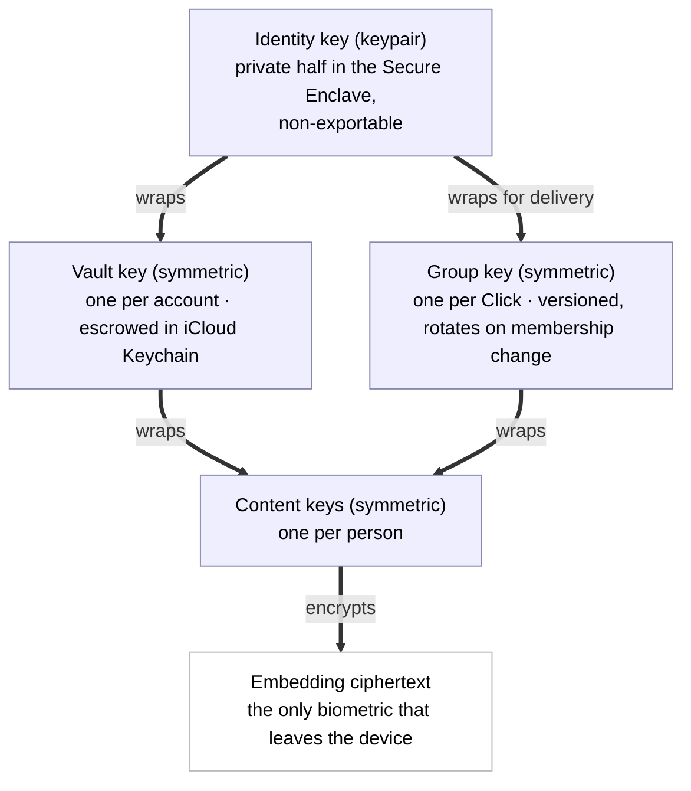
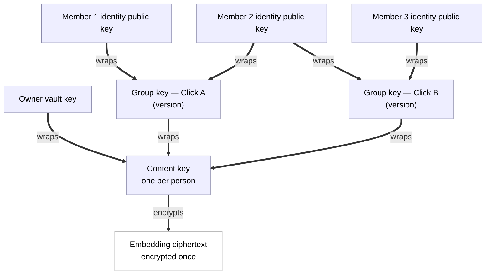
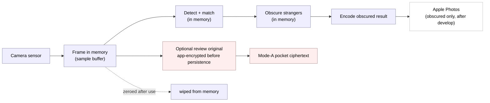
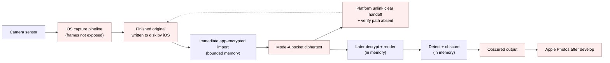
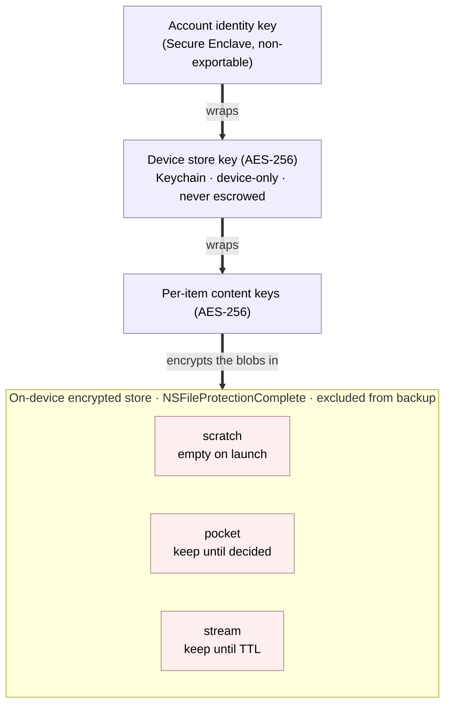
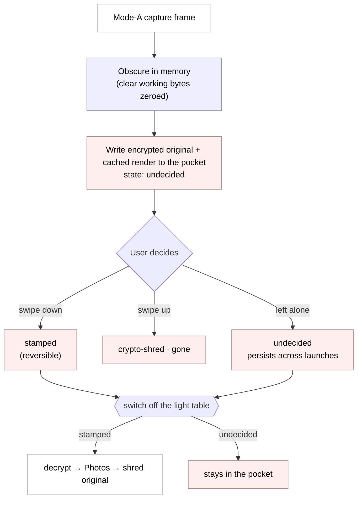
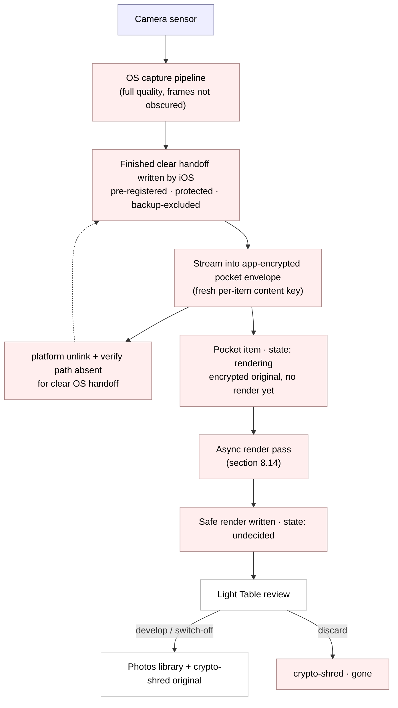
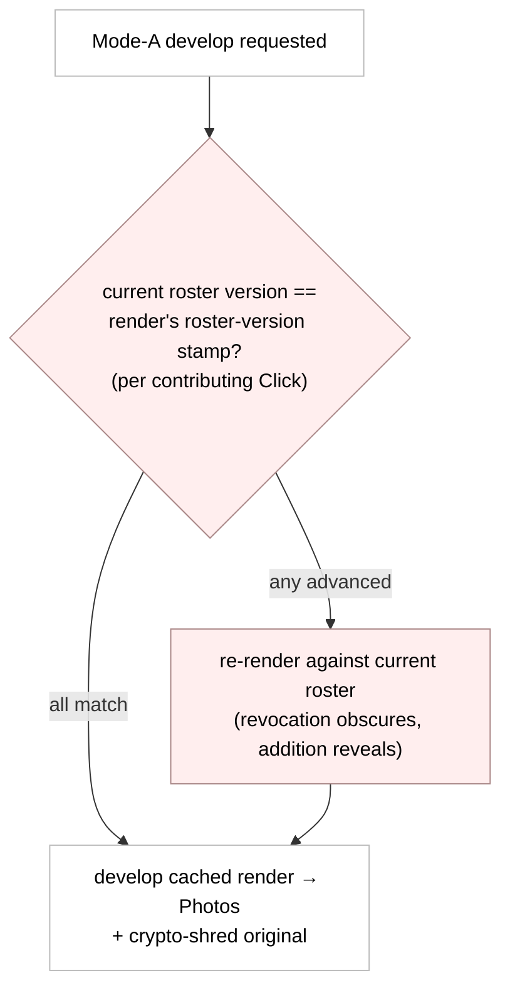
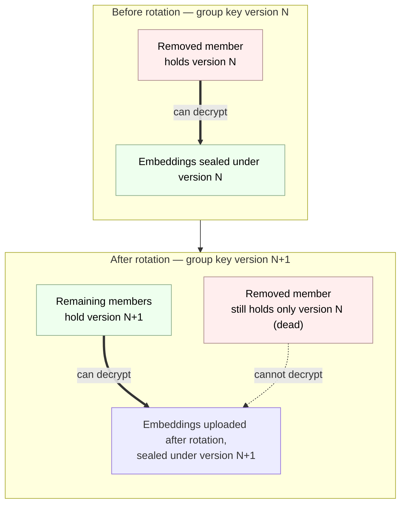

# myClick Cryptographic Protocol

**Status: DRAFT — in active design (2026-05-28). Nothing here is final.**

All thirteen sections are drafted; section 11 (streaming relay and distribution) and section 12 (notification and live delivery) specify the post-v1.0 guardian photo-return feature and its live-delivery layer, and land after the v1.0 surfaces they depend on. This is still a draft, not a final spec: the empirical calibration (template count, match threshold, false-accept ceiling, re-enrolment bands) is validated in the closed beta, and the v2 metadata-hiding items in section 13 remain open. **Stream wire v1 admits stills and measured whole-file video under the pinned §11.2.1 caps (founder-approved provisional open, 2026-07-11), and the atomic Live aggregate — one obscured key still plus its paired ~1.5 s movie carried in one publication — under the §11.2.3 schema (founder sign-off, 2026-07-13). X11 pre-roll publication, chunked media, and notification-extension video fetch remain disabled at the pre-row gate.** Everything here is subject to change as the design firms up — this banner will be updated as sections lock.

This document specifies the cryptographic protocol behind myClick: how faces become encrypted embeddings, how members of a Click share the ability to recognise each other's children, how source originals and obscured Stream outputs have different custody, what pseudonymous routing metadata remains server-visible, and how revocation works. The server cannot decrypt biometric templates or Stream media, but it does observe the metadata and ciphertext-size signals enumerated below.

This protocol is being designed in the open. See the commit history for how it evolved.

## Table of Contents

- [The ideas in plain English (start here)](#the-ideas-in-plain-english)

1. [Threat model](#1-threat-model)
   - [1.3 Accepted trust assumptions (pre-production)](#13-accepted-trust-assumptions-pre-production)
2. [Canonical model](#2-canonical-model)
3. [Key hierarchy](#3-key-hierarchy)
4. [Enrolment (face to encrypted embedding)](#4-enrolment-face-to-encrypted-embedding)
5. [Embedding storage and the server's view](#5-embedding-storage-and-the-servers-view)
6. [Per-Click group key (the ratchet)](#6-per-click-group-key-the-ratchet)
   - [6.2.2 Separate Stream history epochs](#622-separate-stream-history-epochs)
7. [Recognition (on-device matching)](#7-recognition-on-device-matching)
8. [Capture and import: source-original lifecycle](#8-capture-and-import-source-original-lifecycle)
   - [8.4 The hardened Flow B](#84-the-hardened-flow-b)
   - [8.10 The encrypted on-disk display cache (Stream receive)](#810-the-encrypted-on-disk-display-cache-stream-receive)
     - [8.10.1 Session-only clear playback files](#8101-session-only-clear-playback-files)
   - [8.13 Video and Live Photo: record native, render asynchronously](#813-video-and-live-photo-record-native-render-asynchronously)
   - [8.18 The Live Photo output](#818-the-live-photo-output)
   - [8.20 Developed video provenance (same stamp, QuickTime containers)](#820-developed-video-provenance-same-stamp-quicktime-containers)
   - [8.21 Baseline synthetic Live and X11 Apple-style pre-roll](#821-baseline-synthetic-live-and-x11-apple-style-pre-roll)
     - [8.21.1 X11 capture source and capability gate](#8211-x11-capture-source-and-capability-gate)
     - [8.21.2 Exact timeline and tolerance](#8212-exact-timeline-and-tolerance)
     - [8.21.3 Pair custody, encryption, and unlink honesty](#8213-pair-custody-encryption-and-unlink-honesty)
     - [8.21.4 Durable records](#8214-durable-records)
     - [8.21.5 Capture, crash, kill, and relaunch state machine](#8215-capture-crash-kill-and-relaunch-state-machine)
     - [8.21.6 Whole-pair recognition and obscuring](#8216-whole-pair-recognition-and-obscuring)
     - [8.21.7 Real pairing, provenance, and develop](#8217-real-pairing-provenance-and-develop)
     - [8.21.8 X11 implementation gates and Stream exclusion](#8218-x11-implementation-gates-and-stream-exclusion)
   - [8.22 The durable user-state store (love, hide, and dwell)](#822-the-durable-user-state-store-love-hide-and-dwell)
9. [Revocation (key rotation; forward-immediate, forward-only)](#9-revocation-key-rotation-forward-immediate-forward-only)
10. [Key escrow and recovery](#10-key-escrow-and-recovery)
11. [Streaming relay and distribution](#11-streaming-relay-and-distribution)
    - [11.2 Per-blob content key, wrapped under the Stream epoch key](#112-per-blob-content-key-wrapped-under-the-stream-epoch-key)
      - [11.2.1 Versioned authenticated envelope and AAD](#1121-versioned-authenticated-envelope-and-aad)
      - [11.2.2 Canonical v1 records](#1122-canonical-v1-records)
      - [11.2.3 Live aggregate wire schema](#1123-live-aggregate-wire-schema)
    - [11.3 The blind relay](#113-the-blind-relay)
    - [11.7 Withdrawal: STOP-only in v1](#117-withdrawal-stop-only-in-v1)
    - [11.18 Metadata leaks and conceded trust boundaries](#1118-metadata-leaks-and-conceded-trust-boundaries)
12. [Notification and live delivery](#12-notification-and-live-delivery)
13. [Open questions](#13-open-questions)

---

## The ideas in plain English

If you already know public-key cryptography, you can skip straight to section 1 — nothing in this primer is normative.

This is an on-ramp, not a textbook. The rest of the document is precise and assumes these ideas; here we name each one in a sentence or two and point to where it does its work. Nothing here is a requirement — no key sizes, no thresholds. Those live in the body, on purpose, so there is only one place to read them.

- **Plaintext vs ciphertext.** Plaintext is the readable thing; ciphertext is the scrambled version produced by encryption. myClick handles several sensitive plaintext classes at different boundaries: enrolment frames and crops, decrypted recognition embeddings, camera/import source originals, and already-obscured media after an authorised recipient decrypts it. Source originals follow section 8; obscured Stream outputs follow sections 11–12. Persisted biometric templates, myClick-held source originals, Stream media, and detailed observation sidecars are app-encrypted. Relay routing metadata is plaintext to the relay. Downloaded-file provenance is also plaintext metadata to Photos/downstream readers; it is name-free but pseudonymous and correlatable.
- **Encrypted in transit vs encrypted at rest.** "In transit" (TLS) protects bytes while they travel over the network; "at rest" protects bytes while they sit on disk or in a database. myClick does both, and the threat model in section 1 lists each separately because they defend against different attackers.
- **Symmetric keys.** A symmetric key is a single secret that both locks and unlocks — encrypt and decrypt with the same key. The vault key and each Click's group key are symmetric keys; see the key hierarchy in section 3.
- **Public/private keypairs.** A keypair is two matched halves: a public half you can share freely and a private half you keep secret, such that what one half locks only the other half opens. The account's identity key is a keypair; see section 3.
- **Key wrapping (envelope encryption).** Using one key to encrypt another key, so the locked key can be stored or shipped safely and only the holder of the outer key can free it. This is the single most load-bearing idea in the document — it appears on nearly every page, and the layered hierarchy and the "one embedding, many locks" diagrams in sections 3 and 6.3 are entirely built from it.
- **The Secure Enclave.** A dedicated hardware vault inside the iPhone. Keys generated there cannot be copied out — software, including myClick itself, can ask the Enclave to use a key but can never read it. The identity private key lives here; see section 3.
- **Key escrow.** Safely backing up a key with a trusted party so it can be recovered if the device is lost. myClick escrows the vault key with iCloud Keychain rather than asking a parent to safeguard a recovery phrase; see sections 3.2 and 10.
- **End-to-end encryption and server-blindness.** When only endpoints hold the content keys, the server holds media and biometric ciphertext it cannot open. "Blind" does not mean metadata-free: the relay still sees the enumerated account, device, Click, publication, consent, subject-tag, expiry, traffic, and ciphertext-size fields. There is no server key that decrypts a child's biometric or Stream media; section 5 and section 11.18 state the visible remainder.
- **Face embeddings are sensitive biometric templates.** An embedding is a number-vector rather than a compressed photo, but that does **not** make it safely non-reversible or anonymous: model inversion, attribute inference, linkage, and recognition attacks may recover information from a plaintext vector. The protocol therefore protects embeddings as high-risk biometric data with consent, E2EE, scoped keys, rotation, and minimised retention; it never relies on an "impossible to reconstruct" claim. (Each owned enrolment may also keep one small encrypted face crop on that device for inspection; see section 4.8. That crop never leaves the device.)

---

## 1. Threat model

A threat model is two honest lists. The first is what the system must defend against — the attacks where, if we lose, the product has failed at its one job. The second is what the system concedes — the attacks we do not stop, stated plainly so nobody is misled about what "privacy-first" buys them.

The concessions matter as much as the defences. A privacy claim that quietly omits its limits is worse than no claim at all, because it invites the user to trust the system in exactly the situations where it cannot help. So we write both lists, and we write the second one carefully.

### 1.1 Who we defend against (must win)

These are the adversaries the architecture exists to beat. If any of these wins, that is a bug in the protocol, not an accepted risk.

- **myClick the company, or a malicious insider.** Even we cannot decrypt a child's biometric. This is the headline guarantee, and the entire architecture is built to make it true: the keys that decrypt embeddings live in users' Secure Enclaves and iCloud Keychains, never on our servers. Full production access yields encrypted embeddings/Stream objects plus the identifying and correlating metadata explicitly inventoried in §§5 and 11.18 — never a plaintext biometric or usable decrypt key.
- **A server breach.** An attacker who steals the database, object ciphertexts, and backups gets no plaintext embedding, source original, or Stream media and no usable decrypt key. They do get the pseudonymous routing/consent metadata and ciphertext-size/traffic signals enumerated in sections 5 and 11.18. There is no admin key, "break glass" decrypt path, or master secret that turns the stolen ciphertext into faces.
- **A subpoena or state actor.** We cannot hand over what we cannot decrypt. The honest answer to a warrant for a child's biometric is "here is the ciphertext we hold; we have no key for it." This is a deliberate design property, not a legal posture we adopt after the fact — the inability is structural.
- **A network eavesdropper.** TLS protects all protocol traffic in transit, and sensitive payloads are additionally end-to-end encrypted at rest. A wire observer still sees network endpoints, timing, and byte volumes; server-visible routing metadata is not transformed into E2EE content merely because TLS carries it.
- **A malicious Click member.** A member of one Click cannot extract embeddings or decrypt Stream publications outside the Click/key epochs they were granted. Source originals and enrolment-capture sidecars are never uploaded. **Obscured** Stream stills are uploaded only as end-to-end-encrypted ciphertext and are intentionally decryptable by authorised recipients; once an authorised member decrypts one, endpoint and Download limits apply. Recognition remains gated by the active scope at capture time.

### 1.2 What we concede (accepted risks, stated plainly)

These are the attacks we do not stop. We list them because pretending otherwise would be dishonest, and because knowing them lets a user decide what myClick is and is not good for.

- **A compromised device.** If the user's own iPhone is jailbroken, or running malware with sufficient privilege, the plaintext embeddings that are decrypted on-device for matching are exposed on that device. No end-to-end encrypted system can defend a compromised endpoint — the endpoint is where plaintext has to exist for the app to work at all. We protect data in transit and at rest, not against an attacker who already owns the phone.
- **The lock-screen camera, to whoever holds the phone.** Like Apple Camera, myClick's camera is reachable from the lock screen without a Face ID prompt (see [section 7.6](#76-lock-screen-camera-flow)). Someone who picks up the phone can therefore take obscured photos, and if the owner's family happens to be in front of the lens they will be recognised and kept visible. That is the limit of it: the holder cannot browse Clicks, read a roster, change settings, or open the audit log — those stay behind the app-lock — and the decrypted roster is zeroed the instant the app backgrounds. We accept this narrow surface deliberately, as the price of a grab-and-shoot camera; it exposes nothing the holder could not already capture by standing where they are.
- **Apple itself.** We rely on the Secure Enclave for key generation and on iCloud Keychain for escrow and recovery. If Apple is malicious, or is compromised at the hardware or operating-system level, the model breaks. We trust the platform — as does every iOS app, and as the user already does by carrying the device.
- **Authorised use.** A photographer with `can_capture` rights in a Click legitimately recognises the consented children of that Click. That is the product working as designed, not a breach. The crucial nuance, stated explicitly: **within a Click, members necessarily share the embeddings of opted-in children.** A photographer's device must hold the plaintext embeddings of the children they are allowed to recognise, so a determined malicious member could extract and misuse those vectors. Consent and cryptographic scope limit who receives them; they do not make a recipient-held biometric harmless or non-invertible. If you grant someone recognition rights, you are trusting them with that child's embedding. The protocol makes that trust explicit and scoped; it does not pretend to remove it.
- **Metadata.** The server cannot read embeddings, Stream pixels, or encrypted observation geometry, but it sees the membership/guardianship graph and the complete Stream inventory: world/Click/batch/publication/publisher ids, immutable expiry, consent and revoked epochs, pseudonymous subject tags, epoch cohorts/recipient wraps, key/version/state fields, internal object references, fetch-ticket events, timing, network metadata, and ciphertext lengths. APNs device tokens and payload identifiers are sensitive routing metadata held by the relay and Apple; ActivityKit is disabled in v1. Ciphertext size and traffic shape remain inferentially useful ([section 11.18](#1118-metadata-leaks-and-conceded-trust-boundaries)). Full metadata-hiding, padding, and sealed-sender-style routing are later work, not v1 promises.
- **Already-delivered media.** Withdrawal immediately stops every future relay delivery of an affected v1 publication, but cannot erase plaintext or keys an authorised/hostile recipient already retained, a screenshot, or a copy developed into Photos. V1 accepts no re-obscured successor after withdrawal. Re-enabling consent affects newly sealed publications only.

### 1.3 Accepted trust assumptions (pre-production)

Section 1.2 lists the standing architectural concessions. This section collects the narrower assumptions that a pre-production privacy review surfaced and that we are **consciously accepting for the beta**. The pending-name caveat is bounded to one low-sensitivity app-domain value; the authorised-member boundary below explicitly concerns sensitive plaintext embeddings and has no cryptographic "non-reversibility" escape. Each assumption is recorded rather than hidden.

- **The pending-name seal target is an *unauthenticated*, server-returned identity key.** When a joiner seals their own display name for the admitting admin to read before admission, they seal it under the inviter's identity public key returned by unauthenticated pre-join `peek_invite` ([section 5.6](#56-app-domain-names-are-server-blind-too-including-the-accounts-own-name)). A malicious relay could substitute its own key and read exactly that joiner's self-chosen display name. This exception does **not** apply to any biometric group key, Stream epoch key, or historical wrap: §6.2 requires the out-of-band proof and authenticated device-key ledger before those keys are sealed. The residual is therefore one low-sensitivity name, not a Click key/content path. **Full fix:** extend §6.2-style key pinning to the pending-name preview. **Status:** post-beta and stated, not hidden.

- **Within a Click, members share the roster ciphertext, and a member can extract the plaintext embeddings their own device decrypts.** The roster read (`fetch_roster_ciphertext`) is **membership-gated** — an access gate, not a secrecy gate (data-model.md §8.3(1)). A photographer's device must hold the plaintext embeddings of the children it is entitled to recognise, so a determined malicious member could extract those vectors. We do **not** hide a Click's roster from its own members and do not claim embeddings are harmless or non-invertible. Stated as an accepted assumption: *to grant someone recognition rights is to trust them with that child's embedding; the protocol makes that trust scoped and explicit, it cannot remove it.* The same access boundary applies to the name and age-band reads, which return ciphertext to entitled members and fail closed otherwise (data-model.md §8.3(3)). **Full fix:** none is intended — this is a structural property of on-device recognition, not a defect.

---

## 2. Canonical model

This section defines the abstract, storage-agnostic constructs that the cryptography and the Storage Port depend on. It is the shared vocabulary every other section uses precisely, and it is deliberately narrow: a construct belongs here only if the cryptography or the storage interface depends on it. App-domain concepts that the crypto does not touch are defined in the companion data model, not here (see the closing note).

Each construct below gets a precise definition and a one-line plain gloss.

- **Account identity key** — the account's keypair: an ECC P-256 keypair generated per account and per device in the Secure Enclave. The public half is published to the server; the private half is non-exportable and never leaves the Enclave. It does two jobs — it authenticates the account, and it is the root of the wrapping hierarchy (section 3): its public half wraps this member's vault key and each group key delivered to them, and its private half unwraps them.
  *In plain terms: the device-bound keypair that proves who you are and unlocks everything else.*
- **Person (subject)** — the scope a content key belongs to: the holder of a content key and of the embeddings that content key encrypts. A person is a holder's own face or a dependent's, and it is the unit of cryptographic ownership — one person, one content key, one template set.
  *In plain terms: the face whose templates a single content key locks.*
- **Embedding** — a roughly 2048-byte face vector extracted on-device and persisted off-device only as ciphertext. It is the sole biometric artifact stored off-device; each owned enrolment may additionally carry a device-local encrypted crop sidecar (section 4.8). A plaintext embedding remains sensitive biometric data and may support inversion, attribute inference, linkage, or recognition attacks.
  *In plain terms: the encrypted number-vector that stands in for a face.*
- **Content key** — one per person; the symmetric key that encrypts that person's templates. It is the only key applied directly to embedding ciphertext, and it is the small thing that gets wrapped for each audience (see the wraps below).
  *In plain terms: the key to one person's faces.*
- **Vault key** — one per account; the symmetric key that gives the owner private access by wrapping the owner's own content keys (the holder plus their dependents). It is the portable secret recovered on a new device, escrowed in iCloud Keychain.
  *In plain terms: your private master key for your own family's faces.*
- **Click** — a keying scope: the unit that has a group key. Cryptographically, a Click is exactly "a set of members who share one group key generation," nothing more. (Its app meaning — a circle of people who consent to recognise each other's children at premises — lives in the data model.)
  *In plain terms: the group that shares one key.*
- **Membership** — canonically, the set of accounts that currently hold a Click's group key. Membership is defined here by key possession, not by any role flag: you are a member, in the cryptographic sense, exactly when the current group-key version has been wrapped for your identity key.
  *In plain terms: who currently holds the group's key.*
- **Group key and GroupKeyVersion** — the symmetric biometric-roster key shared by a Click's members, and one generation of it. Admission distributes the current key; removal rotates it and mints a GroupKeyVersion that supersedes the prior one. Stream additions/removals independently mint history epochs (§6.2.2). The GroupKeyVersion stamp also serialises concurrent rotations (§6.5).
  *In plain terms: the shared key, and which generation of it you are looking at.*
- **ContentKeyWrap** — a person's content key encrypted under one outer key: either the owner's vault key (owner-private access) or a specific Click GroupKeyVersion (shared recognition within that Click). The embedding ciphertext is stored once; only this small wrap is multiplied per audience.
  *In plain terms: one person's content key, locked for one audience.*
- **GroupKeyWrap** — a GroupKeyVersion encrypted under one member's identity public key, so only that member's Secure Enclave can unwrap it. This is how a group key reaches each member without the server ever holding a usable copy.
  *In plain terms: the group key, locked so only one member can open it.*
- **Logical publication** — one immutable, client-identified media object sent to one Click, with one root expiry and no v1 predecessor or successor. V1 admits stills and whole-file video under the pinned §11.2.1 caps; Live aggregates, X11 Stream publication, and chunked media remain rejected until their explicit later gates ([section 11.2.1](#1121-versioned-authenticated-envelope-and-aad)).
  *In plain terms: one locked media item sent once to one Click.*
- **Publication content key (`K_blob`)** — one fresh AES-256 key generated for exactly one logical publication. HKDF-derived payload and sidecar subkeys authenticate that publication under purpose-separated AAD; `K_blob` itself is wrapped under a dedicated HKDF-derived Stream epoch wrap key with GroupKeyVersion bound only at the wrap layer ([section 11.2](#112-per-blob-content-key-wrapped-under-the-stream-epoch-key)).
  *In plain terms: the one-use key for one published media item.*
- **Authenticated media envelope** — the versioned Stream wire object whose encrypted v1 manifest admits `still` or whole-file `video` under the pinned §11.2.1 caps; Live aggregates and chunked kinds still require a reviewed later gate. The outer representation reveals no direct media descriptor. The relay treats it only as opaque `application/octet-stream`; recipients authenticate the complete envelope and compare its bound context with the delivery record before any display ([section 11.2.1](#1121-versioned-authenticated-envelope-and-aad)).
  *In plain terms: a type-hiding locked package that cannot be moved to another Click or publication without detection.*
- **Stream epoch key** — a random AES-256 key for one Click membership cohort and epoch generation, distributed separately from the biometric group key. A new member receives only the newly-created current/future Stream epoch; they receive no old Stream epoch key or old publication wrap ([sections 6.2.2](#622-separate-stream-history-epochs) and [11.6](#116-stream-epoch-rotation-re-wraps-unshredded-publications)).
  *In plain terms: the Stream-history lock that prevents a newcomer opening older publications.*
- **Media observation sidecar** — the versioned, `K_blob`-rooted encrypted record of **recognised, freshly distributable subjects in the one target Click only**: v1 still geometry/mask, the verdict actually applied, and the effective recipe/renderer version. It contains no stable cross-item id, unknown-person record, biometric, or crop/pixel/audio content. V1 video may carry a whole-clip subject set (not a per-frame timeline); Live aggregates remain rejected. It authorises no v1 successor ([sections 11.2.2](#1122-canonical-v1-records) and [11.3](#113-the-blind-relay)).
  *In plain terms: a sealed record of how known Click subjects were treated, not a second biometric database.*

App-domain constructs — guardianship, the opt-in approval flow, premises, licences, and subscriptions — are defined in the companion data model (myClick repo, `docs/data-model.md`), not here, because the cryptography does not depend on them. In the canonical model, "opt-in" appears only as its cryptographic shadow: a person's content key is wrapped under a Click's group key. The body prose elsewhere (sections 1 and 5 through 9) still mentions premises, opt-in, and capture for narrative context; only this canonical model is restricted to crypto-relevant constructs.

---

## 3. Key hierarchy

In plain English, there are three layers of keys, each doing one job.

The **first layer** is the account's identity. When you first launch myClick, the app asks the Secure Enclave — the dedicated security chip in your iPhone — to generate a keypair just for you. The private half of that keypair never leaves the chip. It cannot be exported, copied, or extracted, even by the app itself; the app can only ask the chip to use it. This identity key is how the server knows it is really you, and it is the key that wraps (encrypts) the next layer down.

The **second layer** is your vault key. This is the key that protects your own family's faces — your embeddings and your children's embeddings — when they sit at rest on disk and on our server. It is a symmetric key (the same key locks and unlocks), wrapped by your identity key so only your device can use it, and escrowed in iCloud Keychain so that if you lose your phone, you can get it back.

The **third layer** is the per-Click group key. Each Click has one. When a child is opted into a Click, that child's embedding is made decryptable by every current member of that Click — so the school photographer's phone can recognise the children whose parents opted them into the school Click, and nobody else's. The group key is how that sharing happens. It is handed to each member by wrapping it under that member's identity public key, so only that member's device can unwrap it. It rotates every time membership changes, which is what makes revocation work (see section 9).

A structural consequence worth stating directly: **a single child's embedding is stored once, but made decryptable by more than one audience.** The embedding ciphertext exists exactly once, encrypted under its own per-person content key (see [section 6.3](#63-content-key-indirection)). What is multiplied is not the embedding but that small content key: it is wrapped once under the parent's vault key — the parent's own private access — and once under each Click's group key the child has been opted into. The same vector, encrypted a single time, with its content key sealed under different locks for different audiences.

The three layers wrap downward: the identity key (its private half locked in the Secure Enclave) wraps the vault key, and the vault key and each group key in turn wrap the content keys that protect the embeddings.



### 3.1 The three layers, precisely

| Key | Type | Lives where | Wrapped / protected by | Job |
|-----|------|-------------|------------------------|-----|
| Account identity key | ECC P-256 keypair | Private key inside the Secure Enclave (non-exportable); public key published to the server | The Secure Enclave itself; never leaves the chip | Authenticates the account; wraps the vault key; unwraps group keys delivered to this member |
| Account vault key | AES-256 symmetric | On-device, and escrowed in iCloud Keychain | Wrapped by the account identity key; escrowed under iCloud Keychain | Wraps the content keys of the account's own enrolled embeddings (holder + children), giving the owner private access at rest |
| Per-Click group key | AES-256 symmetric | On-device for each current member; distributed by the server in wrapped form | Wrapped under each member's identity public key for delivery — and, for a member who **owns/administers** the Click, the group key is **additionally escrowed** by sealing it under that member's **vault key** (recoverable from iCloud Keychain) and storing the sealed blob server-side, so it survives **identity-key loss** (see [section 6.8](#68-group-key-durability-owneradmin-escrow) / [section 10.2](#102-the-mechanics)). The identity key itself remains Secure-Enclave-bound and is never escrowed | Makes a Click's opted-in embeddings decryptable by all current members for recognition; rotates on membership change |
| Device store key | AES-256 symmetric | On-device only (Keychain, device-only / non-synced); never escrowed | Held in the Secure-Enclave-protected Keychain (device-only, non-synced); optionally wrapped under the account identity key once that subsystem exists | Wraps the per-item content keys of the on-device encrypted store — capture scratch, the Light Table pocket, the local gallery (see [section 8.8](#88-the-on-device-encrypted-store-lanes-keys-and-the-journal)) |

The first three keys form the **biometric hierarchy**, and "three layers" refers to them. The **device store key** is a fourth key with a different job: it protects on-disk media blobs (still/video source originals and obscured renders), not embeddings. It is introduced where it is used ([section 8.8](#88-the-on-device-encrypted-store-lanes-keys-and-the-journal)) and sits deliberately outside the escrowed hierarchy above — generated per device, never synced to iCloud Keychain, never escrowed — so the ability to decrypt an unobscured on-disk original never leaves the device that produced it.

### 3.2 Two decisions locked here

**Recovery is by iCloud Keychain escrow, not a user-held recovery phrase.** We escrow the account vault key in iCloud Keychain rather than asking the user to write down and safeguard a recovery phrase. The reasoning: it is by far the best consumer UX (a parent recovering a lost phone signs in with their Apple ID, as they already expect to); Apple is already a conceded trust anchor in our threat model (section 1.2), so escrow does not introduce a new party we were otherwise keeping out; and a lost recovery phrase would mean permanently lost family face data, with no path back. For a product whose users are ordinary parents, not crypto practitioners, the recovery-phrase failure mode is unacceptable.

**A roster group key plus separate Stream history epochs, not a full double-ratchet.** A Click's embedding roster is relatively static: admission distributes the current biometric group key, while departure rotates it for forward revocation. Stream is different—every addition/removal creates a cohort epoch so newcomers cannot decrypt history (§6.2.2). Neither path claims messaging-style per-message forward secrecy.

### 3.3 Concrete primitives (locked 2026-06-18)

Sections 3.1–3.2 fix the *shape* of the hierarchy — which key wraps which, and that recovery is by iCloud Keychain escrow. The concrete primitives below were left implicit in earlier drafts; they are pinned here so the implementation has no cryptographic decision to improvise (the "protocol-spec-first" rule). All three deliberately match constructions myClick already ships on-device (the encrypted store and `RosterCryptoKey`), introducing no new cryptography. They are sound, standard defaults locked for v1; the formal protocol audit remains the place where they receive adversarial scrutiny.

- **AEAD mode — AES-256-GCM.** Every symmetric encryption in the biometric hierarchy — the vault key and each group key protecting content keys, and each per-person content key protecting its embedding template set — uses **AES-256-GCM**. This is the same authenticated mode sections 4.8 / 8.8 fix for the on-device store; section 3 now states it explicitly for the escrowed hierarchy too.
- **Asymmetric wrap — ECIES over P-256.** Wrapping a symmetric key *under an identity public key* — the vault key on-device at rest, and each group key for delivery to a member (section 3.1) — uses **ECIES over P-256**: an ephemeral ECDH to the recipient's P-256 public key, HKDF-SHA256 to derive the wrapping key, then AES-256-GCM. The wrapped form is self-describing on-device and crosses the Storage Port only as an opaque blob; if cross-implementation interop of the wire format is ever required, that format is pinned at that time.
- **Vault-key recovery — the iCloud Keychain escrow is canonical.** The vault key is held two ways (section 3.1): wrapped under the identity key for on-device-at-rest protection, and escrowed in iCloud Keychain. The **escrow is the authoritative recovery artifact** — the identity key is device-bound and dies with the phone (section 10.2), so a replaced device recovers the vault key from iCloud Keychain, never from any on-device wrap.

---

## 4. Enrolment (face to encrypted embedding)

Enrolment is how a face becomes an encrypted embedding. It is the one moment where myClick handles a raw image of a child, so it is designed with the most care: the raw frames, and the working set of face crops kept from them, exist in memory only — for the brief enrolment-and-review session, never longer — and are then zeroed. The one image that outlives the session is each confirmed capture's sidecar image — its subject-masked context crop, or at minimum its tight matcher crop — sealed into an encrypted, device-bound sidecar ([section 4.8](#48-enrolment-capture-sidecars-stored-face-crops)); the full frames never persist anywhere. Enrolment reads frames directly from the live camera feed, so it shares the frame-accessible *ingest* of capture Flow A ([section 8.2](#82-flow-a-frame-accessible-capture-no-clear-source-file)) — but **not** its retention: a capture seals its unobscured original into the pocket, whereas enrolment seals no source original at all and zeroes its frames. The disk-backed Flow B path ([section 8.3](#83-flow-b-os-owned-capture-disk-backed)) never applies either, because iOS never hands enrolment a finished file.

### 4.1 The flow

1. **Initiate.** A parent starts enrolment, for themselves or for a child. (Enrolling a dependent is the common case.)
2. **Continuous sweep.** The app watches the live feed and harvests a short multi-angle set — front, three-quarter left, three-quarter right, up, down, and a smiling front — filling six angle slots as the subject moves, rather than marching through one fixed pose at a time. Frames stream through memory; only the best crop for each slot is kept, and only in memory. Nothing is written to disk during the sweep.
3. **Quality gates.** Each candidate frame is gated before it can fill a slot:
   - An unambiguous enrolment **subject** must be present, and it is the only face processed. A frame with no face is skipped. A frame with more than one face is allowed **only under subject isolation**: the harvester takes the single dominant face — one face clearly larger and more central than any other, by a required margin (currently 1.6×) — embeds **only** that face, and **blurs every other face in the preview and never detects-for-identity, embeds, or stores it**. If no face clears the dominance margin (two faces of similar size and position), the frame is skipped — fail-closed. The wrong-child harm is *harvesting the wrong face*; isolating and embedding only the unambiguous subject, while blurring and never processing everyone else, is what prevents it. This lets a parent enrol in a busy place without capturing bystanders, and is the enrolment counterpart of capture-time bystander obscuring.
   - The face must be large enough in the frame for a faithful crop.
   - The crop must be sharp — a variance-of-Laplacian focus check — so motion-blurred frames are dropped, not captured.
   - Lighting adequacy is a soft nudge, not a block.
   - Pose must vary across the six slots so the template set covers a real range of angles.
   A frame that fails any gate is silently skipped; the app never captures a poor frame just to make progress.
4. **Review.** When all six slots are filled, the user reviews the captured set and can redo any single slot, in which case the app re-harvests only that one look. The six crops remain in memory throughout; nothing is persisted until the user confirms.
5. **Extraction.** On confirm, MobileFaceNet runs on-device and extracts the six embeddings from the held crops. No image leaves the phone for this step; there is no cloud call. Each confirmed capture is stamped with a `capturedAt` timestamp (metadata, not biometric), and its sidecar image — the subject-masked context crop where a mask is available, otherwise the bare tight aligned matcher crop — is sealed into that capture's encrypted sidecar ([section 4.8](#48-enrolment-capture-sidecars-stored-face-crops)).
6. **Zeroing.** The held frames and crops are zeroed from memory the moment extraction and sidecar sealing are done. If the user abandons enrolment before confirming — cancel, back, or the app backgrounding — the crops are zeroed with no extraction and no sidecar at all. See section 4.6.
7. **Encryption.** The embeddings are encrypted under the person's content key; that content key is wrapped under the account's vault key (and, once the person is opted into a Click, under that Click's group key — see [section 6.3](#63-content-key-indirection)).
8. **Storage.** The ciphertext is stored locally and synced to the server. The server receives ciphertext only — it never sees a frame, never sees a plaintext embedding. This sync is not one atomic write but a short sequence of calls; the client owns the person id and the sequence is idempotent and resumable, so an interrupted enrolment can be retried to completion without ever creating a duplicate person ([section 4.9](#49-the-enrolment-write-is-idempotent-and-resumable-the-client-owns-the-person-id)).
9. **Consent read-back.** A consent read-back is recorded in the audit log: who enrolled whom, when, and under what consent statement.

**The capture-trigger contract.** The subject-isolation gate above decides *which* face in a frame may be processed; this contract decides *when* the harvester may commit a capture at all. A capture MUST commit only while all three of the following hold:

1. **Subject lock.** The face being captured MUST be the same physical face that was selected when the harvest armed. Lock is maintained by **geometric continuity only** — face-box overlap across consecutive frames; a face cannot teleport from one part of the frame to another between frames. Tracking MUST NOT use embeddings: bystanders are never embedded, not even to be rejected. Loss of lock MUST cancel any open capture window and silence the trigger until the locked subject is re-established as the clear dominant subject.
2. **Clear winner.** The subject MUST clear the relative dominance margin of the subject-isolation gate (currently 1.6×): clearly larger and more central than any other face in the frame.
3. **Dominance floor.** The subject MUST occupy at least a device-calibrated fraction of the frame — measured as face-box fraction until person segmentation lands, and as person-mask fraction once it does. The floor is absolute where the margin is relative: a face that is merely the largest of several small background faces is structurally ineligible, so background faces can never arm or feed a harvest.

A frame in which any of the three fails is skipped, and a lock loss closes the capture window entirely — fail-closed, as everywhere in enrolment.

One companion rule for what the user is shown: the subject mask that blurs every non-subject face in the live preview MUST equally be applied to any retained review snapshot. A frame kept for the user to look at is held to the same blur standard as the live preview — there is no review image in which a bystander's face is visible.

### 4.2 Liveness: light, not hard-gated

The guided multi-angle sweep is itself a soft liveness check. A flat printed photo or a still image on a screen cannot easily produce a coherent multi-pose sweep — the geometry does not hold up across angles. Where TrueDepth hardware is available, we use it opportunistically to strengthen this.

We deliberately do **not** hard-block on liveness. Hard liveness gating would make enrolling a young child miserable — small children do not perform on cue, and a stuck enrolment flow is a recipe for a parent giving up. The real protection against enrolling a face that isn't a consenting person's is physical: you need physical access to the child to complete the sweep, and the sweep enforces that in practice. Liveness is a check we lean on lightly, not a wall.

### 4.3 Template set of 6 per person

We store a **template set of 6 embeddings** per enrolled person, not a single embedding:

1. Front, neutral
2. Front, smiling (expression variation)
3. Three-quarter left
4. Three-quarter right
5. Looking up
6. Looking down

A detected face matches the person if it clears the match threshold against **any one** of these templates.

The reason for more than one template is that a face embedding is sensitive along three axes at once: **yaw** (turning left/right), **pitch** (looking up/down), and **expression** (neutral vs smiling and beyond). Children's candid faces vary enormously across all three — a kid mid-laugh at a three-quarter angle looks very different to a neutral front shot. A single embedding would miss most real captures.

Four factors set the count:

1. **The pose-and-expression envelope to cover** — the range of angles and expressions a real candid photo will throw at us.
2. **Per-template pose tolerance** — each template reliably matches faces within roughly ±30 degrees of its own pose before confidence drops off. More templates, spaced across the envelope, keep every likely face within tolerance of some template.
3. **The false-accept asymmetry** — the dominant factor. See section 4.4.
4. **Compute and storage cost** — every detected face is compared against every template of every roster member, so the count multiplies the work done per frame and the bytes stored per person.

### 4.4 The false-accept asymmetry

This is the privacy-critical part of the calibration, and it is worth being precise about.

There are two ways matching can go wrong, and they are not equally bad:

- A **false-reject** — your own child is wrongly obscured — is annoying but safe. It fails closed: the worst outcome is that a photo you wanted has a blur where your kid's face is. No stranger is exposed. No privacy is breached.
- A **false-accept** — a stranger's child is shown unobscured because the system wrongly thought they were on the roster — is a privacy breach. It is the exact harm myClick exists to prevent.

These two failures are not symmetric, and the calibration is built around that. Adding templates raises the false-accept rate: each template is another chance for a stranger's face to clear the threshold, so the aggregate false-accept rate is roughly the per-template rate multiplied by the template count. So template count and match threshold are **co-tuned against a hard false-accept ceiling.** We deliberately spend the cost of more templates in the safe currency — false-rejects, over-obscuring — rather than the dangerous one.

**Starting ceiling: aggregate false-accept rate ≤ 0.1%** — a stranger wrongly recognised in fewer than 1 in 1000 faces — to be tightened if the closed-beta data on real children's faces allows.

What this spec fixes is the **method and the ceiling**, not a magic constant. The final template count (it could land anywhere from 5 to 7) and the match threshold are calibrated empirically during the closed beta against real children's faces. The principle — co-tune count and threshold against a hard false-accept ceiling, paying the cost in over-obscuring — is the durable decision.

### 4.5 Re-enrolment: periodic and explicit, age-banded, no silent learning

Children's faces change, so templates go stale. We refresh them by **periodic, explicit re-enrolment**, age-banded:

- Roughly every 3 months under age 5.
- Roughly every 6–12 months for older children.

The app reminds the parent; the parent redoes the sweep. That is the whole mechanism.

We deliberately do **not** silently update templates as recognition succeeds in the field. Continuous "learning" — quietly folding each successful match back into the template set — would mean continuously re-processing a child's biometric in the background. That is precisely the always-on biometric harvesting myClick exists to avoid, and it stays forbidden.

What that rules out is *silent, automatic, success-driven* learning. It does **not** rule out **deliberate correction** — a person explicitly fixing a face the system got wrong and choosing to add it to enrolment (a parent in Mode A post-shutter review, or an operator at the Mode B lightroom). That is not silent and not automatic: it is a human acting on a specific face, which is exactly "you asking us to." Deliberate correction is specified in [section 4.7](#47-deliberate-correction-enrolment-progressive). The line is **silent success-folding (forbidden) vs explicit human correction (allowed)** — both periodic re-enrolment and deliberate correction keep the promise that **we only process a child's face when a person asks us to**; silent background learning is neither and remains barred.

**Re-enrolment re-seals; it does not re-mint.** The four rules below are normative. They exist because re-enrolment runs on a person who is *already* enrolled — most consequentially on a reinstall, sign-out, or new-device restore, where the local roster is rebuilt by re-pushing the restored people back through the enrolment write path. First enrolment mints a single per-person content key ([section 4.10](#410-atomic-self-family-enrolment) step 1: "one fresh per-person **content key**"). Re-enrolment must reuse *that same* key — "one embedding, many locks" ([section 6.3](#63-content-key-indirection)) only holds if the key never changes underneath the locks. Minting a second key re-distributes it only to the home/family Click and the vault wrap, never to the other Clicks the person is already opted into, so every peer or school Click keeps a wrap sealed to the now-dead key and the person reads as undecryptable there while the home Click still opens them and masks the breakage. That is the failure recorded as #496; these rules prevent it by construction.

- **R-RE1 — Re-enrolment is a re-seal, not a re-mint.** When the enrolment write path runs for an **already-enrolled owned person** — one whose vault-key `content_key_wrap` already exists ([section 6.3](#63-content-key-indirection)) — it MUST recover that existing content key (R-RE3) and re-seal the new template set, name, and age band under it ([section 6.3](#63-content-key-indirection), "one embedding, many locks"). It MUST NOT mint a new content key. The single existing vault wrap, and every Click group wrap already written, keep opening the re-sealed ciphertexts unchanged — so a person stays decryptable in **every** Click they were opted into, not only the home Click. **Only first enrolment mints** — the path with no vault wrap and no stored embeddings ([section 4.10](#410-atomic-self-family-enrolment)). The reinstall / sign-out / new-device restore is the trigger of record: `create_person` is idempotent on the client-owned id and *resumes* the same person ([section 4.9](#49-the-enrolment-write-is-idempotent-and-resumable-the-client-owns-the-person-id)), so a write that minted a fresh key on resume would silently orphan that person's peer-Click wraps (#496). A resuming write re-seals; it never re-mints.

- **R-RE2 — A minted key that is ever shared MUST reach every opted-in Click.** R-RE1 removes the need to mint on re-enrolment at all. The one remaining case that legitimately mints a *new* key for an *already-shared* person is a deliberate, system-initiated re-key — for example a future model upgrade that chooses to rotate the content key rather than re-seal under it. Any such re-key MUST re-wrap the new content key under the owner's vault key **and under the current group-key version of every Click the person is opted into**. Distributing a minted-and-shared key to a subset of those Clicks — the exact shape of the #496 defect — is itself a defect, not a partial success. (A first-enrolment mint is exempt: the person is in no Click yet, so "every opted-in Click" is the empty set; the vault wrap and the home-Click opt-in wrap are written by the atomic write of [section 4.10](#410-atomic-self-family-enrolment).)

- **R-RE3 — Recovery fails loud; it never silently mints over an existing person.** Before re-sealing, the write path resolves the content key into exactly one of three outcomes, and there is no fourth:
  1. **Vault wrap present and it opens** → reuse the recovered content key (R-RE1). This is the ordinary re-enrolment outcome.
  2. **Vault wrap genuinely absent** (no `vault_key` `content_key_wrap` exists for this person, and no stored embeddings) → this is a never-enrolled person; mint, as first enrolment ([section 4.10](#410-atomic-self-family-enrolment)).
  3. **Vault wrap present but unreadable, or the read is a transport error** → **ABORT the write**. Never mint, never re-seal under a guessed key, never fall back to a fresh key. A present-but-unreadable wrap means the right key is somewhere this device cannot currently reach, not that the person is new.

  Recovery is **vault-first**: the owner's `vault_key` wrap is per-account, escrowed in iCloud Keychain ([section 3.1](#31-the-three-layers-precisely) / [section 10](#10-key-escrow-and-recovery)), and home-Click-independent — it is the authoritative source and survives reinstall. The home-Click **group-key** path is a fallback for legacy rows that predate the vault wrap; it **MUST NOT** be used to rescue an already-enrolled person on the write path, because a stale or duplicate home Click can hold a `.group` wrap that returns a *different* content key (the #337 leftover-duplicate-family-Click vector, the same one that produced the #472 rename failure). A wrong key recovered from a stale Click would be re-sealed over the person's real templates and silently corrupt them; vault-first, abort-on-ambiguity is what forecloses that.

- **R-RE4 — Write-time self-check before any wrap is stored.** Before the write stores any `content_key_wrap` (vault or group) for an already-enrolled person, the content key in hand MUST be proven to open **at least one of that person's existing server embeddings** ([section 5](#5-embedding-storage-and-the-servers-view)); if it does not, the write MUST abort and store nothing. A brand-new person with **no** existing embeddings is exempt — there is nothing to check against, and the first-enrolment mint (R-RE3 case 2) is correct by construction. Stated honestly: R-RE4 guards **recovery-correctness** — it is the assertion that catches the #337 / #472 contamination vector (a wrong content key recovered from a stale Click) before it can be written. It is **not** the source of the #496 structural guarantee; that guarantee comes entirely from R-RE1 *never re-minting* an already-enrolled person's key. R-RE4 is the belt to R-RE1's braces: even if recovery returned the wrong existing key, the self-check refuses to seal it.

### 4.6 The zeroing guarantee

The enrolment face crops are zeroed from memory **explicitly in code**. They are held only in memory, and only for the duration of the enrolment-and-review session — at most the six crops needed for the template set — and are zeroed the moment embedding extraction and sidecar sealing complete at confirm, or immediately if the user abandons enrolment before confirming (cancel, back, or app backgrounding), in which case no embedding is extracted and no sidecar is written at all. At no point is a raw frame written to disk, and no crop is ever written in the clear: the only image that persists is each confirmed capture's sidecar image — subject-masked context crop or bare matcher crop — sealed encrypted into its sidecar ([section 4.8](#48-enrolment-capture-sidecars-stored-face-crops)). The live-feed path is otherwise the frame-accessible *ingest* of capture Flow A ([section 8.2](#82-flow-a-frame-accessible-capture-no-clear-source-file)), but never its retention: a Flow A capture seals its unobscured original into the pocket, and enrolment seals none. The disk-backed Flow B path never applies to enrolment. It is documented here and visible in the open-source code: a reviewer can read the source and confirm that the crops are zeroed, that no raw frame is written, and that the only persisted image is the encrypted sidecar.

We state the limit of that plainly. Source-level review proves the source does the right thing. **Binary-level verification — that the app actually shipped to the App Store does exactly this — awaits reproducible builds**, which we do not yet have. We will not imply more assurance than we can currently deliver. The source is auditable today; bit-for-bit verification of the shipped binary is future work.

### 4.7 Deliberate correction enrolment (progressive)

Recognition is only as good as enrolment, and the angles that fail in the field — a strong profile, a turned-and-down candid — are exactly the ones a one-time sweep under-covers. Rather than chase every angle at enrolment, myClick lets a person **deliberately correct** a wrongly-obscured face and fold that real, in-the-field capture back into enrolment. It is the explicit-human-action counterpart of the silent learning [section 4.5](#45-re-enrolment-periodic-and-explicit-age-banded-no-silent-learning) forbids: the corrections target the *failures*, which are the captures the template set most needs.

**Where it happens — deliberate surfaces only, never the background:**

- **Mode A:** a parent, on the post-shutter review screen, taps a face that was obscured and identifies it as one of their own roster members.
- **Mode B:** an operator, at the lightroom/review grid for an imported batch, corrects a misidentified face.

In both, a human looks at a specific face and chooses to act. There is no automatic folding of successful matches.

**The write path:**

1. The correction names an **existing roster member the corrector is entitled to enrol** — themselves, or a dependent they own ([section 3](#3-key-hierarchy)). It can **never mint a new person or learn an unknown face** — that would create a persistent biometric for a non-consenting subject, which stays forbidden. It only ever re-labels among already-consented people.
2. **Proximity guard.** A correction may only learn the face the user actually indicated. The source is re-detected, and the re-detected face box MUST substantially overlap the face the user tapped; if re-detection cannot confirm the indicated face, the correction MUST be refused with nothing learned — and the refusal says so plainly. A tap can never silently teach the system a different face than the one under the finger.
3. The corrected face crop is held **in memory only** (Flow A posture, [section 4.6](#46-the-zeroing-guarantee)) and must pass the same quality gate as enrolment ([section 4.1](#41-the-flow)); a poor crop is refused, so a bad capture cannot poison the set. **Occlusion state is inferred conservatively:** if eye landmarks cannot be found on the corrected crop, the capture MUST be stored as eyes-occluded — which only ever *tightens* its bar, because occluded templates are held to the stricter variant tier ([section 7.1](#71-the-flow)). A mis-inference can over-restrict a template; it can never loosen one.
4. MobileFaceNet extracts the embedding on-device; the capture is stamped `capturedAt`, its sidecar image — masked-context crop or bare matcher crop ([section 4.8](#48-enrolment-capture-sidecars-stored-face-crops)) — is sealed into the capture's encrypted sidecar, and the in-memory buffers are zeroed.
5. The embedding is encrypted under that person's content key, exactly as an enrolment template ([section 4](#4-enrolment-face-to-encrypted-embedding)), and appended to their set. The server sees ciphertext only. **A failure here is reported honestly:** a storage or persistence failure MUST surface as a storage failure, never as a quality refusal — a failed write is not dressed up as a poor crop.

**Staying inside the false-accept ceiling.** Deliberate correction grows the template set, and [section 4.4](#44-the-false-accept-asymmetry) is explicit that more templates raise the aggregate false-accept rate. So corrected captures are bounded **three ways at once** (belt-and-braces):

1. **Two seats per (pose, variant) cell** — each cell holds at most two captures, one per provenance class: the best **sweep** capture (enrolment-session provenance) and the best **deliberate correction** (correction provenance). Within each provenance class the best composite score wins its seat, so a new correction replaces the previous correction for that cell rather than piling onto it, and the set stays bounded at ≤ 2 captures per cell. A correction MUST NOT evict a sweep capture, and a sweep capture MUST NOT evict a correction — the seats are separate. The separation is the point: at teach time, every stored capture has just *failed* to clear the matching bar against the corrected face, so a deliberate correction is direct recognisability evidence that the photo-quality score — a proxy — must not silently discard. The second seat changes only the budget, not the matching composition: a seated correction still carries the stricter corrected bar of point 3, and [section 7.1](#71-the-flow) is unchanged. Legacy-migrated captures, which carry a sentinel pose rather than a measured one, are exempt from per-cell collapse until a real sweep replaces them — collapsing them by a pose they never measured would discard coverage blindly.
2. **A hard cap** on total templates per person — once reached, a new correction evicts the weakest rather than adding. The cap MUST NOT evict any seat-holder of an occupied (pose, variant) cell — neither its best sweep capture nor its best correction: seat representation is protected, and the cap binds only on surplus beyond the seated captures, so capacity pressure can never silently erase an angle or variant the set had covered.
3. **A stricter match contribution for corrected captures** — a corrected template is held to a higher bar to *count toward a match* than a sweep template (the same mechanism as the sunglasses tier, [section 7.1](#71-the-flow)). A correction is often a harder angle, exactly where false-accepts concentrate, so it must clear more before it can keep a face visible.

All three apply; the **exact** cap, the per-cell seat scoring, and the stricter-contribution margin are calibrated on the bench against real faces. The durable decision is that the corrected set is held to the same hard false-accept ceiling (≤0.1%) as a sweep-only set — **correction never buys recall by spending the false-accept budget past the ceiling.**

One scoping rule completes the budget: a scoped re-capture of one variant set (for example, redoing the sunglasses sweep) replaces only that set's **sweep** captures. Deliberate corrections survive a scoped re-capture and then compete for their correction seats as normal — redoing one sweep does not throw away the hard-won field corrections that fixed real failures.

**What it is not.** Not silent — every added template traces to a deliberate human correction of a specific face. Not unconsented — it only ever extends a biometric the corrector already owns. Not unbounded — it lives inside the [section 4.4](#44-the-false-accept-asymmetry) ceiling.

### 4.8 Enrolment capture sidecars (stored face crops)

An embedding is the right thing to match with and the wrong thing to show a human. A parent looking at a roster of number-vectors cannot tell whether the third capture is their child mid-laugh or a blurry mistake; cannot see that a set has gone stale as the child grew; and, when the embedding model is upgraded, the only path forward would be to re-sweep every person from scratch. So each enrolment capture MAY carry exactly **one stored image sidecar**, under rules strict enough to keep every other guarantee in this document intact.

**This revises a claim.** Earlier versions of this protocol stated that embeddings are the only persisted biometric artifact. That is no longer the whole truth, and we say so plainly: with sidecars, each owned enrolment capture may persist **one encrypted face crop on the owner's device**. The embedding remains the only biometric used for matching, and the only biometric ever stored off-device, synced, or transmitted. The sidecar is a deliberate, bounded exception — an image, not a vector — and every rule below exists to keep it bounded.

**What the sidecar is.** One stored image per capture, in one of two forms. The minimum — and fallback — form is the **bare tight aligned matcher crop**: the exact image the embedding was computed from, showing precisely the face the embedding already represents and nothing around it. The stored image MAY instead be the **subject-masked context crop**: the wider face-local context around the matcher crop, in which every region outside the subject's area is blurred or masked **before persistence** — the same subject mask that governs the live enrolment preview and any retained review snapshot ([section 4.1](#41-the-flow)) — together with **matcher-rect metadata** locating the aligned matcher crop within it. The unmasked context MUST NEVER be persisted: masking happens before the sidecar is sealed, so there is no moment, on any path, at which an unmasked context image exists on disk. When no subject mask is available, the sidecar MUST fall back to the bare matcher crop. In either form, never the full frame and never an unmasked wider crop: every pixel outside the subject's area is either absent (bare crop) or masked before sealing (context crop) — no readable background, no other person.

**Consent boundary — identical to embeddings.** Sidecars exist only for owned biometrics: the holder's own face, and dependents the holder enrolled ([section 3](#3-key-hierarchy)). A face that never gets a persisted capture never gets a sidecar — bystanders and strangers are untouched ([section 7.2](#72-the-unconsented-face-invariant-r2) stands unchanged), and a refused correction ([section 4.7](#47-deliberate-correction-enrolment-progressive)) leaves no sidecar behind.

**Encryption and at-rest posture.** Each sidecar is encrypted with AES-GCM under its own per-file content key, wrapped by a Secure-Enclave-protected key — the same key discipline as the on-device encrypted store ([section 8.8](#88-the-on-device-encrypted-store-lanes-keys-and-the-journal)). The file is written `NSFileProtectionComplete` and is excluded from all backups. It is never exported, never synced, never transmitted: the sidecar never leaves the device, on any path.

**The only two decrypt uses.** A sidecar is decrypted only:

1. for **on-screen display to the capture's owner**, in the roster and enrolment UI — the gallery is how an owner audits what the app has actually learned; and
2. for **local re-embedding when the embedding model is upgraded** — a named, permitted use: the new model re-extracts embeddings from each sidecar's aligned matcher crop — the matcher-rect region of a masked-context sidecar, or the whole image of a bare-crop sidecar — entirely on-device, so a model upgrade does not force every family to re-sweep.

No other use is permitted. In particular, a sidecar is never an input to live recognition.

**Lifecycle — 1:1 with its capture, no orphans.** A sidecar is crypto-shredded (key destroyed, file removed) the moment its capture is pruned, evicted, retaken, or its person deleted. One capture, at most one sidecar, with exactly the capture's lifetime. On every launch the app reconciles sidecars against captures and shreds any orphan — the same journal pattern as the capture scratch posture ([section 8.4](#84-the-hardened-flow-b)).

**Default-on.** Sidecars are on by default. The stored crop is the transparency story — a roster a parent can look at and verify — not an optional extra.

**A timestamp alongside.** Each capture also gains a `capturedAt` timestamp — metadata, not biometric — so staleness ([section 4.5](#45-re-enrolment-periodic-and-explicit-age-banded-no-silent-learning)) is visible per capture rather than guessed per person.

### 4.9 The enrolment write is idempotent and resumable; the client owns the person id

Storing an enrolment ([section 4.1](#41-the-flow), steps 7–9) is not a single atomic write. It is a short sequence of separate calls to the storage layer — create the person, store each encrypted template, store the content-key wraps (vault, then the Click group key), record the opt-in, approve it — and the network or the app can die between any two of them. This section states the property that makes that sequence safe, because a half-finished enrolment is a data-flow question with a privacy consequence, and an auditor should see how it is handled.

**The client owns the person id.** The device generates the person's identifier and supplies it when creating the person; the same identifier is used for every subsequent call in the write. The create step is **idempotent on that identifier**: if the person does not exist it is created (and the caller established as its guardian); if it already exists and the caller is its guardian, the call is a no-op that returns the same person — the *resume* path; if it already exists and the caller is **not** its guardian, the call is rejected, so one device can never claim or collide with another account's person id. Identity is gated by guardianship exactly as every other person-scoped operation is.

**The whole write is therefore resumable.** Every step after create is already idempotent on the person id — storing a template overwrites the same slot, storing a wrap overwrites the same wrap, recording and approving the opt-in converge to the same state. So a retry after any mid-sequence failure re-enters the same person and drives the *same* write to completion. It can never produce a second, duplicate person, and there is no client-versus-server identifier to reconcile, because the identifier the device generated **is** the stored identifier.

**A partial write is invisible to recognition.** Recognition reads only the **approved roster** — the set of persons whose opt-in has been approved ([section 7.3](#73-roster-decryption-lifecycle-r1)) — and the opt-in approval is the *last* step of the write. A person whose write failed before that step has no approved opt-in, so the recognition pipeline never sees them: a half-written enrolment cannot cause a wrong match and cannot leak. This is the same gate as ordinary consent — pending means not in the roster, whether because an admin has not yet approved or because the write did not finish. The worst consequence of an interrupted enrolment is an abandoned record on the storage layer, never an unsafe recognition; the storage layer's own housekeeping reclaims such records, and doing so is hygiene, not a safety dependency.

**One refinement is now closed for the self-family path; one remains open.** Folding the make-live steps — the group-key content wrap, the opt-in, and its approval — into a single atomic operation, so a person can never be momentarily in the roster without its key, is now done for **self-family enrolment**: [section 4.10](#410-atomic-self-family-enrolment) specifies a single transactional write that commits the person, the guardianship, every embedding, the vault wrap, an approved opt-in, and the group wrap all-or-nothing. The remaining open refinement (listed in [section 13](#13-open-questions)) is version-tagging a model-upgrade re-embed ([section 4.5](#45-re-enrolment-periodic-and-explicit-age-banded-no-silent-learning), [section 4.8](#48-enrolment-capture-sidecars-stored-face-crops)) so a person can never be left half on the old model and half on the new. The atomic write below does not change the resumability property above — the granular sequence remains the path for cross-Click opt-in, re-enrol re-sync, and import.

### 4.10 Atomic self-family enrolment

[Section 4.9](#49-the-enrolment-write-is-idempotent-and-resumable-the-client-owns-the-person-id) makes the granular multi-call write safe to retry; it does not make it atomic. For the common case — a guardian enrolling their own child into their own family Click, where the guardian and the admitting admin are the same actor — the write can be made strictly all-or-nothing, and is. The device computes every cryptographic artifact in memory first and then commits the whole enrolment through **one** storage-layer call. The ordering is exact, and stated here so a reviewer can read it against the open-source code:

1. **Seal.** Seal the template set, the display name, and the age band under one fresh per-person **content key**, and **wrap the content key under the account's vault key**. This is the in-memory crypto of [section 4](#4-enrolment-face-to-encrypted-embedding) / [section 6.3](#63-content-key-indirection) — nothing has left the device yet.
2. **Fetch the held group-key version.** Read the version of the **home-Click group key the device already holds**. If the device holds **no** group key for that Click, **fail loud and write nothing** — neither locally nor to the server. There is no path that ships an enrolment without the group wrap it needs to be recognised.
3. **Group-wrap in memory.** Compute the **group wrap** of the content key under that held group-key version, in memory.
4. **Zero.** Zero the plaintext templates from memory — on **every** exit path, including every failure path above ([section 4.6](#46-the-zeroing-guarantee)).
5. **Commit once.** Call the single enrolment write **once**. The server commits, in a **single transaction**, the person (under the client-owned id, idempotent — [section 4.9](#49-the-enrolment-write-is-idempotent-and-resumable-the-client-owns-the-person-id)), the caller's primary guardianship, every embedding ciphertext, the vault content-key wrap, an **approved** opt-in, and the group content-key wrap. Any failure rolls the whole write back, so the server is never left half-written. Only **ciphertext and opaque wraps** cross the wire — the server still never sees a plaintext embedding, name, age band, or key ([section 5](#5-embedding-storage-and-the-servers-view)).
6. **Local-write-last.** Write the **local roster only after** the call succeeds. A failure at any step above therefore leaves **no** server state **and** **no** local roster entry — the device never claims a person is enrolled that the server does not also hold, approved and wrapped.

The auth gate is **guardian of the person AND admin of the target Click** — the self-family case, where the same actor is both, so the opt-in auto-approves inline. A **cross-Click** opt-in (guardian ≠ admin) is **not** this path: it keeps the granular [section 4.9](#49-the-enrolment-write-is-idempotent-and-resumable-the-client-owns-the-person-id) sequence — the guardian opts in (pending) and writes the wrap, and a separate admin approves — because the make-live decision belongs to a different actor and cannot be folded into one local transaction. This atomic write is **additive**: the granular calls remain for cross-Click opt-in, re-enrolment re-sync, name/age backfill, and import.

---

## 5. Embedding storage and the server's view

This section is the precise enumeration of what the server can and cannot see. It is the technical backing for the public "what we store" page, and it is the place where the headline claim from [section 1.1](#11-who-we-defend-against-must-win) — "even we cannot decrypt a child's biometric" — gets made concrete. A privacy claim is only as good as the list behind it, so here is the whole list.

The discipline is simple: everything the server holds is either ciphertext (useless without keys the server does not have) or metadata we have already conceded ([section 1.2](#12-what-we-concede-accepted-risks-stated-plainly)). Nothing else.

At a glance, the line the server cannot cross: it holds ciphertext and the conceded metadata, and it never holds a plaintext embedding or any usable key.

```mermaid
flowchart LR
    subgraph sees["What the server holds"]
        direction TB
        ct["Encrypted embeddings (ciphertext)"]
        wraps["Wrapped content-keys and group keys"]
        pub["Account public keys"]
        meta["Membership metadata, timestamps, premises polygons, audit log"]
        email["Account emails (auth layer; admin-readable in a school Click only — 5.9)"]
    end
    subgraph never["What the server never holds"]
        direction TB
        plain["Plaintext embeddings"]
        vk["The vault key (escrowed with Apple)"]
        ugk["Any group key in unwrapped, usable form"]
        raw["Any unobscured source original<br/>or enrolment image"]
    end
    sees -.->|cannot cross| never

    classDef has fill:#efe,stroke:#8a8,color:#000;
    classDef hasnt fill:#fee,stroke:#a88,color:#000;
    class ct,wraps,pub,meta,email has;
    class plain,vk,ugk,raw hasnt;
```



### 5.1 What the server holds

All of this is either ciphertext the server cannot decrypt, or metadata we have openly conceded.

- **Encrypted embeddings.** The 2048-byte face vectors, as ciphertext. Never in plaintext.
- **Wrapped content-keys and wrapped group keys.** Each person's template set is encrypted under that person's content-key; that content-key is wrapped under the owner's vault key and under each Click's group key the person is opted into; and each group key is wrapped under a member's identity public key. The server stores all of these wrapped forms and routes them to the right devices. It cannot unwrap any of them, because the unwrapping keys live in members' Secure Enclaves. (The content-key indirection is explained in [section 6](#6-per-click-group-key-the-ratchet).)
- **Encrypted, already-obscured Stream publications and encrypted observation sidecars.** The relay stores ciphertext for the shared media and its minimised sidecar, plus the pseudonymous routing metadata enumerated in [section 11.18](#1118-metadata-leaks-and-conceded-trust-boundaries). A shared still can intentionally leave recognised, distributable subjects visible to authorised recipients; "obscured" does not mean "contains no face." The server cannot decrypt those pixels or sidecar observations.
- **Account public keys.** Public by design — that is what "public key" means. The server uses them to verify accounts and to route wrapped group keys.
- **Membership metadata.** Which accounts are in which Click; each member's role flags (`is_biometrically_enrolled`, `can_capture`, `is_admin`); and the associated timestamps.
- **Click purpose declarations.** For each Click, the set of publication purposes it declared at creation — up to four opaque enum tokens (`group_stream`, `internal_publication`, `public`, `external`). This is metadata we concede: the server can see *that* a Click declared, say, a public purpose, and therefore something about what the group photographs for. It is not PII — no names, no per-child rows — and the human labels resolve only on an entitled device.
- **Premises definitions.** The geofence polygons attached to each Click.
- **The audit log.** Consent events and membership changes — who enrolled whom, who joined or left, when.
- **Biometric validation receipts.** For each identity validation: the person's id, the validating account, the Click they validated under, a timestamp, the decision (`verified` / `not_confirmed`), and a coarse confidence bucket. **Metadata only** — no image, no sample, no embedding, and no raw similarity score; the comparison itself happened on the validator's device and the sample was zeroed ([section 7.14](#714-biometric-identity-validation-on-device-ephemeral-sample-metadata-only-receipt)).
- **The account email — in the auth layer only, and readable by an admin in one named case.** Every account authenticates against a confirmed email (§3, ADR-0017); the server necessarily holds it, and always has. It is **not** stored in the application schema, and the RPC surface does not read it — with exactly one enumerated exception, [section 5.9](#59-the-account-email-is-auth-layer-only--with-one-named-exception).

### 5.2 What the server never holds

This is the list that makes the "never on our servers" claim in [section 1.1](#11-who-we-defend-against-must-win) precise.

- **The account vault key.** It is escrowed in iCloud Keychain — that is, with Apple — and never on our servers. We are not in the escrow path at all (see [section 10](#10-key-escrow-and-recovery)).
- **Any group key in unwrapped form.** The server only ever sees group keys wrapped under members' identity public keys. It never holds one it could actually use.
- **Any plaintext embedding.** Decryption happens on-device, in memory, for the duration of a recognition session and no longer (see [section 7](#7-recognition-on-device-matching)).
- **Any unobscured source original, enrolment frame, or enrolment-crop sidecar.** Those artifacts are never uploaded — not at enrolment, Mode A capture, or Mode B import. The on-device enrolment-capture sidecars ([section 4.8](#48-enrolment-capture-sidecars-stored-face-crops)) never leave the device. This claim does **not** say the relay stores no photo bytes: it stores end-to-end-encrypted, already-obscured Stream outputs, and those outputs may contain recognised distributable subjects who remain visible to authorised recipients.

### 5.3 What the server can therefore infer

We concede this metadata in [section 1.2](#12-what-we-concede-accepted-risks-stated-plainly); here is what it amounts to in practice.

- **The social and institutional graph.** From membership metadata, the server can see who is in which Clicks together — which accounts belong to a family, which parents are in a class, which staff are in a school group.
- **Timing.** When embeddings are uploaded, when members join or leave. The shape of activity over time is visible even though its content is not.
- **Premises locations.** The geofence polygons are server-stored in v1 (so they can sync to members' devices), so the server knows roughly where a Click operates — which school, which neighbourhood.

### 5.4 What the server cannot infer

- **Anyone's biometric.** Every embedding is ciphertext. The server cannot tell one child's face from another's, or reconstruct any face at all.
- **The plaintext recognition result or subject geometry.** Recognition happens on-device. For Stream, the relay does learn the publication's pseudonymous distributable-subject tags and therefore co-appearance by stable id; the detailed verdicts, regions, masks, recipe, and timing observations leave the device only inside the encrypted sidecar. The relay cannot read those observations, but it is wrong to claim it learns nothing about who appeared. The complete visible inventory is [section 11.18](#1118-metadata-leaks-and-conceded-trust-boundaries).

### 5.5 Two decisions recorded here

**Premises are server-visible in v1.** The geofence polygons live on the server so they can sync to every member's device, which means the server can infer roughly where a Click operates. This sits inside the metadata concession already made in [section 1.2](#12-what-we-concede-accepted-risks-stated-plainly) — it is not a new concession, just the concrete form of one. Premises-encryption, which would hide locations from the server, is deferred to v2 along with the rest of metadata-hiding (see [section 13](#13-open-questions)).

**Storage substrate: Postgres `bytea` for embeddings; object storage for large Stream ciphertext.** Embedding data is small — roughly 12 KB per person for the six-template set in plaintext; the stored ciphertext, plus its small content-key wraps, is modestly larger — so it lives directly in Postgres as `bytea`. There is no efficiency reason to push embeddings into object storage at this scale. Larger encrypted artifacts — notably Stream publication ciphertext and encrypted observation sidecars ([section 5.1](#51-what-the-server-holds), [section 11](#11-streaming-relay-and-distribution)) — use storage buckets configured with no server-side decrypt key.

### 5.6 App-domain names are server-blind too, including the account's own name

The same "the server holds only ciphertext" guarantee extends past embeddings to the app-domain **names** the product shows. A person's display name is sealed under that person's content key; a Click's name under the Click's group key; and the **account's own display name** — the human name a member shows to the people around them — is sealed *separately for each audience that should read it*, under the key that audience already holds. No new key material is introduced anywhere; each name is "just one more thing an existing key locks".

An account's display name has **four audiences**, and is sealed four ways:

| Audience | Reads it where | Sealed under | Why that key |
|----------|----------------|--------------|--------------|
| **Self**, across the account's own devices | the user's own profile | the account **vault key** | per-account, escrowed in iCloud Keychain (§3.1/§10) — recovers on a new device; no other account holds it |
| **Co-members** of a Click | the member list | that Click's **group key** | every current member already holds it (§6.2); the server holds only ciphertext |
| **The admitting admin**, *before* the group key is shared | the admit queue | the **inviter's identity public key** (ECIES over P-256) | admission is the moment the group key is distributed (§6.2), so a pending member cannot yet seal under it — they seal to the inviter/admin's identity key instead, which only that admin's Secure Enclave can open |
| **The invitee**, *before* joining | the invite preview | *(none — carried as cleartext in the invite link)* | a non-member holds no group key, and the link does **not** carry one, so a server-sealed name would be unreadable; instead the inviter's app writes the Click name and its own display name **as cleartext into the invite link itself** (`&c=` / `&i=`). The link's query never reaches our server, so this stays server-blind — the inviter is choosing to tell the invitee these two low-sensitivity strings out-of-band |

The construction in each row is one already fixed in §3.3: AES-256-GCM under the vault or group key for the symmetric paths, and ECIES over P-256 (ephemeral ECDH → HKDF-SHA256 → AES-256-GCM) for the seal-to-identity-public-key path — the identical primitive that delivers a group key to a member, applied to the name bytes instead of a key. Every form is ciphertext at rest; **the server reads none of them**, and the "what we store" list stays as short for the account name as it is for a child's face.

Two consequences recorded honestly. First, the pending-member path assumes — in the v1/beta scope — that **the inviter is the admin who admits**; a different admin holds a different identity key and would see only the id-stub placeholder for that pending member (fail-closed, no leak). Multi-admin reveal is a post-beta refinement. Second, the two group-key-sealed name forms (a member's name, an inviter's name) are bound to a group-key version, so **rotation (§6.4) must re-seal them under the new version**, exactly as it must re-seal the Click name; the self name (vault key) and the pending name (identity public key) are not group-key-bound and are unaffected. The data-model records the storage columns, RPCs, and the rotation obligation (`docs/data-model.md` §9.6).

**Trust caveat — the pending-name seal target is an *unauthenticated* server-returned key.** The pending-member path (row 3 above) seals the joiner's display name under the inviter's identity public key returned by pre-join `peek_invite`. A malicious relay could substitute its own key and read that one low-sensitivity, self-chosen name. Load-bearing group/Stream distribution does not reuse this exception: §6.2's out-of-band proof and group-key-authenticated device-key ledger prevent a relay-only substitution before any biometric or Stream key is wrapped. Extending that pinning to the preview name remains post-beta; the invitee-preview row carries cleartext in the invitation and is unaffected.

**AEAD mode pinned (was an inference in client code).** Every symmetric field-seal named in this section — the self name (vault key), each co-member / inviter name (group key), each person and Click name (content key / group key) — uses **AES-256-GCM**, and the seal-to-identity-public-key path (the pending name) uses **ECIES over P-256** (ephemeral ECDH → HKDF-SHA256 → AES-256-GCM), exactly as fixed in §3 (lines on AEAD mode and asymmetric wrap). This restates, at the name-seal site, the primitive the client implements, so the mode is a PROTOCOL literal here and not left to be re-derived from the code.

**Structured names (first name + surname).** A person's name — and the account holder's — is stored as **two independent ciphertexts**, not one blob: an admin of a 300-child Click cannot tell five Sallys apart on a first name alone. This changes the *shape* of the name at rest, not its protection, and introduces **no new key material**: each field is sealed under exactly the key its single-blob predecessor already used — a person's first name and surname under that **person's content key** (alongside their templates, display name, and age band, sealed at the same instant, so the audience is identical), and the account holder's under the **account vault key**. AES-256-GCM throughout, as fixed in §3. The person's pair is therefore readable by exactly the audience that can already recognise them (the owner via their vault wrap; a Click member via the `.group` wrap) — and, being **content-key** and **vault-key** bound rather than group-key bound, the pair carries **no new rotation obligation**: §6.4 re-seals the content-key *wrap*, never the name bytes. The legacy single-blob display name is retained for back-compat and holds the combined "first surname". A person is captured **once at the family Click** and inherited by every other Click through that one row, so a surname corrected on the family record propagates with nothing re-distributed. The surname is **optional** — absent means absent, never an encrypted empty string.

### 5.7 The per-account Clicks read returns two server-blind roster counts

The per-account Clicks read (the app-domain `list_my_clicks`) — the read that returns the calling account's Click memberships — additionally returns, **per Click**, two integer counts:

- **(a) The Click's approved opt-in total** — the number of approved opt-in persons recognised by that Click. It is returned to **members** of the Click, who already see that Click on their list.
- **(b) The caller's own approved opt-in count in that Click** — the number of the calling account's own approved opt-ins in that Click. It is returned to the caller as a **guardian** of those persons.

Both are counts over **opt-in association metadata only** — the `(person_id, click_id)` opt-in associations the server already holds to enforce sharing. They expose **no key material, no ciphertext, no biometric template, and no name**: a count is an integer, not a roster. Counting an association the server already stores introduces **no new server knowledge** — the server can already see that a `(person_id, click_id)` association exists ([section 5.1](#51-what-the-server-holds), membership metadata), so aggregating those existing rows into a count tells it nothing it could not already derive by counting them itself.

This preserves the server-blind posture exactly as the document already permits elsewhere: it is the same class of low-sensitivity, signal-free count as the per-`(person_id, click_id)` distribution-revoked marker and the per-blob ordering scalars the streaming layer already concedes ([section 11.18](#1118-metadata-leaks-and-conceded-trust-boundaries)). The privacy floor is unchanged — the server still holds only ciphertext and metadata it already conceded, and the "what we store" list gains nothing readable.

### 5.8 The Click purpose set is declared once and is immutable

A Click declares, at creation, an immutable set drawn from one fixed vocabulary of four independent publication purposes. `group_stream` keeps photos inside myClick's Stream; `internal_publication`, `public` and `external` each let a file leave — that split is the develop/export leak boundary.

The declaration invents no new consent mechanism. It is a *statement of intent* that later gates map onto the two opt-ins that already exist (recognition, and `optin.distribute` for the Stream). There is no per-child purpose row: because the set can never change, every child recognised in the Click accepted the same fixed set, so being recognised in the Click *is* accepting its export purposes as a package.

Immutability is enforced in the database, not by convention: one writer (`create_click`, inside the create transaction) and a trigger that fails loud on any direct update or delete. A cascade from deleting the parent Click is permitted — purposes die with their Click — and is told apart from a direct delete by trigger nesting depth. The consequence is deliberate and worth stating plainly: **a Click cannot gain a purpose it did not declare on day one.** Adding one to a 300-member Click would require re-consenting everyone and fail-closing the new purpose per member until they answered; that machinery should not exist. A changed need is an honest new consent context — which is a new Click. Clicks created before this existed hold an empty set permanently.

### 5.9 The account email is auth-layer-only — with one named exception

The account email is the durable spine of authentication (§3, ADR-0017). The server holds it because it authenticates you; that has never been a secret. Two narrower properties are what matter, and one of them now carries a named exception.

**Unchanged: no contact PII is stored in the application schema.** No email or phone column exists on any application table. There is no roster, no contact store, and no delivery path — myClick cannot send a message to a person, because it does not hold a way to reach them.

**The exception: a school Click's admin may read its members' verified emails.** One enumerated `SECURITY DEFINER` read, `get_click_member_verified_emails`, returns each active member's verified account email to the **admin** of a **school** Click, alongside the children that member guards there. Its purpose is guardian binding: the school pairs its own record *(this email guards this child)* with our verified fact *(this verified-email account controls this child's enrolment)*, and thereby binds a child's opt-in to the guardian it already holds on file. The school matches on its own side; no roster enters myClick and myClick sends nothing.

The exception is bounded, and the bounds are enforced server-side, fail-closed:

- **Admin-gated and school-scoped.** The caller must hold an active admin membership of the Click, and the Click's category must be `school`. Non-members, non-admin members, and admins of **peer** or **family** Clicks are all refused. The family refusal is load-bearing: every account is the admin of its own family Click.
- **Verified only.** Only a confirmed address is returned; an unconfirmed one is returned as null. The member is still listed — we exclude the address, not the person.
- **Read-only.** The read persists nothing. Nothing is written to the application schema, so retention of contact data there remains zero.
- **Fail loud.** Every refusal raises. Unlike the roster and member reads, which return an empty result to an unentitled caller, a refusal here is an explicit error — an empty PII list would be ambiguous.
- **Disclosed.** A member is told, before it can happen, that a school Click's admin can see their account email and why. This is never silent.

**The email is the only plaintext identifier in the response.** The member's own name and every child's name travel exactly as they do everywhere else — ciphertext sealed under the Click group key and the child's content key (§5.6, §6.3), opened on the admin's device with keys they already hold. The server reads none of them.

**What this concedes, precisely.** Not "the server can now read your email" — it always could (§5.3). The concession is that **another account** — a school admin — can now see it. A disclosure between users is a different kind of thing from a disclosure to the platform, which is why the member-facing disclosure above is mandatory rather than optional. Like every revocation in this protocol, it is **forward-only**: removing an admin stops future reads; it cannot unsee what was seen.

Recorded in ADR-0046. The precedent is ADR-0040, which carved the same shape for the photographer's account email in the provenance stamp: a named, disclosed, purpose-bound email exception for a legitimate accountability need.

## 6. Per-Click group key (the ratchet)

This section consolidates the group-key decisions from [section 3](#3-key-hierarchy) and the sharing-mechanic design into one place. It is the mechanism that lets every current member of a Click recognise the children opted into it, and lets revocation work the moment membership changes.

### 6.1 One key per Click

Each Click has a single **AES-256 group key**. The embeddings opted into the Click are made decryptable under it (indirectly — see [section 6.3](#63-content-key-indirection)), so that every current member can recognise those children, and nobody outside the Click can.

### 6.2 Distribution rides on admin approval

When a new member is admitted, the admin's device wraps the current group key under the new member's identity public key and hands the wrapped key to the server to deliver. Only the new member's Secure Enclave can unwrap it.

This deliberately rides on the admin-approval step that already exists in the join flow. Admission to a Click already requires an admin to approve; wrapping the group key is folded into that same action. The rationale is accountability: a human admin is already in the loop deciding who gets in, so the cryptographic grant of recognition rights happens at exactly the moment a person took responsibility for admitting them — not automatically, not server-side.

**Recipient-key authenticity is load-bearing.** No biometric group key, Stream epoch key, or historical re-wrap may be sealed to a public key obtained only from the relay. Otherwise a malicious relay could substitute its own P-256 key and defeat the headline no-server-decrypt guarantee. Admission therefore authenticates the joining device key with an out-of-band invite secret:

```text
device_key_context =
  ENCODE("myclick.member-device-key.v1",
         world_id, click_id, invite_id,
         recipient_account_id, recipient_device_id,
         recipient_identity_public_key)

device_key_proof = HMAC-SHA256(S_invite, device_key_context)
device_key_fingerprint = SHA-256(recipient_identity_public_key)
```

The admitting admin generates fresh 256-bit `S_invite`, retains it in device-key-encrypted pending-invite state, and gives it to the joiner out of band as a QR payload or through an external end-to-end-encrypted channel, encoded as unpadded RFC 4648 §5 base64url that decodes to exactly 32 bytes. An HTTPS page, redirect, query/fragment fallback, myClick relay message, or server-rendered web flow is forbidden because a malicious relay could read it. The secret MUST NOT appear in an HTTP request, APNs, relay row, analytics, crash report, pasteboard, or log. The relay receives `invite_id`, the bound key package, and `device_key_proof`, but not `S_invite`. Before approval, the admin verifies the HMAC and exact context, displays the joining account/device and the 64-character lowercase-hex `device_key_fingerprint` for human approval, and consumes the single-use invite; both endpoints then zero/delete the secret. Missing local secret, replay, mismatch, or key change fails closed. A replacement/new device uses the same construction with a fresh device-link secret delivered by an already-pinned device or a current admin; current membership or a server-returned key alone never authorises a new device.

Approval atomically pins the exact `(account_id, device_id, P-256 public key, fingerprint)` in a closed, sorted **Click device-key ledger**, adds membership, and creates the post-admission Stream epoch before any group/epoch wrap is accepted. The ledger plaintext is `click-device-key-ledger-v1` in §11.2.2. It is AES-256-GCM sealed as `device-key-ledger-envelope-v1` under:

```text
ledger_context =
  ENCODE("myclick.device-key-ledger.v1",
         world_id, click_id, group_key_version_id, ledger_version)

K_device_key_ledger = HKDF-SHA256(
  IKM = K_group,
  salt = SHA-256(ledger_context),
  info = "myclick.device-key-ledger-key.v1",
  L = 32)
```

Each `(GroupKeyVersion, ledger_version)` derives a one-seal key. Exact envelope bytes are durably committed before submission and retried byte-for-byte; crash uncertainty abandons that version, and ledger versions may skip but never repeat or decrease. Ledger updates are admin-authorised, CAS-monotone, and replace the complete ledger; duplicate account/device tuples, duplicate public keys across different devices, unsorted entries, rollback, or an unpinned wrap target reject. Every wrapping client authenticates the ledger and byte-compares the target public key/fingerprint before ECDH; raw relay key columns are routing copies, never trust roots. A newly admitted recipient may unwrap the group key, but must then authenticate that same ledger and find its exact account/device/key entry before retaining the key or accepting any roster/Stream material. Owner/admin recovery escrow also authenticates the latest GroupKeyVersion, ledger version, and ledger digest under the vault key; a recovered device that cannot prove monotone ledger continuity must use peer/admin device-link re-authorisation before distributing any key. This does not stop an already-authorised malicious member from exfiltrating keys it legitimately holds—the endpoint concession remains—but it prevents the relay acting alone from inserting a decrypt key.

#### 6.2.1 Admission confers membership, not the photographer capability

Admission confers **membership only**. A newly admitted account holds the group key — it can decrypt the Click's roster and be recognised within it — but admission does **not**, by itself, confer the **photographer capability**: the right to take recognising photographs under the Click (the `can_capture` member attribute, [section 5.1](#51-what-the-server-holds)). The two are now separated. (An earlier draft implicitly granted the photographer capability to every member of a *symmetric* — peer/family — Click at admission, on the reasoning that all adult members of a family or class cohort capture symmetrically; that **implicit grant is removed**, and this clause supersedes it.)

The photographer capability is acquired through a **two-party handshake**: the member **requests** it (the app-domain `request_capture`), and a Click **admin approves or declines** it (the app-domain `approve_capture` / `decline_capture`). The request is a **durable, declinable state** — it persists until an admin acts on it, exactly as the guardianship request of [section 6.7.1](#671-the-request-direction-when-the-second-guardian-initiates) does — not a fire-and-forget call. This mirrors the existing two-sided shape already used for guardianship and for admission itself: one party initiates, a second party with authority consents, and neither side can complete the grant alone.

The rationale is consent symmetry. A biometric-processing capability must **originate from the data-subject's own affirmative act** — a member is never dropped into a role that processes other people's children's faces without asking for it. The admin still **gates the actual grant**, so the asymmetric-institutional safety property is fully preserved: in a school-style Click, only admin-selected members can ever capture, because a request without an admin approval grants nothing. The change tightens the symmetric case (a request is now required where one was previously implicit) without loosening the asymmetric case.

Acquiring the capability is a **membership-attribute change only** — it flips `can_capture` for one member. It distributes **no key material and triggers no group-key rotation**: the group key was already delivered to this member at admission ([section 6.2](#62-distribution-rides-on-admin-approval)), and the capability grants no new decryption reach (the member could already decrypt the roster they were admitted to). Rotation remains reserved for a member **leaving or being removed** ([section 6.4](#64-biometric-group-key-rotation-on-member-removal)).

**Transition.** Photographer capabilities granted under the prior implicit-grant rule are **grandfathered** — left in place, not retroactively revoked. Tightening an already-granted capability (asking a grandfathered photographer to re-request, or withdrawing a capability granted implicitly) is a **separate, deliberate, communicated change**, not a side effect of this rule; this clause changes only how the capability is acquired **from here forward**.

#### 6.2.2 Separate Stream history epochs

The biometric group key is deliberately **not** the Stream history key. Giving an admitted member the current biometric group key is necessary to recognise the current roster, but it MUST NOT make pre-admission Stream publications decryptable. Stream therefore has an independent random AES-256 **Stream epoch key** and an explicit cohort ledger.

- A `stream_epoch_id` is a CSPRNG-generated UUIDv4 (122 random bits after mandatory version/variant bits) created at Click creation and again on **every membership addition or removal**. Its immutable cohort is the exact set of member **accounts** current at creation. Recipient wraps are device-specific records under that account eligibility; a new device does not make a later-joining account eligible for an old cohort.
- `stream_epoch_generation` is an unsigned 32-bit integer starting at `0`. Generation exhaustion requires a fresh epoch id; wraparound is forbidden. The random 256-bit epoch key is wrapped separately to each eligible registered device identity key. The relay stores only those recipient-specific authenticated wraps and the cohort/epoch/generation metadata.
- A publication is permanently assigned to the current `stream_epoch_id` at its pre-row seal. Its `K_blob` is wrapped under the dedicated Stream wrap key derived from that epoch key ([section 11.2](#112-per-blob-content-key-wrapped-under-the-stream-epoch-key)); it is never wrapped directly under the biometric group key.
- **Admission:** create a fresh epoch for the post-admission cohort and use it only for publications sealed from that point forward. Deliver that key to all current recipients, including the newcomer. Do not deliver any old epoch key or old `K_blob` wrap to the newcomer, and do not re-wrap an old publication under the new epoch. This is cryptographic history exclusion, not merely a list filter.
- **Removal:** create a fresh current/future epoch for the remaining members. For each unexpired historical epoch whose cohort included the leaver, rotate that historical epoch to a fresh key and increment its generation; distribute it only to `old cohort ∩ current membership`, and re-wrap that epoch's still-live `K_blob` values under the new generation. Never add a recipient who was absent from the original cohort. If the intersection is empty, crypto-shred the epoch's remaining publications. The relay denies the leaver immediately while this bounded re-wrap drains; cached plaintext or keys already obtained remain subject to the forward-only endpoint limit.
- **Recovery/availability:** only a current member who belonged to a historical epoch and can unwrap its current key generation may perform that epoch's re-wrap. If no such device/key is available, affected publications remain denied rather than being re-keyed by the server or exposed to a later joiner. Availability may fail; history exclusion may not.

The epoch ledger is append-only except for key-generation rotation and terminal key deletion. Neither an admin nor the relay may "backfill history" by copying old epoch wraps to a new recipient. The data model and RPC implementation MUST represent `(world_id, click_id, stream_epoch_id, stream_epoch_generation, recipient_account_id, recipient_device_id)` explicitly; inferring eligibility from current membership alone is non-conforming.

**Exact Stream-epoch recipient wrap.** This new wire artifact is not allowed to inherit the older protocol's implementation-defined "opaque ECIES" encoding. For each eligible recipient device, the wrapping device first authenticates §6.2's Click device-key ledger and selects the exact pinned public key; a raw relay-returned key is never accepted. It then generates a fresh ephemeral P-256 keypair and performs ECDH with that recipient identity public key. Both public keys use the 65-byte SEC 1/X9.63 uncompressed representation (`0x04 || X[32] || Y[32]`), and invalid/off-curve/non-canonical points are rejected. Using the canonical `ENCODE` of §11.2.1:

```text
epoch_delivery_context =
  ENCODE("myclick.stream.epoch-delivery.v1",
         world_id, click_id, stream_epoch_id, stream_epoch_generation,
         recipient_account_id, recipient_device_id)

K_epoch_delivery = HKDF-SHA256(
  IKM = P256-ECDH(ephemeral_private, recipient_identity_public),
  salt = SHA-256(epoch_delivery_context),
  info = "myclick.stream.epoch-delivery-key.v1",
  L = 32)
```

AES-256-GCM then seals the exact 32-byte Stream epoch key under `K_epoch_delivery`, with one fresh 96-bit CSPRNG nonce and `epoch_delivery_context` as AAD. The wire record is the closed `stream-epoch-recipient-wrap-v1` map in §11.2.2: version, context ids, recipient ids, ephemeral public key, nonce, 32-byte ciphertext, and 16-byte tag. Each derived key performs exactly one successful seal. A recipient reconstructs and byte-compares every context field with the authenticated cohort ledger before open; any mismatch, duplicate recipient wrap, unknown version, invalid point, or failed tag rejects the grant. An existing cohort account adding a replacement device may receive a historical key only through an authenticated re-wrap by a still-eligible device/admin against the immutable account cohort; current membership alone and relay-side copying remain insufficient.

### 6.3 Content-key indirection

Embeddings are not encrypted directly under the group key. Instead, **each person has a single content-key that encrypts their template set, and that content-key is wrapped under the group key.** One extra layer of indirection. The indirection is uniform across audiences: the same content-key is also wrapped under the owner's vault key for the owner's private access (see [section 3](#3-key-hierarchy)). So the embedding ciphertext is stored exactly once, and only the small content-key is wrapped per audience — never the embedding itself.

One embedding, many locks: the embedding is encrypted a single time under its content key, and that one content key is wrapped under the owner's vault key and under each Click group key the person is opted into; each group key is in turn wrapped under every current member's identity public key.



The payoff is removal-rotation cost. When a departure requires the biometric group key to rotate ([section 6.4](#64-biometric-group-key-rotation-on-member-removal)), only the small content keys are re-wrapped, not the embedding ciphertexts. Rotating an 800-child school Click therefore re-wraps 800 small keys rather than re-encrypting 800 template sets.

**The content key is minted once and reused for the person's life — clarifying what changes and what does not.** The content key seals only *static* enrolment data (the embedding, the name, the age band), so it is minted exactly once, at first enrolment, and reused thereafter. A re-enrolment, a look change, glasses, and an embedding-model upgrade all re-seal the templates under the **same** content key — none of them mints a new one ([section 4.5](#45-re-enrolment-periodic-and-explicit-age-banded-no-silent-learning), R-RE1). **Revocation is group-key rotation, not a content-key change:** a member leaving rotates the group key and re-wraps the same content key under the new GroupKeyVersion ([section 6.4](#64-biometric-group-key-rotation-on-member-removal)); the content key is untouched. An actual content-key change is therefore a rare, deliberate event (for example a future model upgrade that chooses to rotate rather than re-seal — [section 4.5](#45-re-enrolment-periodic-and-explicit-age-banded-no-silent-learning), R-RE2), and when it happens it **MUST** re-wrap the new key under the owner's vault wrap **and** under the current group-key version of **every** Click the person is opted into, in **one atomic transaction**. Distributing a changed content key to only a subset of those audiences is the failure recorded as #496, not a partial success. This keeps the divergence loud and bounded: the cheap per-audience wrap is the only thing that fans out, the single shared embedding never moves, and a stale wrap fails to open (a surfaced, fail-closed signal — [section 7.3](#73-roster-decryption-lifecycle-r1)) rather than silently opening a stale face.

### 6.4 Biometric group-key rotation on member removal

Adding a member does **not** rotate the **biometric** group key — admission distributes that current key to the newcomer ([section 6.2](#62-distribution-rides-on-admin-approval)), since the roster is current shared state. It **does** create a fresh current/future Stream history epoch and withholds older epochs ([section 6.2.2](#622-separate-stream-history-epochs)). Rotation of the biometric group key is the response to a member **leaving or being removed**. Every such departure rotates the group key:

1. A new group key is generated.
2. It is wrapped only to each remaining device key authenticated by §6.2's current Click device-key ledger.
3. The content-keys are re-wrapped under the new group key.

After rotation, the old group key is dead: it decrypts nothing new, and anyone who only held the old key (a departed member) is locked out of everything uploaded thereafter. This is the engine of revocation ([section 9](#9-revocation-key-rotation-forward-immediate-forward-only)).

Stream removal runs the separate epoch procedure in §6.2.2: fresh future epoch, cohort-preserving historical-epoch generation rotations, and no history grant to later joiners. Biometric content-key re-wraps and Stream `K_blob` re-wraps are different operations under different keys and MUST NOT share a key or eligibility table.

### 6.5 Multiple admins, and serialising concurrent rotations

Any admin can distribute or rotate the group key. This is native to the model rather than a special case: every admin is a member and therefore already holds the group key, and `is_admin` is just a per-member attribute. There is no separate "key-holder" role to manage.

That raises one concurrency hazard: two admins rotating at the same moment could produce two conflicting "new" group keys, leaving members in an inconsistent state. We prevent this by **serialising rotations with a version stamp** on the server (optimistic concurrency). A rotation references the key version it intends to replace. If two rotations race, the first to land wins; the second is rejected because the version it referenced is now stale, and it retries against the new version. The server never has to understand the key material to do this — it only compares version numbers — so serialising rotations does not require the server to hold anything it should not.

Multiple admins is also the institutional recovery-resilience mechanism (see [section 10](#10-key-escrow-and-recovery)).

### 6.6 Why group-key-plus-rotation, not a full double-ratchet

This decision is recorded in [section 3.2](#32-two-decisions-locked-here). A messaging double-ratchet gives every message separate forward secrecy. The biometric roster instead distributes its current group key on admission and rotates it on departure; Stream uses separate cohort epochs on every membership addition/removal. This yields the scoped forward-only properties in [section 9](#9-revocation-key-rotation-forward-immediate-forward-only) without pretending the roster is a chat transcript.

### 6.7 One canonical child enrolment per Click; co-guardianship, not duplication

A `Person` in myClick is one guardian's enrolment record, not a canonical human (a content-key sealing one person's template set, [section 6.3](#63-content-key-indirection)). The enrolment write is owned by exactly one guardian and is idempotent **on that account's** client-owned person id ([section 4.9](#49-the-enrolment-write-is-idempotent-and-resumable-the-client-owns-the-person-id)). That idempotency stops *one* guardian's retries from minting a duplicate; it cannot stop *two different* guardians from each enrolling the **same physical child** into the **same Click**, because their two records are distinct, each guardian-owned, and the protocol **deliberately holds no way to tell they are the same human**. Correlating a child across accounts would require comparing biometrics across owners — exactly the global biometric index the unconsented-face invariant ([section 7.2](#72-the-unconsented-face-invariant-r2)) and the accepted-trust boundary ([section 1.2](#12-what-we-concede-accepted-risks-stated-plainly), [section 1.3](#13-accepted-trust-assumptions-pre-production)) forbid us to build. The duplicate is the price of never correlating a child across accounts; we cannot also promise one canonical record per child by building the index we promise never to build.

Two records for one child do not break recognition — the roster union simply gains a second reference point — but they corrode three guarantees: **revocation** (one guardian removing the child rotates the key and drops *their* record, yet the child stays recognised through the other record — "I took my kid out" does not take the kid out, contradicting the forward-immediate revocation of [section 9](#9-revocation-key-rotation-forward-immediate-forward-only)); **consent accounting** (an institutional "we have consent for all N children here" count double-counts a child held under two records); and the **custody biometric-pause** flow (which acts on one record, so pausing the known one leaves the unknown one live).

The protocol's rule:

1. **One canonical enrolment per Click.** The target roster state is, for a given child in a given Click, **one biometric record, opted in once, with one or more guardians attached** — never two competing biometric enrolments. This is the single object that revocation, consent counts, and the pause flow act on.

2. **A second guardian co-guardians the canonical record; they do not re-enrol.** When a guardian opts a child into a Click ([section 6.3](#63-content-key-indirection) wraps the child's content key under the Click group key), their device — already an admitted, keyed member ([section 6.2](#62-distribution-rides-on-admin-approval)) — checks the child against the **Click roster it is already entitled to decrypt** ([section 7.3](#73-roster-decryption-lifecycle-r1)). On a likely match against a record the device does not already own, the protocol resolves toward **co-guardianship of the existing canonical record** rather than completing a second enrolment.

3. **The check is Click-scoped and leaks nothing across the boundary.** It runs only against a roster the checking device may already read inside that one Click — the authorised-member boundary already conceded in [section 1.2](#12-what-we-concede-accepted-risks-stated-plainly) / [section 1.3](#13-accepted-trust-assumptions-pre-production). It **never** reaches across Click boundaries and never reveals a child's presence to a party not already entitled to that roster; a cross-boundary "already enrolled?" check would itself be a breach (it would disclose a child's presence to a non-entitled party and reconstruct the forbidden cross-account correlation).

4. **The consent rule — who may act.** Becoming a co-guardian of the canonical record happens **only** through the existing two-sided guardian grant: an existing guardian *proposes* the specific account, and **only that named account** can *accept* (the app-domain `propose_guardian` → `accept_guardian` handshake; data model, "Guardianship and the co-parent solution"). The duplicate resolution **initiates** that handshake; it never bypasses it, never self-mints guardianship over a child an account was not invited to guard, and never silently merges or moves a biometric across accounts. A guardian may always revoke, pause, or opt out **a record they guard** — and those acts now operate on the one canonical record, so removal actually removes the child.

This is a **nudge, not a hard guarantee.** Two genuinely different look-alike children must remain enrollable, so the check is overridable, and two uncoordinated guardians who both dismiss it can still produce two records; an admin reconciliation step (an app-domain tool for institutional Clicks, where the admin holds the one canonical roster) closes the residual. No key material, wrap chain, or rotation rule changes here — this is a consent-and-flow rule layered on the existing content-key indirection ([section 6.3](#63-content-key-indirection)) and the existing two-sided guardian grant. The exact match threshold, the merge mechanics, and whether a confirmed-same second biometric is discarded or folded in as additional templates of the one record are deferred to the build (adjacent to [section 4.5](#45-re-enrolment-periodic-and-explicit-age-banded-no-silent-learning) / [section 4.9](#49-the-enrolment-write-is-idempotent-and-resumable-the-client-owns-the-person-id)) and listed in [section 13](#13-open-questions).

#### 6.7.1 The request direction: when the second guardian initiates

[Section 6.7](#67-one-canonical-child-enrolment-per-click-co-guardianship-not-duplication) says co-guardianship is reached through the two-sided guardian grant: an *existing* guardian **proposes** a specific account, and only that named account may **accept** (the app-domain `propose_guardian` → `accept_guardian` handshake). That direction works when the canonical guardian initiates. The duplicate-child case surfaces the nudge on the **other** device — the *second* guardian's, at opt-in time ([section 6.7](#67-one-canonical-child-enrolment-per-click-co-guardianship-not-duplication) part 2) — and there the proposing direction cannot start, for three structural reasons:

1. The second guardian is **not yet a guardian** of the canonical record, so they cannot *propose* (the propose right belongs to existing guardians only — the gate that stops a stranger self-minting guardianship).
2. The Click roster their device legitimately decrypts ([section 7.3](#73-roster-decryption-lifecycle-r1)) names the matched child by its record id, but **never names the owning guardian's account** — so the second guardian's device has no `proposed_account_id` to target, and structurally *cannot* learn who the canonical guardian is.
3. There is no channel for the second guardian to **ask** the canonical guardian to propose them, and no way for the canonical guardian to **see** that a duplicate was detected on someone else's device.

So the protocol defines the **inverse** of the propose→accept handshake, used when the second guardian is the one who notices:

- **Request.** The second guardian — an admitted, keyed **member** of a Click the child is opted into ([section 6.2](#62-distribution-rides-on-admin-approval), [section 7.3](#73-roster-decryption-lifecycle-r1)) — issues a **request** to co-guardian the matched canonical record (the app-domain `request_guardianship`). The request is **Click-scoped**: it is legitimate only for a child opted into a Click the requester is an active member of — exactly the roster their device may already read ([section 1.2](#12-what-we-concede-accepted-risks-stated-plainly) / [section 1.3](#13-accepted-trust-assumptions-pre-production)). It reaches across no Click boundary and **discloses nothing about the canonical guardian** to the requester (it returns only that the request was recorded; there is no read that maps a record to its guardian for a non-guardian).
- **The canonical guardian sees it.** Only an existing guardian of that record can read the pending request (the missing inbox/notification — app-domain `list_guardianship_requests_for_me`), learning who is asking. A requester or a non-guardian learns nothing.
- **Approve, or decline.** An existing guardian **approves** (app-domain `accept_guardianship_request`), which mints the requester's co-guardianship with the same effect as `accept_guardian` (no separate key scheme; access rides the existing wrap chain and removal-rotation rule, [section 6.3](#63-content-key-indirection)/[section 6.4](#64-biometric-group-key-rotation-on-member-removal)). Or an existing guardian declines.

The consent invariant is unchanged: **the canonical guardian still says yes.** Only the *initiating side* flips — request-by-future-co-guardian, approve-by-existing-guardian — instead of propose-by-existing-guardian, accept-by-future-co-guardian. A request **never self-mints** anything: it is an ask, and only a consenting existing guardian's approval produces the co-guardianship. Both directions converge on the same end state ([section 6.7](#67-one-canonical-child-enrolment-per-click-co-guardianship-not-duplication) part 4) — one canonical record, one or more guardians, admitted only through two-sided consent — and neither ever moves or correlates a biometric across accounts.

### 6.8 Group-key durability (owner/admin escrow)

The identity key that unwraps a member's delivered group key ([section 3.1](#31-the-three-layers-precisely)) is Secure-Enclave-bound and **never escrowed** — by design ([section 3.2](#32-two-decisions-locked-here), [section 10.2](#102-the-mechanics)). That keeps an iCloud-account compromise from decrypting a Click, but it also means that when a device loses its identity key — a full app-delete, a sign-out, or a move to a new device — every `group_key_wrap` sealed to that key is orphaned, and a Click for which the owner is the **only** member (or the only one whose key is gone) has no peer left to re-wrap it. This section closes that durability gap for the members who can close it themselves, without weakening the Enclave-bound identity posture. The decision is recorded in [ADR-0019](https://github.com/carlheinmostert/myClick/blob/main/docs/adr/0019-identity-key-durability-reinstall-signout.md) (Option B).

The mechanism reuses the already-escrowed vault key ([section 3.1](#31-the-three-layers-precisely)):

1. **Seal at create / admit-as-admin / rotation.** At Click creation, when a member is admitted as an admin, and on every group-key removal rotation ([section 6.4](#64-biometric-group-key-rotation-on-member-removal)), a member who **owns/administers** the Click seals the current group key under their vault key — AES-256-GCM, the same symmetric wrap the per-person vault wrap uses ([section 3.3](#33-concrete-primitives-locked-2026-06-18)) — and stores the resulting ciphertext server-side in `group_key_vault_wrap`. The server holds only ciphertext; the vault key never reaches the server ([section 10.2](#102-the-mechanics)).
2. **Recover and re-wrap on identity-key loss.** On a new device (or after a reinstall / sign-out), the owner recovers their vault key from iCloud Keychain ([section 10.2](#102-the-mechanics)), unseals `group_key_vault_wrap` to recover the group key, and **re-wraps** it under the **fresh** Secure-Enclave identity key via the existing distribution path (the app-domain `distribute_group_key`). No new wrapping scheme is introduced; the recovered key rejoins the standard wrap chain ([section 6.3](#63-content-key-indirection)).

**Scope, stated honestly.** This covers Clicks you **own/administer** — the case where you hold the group key at seal time and can self-recover. A Click you joined as a **non-admin** and then lost your key for has no vault-sealed copy of that key on your account, so it still needs a peer/admin **re-admit** to re-wrap the group key to your new identity key — the open case carried in [section 10](#10-key-escrow-and-recovery) / [section 13](#13-open-questions). The trade this makes is precise: a shared secret (the group key) now also sits in one owner/admin's personal iCloud vault, so an iCloud compromise of an **owner** exposes that one Click's photos — a scoped widening, narrower than escrowing the identity key itself, which would expose every Click.

## 7. Recognition (on-device matching)

Recognition is the moment the product earns its name: faces are detected, matched against the people you are allowed to recognise, and everyone else is obscured. Detection, embedding extraction, matching, and the plaintext decision all happen on-device. No plaintext embedding, face crop, landmark set, or unknown-person record leaves the phone. A Stream publish is a separate, explicit export of the **already-obscured media ciphertext**, pseudonymous distributable-subject tags, and a `K_blob`-encrypted observation sidecar; [sections 11.2–11.3](#112-per-blob-content-key-wrapped-under-the-stream-epoch-key) define that bounded exception and [section 11.18](#1118-metadata-leaks-and-conceded-trust-boundaries) inventories what the relay sees.

### 7.1 The flow

1. **Detect.** Vision detects faces in the frame and returns their bounding boxes.
2. **Extract.** MobileFaceNet extracts an embedding for each detected face, in memory.
3. **Compare.** The device compares each face's embedding against the **active roster**. In Mode A this is the union of the signed-in photographer's accepted `can_capture` Clicks whose premises are active at the current location, plus every unrestricted Click for which that grant is accepted, and it recomposes as the camera moves. In Mode B it is the one explicitly selected, authorised Click snapshot fixed at attended batch start ([section 7.9](#79-mode-b)).
4. **Decide.** A face stays visible if it clears the threshold against **any one** of a person's templates; no match obscures it. The bar is **variant-aware**: an eyes-occluded template (sunglasses) is held to a **stricter** threshold than a bare or reading-glasses one. An occluded face carries far less of the discriminative signal — the eye region — so a sunglasses template is the one most likely to false-accept a stranger ([section 4.4](#44-the-false-accept-asymmetry)); the stricter bar is how we let someone be recognised in sunglasses without spending the false-accept budget. The tier only ever **raises** the bar for occluded templates and never lowers any bar, so bare and reading-glasses matching is unchanged. The occluded threshold is calibrated on the bench against real faces.
5. **Zero.** Every detected face's embedding is zeroed the moment its decision is made.

### 7.2 The unconsented-face invariant (R2)

This is a hard guarantee, and it is the legal hook (POPIA legitimate-interest, GDPR equivalent) that makes processing strangers' faces defensible at all: **we never build a database of children we do not have consent to remember.**

A stranger's embedding is computed in memory, used only for the single obscure-or-keep comparison, and zeroed within milliseconds. It never touches disk. It never touches the network. It is never stored, indexed, or retained in any form. The only thing that persists from a stranger's face is the obscuring that protected them.

### 7.3 Roster decryption lifecycle (R1)

The active roster is stored as ciphertext (that is the whole point of [sections 5](#5-embedding-storage-and-the-servers-view) and [6](#6-per-click-group-key-the-ratchet)). Recognition needs it in plaintext. So the roster is decrypted into memory at the start of a session, held for the session, and zeroed at the end.

No plaintext roster is ever written to disk. Only the **encrypted** roster is cached on disk for fast loading; decryption is always in-memory and per-session. This is what keeps the encrypted-at-rest guarantee true for consented children, not only for strangers — your own child's embedding is no more exposed at rest than anyone else's.

**A per-Click "can't be read on this device" signal — surfaced, never silent.** When a Click's roster portion fails to decrypt on this device — the device holds the group-key version but the person's content key or embedding will not open under it (the #457 / #496 signal: the wrap is sealed to a content key this device no longer has) — that Click is dropped from the recognition union **fail-closed**, exactly as it must be. But a fail-closed drop MUST NOT be invisible. The device surfaces an explicit per-Click signal to the affected guardian — "this Click's enrolment can't be read on this device" — *even when the same person is still recognised through another Click* (their family Click), so that a masked, partial corruption is visible rather than silently hiding behind a Click that still works. Without this, a non-family member (a school photographer) silently blurs a consented child with no symptom at all, and the guardian's own device hides the breakage because their family wrap still opens. The signal is **gated behind the bounded cold-start retry** (the same self-healing auto-retry that warms a not-yet-warmed peer-Click key on first launch) so that an as-yet-unwarmed key never raises a false alarm: it fires only once a key is confirmed genuinely unreadable, not merely late. The fail-loud surfacing is the complement to the durability fix ([ADR-0019](https://github.com/carlheinmostert/myClick/blob/main/docs/adr/0019-identity-key-durability-reinstall-signout.md) Option D); the re-seal-not-re-mint rules of [section 4.5](#45-re-enrolment-periodic-and-explicit-age-banded-no-silent-learning) (R-RE1–R-RE4) are what stop the corruption arising in the first place.

### 7.4 Roster key-wrapping — Secure-Enclave self-ECDH

[Section 7.3](#73-roster-decryption-lifecycle-r1) fixes that only the *encrypted* roster is cached on disk. This subsection fixes the key that encrypts it, and the device-bound key that wraps *that* key. The biometric embeddings in the roster are the most sensitive bytes the device caches at rest, so the at-rest key is hardware-bound to the one phone that owns the roster.

- **The roster cache is sealed under a random roster key.** The on-disk encrypted roster is AES-256-GCM under a random 256-bit **roster key** generated on the device. Decryption is in-memory and per-session, exactly as section 7.3 requires; the roster key is the symmetric key that AES-GCM uses.
- **On Secure-Enclave hardware the roster key is itself wrapped.** The roster key is not stored bare. It is wrapped (AES-256-GCM) under a **wrapping key** that is derived from a non-extractable Secure-Enclave P-256 key — the same key-wrapping (envelope) idea that the whole document is built on (section 3), applied one layer further down, to the local at-rest cache rather than to the escrowed hierarchy.
- **The wrapping key is derived by self-ECDH.** The Secure-Enclave private key performs an ECDH key-agreement **with its own public key**, and the shared secret is run through HKDF-SHA256 — salt `camera.myclick.roster-key-wrap`, 32-byte output — to produce the AES-GCM wrapping key. The derivation is deterministic: the same Enclave key always yields the same wrapping key, so the roster key can be unwrapped on every launch without storing the wrapping key anywhere.
- **Why self-ECDH, not direct encryption.** CryptoKit's Secure-Enclave API exposes only key-agreement and signing — there is no direct symmetric-encryption primitive that takes an Enclave key. Self-ECDH followed by HKDF is the accepted way to derive a deterministic symmetric wrapping key from a non-extractable Enclave key: it uses only the two operations the Enclave offers, and it never asks the Enclave to do anything outside its hardware contract.
- **Why this is sound, not a weakness.** The Enclave private scalar never leaves the chip — that is the whole point of the Secure Enclave (section 3). Because the scalar is the only secret input to the agreement, the wrapping key can be reproduced *only* by this exact device's Enclave; no other device, and no software on this device, can derive it. HKDF with the domain-separated salt turns the raw ECDH shared secret into a proper pseudorandom 256-bit key bound to this purpose. The "self" in self-ECDH is not a degenerate handshake — it is a deterministic way to make the hardware mint a per-device symmetric key.
- **Persistence.** The wrap material is a single Keychain item with accessibility `kSecAttrAccessibleWhenUnlockedThisDeviceOnly`: it is available only while the device is unlocked, and it is **excluded from iCloud and iTunes/Finder backup**, so it never leaves the phone by any backup or sync path. The stored blob is `[Secure-Enclave key dataRepresentation][AES-GCM-wrapped roster key]` — the device-bound key's own serialised form concatenated with the roster key sealed under the wrapping key derived from it. On launch the Enclave reconstitutes its key from the `dataRepresentation`, re-derives the wrapping key by self-ECDH, and unwraps the roster key into memory.
- **Fallback where no Secure Enclave exists.** On a platform without a Secure Enclave — the simulator, or older hardware below the supported floor — there is no non-extractable key to wrap with, so the roster key is stored **bare** behind the *same* `kSecAttrAccessibleWhenUnlockedThisDeviceOnly` Keychain accessibility. This is an explicit branch, not a silent degrade: the device-only, no-backup at-rest posture is identical; only the extra hardware-bound wrap is absent, because the hardware to provide it is absent.

This decision — to keep the self-ECDH scheme rather than reach for any other construction to key the at-rest roster cache — is recorded as ADR-0013 in the myClick working repo.

### 7.5 What an active recognition session is

A recognition session is precisely the period during which the device holds a decrypted roster in memory. Its boundaries are defined exactly, because the roster's lifetime is a security property.

- **Starts** when recognition is needed: the camera viewfinder becomes active (Mode A), or an import batch begins (Mode B).
- **Ends — hard boundaries, roster zeroed immediately, no exceptions:**
  - the app backgrounds, or the Face ID app-lock engages;
  - the app terminates;
  - the camera screen closes, or the Mode B batch finishes or is cancelled.
- **Soft boundary (foreground only):** if the user briefly navigates away from the camera while the app is still foregrounded and unlocked, the roster is held for roughly 60 seconds — so flipping quickly back to the camera does not pay the decryption cost again — and then zeroed. Any background or lock during that window zeroes it immediately. The soft boundary never survives leaving the app.
- **Recomposes within a session — Mode A only:** as the device crosses premises boundaries, Clicks drop out of the in-memory roster (their portion zeroed) or join it (their portion decrypted). The session persists; its roster contents track the active scope. A Mode B batch does not recompose after it starts: its union is a batch snapshot under [section 7.9](#79-mode-b).

### 7.6 Lock-screen camera flow

The camera and recognition are reachable from the lock screen **without** a Face ID prompt, the way Apple Camera is. The Face ID app-lock gates only the management surfaces — the Clicks list, settings, the licence inventory, the audit log — never the camera.

The security reasoning follows directly from the threat model. We already concede the stolen or compromised device ([section 1.2](#12-what-we-concede-accepted-risks-stated-plainly)). The camera only ever obscures faces; it never exposes the roster, the embeddings, or the social graph to whoever is holding the phone. So a thief who grabs the phone gets a camera that will recognise the owner's family if those people happen to be physically standing in front of it — and nothing else. They cannot browse Clicks, see who is enrolled, read settings, or open the audit log. The decrypted roster is still zeroed the instant the app backgrounds or locks; it is simply re-decrypted on each quick launch. We trade nothing of value for the convenience of a grab-and-shoot camera.

### 7.7 Progressive roster loading

Rosters load smallest-and-likeliest first. The family Click — a handful of people — decrypts in single-digit milliseconds; most-recently-used Clicks come next; large rosters fill in over tens of milliseconds. Crucially, this decryption overlaps camera-hardware initialisation, which takes roughly 200–400 ms on every launch regardless, so the roster work is hidden behind a wait that was happening anyway and is invisible to the user.

Combined with two other rules, the quick grab from the lock screen feels instant:

- **Shutter-independence:** the shutter captures the frame instantly; obscuring is applied when the decision is ready, not before. You never wait to take the shot.
- **Fail-closed:** until the decision is ready, faces are obscured.

The only observable artifact is benign: a school-opted-in child who is not part of the owner's family might be briefly over-obscured — for the tens of milliseconds until the school roster finishes loading — and over-obscuring is always the safe direction to fail.

### 7.8 Matching performance (R3)

Matching is brute-force vectorised cosine similarity: one face's embedding is compared against the whole roster matrix in a single operation, using Accelerate/BNNS. This is more than fast enough for v1 scale, which runs to thousands of templates. Approximate-nearest-neighbour indexing is deferred until a single roster exceeds roughly 10,000 templates — a threshold a v1 Click does not reach.

### 7.9 Mode B

Mode B is the explicit context-selection exception because the source was captured outside myClick and has no trustworthy myClick photographer/premises context. Before an attended batch starts, the signed-in operator explicitly selects **one Click** for which they hold an accepted `can_capture` grant. The device loads that Click's current approved roster and freezes it as the batch snapshot. There is no automatic premises union and no multi-Click widening.

Membership or capture-grant changes after the batch starts do not expand that snapshot. A loss of the selected grant, roster readability, source access, foreground state, or device-unlocked state cancels the unfinished batch; it never substitutes another Click, a partial roster, or an unattended continuation from a cached source. Detection, extraction, comparison, decision, and zeroing are otherwise identical to Mode A. Source custody is the attended-ingest, sealed-pocket contract of [sections 8.1 and 8.9](#81-three-custody-paths): the import runs foreground and attended, and each completed item's unobscured original is sealed into the pocket on exactly the same terms as a Mode A capture.

### 7.10 The obscuring fill: style vocabulary and per-style anonymity floors

Everything above specifies the *decision* — which faces stay visible and which are obscured. This subsection specifies the *fill*: the pixels rendered where an obscured face was. The fill is a **rendering vocabulary**, not a privacy mechanism in its own right, and the boundary between the two is the whole point of specifying it here.

**The style vocabulary.** An obscured face is rendered in exactly one **obscuring-fill style**, drawn from a fixed vocabulary:

- `gaussian` — the legacy fill. Retired from user selection; the vocabulary retains it so the provenance stamps of photos developed before the style vocabulary existed still resolve to a name.
- `mosaic-square`, `mosaic-hex`, `mosaic-crystal` — pixel-mosaic variants.
- `painterly-watercolor`, `painterly-dots` — painterly variants, rendered over a diffuse base.
- `sticker-<glyph>` — a decorative glyph composited over an anonymity-grade fill, parameterised by the glyph.

**What a style can never change.** A style is texture, never scope. The obscure-or-keep decision ([section 7.1](#71-the-flow)), the mask-shape machinery that bounds the fill, the fail-closed rule ([section 7.7](#77-progressive-roster-loading)) — until the decision is ready, faces are obscured — and the unconsented-face invariant ([section 7.2](#72-the-unconsented-face-invariant-r2)) are all **unchanged by style**. Style rendering consumes the same in-memory-only, zeroed-after-decision embeddings as before; no style creates, requires, or retains any biometric. Switching styles changes what an obscured stranger looks like; it can never change who is obscured.

**Per-style anonymity floors (normative).** Every style must meet the approved face-obscuring benchmark; a style that merely decorates is a leak. No blur/mosaic transform is claimed mathematically irreversible. Each style therefore carries a renderer-versioned floor that cannot be configured lower, and a renderer version is not accepted until adversarial human/ML evaluation has registered that floor; absent a registered version, render/publish fails closed.

- **Mosaic (all three variants):** a **fixed maximum block count per face**, not a fixed block size — the registered starting profile is approximately 9 blocks across regardless of face size. This prevents larger faces silently receiving finer-grained pixelation, but is not itself a proof against reconstruction; the registered benchmark is the gate.
- **Painterly (both variants):** a registered **minimum smoothing radius / dot radius relative to face size**. The renderer rejects a too-gentle brush.
- **Sticker:** the glyph is decoration above a separately benchmarked obscuring fill. A failed glyph composite leaves that underlying fill rather than clear pixels; the privacy claim never rests on artwork.
- **Depth-of-field scene treatments:** any treatment that melts a scene into a lens look additionally renders **anonymity-grade obscuring on every stranger head UNLESS the local scene blur at that head already meets the per-head anonymity floor**, in which case the scene blur *is* the anonymisation and no style fill is added (the conditional-obscure rule, [section 7.12](#712-depth-of-field-the-scene-blur-may-satisfy-the-anonymity-floor)). A subtle background bokeh never dilutes the anonymisation of a stranger's face — but a deep bokeh that already dissolves a stranger's face is itself sufficient. Fail-closed: a head is left to the bokeh only on positive confirmation; any head not confirmed anonymised by the blur is obscured.

**Provenance carries the style.** The **name-free but pseudonymous** in-file provenance stamp ([ADR-0014](https://github.com/carlheinmostert/myClick/blob/main/docs/adr/0014-unified-photo-provenance.md) — EXIF `UserComment` + the XMP namespace `https://myclickapp.com/ns/provenance/1.0/`) records its obscuring-mode field as a value from this vocabulary. Because rendering is resolved per destination, **each rendered copy carries the style it was actually rendered in**: the photographer's local developed copy, each streamed per-Click copy ([sections 11.1](#111-two-obscured-versions-on-the-photographers-device) and [11.17](#1117-read-state-and-provenance-without-lineage)), and each Mode B export stamp their own value independently. The stamp exposes no name, biometric, or location, but its Click UUID, counts, timestamp, mode/style, and app version are correlators to any downstream reader. On Stream the stamp travels only inside encrypted media bytes; the encrypted observation sidecar also records the effective recipe/version. Neither is a plaintext relay field.

The product design behind this vocabulary — the style family, the cascade of defaults, and the per-destination lens review — is specified in the myClick working repo at `docs/superpowers/specs/2026-07-07-obscure-styles-and-destination-lenses-design.md` (2026-07-07). This subsection is the normative protocol residue of that design: the vocabulary, the floors, and the invariants styles cannot touch.

### 7.11 Destination consent obscuring uses the photo's effective style

When a photo is rendered for a specific destination Click, the outgoing copy carries **per-destination consent obscuring** (Layer 2): every account not affirmatively distributable into *that* Click is obscured in *that* copy, even one who is a recognised, consented member of another Click the same photo is bound for ([section 11.1](#111-two-obscured-versions-on-the-photographers-device)). This is a publish-time render, not a post-withdrawal successor operation; v1 withdrawal is STOP-only. This subsection fixes one rendering rule for that Layer-2 obscuring, normatively:

**The destination consent obscure is rendered in the photo's effective obscure-style — the same style and fill as the rest of that copy ([section 7.10](#710-the-obscuring-fill-style-vocabulary-and-per-style-anonymity-floors)) — never a distinct or foreign fill.** A mosaic photo's consent-obscured faces are mosaic; a watercolor photo's are watercolor. One copy, one coherent texture: a destination render never shows a foreign smudge (for example a legacy `gaussian` patch) appearing only where the consent layer acted. This is what lets the Light Table's per-destination lens show the guardian exactly what leaves — the consent layer becomes visible, and it looks like the photo it lives in.

What this rule does **not** touch: the obscure-or-keep **decision** ([section 7.1](#71-the-flow)), the **fail-closed** rule ([section 7.7](#77-progressive-roster-loading)), and the **unconsented-face invariant** — no persistent biometric for a face we do not have consent to remember ([section 7.2](#72-the-unconsented-face-invariant-r2)) — are all unchanged. This is a rendering rule only: it fixes the *fill* Layer 2 uses, never *who* Layer 2 obscures.

Rendering is **on-device only**. The rendered pixels then cross the relay only as authenticated ciphertext, and the Stream observation sidecar carries the effective recipe/version only as separate authenticated ciphertext ([section 11.2.2](#1122-canonical-v1-records)); no plaintext style field is added to the relay row. **Per-Click house styles** — a Click prescribing its own destination style — are a named future extension; **today the destination render uses the photo's effective style**, so every account obscured in a given copy (whether by the recognition decision or by Layer 2) shares that one copy's fill. The product design is the same `docs/superpowers/specs/2026-07-07-obscure-styles-and-destination-lenses-design.md` (2026-07-07) and its Phase 2 destination-lenses plan.

### 7.12 Depth-of-field: the scene blur may satisfy the anonymity floor

[Section 7.10](#710-the-obscuring-fill-style-vocabulary-and-per-style-anonymity-floors)'s original depth-of-field clause required anonymity-grade obscuring on every stranger head *regardless of the scene blur radius*. That was structurally safe but produced a wrong-looking result: a stranger already dissolved into deep bokeh would still receive a crisp style patch floating in the soft blur — the patch defeats the depth-of-field and reads as a defect. This subsection replaces the unconditional clause with a **conditional-obscure rule**, normatively. It relaxes a rendering floor; it changes no decision, no invariant, and nothing on the wire.

**The rule.** For each stranger head under a depth-of-field treatment:

1. **Deep bokeh melts.** If the local scene blur at that head **meets the per-head anonymity floor**, the head receives **no style obscure** — the scene blur *is* the anonymisation and the head dissolves into the bokeh. A crisp fill is neither added nor needed.
2. **Close heads blend.** If the head is **too close to the focal/sharp plane** (or too large for the blur to anonymise at its size), it is **still obscured** — but the obscure is **blended into the bokeh, never a crisp patch**: the head is obscured on the clean frame *before* the scene blur is applied, so the same local blur carries over the anonymity-grade fill and it sits softly at the scene's depth. (Equivalently, an implementation may apply the local scene blur to the fill after compositing; either way the result must not be a sharp fill in soft blur.)
3. **Fail-closed.** A head is left to the bokeh **only on positive confirmation** that the local blur meets the floor *and* the head is off the sharp plane. Any head for which either condition cannot be confirmed is **obscured**. Uncertainty obscures; a stranger is never left identifiable.

**The per-head anonymity floor.** "Meets the floor" is defined relative to face size: the local scene-blur radius at a head must be at least the registered benchmark fraction of that head's width — no weaker than the approved painterly floor of [section 7.10](#710-the-obscuring-fill-style-vocabulary-and-per-style-anonymity-floors), and stronger where scene blur is the sole treatment. A larger face near the focal plane needs more blur than a small distant one, so the test scales with the head, not with an absolute radius. Missing/unregistered benchmark data cannot authorise the bokeh-only path.

**The kept-subject mask is complete or the face-region only — never a ragged half.** So the "melt vs sharp" boundary is a whole person, not a fragment: a recognised subject's sharp region is the **completed** person mask — interior holes filled, small edge gaps bridged — so a partially-occluded subject renders **all-sharp**, never half-in-focus. A stranger's region is **never** admitted to the sharp mask: where instance segmentation is ragged or over-grown, stranger head regions are knocked back to the blurred layer, so no sharp patch of a stranger's face can survive a mask error (fail-closed — this is a privacy guarantee, not a cosmetic one). Everyone not confidently a kept subject melts.

**Scope.** The decision is made on-device from local scene-blur geometry and face rectangles; embeddings are still in-memory-only and zeroed after the obscure-or-keep decision ([section 7.2](#72-the-unconsented-face-invariant-r2)). A Stream publish may carry the resulting pixels and minimised recipe/region observation only as authenticated ciphertext; it adds no plaintext depth, style, geometry, or biometric field at the relay. Mode A may additionally consult an optional encrypted capture-depth blob sealed with the pocket original ([section 8.8](#88-the-on-device-encrypted-store-lanes-keys-and-the-journal)) to vary blur amount outside the kept-person instance mask — depth never leaves the device, never expands who stays sharp, and missing/bad depth fails closed to the segmentation path. The product design is `docs/superpowers/specs/2026-07-07-obscure-styles-and-destination-lenses-design.md` (2026-07-07) and the Mode A depth-guided tier addendum `docs/superpowers/specs/2026-07-09-mode-a-depth-guided-dof-design.md`.

### 7.13 Obscure region is context-dependent (whole-body under a softened render)

myClick's default obscure region is **face-focused** (a head cutout following the silhouette), because a whole-body blur in an otherwise-sharp photo reads aggressive. This subsection makes that context-aware, normatively. It is a **rendering choice only**: it changes no decision, no invariant, and nothing on the wire.

**The rule.** The obscured region for a person is **whole-body** when the render that person sits in is already **softened** — specifically (a) the person is under a depth-of-field treatment, (b) the person is a **fully-melted stranger** whose whole silhouette dissolves into the scene bokeh ([section 7.12](#712-depth-of-field-the-scene-blur-may-satisfy-the-anonymity-floor)), or (c) the person is a **consent-excluded subject inside a softened destination render** — recognised at capture but not affirmatively distributable into the target Click ([section 11.1](#111-two-obscured-versions-on-the-photographers-device)/[section 7.11](#711-destination-consent-obscuring-uses-the-photos-effective-style)), and therefore sharp whole-body in the reviewed depth-of-field copy. In a **normal sharp render** the region stays **face-focused**. The body is traced from the face via person-instance segmentation (`VNGeneratePersonInstanceMaskRequest`) — the same instance mask the depth-of-field option uses.

**Fail-closed — coverage never shrinks.** The whole-body melt is composed **on top of** the face-focused obscure, so its coverage is never less than the face obscure today. The melt mask always includes a **conservative expanded region** (the face grown into head + torso) unconditionally, unioned with the traced silhouette when segmentation succeeds; a segmentation miss can therefore only ever **grow** coverage, never shrink it. If the whole-body melt fails outright the benchmarked face-focused obscure still stands; only the body-melt treatment is skipped.

**Consistency.** The single region decision (softened OR melted-stranger ⇒ whole-body; else face-focused) is applied identically across the on-device obscure, depth-of-field, and destination-lens render paths, and the **sealed publish bytes carry the same rule** ([section 11.1](#111-two-obscured-versions-on-the-photographers-device)), so the published copy and the on-screen lens agree.

**Scope.** The decision reads only local softened-render state and face rectangles; embeddings remain in-memory-only and are zeroed after the decision ([section 7.2](#72-the-unconsented-face-invariant-r2)). A Stream publication carries only the already-rendered media and its minimised recipe/region sidecar as ciphertext; no plaintext body mask or geometry is added to relay metadata. The product design is `docs/superpowers/specs/2026-07-07-obscure-styles-and-destination-lenses-design.md` §4.1 (founder-approved 2026-07-08).

### 7.14 Biometric identity validation (on-device, ephemeral sample, metadata-only receipt)

Recognition answers "is this face someone I may keep visible?". **Validation** answers a different question — "is the enrolled fingerprint labelled *Sally* actually Sally?" — using the same machinery. It exists because guardian-email binding proves *who consented*, not *what they enrolled*: a guardian could enrol any face and type any name, and a school acting as controller (POPIA s.34-35 / GDPR Art 8 and the accountability duty) needs better than that.

The property that makes it admissible is that it **compares fingerprints and never reveals a face**.

1. **Sample.** An entitled admin supplies a fresh sample of the child — the school's file photo, or the live child. It is a photo the admin already holds.
2. **Detect, align, embed.** One face is located, aligned into the canonical space of [section 4.1](#41-the-flow), and embedded by MobileFaceNet — in memory. **Zero or more than one detected face is a refusal, not a heuristic**: with two faces in frame the device cannot say which one it would be vouching for, and guessing is how a wrong child is vouched for.
3. **Compare.** The sample's embedding is compared **on the admin's device** against that person's already-decrypted roster embeddings, using the section 7.1 matcher held to a **stricter threshold** than the recognition bar. The comparison happens on-device because it cannot happen anywhere else: the server holds no key ([section 5.2](#52-what-the-server-never-holds)) and is structurally incapable of performing or re-deriving it.
4. **Decide, fail-closed.** Clearing the stricter bar yields `verified`; **everything else** — a borderline near-miss, a different child, a person with no enrolled templates — yields `not_confirmed`. There is no third state and no path to a false green. The single state deliberately reads the same for "visibly someone else" and "could not be sure enough".
5. **Zero.** The sample's photo and its embedding are zeroed the moment the decision is made — the same discipline as the unconsented-face invariant ([section 7.2](#72-the-unconsented-face-invariant-r2)) and the enrolment zeroing guarantee ([section 4.6](#46-the-zeroing-guarantee)). **No new persistent biometric is created**, on the device or the server. In particular validation writes **no capture sidecar** ([section 4.8](#48-enrolment-capture-sidecars-stored-face-crops)): a sidecar is an artifact of enrolment, and a sample is not an enrolment.
6. **Receipt.** A **metadata-only** validation record is written. It is a receipt for a comparison that already happened somewhere the server cannot see.

**The stricter bar (V1).** Validation MUST be held to a threshold at least as strict as the recognition threshold, and the tier bars of section 7.1 compose over it by `max` — so a tier may only ever raise the bar for a tagged enrolled template, never lower it below the validation bar. The asymmetry is deliberate: a recognition false-accept keeps one face visible in one photo, whereas a validation false-accept is a school *vouching* for a wrong identity in a durable, delegable record. Recognition is tuned for recall; validation is tuned for precision. **The exact value is bench-calibrated and is not fixed by this document**; the implementation carries a named placeholder pending a labelled bench run.

**No new capability (V2).** Validation grants an admin **no power they did not already hold**. A Click member's device already decrypts roster embeddings to run recognition (that is how a photographer who is not the guardian recognises the kids); validation points that existing capability at a new question. It adds no key, no decryption right, and no access to any child's data, and it cannot render a face because it never decodes one.

**What persists (V3).** The record carries exactly: the person's biometric identity, the validator's account, the Click they acted under, a timestamp, the decision, and a **coarse** confidence bucket. It carries **no image, no sample, no embedding, and no raw similarity score** — the raw cosine is a biometric-derived scalar and stays on the device. The validator's readable name and org are *not* stored: the record holds ids, and the names resolve client-side from the existing server-blind ciphertext ([section 5.6](#56-app-domain-names-are-server-blind-too-including-the-accounts-own-name)). A full dump of the record store reveals that some account vouched for some person id at some time, and nothing about either face.

**Keyed to the biometric (V4).** The record is keyed to the person's biometric identity, **not** to a Click membership: validate once and the status holds everywhere that biometric lives. This is what lets a large organisation delegate the burden of proof to whoever actually recognises each child — Sally in 7B is validated by her 7B teacher, once, and it counts across every Click she is in.

**Honest limits.** A match is a strong *confidence*, not a proof: face comparison is probabilistic and inherits the false-accept/reject risk of [section 4.4](#44-the-false-accept-asymmetry). The copy says "matched to high confidence" and the fail-closed state says "not confirmed". This is school-attested confidence, not identity verification — it does not make myClick an identity authority. And as with section 4.6, source-level review proves the source zeroes the sample; binary-level verification awaits reproducible builds.

*Recorded as ADR-0045 in the myClick working repo.*

## 8. Capture and import: source-original lifecycle

The previous sections guarantee that three sensitive artifacts never persist in the clear: the **enrolment sweep frames** ([section 4](#4-enrolment-face-to-encrypted-embedding)) — whose confirmed captures persist only as the encrypted, device-bound sidecar images of [section 4.8](#48-enrolment-capture-sidecars-stored-face-crops), never in the clear — a **stranger's embedding** ([section 7.2](#72-the-unconsented-face-invariant-r2)), and the **decrypted roster** ([section 7.3](#73-roster-decryption-lifecycle-r1)). All three are memory-only or sealed-encrypted by construction and are unaffected by anything in this section.

This section addresses a fourth artifact those guarantees do not cover: the **source original** — the actual photo or video being captured or imported, before myClick has obscured the faces in it. It is the frame the camera produces, or the file a Mode B import hands us. Until it is obscured, it is the most sensitive plaintext the product ever handles in bulk: a clear image that may contain unconsented children.

The three custody paths differ in **ingest**, not in **retention**. They are stated separately because how an original enters myClick differs materially — and because two of them can involve a clear file myClick did not write: the Flow-B handoff, and the Files-picker copy of a Mode B import (below):

1. **Mode A, frame-accessible:** myClick never receives a clear source file at all. The frame arrives in bounded working memory and is sealed directly into app-encrypted pocket custody.
2. **Mode A, OS-owned/file-backed Flow B:** iOS may first create a clear handoff file. myClick protects the location with Data Protection, immediately imports it into app-encrypted pocket custody, then performs and verifies a platform unlink. Because a clear handoff has no app-held encryption key, myClick cannot crypto-shred already-written flash blocks and MUST NOT claim otherwise.
3. **Mode B import:** the external provider/Photos library owns its own copy of the original. The attended importer decodes the user-authorised source and seals a **full-resolution myClick copy of the unobscured original** into the same app-encrypted pocket custody as a Mode A capture. myClick crypto-shreds its own copy on publish or discard; it cannot make claims about the external owner's retention of theirs. Mode B has two ingest sources with materially different disk behaviour: a **Photos-library pick** delivers bytes in memory through the system item provider (no myClick-visible clear file), while a **Files pick** causes iOS to place a **system-created clear copy** of each picked document into myClick's sandbox before the delegate ever sees a URL — the **picker copy**, a clear file myClick did not write. Its normative lifecycle is in the Mode B bullet of [section 8.2](#82-flow-a-frame-accessible-capture-no-clear-source-file); its residual is stated with the others in [section 8.5](#85-the-residual-stated-plainly).

**Retention is uniform across ingest paths and media types (corrected 2026-07-21).** However an original arrives — frame-accessible capture, OS-owned capture, or Mode B import — it is sealed under a fresh per-item key into the pocket lane ([section 8.8](#88-the-on-device-encrypted-store-lanes-keys-and-the-journal)), held as ciphertext for the item's Light-Table dwell so a missed face can be re-rendered against the true source, and crypto-shredded on publish or discard ([section 8.9](#89-the-light-table-persistent-review-and-the-switch-off-commit)). The load-bearing guarantee is therefore that **no recoverable cleartext original ever persists** — not that no original persists. Earlier revisions of this section stated that Mode B "reads the source **in place**" and kept no imported-original copy, and that a frame-accessible Mode A original existed only in memory; both statements were wrong and are **withdrawn**. The only claim that remains genuinely path-specific is the clear-handoff flash-erasure residual of [section 8.5](#85-the-residual-stated-plainly), which belongs to OS-owned Flow B alone.

### 8.1 Three custody paths

- **Mode A / Flow A:** myClick receives a frame in memory, obscures it, and app-encrypts any review original before persistence.
- **Mode A / Flow B:** an OS-owned recorder creates a clear protected handoff, followed by the durable seal-and-unlink state machine in §8.4.
- **Mode B:** an attended, foreground import decodes a user-selected external source and seals a full-resolution unobscured original into the pocket alongside its obscured derivative. Its *ingest* is neither Flow A nor Flow B capture ingest; its *retention* is identical to both.

### 8.2 Flow A: frame-accessible capture (no clear source file)

The standard AVFoundation path delivers each frame as an in-memory sample buffer (`AVCaptureVideoDataOutput` / `AVCapturePhotoOutput`) before any file is written. The pipeline obscures in memory; anything crossing to Photos is obscured, and any retained Mode-A review original is app-encrypted before persistence:



This covers frame-accessible Mode A still capture. Mode B is stated separately because its *ingest* differs — myClick does not own the external source it decodes — not because its retention differs; see the Mode B bullet below. Video and Live Photo followed an in-flight path in an earlier design; they no longer do — see the supersession note below and [section 8.13](#813-video-and-live-photo-record-native-render-asynchronously).

- **Photo.** The frame is obscured in memory. If immediate develop is chosen, only the obscured image is written to Photos. If Light Table review is used, the review original crosses into the Mode-A pocket only after app encryption under a fresh per-item key; no clear source file is written.
- **Video and Live Photo (superseded — see [section 8.13](#813-video-and-live-photo-record-native-render-asynchronously)).** An earlier design obscured video frames one by one as they arrived, streaming an already-obscured movie to disk via `AVAssetWriter`. That real-time, in-flight path is **withdrawn**: obscuring a moving scene frame-accurately while it records imposes thermal load, degrades quality, and contends for compute and memory with the live camera itself. Video and Live Photo now use the OS-owned handoff/pocket path and are obscured by an asynchronous whole-clip render pass ([section 8.13](#813-video-and-live-photo-record-native-render-asynchronously) onward).
- **Mode B import is not Flow A ingest.** It is attended and foreground-only. The importer opens the external source's user-authorised URL/Photos resource, decodes bounded frames or windows, obscures them, and seals a full-resolution unobscured original together with its obscured render into the pocket **exactly as a Mode A capture does** — same seal, same lane, same fresh per-item key, same crypto-shred on publish or discard. What it does **not** create is a durable source bookmark or a resumable background-original job: background, lock, source revocation, or cancellation ends the *unfinished* batch and releases access, and the operator restarts the remaining items from the external source. Items already sealed are ordinary pocket items from that moment and survive background, lock, and relaunch like any other. (Recognition behaviour is in [section 7.9](#79-mode-b).)
- **The Files-picker copy (corrected 2026-07-21).** When the import source is the Files picker, iOS delivers each picked document as a **system-created clear copy** inside myClick's sandbox — created during the pick interaction, before the app sees a URL, so the §8.4 pre-registration discipline is structurally impossible for it. The normative bound instead starts at delivery: each picker copy MUST be immediately moved into a myClick-owned namespace, marked Data-Protected and excluded from backup; it MUST be read at most once and platform-unlinked immediately after its bytes are consumed, whether or not the decode succeeds; a batch that ends for any reason — completed, blocked, or cancelled — MUST unlink every remaining copy; and a launch sweep of the owned namespace MUST reap any survivor of a crash. Copies picked for the metadata/provenance report follow the same read-once-unlink rule. Earlier revisions of this section claimed Mode B reaches pocket custody "without any clear source file ever existing"; that was true of Photos-picker ingest only and is **withdrawn** for Files ingest.

For frame-accessible Mode A, no clear source *file* is ever created: the original crosses from sensor to app-encrypted pocket ciphertext without ever touching disk in the clear. That is a statement about ingest, not about retention — the original **is** retained, as pocket ciphertext, on the uniform terms of the [section 8](#8-capture-and-import-source-original-lifecycle) preamble. It describes neither Mode B's externally-owned source nor an OS-owned Flow-B clear handoff.

### 8.3 Flow B: OS-owned capture (disk-backed)

Some capture modes are implemented end to end in Apple's hardware pipeline and produce a finished file myClick never had the chance to obscure:



The hazard is the single on-disk node: the finished original exists in the clear from the moment iOS writes it until myClick destroys it. A naive "we will delete it after obscuring" is insufficient, because three ordinary events break it:

- **An interrupted run.** A crash, an out-of-memory termination, or a dead battery *between* the OS writing the file and myClick deleting it leaves the original on disk. This requires no attacker — only an ordinary interruption.
- **An exported copy.** A file written to a backed-up or synced location is copied off the device by the operating system's normal behaviour (iCloud backup, device backup, system indexing), with no compromise involved.
- **A non-destructive delete.** On flash storage, a normal delete unlinks the file but leaves its bytes recoverable until they are overwritten.

[Section 8.4](#84-the-hardened-flow-b) prevents backup/indexing, makes interruption recoverable, and minimises the clear-file lifetime. It cannot turn platform unlink of a clear file into cryptographic erasure, so §8.5 retains that residual explicitly.

### 8.4 The hardened Flow B

Flow B has two materially different disk states: a short-lived **clear OS handoff** and the durable **app-encrypted pocket import**. Calling both "encrypted scratch" hid the dangerous boundary. The following state machine is normative and journaled before the OS is allowed to create bytes:

| State | Required durable fact | Permitted next state |
|---|---|---|
| `registered` | Sealed journal record contains random item id, exact dedicated handoff path, expected capture mode, creation nonce, and `registered_at`; the record is committed **before** recorder start. | `handoff_created`, `cancelled`, or `unlink_pending` |
| `cancelled` | Recorder start was cancelled/failed before a valid closed handoff; the registered path is absent. If any path exists, transition to `unlink_pending` instead. | `reconciled` |
| `handoff_created` | The file exists only at the registered path. The app verifies `NSFileProtectionComplete`, backup exclusion, app-container ownership, no symlink, and the expected regular-file identity before reading. This state does **not** prove recorder finalisation. | `handoff_recorded` after successful close/finalisation, otherwise `unlink_pending` |
| `handoff_recorded` | Journal records the closed file's path identity, byte length, protection class, and close time before import begins. | `encrypted_committed` or `unlink_pending` |
| `encrypted_committed` | The complete source has been streamed into AES-256-GCM under a fresh per-item key, authenticated, and committed blob-first/sidecar-last as a pocket item. No clear bytes are accepted as scratch/pocket state. | `unlink_pending` |
| `unlink_pending` | Journal says a clear handoff may still exist. The app calls the platform remove/unlink API and then verifies that the registered path is absent. | `reconciled` only after absence is verified |
| `reconciled` | Encrypted pocket state is committed (or intentionally discarded), the clear path is absent, and the custody record may be removed. | terminal |

The handoff directory is dedicated, backup-excluded, `NSFileProtectionComplete`, never shared, never indexed by myClick as media, and never used for review or playback. The app MUST verify the effective file protection after creation; setting directory attributes before recorder start is not proof that the OS-produced file inherited them. A capture mode that cannot satisfy pre-registration, protection verification, immediate encrypted import, platform unlink, and absence verification MUST NOT ship under a Click.

**Launch reconciliation is pre-availability and state-driven.** On every launch, before capture, review, Stream, or notification media processing becomes available, the app enumerates the sealed custody records and the dedicated handoff/encrypted-import directories:

- `registered` without a file is cancelled. A file found while the journal is still `registered` is never assumed complete: protection/path identity is checked only so the exact orphan can be platform-unlinked and verified absent.
- `cancelled` advances to `reconciled` only while the registered path is absent; a surviving path first advances to `unlink_pending`.
- `handoff_created` proves the protected file was observed but not that the recorder closed/finalised it; after interruption it is platform-unlinked and never imported. Only `handoff_recorded`, whose durable close/final-length fact was committed after successful recorder finalisation, may be imported, and then only when file identity, length, and intended item match exactly.
- `encrypted_committed` or `unlink_pending` never re-imports; it completes unlink/absence verification.
- an unjournaled clear file in the dedicated directory is unlinked and reported as an orphan; an unjournaled app-encrypted partial is crypto-shredded.
- any unlink/absence-verification failure blocks the media surfaces that could leak an unreconciled clear original and fails loud. Reconciliation is idempotent and resumes from the last durable state.

**Implemented block is partial, not total (AN5 / PR #943, 2026-07-24; OCD61).** The normative requirement above is that a failed launch reconcile must not let an unreconciled clear original reach a leaking surface. The shipped iOS posture satisfies it with a **scoped** block rather than a blanket one: **Video and Live capture are paused** (these are the Flow-B / OS-handoff pipelines whose clear handoff the reconcile governs), while **still capture is allowed** — a still is a Flow-A frame-accessible capture that never creates the clear OS handoff this state machine tracks, so blocking it would buy no safety. The user sees a **loud, persistent banner** naming the paused surfaces with a **Retry** that re-runs the reconcile, and — for the rare unrecoverable journal — a **Reset** that clears the stuck custody records. A total block remains the conservative fallback the spec permits; the partial block is the shipped refinement, and stills are only ever admitted because their pipeline is provably outside the failed reconcile's custody scope.

**Deletion language is state-specific.** App-encrypted partials and pocket items are **crypto-shredded** by destroying their per-item keys. The clear OS handoff has no app-held key and therefore can only be **platform-unlinked and verified path-absent**. iOS Data Protection limits access while locked and backup exclusion limits replication, but neither proves physical flash-block erasure. This protocol never calls clear-handoff unlink a crypto-shred.

**No secondary clear handoff.** Apart from the OS recorder that creates the registered Flow-B handoff, myClick MUST NOT pass a source original to Photos, QuickLook, share sheets, thumbnail services, or another API that may cache/copy it. Decode, Vision, and the encrypted importer read the registered file in process. A derivative myClick did not create cannot be reconciled.

### 8.5 The residual, stated plainly

Flow B has a residual that app-level encryption cannot retroactively remove: iOS first writes a clear handoff. `NSFileProtectionComplete`, backup exclusion, a dedicated path, immediate import, and verified unlink sharply bound that exposure, but a normal unlink does not prove erased flash blocks. While the device is unlocked and before unlink completes, the file is readable to myClick and to a sufficiently compromised endpoint; after unlink, recoverability is controlled by the platform/flash implementation, not by a destroyed myClick key. The product MUST say "the OS handoff is protected, immediately sealed, and unlinked" rather than "the clear original is cryptographically unrecoverable."

Once `encrypted_committed` is durable, the retained Mode A original is app ciphertext and can be crypto-shredded. Frame-accessible Mode A never creates the handoff. Mode B's Photos-picker ingest creates no clear file either; its **Files-picker ingest does** — the system-created picker copy of [section 8.2](#82-flow-a-frame-accessible-capture-no-clear-source-file), which carries the same class of residual as the handoff: move, protection, eager unlink, and the launch sweep sharply bound the exposure, but a platform unlink of a clear file is never cryptographic erasure, and the window between the system creating the copy and delivering it to the app is OS-controlled. *(Corrected 2026-07-21: the previous revision said Mode B seals "without an intervening clear file"; that was true of Photos-picker ingest only and is withdrawn for Files ingest.)* The external provider's copy of a Mode B source stays outside myClick custody entirely and carries no myClick erasure claim; the sealed myClick copy of that same original is ordinary pocket ciphertext and **is** crypto-shreddable.

### 8.6 Modes that cannot be obscured

A few capture modes cannot be obscured meaningfully even with the machinery above — most clearly **RAW / ProRAW**, where the value of the format *is* the unprocessed sensor data, and obscuring it would both defeat the format and require editing raw sensor values. For any such mode the rule is scope, not scratch: it is offered **only in Normal Mode** — the per-capture override for solo shots with nothing to obscure — or it is not offered at all. A mode that needs obscuring but cannot be obscured is never shipped under a Click.

### 8.7 Decisions recorded here

- **Ingest is path-specific; retention is not.** Frame-accessible Mode A and Mode B's Photos-picker ingest reach app-encrypted pocket custody without any clear source file ever existing; OS-owned Flow B briefly creates a Data-Protected clear handoff, and Mode B's Files-picker ingest briefly receives a system-created clear picker copy — each bounded by its stated lifecycle and platform-unlinked, with the residuals stated in §8.5. All paths then retain an app-encrypted unobscured original on identical pocket terms and crypto-shred it on publish or discard. The earlier claims that **Mode B makes no myClick original copy** and that Mode B ingest involves **no clear source file** are factually wrong and are withdrawn (corrected 2026-07-21); what survives them is the narrower and true claim that no *recoverable cleartext* original persists.
- **Flow B is gated on the journaled state machine + app-encrypted pocket foundation.** No OS-owned capture mode that requires obscuring ships before that foundation exists; until then such modes are held or restricted to Normal Mode.
- **The encrypted-scratch foundation is generalised into a single on-device encrypted store** with three retention lanes — scratch, pocket, and stream ([section 8.8](#88-the-on-device-encrypted-store-lanes-keys-and-the-journal), [section 8.9](#89-the-light-table-persistent-review-and-the-switch-off-commit)). Flow B scratch is its ephemeral lane; the Light Table's persistent review tray and Guardian's local gallery are the other two. Recorded as ADR-0006 in the myClick working repo.

### 8.8 The on-device encrypted store: lanes, keys, and the journal

Three features hold **app-encrypted** blobs on disk: a Flow-B encrypted-import partial, the **Light Table** pocket (Mode A captures and Mode B imports alike), and the received-obscured Stream cache. The clear OS handoff is not a lane and is never called encrypted scratch; it is an external custody obligation tracked by the §8.4 state machine until platform unlink is verified. The external provider's own copy of a Mode B source is likewise not a lane — but the sealed myClick copy of that imported original **is** an ordinary pocket item. Every actual store item has a per-item key and one retention lane.

| Lane | Holds | Retention rule | Used by |
|------|-------|----------------|---------|
| **scratch** | an app-encrypted partial being imported from a registered Flow-B handoff | promoted atomically to pocket or crypto-shredded; reconciled to empty on launch | Flow B encrypted import ([section 8.4](#84-the-hardened-flow-b)) |
| **pocket** | an app-encrypted unobscured source original — Mode A capture or Mode B import alike — its cached obscured render, and (Mode A only) an optional encrypted capture-depth blob | kept until the user decides — keep, discard, or switch-off; there is no age-based expiry | the Light Table ([section 8.9](#89-the-light-table-persistent-review-and-the-switch-off-commit)) |
| **stream** | an app-encrypted obscured received still or §11.2.1-capped whole-file video | kept until the earlier of relay/local expiry, retract, or withdrawal denial, then crypto-shredded | Guardian's local gallery |



**Keys.** Each item is sealed with its own per-item content key (AES-256), exactly as embeddings are ([section 6.3](#63-content-key-indirection)). Those content keys are wrapped by a single **device store key** — an AES-256 key generated on the device and held in the Keychain as **device-only and non-synced; it is never escrowed to iCloud Keychain and is not part of account recovery.** Keychain items in this protection class are themselves protected by a Secure-Enclave-resident device key, so the store key is Secure-Enclave-rooted without depending on the account identity key ([section 3](#3-key-hierarchy)); wrapping it under that identity key is an equivalent option once the subsystem exists. It is the device-local counterpart of the vault key: where the vault key is escrowed so a parent can recover their family's faces on a new phone, the store key is deliberately *not*, so the ability to decrypt an unobscured on-disk original never leaves the device that produced it. A replaced phone generates a fresh store key and therefore starts with an **empty store** — escrowed biometric data returns through normal recovery; on-disk originals do not.

**At rest.** Every blob is written `NSFileProtectionComplete`, inside myClick's app container, and excluded from backup; and it is never handed to a system service that may cache it ([section 8.4](#84-the-hardened-flow-b)'s procedural rule applies to all lanes). While the device is locked or powered off, the file's bytes and the store key are both unavailable, so a seized, off, or locked phone yields ciphertext.

**Store destruction is crypto-shred.** Because every **store item** has its own content key, destroying it means discarding that key. This holds for all three encrypted lanes. It does not describe the clear OS handoff, whose state-specific platform unlink is defined in §8.4.

**Per-item metadata sidecars.** Each item's metadata — its lane, state, the wrapped per-item content key, the blob references, and (for pocket items) the review face-set, strip order, the durable **edit op-list** of [section 8.9](#89-the-light-table-persistent-review-and-the-switch-off-commit), and (when present) a reference to an optional **capture-depth** blob — is held in its own sealed sidecar, `<id>.meta.enc`, AES-256-GCM under the device store key, alongside that item's blobs. There is **no shared journal file**: an item is fully self-describing, so writes for different items never contend and the store's write path is concurrency-safe by construction. (The earlier single-journal form forced a read-modify-write of one shared file and therefore a serial write path; the per-item sidecar removes that bottleneck — see ADR-0008. It is the same sealed-sidecar pattern used for face crops in section 4.8, applied to the store index.) The **sidecar is the commit marker**: blobs are written first and the sidecar last, by atomic rename, so an item is present iff its sidecar exists and its blobs are present. On every launch, before other work, the app reconciles the store by enumerating the sidecars and applying each item's lane policy — **per lane**: the scratch lane is emptied (any leftover original finished or destroyed, idempotently); overdue stream items are expired; pocket items are verified present and consistent and otherwise **kept**; a sidecar whose **load-bearing** blobs are missing (a torn write) is dropped, and a blob with no sidecar is deleted. "Reconcile to empty on launch" is thus the scratch lane's policy, not a universal rule — one shredder, three retention policies, now indexed per item rather than by a single journal. Crypto-shred is unchanged in effect: discarding an item deletes its sidecar (and with it the wrapped content key) and its blobs, so the bytes become unrecoverable immediately.

**OS handoff custody record — the sidecar-before-blob state machine.** Before an OS/file-backed recorder starts, myClick commits the sealed `registered` record of §8.4. That record either takes the no-file `cancelled → reconciled` path or advances through `handoff_created`, `handoff_recorded`, `encrypted_committed`, `unlink_pending`, and `reconciled`; the eventual pocket item still commits blob-first and pocket-sidecar-last. The record may be removed only after encrypted commit/discard and verified path absence. Launch reconciliation treats every surviving state as mandatory import-or-unlink work and enumerates the dedicated directory for unrecorded orphans. "Unlink" is intentional: no custody record may describe a clear handoff as crypto-shredded.

**Optional Mode A capture-depth blob.** A Mode A still MAY carry one additional sealed blob, `<id>.depth.enc`, holding the capture-time depth/disparity map (`AVDepthData`) aligned to the upright original. It is sealed under the **same per-item content key** as the original and render — **no new key material** — written `NSFileProtectionComplete` and excluded from backup, and crypto-shredded with the item. The sidecar names it with an optional field (absent / nil on legacy records and on every Mode B import). Depth is **sensitive capture residue**, not an embedding and not a stranger biometric ([section 7.2](#72-the-unconsented-face-invariant-r2)): it MUST NEVER leave the device, MUST NEVER be written in the clear, MUST NEVER be used to recognise or enrol anyone, and MUST NEVER expand who stays sharp under a depth-of-field treatment — person-instance masks still answer "who is sharp"; depth only answers "how much blur" outside that mask ([section 7.12](#712-depth-of-field-the-scene-blur-may-satisfy-the-anonymity-floor)). The depth blob is **not load-bearing** for pocket presence: a missing or undecryptable depth map fails closed to the segmentation depth-of-field path (or to no depth-guided look); it does not drop the pocket item. Mode B MUST NOT invent or estimate depth. Product design: `docs/superpowers/specs/2026-07-09-mode-a-depth-guided-dof-design.md`.

**Minimisation.** The pocket retains an app-encrypted unobscured original for every item it holds — Mode A capture and Mode B import alike; the Stream lane retains app-encrypted obscured media. Each persistent lane has its own bound: root relay/local expiry for Stream, and for pocket items the user's own publish-or-discard decision, prompted by a bounded-with-a-nudge prompt rather than enforced by an age-based expiry. The store never silently destroys a pocket item the user has not decided on.

### 8.9 The Light Table: persistent review and the switch-off commit

The Light Table has two ingest modes that share both presentation **and** persistence. **Mode A** is the pocket lane's persistent review surface for myClick captures. **Mode B** is an attended foreground import grid over externally-owned sources; every item it completes is sealed into that same pocket lane on the same terms. What Mode B does not do is survive background or lock as a *resumable source batch*: the unfinished remainder is cancelled and restarted from the external source, while items already sealed persist as ordinary pocket items.

**Mode-A pocket storage.** A captured frame is obscured in memory and any review original is app-encrypted before pocket commit, together with a cached obscured render. A Mode-A capture with trustworthy `AVDepthData` MAY also seal the optional capture-depth blob of §8.8. The encrypted original supports later manual face-fix and edit replay; each use decrypts only in memory and zeroes the working bytes.

**Mode-B attended grid.** A batch starts only while the app is foreground, unlocked, and the operator remains on the import/review surface. Each external item is opened under its user-granted provider/Photos access and decoded. Detection, correction, and obscuring use bounded memory; each **completed** item is then sealed as a pocket item — full-resolution unobscured original plus obscured render, under one fresh per-item key, through the identical seal a Mode A capture uses. What myClick MUST NOT retain is a **durable source bookmark, source-equivalent external handle, or resumable background job** that would let the batch continue unattended. Background, lock, navigation away, permission loss, or cancellation closes all source handles, zeroes the working set, and marks uncompleted items cancelled; the operator restarts those from the external source. Items already sealed are pocket items and persist across background, lock, and relaunch under the pocket policy of [section 8.8](#88-the-on-device-encrypted-store-lanes-keys-and-the-journal) — the app resumes *review* of sealed items, never *import* of unsealed ones. A Mode-B video may enter Stream publication only when it satisfies the same §11.2.1 whole-file video caps and attended-processing rules; oversized or unattended Mode-B video remains blocked.

**Pre-develop edit history (the durable op-list).** A pocket still's editable picture is not a baked file — it is the encrypted original plus an ordered, reversible list of edit operations re-derived over it at display time (depth-of-field, Focus/Blur strokes, person removal, obscure-style changes, destination-lens tweaks). That **op-list is a first-class field of the pocket item's sealed metadata sidecar** (`<id>.meta.enc` under the device store key — [section 8.8](#88-the-on-device-encrypted-store-lanes-keys-and-the-journal); ADR-0008 / ADR-0035). Semantics, locked with ADR-0035 (2026-07-09):

- **What is persisted.** The ordered op-list only — small structs and references to on-device masks already held for the item. **No new key material**; same `NSFileProtectionComplete` + per-file / device-store-key protection as every other sidecar field.
- **What is not persisted.** Runtime **checkpoint** images used to make undo across expensive ops (today: person-removal / inpaint) instant. Checkpoints are a memory accelerator; on relaunch they are rebuilt lazily by replaying up to the nearest needed expensive op once.
- **Scope.** Per Mode-A pocket item (per photo). There is no cross-photo / batch undo stack and no durable Mode-B source edit history.
- **Lifetime.** Undo walks the op-list backward while the item is still pre-develop. Forward redo is not required by this protocol field (product may add it later without changing the stored shape).
- **Cleared at develop.** Develop (the leak boundary — writing the safe render to Apple Photos and crypto-shredding the original) **collapses / clears the op-list** together with any runtime checkpoints for that item. After develop there is no editable history, because the source original it was derived over is gone. Discard / crypto-shred of the pocket item likewise destroys the sidecar and therefore the op-list.
- **Provenance unchanged.** The name-free provenance stamp written at develop continues to describe the burned result; the op-list does not add a new provenance surface, server data-flow, or ledger.
- **v1 scope.** Stills. Extending the same field to video / Live Photo pocket items is a named follow-on (their op set and checkpoint costs differ).

This field is what makes pre-develop undo honest across relaunch: the photo *and* its reversible edit history survive a cold launch, still entirely below the leak boundary.

**States and gestures.** Each Mode-A pocket item is `undecided`, `stamped`, or gone:

- **Keep (swipe down)** marks the frame `stamped`. This is a reversible state, not a commit — un-stamping returns it to `undecided`. The original stays in the pocket.
- **Discard (swipe up)** crypto-shreds the item immediately: its content key is discarded and the frame is unrecoverable.
- A frame left alone stays `undecided`, on the table, across launches.

**Switch-off is the commit point**, and it is journaled and idempotent. When the user switches off the Light Table, the app walks the pocket: a `stamped` frame is decrypted in memory, its obscured render is written to the Photos library, and its original is then crypto-shredded; an `undecided` frame is left in the pocket to persist; discarded frames are already shredded. The item's **sidecar** marks the Photos write done before the shred, so an interrupted commit that re-runs on the next launch neither writes a photo twice nor loses one. Developing a stamped frame also **clears that item's durable edit op-list** (and drops any runtime checkpoints) — the history does not outlive the original it was derived over. After switch-off the table holds exactly the still-undecided frames.



**Per-device, by design.** Because the store key is never escrowed ([section 8.8](#88-the-on-device-encrypted-store-lanes-keys-and-the-journal)), the Light Table is per-device: "untouched frames stay on the table" holds across launches on the same phone, but a restored or replaced phone starts with an empty table. Undecided review frames are local working state, and keeping the unobscured-original decryption capability off every escrow and backup path is the stronger posture.

**Bounded with a nudge.** Undecided frames past a threshold (an age, and/or a count) raise a gentle prompt to decide on them. The store never silently deletes an undecided frame; the bound exists so the count of unobscured originals at rest does not grow without limit — the same data-minimisation logic the stream lane's TTL serves.

### 8.10 The encrypted on-disk display cache (Stream receive)

The Stream's receive feed decrypts each incoming publication to display it. Holding every display derivative only in memory would make a cold relaunch re-fetch the relay envelope and recover the Stream epoch key again. The **display cache** is a fourth use of the on-device encrypted store machinery ([section 8.8](#88-the-on-device-encrypted-store-lanes-keys-and-the-journal)): it may persist a display derivative or the already-authenticated received media, but **only app-encrypted**. V1 may cache authenticated stills as encrypted display JPEGs. Authenticated received video MAY persist only as an app-encrypted display blob under the rules below; clear playback files remain session-only per §8.10.1.

**Same posture as §8.8.** One **display blob** (`<blobid>.display.enc`) and one **sidecar** (`<blobid>.meta.enc`, AES-256-GCM under a device cache store key, holding the wrapped content key, the blob ref, `cachedAt` / `expiresAt` / `lastReadAt`, the publication id, media kind after local authenticated decrypt, and a relay CAS version fingerprint) per entry. A still display blob may be a ~1024px JPEG; a video display blob may be the complete authenticated MOV or received envelope, but it MUST remain sealed under a fresh local per-file content key whenever it persists. No persistent cache entry is a clear MOV. Blobs are written `NSFileProtectionComplete`, inside the app container, excluded from backup; the sidecar is the commit marker (blob first, sidecar last, atomic rename). Destruction is the same key-first crypto-shred: delete the sidecar (the only wrapped-key copy) first, then the blob, and verify both are gone — a survivor fails loud, never silently.

**A distinct, droppable device key.** The cache uses its own device store key, held in the Keychain device-only / non-synced / never-escrowed, under a service distinct from the pocket's. The cache is thus independently droppable — wiping it never touches the pocket — and, like every store key, a replaced phone generates a fresh one and starts with an empty cache.

**It holds no user state.** Everything in a cache entry MUST be media bytes or cache control — the wrapped key, the blob ref, the timestamps, the publication id, the media kind, the version fingerprint. A cache entry MUST NOT be the only home for anything the viewer authored: a love, a hide, a dwell total, or any other mark that cannot be recomputed from the bytes. This follows from the three clauses below and is stated separately because it is easy to violate by accident, one convenient field at a time. This structure evicts under a cap, sweeps on a TTL, and calls a miss normal — so a mark stored here is a mark the store is licensed to delete while the publication it describes is still live on the relay. Durable user state lives in [section 8.22](#822-the-durable-user-state-store-love-hide-and-dwell), keyed to the publication rather than to this copy of it. A derived display hint that the bytes themselves author — a media's aspect ratio, say — MAY be cached here, because its loss costs only a recompute on the next decrypt.

**Differences from §8.8, stated plainly.** (1) **A single load-bearing blob** per entry (the encrypted display copy), versus the pocket's original+render. (2) **It persists across launch as a cache: a miss is a normal, non-fatal outcome** — the feed simply re-fetches — whereas a post-commit pocket miss is a defect. (3) **An active TTL/version sweep that deletes.** Where the pocket never deletes an undecided item on its own, the cache deletes: an entry past its expiry, or version-stale, is crypto-shredded on read and on reconcile. (4) **A size cap with LRU eviction.** Application Support is not OS-evicted, so the cache caps itself (a byte/count cap) and evicts the least-recently-used entries — through the same crypto-shred path, never a bare delete. (5) The **primary invalidation is receiver-side**, below. (6) A video may need a separate clear playback staging file, but that file is session-only and is governed by [section 8.10.1](#8101-session-only-clear-playback-files); it is never the cache entry.

**Invalidation is receiver-side, against authenticated relay state.** A retract, expiry, or STOP-only withdrawal denial is enacted by the relay; a receiver learns of it through the authenticated listing/revocation feed, never from APNs alone. On every feed refresh the device enumerates the cache and crypto-shreds every cached publication that the authoritative response marks denied/gone, or that is past its stored expiry. This is enumerated cache-vs-authority, not a diff of the in-memory feed (which is replaced wholesale and would miss a never-listed-this-session publication).

**The absent-shred runs only against a *trustworthy* listing.** Because that sweep is destructive, it fires only when the device trusts the live set to be **complete**: the inbound and outbound listings must both have **succeeded** *and* their union must be **non-empty**. A failed listing, or a successful-but-**empty** one, is a not-yet-loaded view — the reconcile then falls back to the TTL / version / orphan sweeps only, never the absent-shred. This is load-bearing: at a cold relaunch the per-Click listing returns empty for a beat, before the subscribed Clicks and their group keys resolve; treating that transient empty set as "every cached blob was retracted" would crypto-shred the entire freshly-warmed cache, and the feed would re-download on every launch (the cold-relaunch wipe). Deferring is safe — a genuinely empty feed's entries reach their TTL, and the next non-empty listing absent-shreds whatever is truly gone. The expiry and version sweeps still run on every reconcile, so a retract is never *missed*, only (in the rare fully-emptied-feed case) deferred to the TTL window.

**Withdrawal / version invalidation.** V1 mints no withdrawal successor. Once the authenticated gate or revocation feed reports a publication denied for a subject withdrawal, the client stops display/playback and crypto-shreds its encrypted cache entry. As defence-in-depth, the local sidecar also stores the publication CAS `version`; a read or reconcile whose authoritative version differs crypto-shreds the copy and treats it as a miss. A miss can be refilled only through [section 11.4](#114-the-delivery-gate-server-blind), which reruns the standing withdrawal gate and therefore cannot restore the denied v1 publication.

**Orphan-key sweep — fail-soft on a new key.** Because the cache key is never escrowed, a fresh or restored device cannot open last device's sidecars. The launch reconcile treats a sidecar that will not open under the current store key as unrecoverable and deletes both files (it is already unreadable; this only reclaims disk) rather than raising a corruption error — a fresh key means the whole directory is stale and is safely swept, never bricking the feed.

**TTL.** An entry's effective expiry is `min(relay root_expires_at, cachedAt + a local cache TTL)`, so cached accepted media never outlives either the publication's immutable retention window or the local ceiling.

**On-device only.** The cache crosses no device boundary: no server data-flow, no ledger. It is a per-device performance copy of media the device was already authorized to decrypt and display.

#### 8.10.1 Session-only clear playback files

**An API constraint, and only for video.** AVPlayer requires a seekable file on disk; it will not play from an in-memory frame stream. That is an **API constraint, not a design choice**, and it is the entire justification for this section. The still path carries no such constraint — a received photo is decrypted in memory straight to a `UIImage` and **never touches the disk in the clear**. This asymmetry is deliberate and load-bearing: the exception MUST NOT be generalised to stills, and photos MUST NOT be routed through a playback-staging file for the sake of one uniform display path. If a future API plays video from memory, this exception expires with it.

For §11.2.1-accepted whole-file Stream video, the client MAY create this narrow exception for **already-obscured received video**, never for an unobscured source original: one clear MOV, held **solely for the current app run**, under all of the following rules.

1. **Dedicated protected directory.** Clear playback files live only in a dedicated playback-staging directory inside the app container, with `NSFileProtectionComplete`, backup exclusion, no filename extension or user-derived filename, and no handoff to QuickLook, a share sheet, thumbnail service, or any API that may make another copy. The directory is never a cache and is never indexed as durable Stream state.
2. **Authenticate before materialise.** The client MUST download the complete measured-and-accepted video envelope, authenticate the one whole-MOV AEAD and compare its envelope context with the relay row ([section 11.2.1](#1121-versioned-authenticated-envelope-and-aad)) before writing any clear playback file. It MUST NOT play unauthenticated partial bytes.
3. **One run, one lease.** Each file is owned by one **app-run lease**, not by a playback surface: it MAY outlive the surface that materialised it and be reused by a later surface within the same run. It is removed and verified absent **when the device locks**, when a materialise or playback attempt fails or is cancelled before it reaches a validated playable state, and when the publication is retracted, withdrawal-denied, expired, or found version-stale. It is **not** removed when the playback surface exits, nor when the app backgrounds. V1 has no successor or replacement lease.
4. **Launch sweep before availability.** On every launch, before the Stream or any playback surface becomes available, the app enumerates the dedicated directory and removes every file as a crash orphan. There is no resume of a prior clear playback file. With rule 3's lock sweep, this is what holds the lease to a session: no clear playback file survives a launch.
5. **Cleanup failure blocks playback and fails loud.** If removal cannot be completed and verified, the affected publication remains blank and the app surfaces a cleanup failure. It MUST NOT silently retain the file, continue playback, or fall back to an unprotected location.
6. **Persistent state remains encrypted and bounded.** The only copy permitted to survive the playback lease is the app-encrypted cache entry of §8.10, bounded by `min(relay root_expires_at, local TTL)` and the cache's size/LRU cap. There is no persistent clear MOV path.

**Why the lease is the app run, not the surface.** The former per-surface lease implicitly treated *"the app is not currently showing this video"* as the threat boundary. It is not. The real boundary is **"someone other than the owner has the device"** — which is precisely what **locked** means, and why the lock sweep is retained and is now the primary one. While the device is unlocked and in the owner's hand, an `NSFileProtectionComplete` file in a dedicated directory inside the app sandbox is readable by exactly one thing: this app. (At lock, the OS already renders those bytes cryptographically inaccessible; rule 3's removal is defence-in-depth on top of that, not the only barrier.) Dying on surface exit therefore buys almost nothing against the real boundary, while costing a full re-materialise — download, authenticate, write — on every re-open. That cost was estimated at roughly 100 ms per open when this lease was chosen; **it has not been measured on device.** The figure is recorded as the motivation for the decision, not as a specified bound, and nothing in this section depends on its value.

**"Session-only" now means what the title says.** This section is titled *session-only* — whose natural reading is "for the app run" — while the former rule 3 narrowed the lease to a single playback surface. Title and rules disagreed, and that drift is the likely source of the divergence this amendment settles. They now agree: **a session is an app run.** Rule 6 is unaffected and **holds unchanged** — the only copy permitted to survive the lease is still the app-encrypted §8.10 entry, and there is still no persistent clear MOV path. Because rule 4 sweeps every clear playback file at launch, the file still never survives a launch, and the section's title remains literally true of its rules.

### 8.11 The smart pocket: persistent local replica with server-authoritative revocation (proposed evolution, not yet implemented)

> **Status: forward direction, open questions resolved (founder decisions 2026-06-28); implementation by slices.** This subsection records the agreed *direction* for evolving the §8.10 receive cache; it is not yet implemented, but the open questions are now **resolved** rather than open. It stays a forward-looking model, marked as such for the same reason the post-v1.0 and draft items elsewhere are: an auditor should see where the design is heading, not only what is built. The pull-reconcile backstop ([clause below](#811-the-smart-pocket-persistent-local-replica-with-server-authoritative-revocation-proposed-evolution-not-yet-implemented)) already ships in part (the §8.10 receive-side reconcile); the persistence-by-default and authenticated push-delete halves are the new work, sequenced by slices — **Slice 1** the persistence flip (keep the warmed feed by default), **Slice 2** the authenticated `fetch_revocations` pull feed plus the server-side withdrawal resolution that expands a per-`(person_id, click_id)` marker to blob ids at read time, **Slice 3** the content-free APNs background wake. The decision and its now-resolved questions are recorded as ADR-0021 in the myClick working repo.

The §8.10 cache is framed as a **cache**: a performance copy of the feed, droppable at will, re-fetched on a miss, kept briefly so a withdrawal has little to chase. The smart pocket is its evolution into a **persistent local replica within the publication's relay window**: it keeps shared photos on-device by default until the earlier of authoritative denial, root expiry, or local eviction, and enforces the revocation promise by obeying authenticated delete/version signals.

**Persistence and revocation are not in tension.** The "keep little, re-fetch to check" instinct conflated the *requirement* (obey a withdrawal) with one *implementation* (an ephemeral re-fetch). Re-fetching is not what makes a withdrawal land; **obeying a delete signal is**. A persistent store that honours delete/version signals enforces withdrawal exactly as well as a re-fetching cache, because both ultimately depend on the device syncing with the relay, and **neither can reach a powered-off device**. The persistent replica that obeys its authority is the standard offline-first pattern, not a novelty — Signal/WhatsApp keep messages locally yet honour delete-for-everyone and disappearing-message timers; a CDN keeps edge copies yet obeys a purge.

**Relay as consent authority, pocket as agent.** The split that makes this clean:

- The **relay is the consent authority** — the single source of truth for *liveness and consent*: who is still allowed to hold a publication, what has been withdrawn, the current per-row `version`, and the per-Click `consent_epoch` ([section 11.3](#113-the-blind-relay), [section 11.4](#114-the-delivery-gate-server-blind)). It holds no usable decrypt key and cannot read pixels or encrypted observations, but it does see stable subject tags and the complete §11.18 metadata inventory.
- The **smart pocket is the relay's agent** — it mirrors the *content* (the encrypted blobs the device was already authorized to decrypt and display, [section 8.10](#810-the-encrypted-on-disk-display-cache-stream-receive)) and enforces the relay's consent state on-device, crypto-shredding a copy the relay reports gone, version-stale, or expired. Truth lives at the relay; bytes and local enforcement live in the pocket.

**The revocation path has two halves.** The first is mandatory and already partly built; the second is the new immediacy upgrade.

1. **Pull-reconcile — the self-healing backstop (mandatory).** On every sync the device reconciles the local pocket against the relay's authoritative live set, exactly as the §8.10 receive-side reconcile already does: any entry **absent-from-live**, **version-stale** (a CAS `version` mismatch, [section 11.9](#119-per-blob-atomicity-and-ordering-compare-and-set)), or **expired** is crypto-shredded. This half **must remain**, non-negotiably: it is the **only** mechanism that catches a *missed* signal, and a missed delete — a withdrawn child lingering — is the one failure the feature must never produce. The backstop is what makes the push half safe to rely on.
2. **Push-deletes — the immediacy upgrade (the new part, on by default).** The relay prompts the device to reconcile within seconds, even backgrounded, instead of only on the next open. Arrival and revocation use the one exact §12.1 generic mutable-content poke carrying only opaque `blob_id`/`click_id`. Every validly parsed poke schedules authenticated `fetch_revocations` from the device cursor independently of rich-media policy; that response is the sole authority for shredding. The optional authenticated §11.4 notification fetch is separate and returns no media capability on denial. A dropped, delayed, replayed, or fabricated poke falls back to pull-reconcile and cannot itself fetch or shred an item.

This mirrors the STOP-only withdrawal split in [section 11.7](#117-withdrawal-stop-only-in-v1): the server-side stop is immediate and unconditional for every new delivery attempt; the device-side cache cleanup is eventual and best-effort. A missed wake leaves an already-authorised encrypted local copy until the next authenticated reconcile drops it; it never authorises a new fetch.

**The revocation channel — forged-shred DoS closed by construction.** Only an authenticated relay response may cause a shred. APNs is a zero-authority doorbell and always uses §12.1's single closed generic mutable-content schema; there is no alternate silent payload or collapse/event identifier. The sole delete authority is authenticated `fetch_revocations(since_cursor)`, which reruns account/device authorization and returns only publications this device must remove. A forged/replayed poke can trigger extra authenticated calls but cannot shred. Shredding absent is idempotent. The device-held cursor advances only after confirmed local shred; there is no media read receipt, although the next authenticated cursor request necessarily reveals revocation-processing progress and is inventoried in §11.18. Failed shred does not advance it; a cursor below compaction floor gets `resync_required` and performs full §8.10 reconcile. APNs carries only the opaque blob/Click routing pair; the authenticated feed alone carries `revoked_epoch` and delete authority.

**The local metadata DB.** The pocket is indexed by a local metadata database — **one row per cached publication** — with encrypted blobs stored as content references. It generalises the §8.10 / [section 8.8](#88-the-on-device-encrypted-store-lanes-keys-and-the-journal) per-item sealed sidecar into a queryable index that can drive reconcile, eviction, and push-delete lookups efficiently at feed scale. Each row carries at least: `blobID`; CAS `version`; `consent_epoch`; `click_id`; the publication's pseudonymous subject-tag set for local filtering; `cachedAt`; `lastSeenLive`; and `expiry = min(relay root_expires_at, cachedAt + 90d)`. These ids/tags are plaintext **pseudonymous local metadata**, not "nothing but meaningless integers"; they can correlate publications on that device. No key, name, embedding, pixel, landmark, or audio is stored in the DB. The wrapped local cache key stays in the sealed per-item sidecar, so crypto-shred discards that key first and removes the DB row/blob alongside. This introduces no new server key material and reuses the publication-key and §8.10 store machinery ([section 11.2](#112-per-blob-content-key-wrapped-under-the-stream-epoch-key)).

**Bounds — a store and a cache, never past the relay window.** "Keep forever" is only the default intent inside the published window: effective expiry is `min(relay root_expires_at, cachedAt + 90d)`, and immutable `root_expires_at` is always binding ([section 11.5](#115-crypto-shred-at-the-ttl-window)). Within that window the pocket keeps a received photo as long as feasible, obeys deletes regardless of storage pressure, and evicts least-recently-used entries through the same crypto-shred path when it approaches its byte/count cap. An evicted entry is a normal cache miss and may be re-fetched only while every delivery gate still passes.

**The precise guarantee — same words for cache or store.**

> A cooperating device honours a withdrawal on its next successful authenticated sync, including one prompted by APNs. APNs alone is never authority. The protocol cannot reach a powered-off, offline, malicious, or compromised endpoint.

The push shrinks the lingering window from "next open" toward "seconds" for a backgrounded device; the backstop guarantees the window closes on the next sync even if every push was missed. The residual — a powered-off or long-offline device beyond reach of either half — is the **same** residual the §8.10 pull-only model has today ([section 9.3](#93-forward-only-stated-plainly)'s forward-only limit applies); the smart pocket does not enlarge it.

**At-rest posture change, stated plainly.** Compared with an ephemeral cache, the pocket means **more decrypted shared photos sit at rest, longer** — they persist between sessions, kept by default for the life of the Click's retention window (bounded to ≤ the relay window, capped at the 90-day MAX TTL above — never indefinitely). They remain **device-only, encrypted, `NSFileProtectionComplete`, excluded from backup, and crypto-shreddable** ([section 8.8](#88-the-on-device-encrypted-store-lanes-keys-and-the-journal)) — ciphertext whenever the device is locked or off — but this is a real claim change, and the product's "what we store" page and this spec say it directly: *your device keeps an encrypted, server-revocable local copy of shared photos, never longer than the relay would have served it.* That copy change lands **with** the feature, not in a later sprint.

**The Download leak boundary is unchanged.** The pocket sits **inside** the privacy boundary: encrypted, server-revocable, crypto-shreddable. **Download** to Apple Photos remains the explicit, permanent, **out-of-boundary** keep — the forward-only, irretrievable exit from revocation ([section 9.3](#93-forward-only-stated-plainly), [section 11.5](#115-crypto-shred-at-the-ttl-window)). A longer-lived in-boundary pocket must not blur that line: the pocket is revocable; Download is the user's deliberate, permanent choice to step outside revocation. The two stay visibly distinct.

**On-device replica, server-backed ciphertext.** The pocket adds no second content upload: it is a local encrypted replica of Stream ciphertext the relay already stores. Its authenticated revocation feed carries `blob_id`, `click_id`, and `revoked_epoch`; its APNs poke carries only generic mutable content plus opaque `blob_id`/`click_id`. APNs tokens, those payload ids, and timing are sensitive routing/correlation metadata, even though none is a key, name, face, or media capability. ActivityKit is disabled. [Section 11.18](#1118-metadata-leaks-and-conceded-trust-boundaries) declares the full inventory.

### 8.12 Render and develop: two events, and the rendering state

Sections 8.2–8.9 quietly assumed one thing that is true for a still photo and false for a clip: that obscuring finishes at capture. A photo's obscured render is produced in memory the instant the shutter fires ([section 8.2](#82-flow-a-frame-accessible-capture-no-clear-source-file)), so by the time the frame reaches the Light Table it is *already safe to show*. A clip cannot work that way — rendering a whole video well takes far longer than recording it (see [section 8.13](#813-video-and-live-photo-record-native-render-asynchronously)) — so the single "capture" moment splits into two distinct events, and the spec names them separately from here on:

- **Render** is the on-device act of producing the **safe render** — reading the source original, detecting and tracking faces, deciding keep-or-obscure, and writing an obscured output (the "obscured render", the noun this step produces). Render is **entirely on-device and is not a distribution**: nothing leaves the phone, nothing enters the Photos library, no other member sees anything. Rendering a clip is exactly as private as holding its encrypted original in the pocket.
- **Develop** is the act of writing that safe render **out to Apple Photos** (the [section 8.9](#89-the-light-table-persistent-review-and-the-switch-off-commit) switch-off commit). Develop is the **leak boundary**: once a render lands in the Photos library it can sync to iCloud and is beyond myClick's reach or revocation ([section 9.3](#93-forward-only-stated-plainly)). Develop also crypto-shreds the source original. **Develop is symmetric across the product** — crossing into Apple Photos is called *develop* on either end: the photographer developing a render off their own Light Table, and a Click member saving a photo received on the Stream into their own Photos are the same act. **Publish** is a *different* word reserved for a *different* act — sharing to a Click's Stream, an end-to-end-encrypted hand-off that is **not** a leak — and is specified in [section 11](#11-streaming-relay-and-distribution). In this document "publish" never means "into Apple Photos"; that is always "develop".

For a still, render and develop are *offered* as one gesture but are still two events — the render exists before it is developed to Photos; the user reviews it, then commits. For a clip they are **separated in time by construction**: rendering runs asynchronously in the background and may take many seconds after recording stops, and the user cannot develop a clip that has not finished rendering. Keeping the words distinct is load-bearing for the honesty of the model: rendering is not a leak, developing to Photos is.

This introduces one new pocket state, ahead of the `undecided` / `stamped` states of [section 8.9](#89-the-light-table-persistent-review-and-the-switch-off-commit):

- **`rendering`** — a pocket item that holds an encrypted source original but **does not yet have a safe render**, because the asynchronous render pass has not produced one. A `rendering` item is on the Light Table but cannot be developed to Photos; it shows a working affordance, not a shareable frame. When rendering completes it transitions to `undecided` (a render now exists; the user may keep, discard, or leave it) exactly as a still arrives. A still never occupies `rendering` — its render is produced in memory at capture, so it enters the pocket already `undecided`.

### 8.13 Video and Live Photo: record native, render asynchronously

**One rendering pipeline for both.** myClick's baseline synthetic Live item is a press-instant still paired with an approximately 1.5-second post-shutter movie ([section 8.21](#821-baseline-synthetic-live-and-x11-apple-style-pre-roll)). The renderer treats that paired movie as **the smallest clip through the same per-frame video-obscuring engine** that handles full-length video: there is one render pipeline, and the Live movie is its lower bound, not a second obscuring implementation. Everything in [sections 8.13–8.19](#813-video-and-live-photo-record-native-render-asynchronously) applies to both; where the Live item differs, it is in its paired output shape ([section 8.18](#818-the-live-photo-output)) and timing contract (§8.21).

**Record at native quality, then render.** Video and Live capture retain the OS-quality encoded source and do *not* attempt to obscure frames in flight. The live camera pipeline is left untouched so it keeps the frame rate, stabilisation, HDR, and thermal envelope the OS gives it; the obscuring work happens afterward, asynchronously, over the finished clip. This is the deliberate reversal of the withdrawn real-time path ([section 8.2](#82-flow-a-frame-accessible-capture-no-clear-source-file)'s supersession note): in-flight obscuring is rejected for its thermal cost, its quality loss on motion, and — decisively — its contention with the live camera for the same compute and memory. "Native quality" describes encoding quality only; it does **not** claim that the baseline synthetic Live timing matches Apple Camera ([section 8.21](#821-baseline-synthetic-live-and-x11-apple-style-pre-roll)).

**The seal, precisely.** Before recording begins, myClick commits the `registered` custody record for the exact OS handoff path and intended pocket item. Where iOS must write the finished clip as a clear file, it writes only to that dedicated backup-excluded location; after creation myClick verifies the effective `NSFileProtectionComplete` class and exact regular-file identity before reading. The handoff is not scratch or pocket state. The app records the closed handoff, streams it into an AES-256-GCM envelope under a fresh per-item content key, authenticates and commits the encrypted pocket sidecar last, advances to `unlink_pending`, calls the platform unlink, and verifies the registered path absent before `reconciled`. It MUST NOT call this clear-file deletion a crypto-shred ([section 8.4](#84-the-hardened-flow-b)). From encrypted commit onward, the retained original is a **pocket-lane ciphertext**:

- The **scratch lane** is *empty on launch* ([section 8.8](#88-the-on-device-encrypted-store-lanes-keys-and-the-journal)); its journal covers the pre-registered OS handoff and the in-progress encrypted seal only for the interval between OS write and pocket commit.
- The **pocket lane** is *kept until decided*; it holds the video's encrypted original from the seal until the user develops or discards it. A clip's original must survive across launches and across the whole render-then-review dwell, so it belongs in the pocket, exactly like a still's Light-Table original ([section 8.9](#89-the-light-table-persistent-review-and-the-switch-off-commit)) — the only difference is that a video pocket item begins life `rendering` (no render yet) rather than `undecided`.

Because the durable original is device-store-key-wrapped and that key is **device-only and never escrowed** ([section 8.8](#88-the-on-device-encrypted-store-lanes-keys-and-the-journal)), the unobscured clip cannot ride a backup or restore off the device — defence in depth beyond `NSFileProtectionComplete` and backup exclusion. A replaced phone starts with no video originals at all.

**An interrupted seal is reconciled on launch before media surfaces appear.** The reconciler resumes the exact §8.4 state. It imports only a verified, unambiguous registered handoff; otherwise it platform-unlinks the clear path and verifies absence. A committed encrypted pocket item is never imported twice; `unlink_pending` completes deletion only. Unjournaled clear orphans are platform-unlinked and reported. A failure to verify protection or path absence blocks media availability and fails loud. The app-encrypted seal remains sidecar-last and atomic, but no text treats the preceding clear handoff as cryptographically erased.



### 8.14 The render worker: preemptible, bounded, two streaming passes

Rendering a clip is heavy, on-device, neural-engine work that must never compete with the thing the user is actually doing. The render worker is therefore **low-priority, single-flight, and fully preemptible**, governed by four gates in strict order:

1. **A live capture session always wins.** The worker **hard-suspends** the instant a capture session goes live and does not resume until the session ends. This is the primary rule, and it addresses compute and memory contention, not only heat: the live camera and a render pass both want the neural engine and large pixel buffers at once, and the live camera is what the user is watching. A suspended pass resumes from its last checkpoint; it never restarts from zero.
2. **Thermal state.** With no live session, the worker still throttles or suspends under `ProcessInfo` thermal pressure, so a long batch cannot cook the device.
3. **Charging / idle preference.** The worker prefers to run when the device is charging or idle, and backs off on battery under load — the same posture as any considerate background task.
4. **Memory pressure.** It yields under memory pressure rather than risk a jetsam kill mid-clip.

**Concrete gate thresholds (normative — fail loud, never silent degrade).** The worker may **start or continue** a clip only when every gate below is clear. A blocked gate **defers** the queued clip (item stays `.rendering`; original stays sealed); it does **not** skip obscuring, invent a partial render, or develop an unfinished movie. Evaluation order matches the four gates above:

| Gate | Clear (may run) | Blocked (must defer) | Signal |
|---|---|---|---|
| 1. Capture live | No in-progress video recording (and, when wired, no live capture session) | Recording / live capture session | App-owned flag; hard-suspend |
| 2. Thermal | `ProcessInfo.thermalState` is `.nominal`, `.fair`, or `.serious` | `.critical` only | `ProcessInfo.thermalStateDidChangeNotification` |
| 3. Charging / idle | Device is charging or full, **or** Low Power Mode is off | Low Power Mode **on** while on battery (not charging / not full) | `ProcessInfo.isLowPowerModeEnabled` + `UIDevice.batteryState` |
| 4. Memory | No sticky memory-pressure flag, and `os_proc_available_memory()` ≥ 80 MiB (when the API reports a value) | `UIApplication.didReceiveMemoryWarningNotification` (sticky until headroom recovers), or available memory below 80 MiB | Memory warning + `os_proc_available_memory()` |

**Thermal gate rationale (`.serious` may run).** On modern iPhones, `ProcessInfo.thermalState == .serious` commonly sticks for minutes after a short camera session even when the device is not meaningfully hot to the user. Hard-deferring every clip at `.serious` stranded brand-new short videos behind a permanent "Waiting… phone is warm" strip. The normative hard thermal block is therefore **`.critical` only** — the OS's "actively thermal-throttling" band. Capture-live (gate 1) remains the primary contention rule; memory and LPM gates still apply. A mid-clip escalate to `.critical` still defers and re-queues (fail-closed; never a partial develop).

Between clips the worker re-checks before dequeuing the next item. Mid-clip, it re-checks at frame boundaries; if a gate blocks, the in-flight pass **stops**, the item remains `.rendering`, and the id is re-queued at the front. Full frame-checkpoint resume (continue from the last completed frame without re-analysing from zero) is required by the preemptible contract above and is an implementation obligation — until that checkpoint lands, a mid-clip defer **restarts** the two passes from the beginning of that clip (still fail-closed; never a partial develop).

**Two bounded streaming passes.** Each clip is rendered as **two sequential streaming passes over the frames**, never a whole-clip decode into memory, so peak memory is **flat regardless of clip length** — a ten-second clip and a ten-minute clip have the same footprint:

- **Pass 1 — analyse, track, decide.** Stream the frames once to detect faces, build **person-tracks** across time, match each track against the roster, and decide one keep-or-obscure verdict per track ([section 8.15](#815-per-track-decisions-across-the-whole-clip)). This pass writes only a compact per-track decision map, not pixels.
- **Pass 2 — render.** Stream the frames a second time, applying each track's decision to every frame it appears in, and write the obscured output clip (and, for a Live Photo, its paired still — [section 8.18](#818-the-live-photo-output)). If the sealed original carries an audio track, Pass 2 **copies that audio into the obscured render without modification** ([section 8.18](#818-the-live-photo-output)); only the visual track is rewritten.

Both passes are checkpointed at frame boundaries so preemption at any of the four gates above costs at most the current frame. The source original is decrypted **only** into the working buffers of the current frame window, and those buffers are zeroed as the window advances; at no point does a whole cleartext clip exist in memory or on disk.

### 8.15 Per-track decisions across the whole clip

Keep-or-obscure is decided **per person-track across the whole clip, not per frame.** Pass 1 builds a track for each person by following the body with person-instance segmentation ([section 7.13](#713-obscure-region-is-context-dependent-whole-body-under-a-softened-render) already establishes that the obscure region is traced from the face along the body), matches the track against the roster, and produces **one verdict for that person that is then applied to every frame the track appears in.** A person recognised in the clip stays clear for the whole clip; a stranger is obscured for the whole clip. This avoids the flicker of a per-frame decision (a face that is recognised on one frame and missed on the next) and is only affordable because the pass is asynchronous over the entire clip rather than racing the shutter.

The decision is **fail-closed**, exactly as the live path is:

- A track is **kept clear only if it is confidently recognised.** Anything short of that is obscured.
- An **ambiguous** track — low match confidence, or **tracker identity ambiguity where two tracks cross and the tracker cannot be sure which person continued which track** — is obscured **provisionally** for the frames in question, never revealed on a guess.
- Once identity **re-establishes** (the track separates cleanly again, or a later high-confidence match resolves who the track belonged to), the decision is **backtrack-corrected**: the render for the affected frames is recomputed with the now-known verdict. Because both passes are whole-clip and checkpointed ([section 8.14](#814-the-render-worker-preemptible-bounded-two-streaming-passes)), a track's identity resolved late in the clip can correct frames early in the clip before anything is developed to Photos.
- A track that is **never** resolved to a confident recognition stays obscured for the entire span it is present. Coverage never shrinks below the face obscure, and under a softened render it is whole-body per [section 7.13](#713-obscure-region-is-context-dependent-whole-body-under-a-softened-render).

Provisional-obscure-then-backtrack is the video analogue of the live path's "obscure first, decide after": nothing is ever revealed before identity is certain, and the whole-clip pass is what lets a late certainty repair an early frame.

### 8.16 Roster re-evaluation at render and at develop

A Mode-A pocket item — still or clip — may sit un-rendered or undecided across launches, days, and membership changes. Mode B has no source pocket and is governed separately below.

- **Mode-A context is frozen at record time.** The photographer's active `can_capture` Clicks filtered by premises are written into the Mode-A pocket item's device-key-sealed sidecar and never widened later; a membership gained afterward does not change which Clicks a past capture belongs to.
- **Roster is evaluated fresh at render and at develop.** Who is *currently* enrolled in that frozen set of Clicks is resolved anew each time the item is rendered and again when it is developed to Photos. **Revocation obscures; addition reveals**: a child removed from a Click between record and develop is obscured in the render that is developed to Photos even though they were recognised when the clip was shot, and a child added to the Click becomes recognised in a re-rendered version even though they were a stranger at capture. Recognition is **recomputed from the retained encrypted original each time** — consistent with the unconsented-face invariant ([section 7.2](#72-the-unconsented-face-invariant-r2)): no persistent per-face biometric is kept for the clip's subjects; the match is redone from the original against the current roster and the in-memory embeddings are zeroed after.

**Mode-A develop is a hard gate.** myClick never writes a pocket render to the Photos library without **re-checking the item's frozen record-time Click set against the current roster at the moment of develop.** This is non-negotiable for every Mode-A pocket item, photo and video alike: the leak boundary ([section 8.12](#812-render-and-develop-two-events-and-the-rendering-state)) may only be crossed with a render that reflects consent as it stands then, not at capture or an earlier render.

**A roster-version stamp avoids needless re-render.** Each render records the **roster version** (a monotone per-Click stamp that advances on every membership change) it was computed against. At develop, if the current roster version for every contributing Click still matches the stamp on the cached render, the render already reflects the current roster and is developed to Photos as-is; if any has advanced, the item is **re-rendered before develop** so revocations obscure and additions reveal. Re-render is thus skipped exactly when it would change nothing, and forced exactly when consent has moved.

**Mode B stays attended.** The one explicitly selected Click and roster version are frozen for the in-progress batch only; they are held in memory with the external provider handle, and are not written as a durable source bookmark or resumable batch record. The item's own unobscured original, however, **is** sealed into the pocket exactly as a Mode A capture's is ([section 8.9](#89-the-light-table-persistent-review-and-the-switch-off-commit)). Immediately before an obscured derivative is exported or armed for Stream, the importer rechecks the operator's accepted capture grant and the selected Click's current roster version. If either changed, it re-renders in the same foreground/unlocked session. If the permission, foreground/unlocked state, or roster cannot be re-established, the item is cancelled and its pocket original together with any unfinished derivative/observations is crypto-shredded or zeroed; the app never continues an unattended batch from a cached source handle. Once the completed obscured derivative has crossed to Photos or another external destination, the usual forward-only limit applies.



### 8.17 Retention, re-render, and the develop-or-discard shred

For **Mode A**, the encrypted original is retained for the item's whole Light-Table dwell under the pocket-lane rule ([section 8.8](#88-the-on-device-encrypted-store-lanes-keys-and-the-journal), [section 8.9](#89-the-light-table-persistent-review-and-the-switch-off-commit)). It is kept, not an obscured-only copy, precisely so the item can be re-rendered after a manual face-fix, roster change, or undo, then the working buffers are zeroed again. **Mode B is excluded:** its original remains external and its attended batch has no durable source edit/re-render history.

**Re-render and undo are pre-develop only.** They are freely available for as long as the item sits in the pocket. The moment the item is **developed to Photos** (the switch-off commit of [section 8.9](#89-the-light-table-persistent-review-and-the-switch-off-commit)) the original is **crypto-shredded** and the safe render enters Apple Photos — and from there it can sync to iCloud. That step is **irreversible**: there is no original left to re-render, and the developed render is outside myClick's boundary and beyond revocation ([section 9.3](#93-forward-only-stated-plainly)). A **discard** shreds the original the same way, minus the Photos write. Develop and discard are the only two exits, and both end in a crypto-shred of the source original; the difference is only whether a safe render was written out first.

This is the same develop/discard machinery §8.9 already defines for stills; the clip inherits it unchanged, with the one addition that a clip cannot be developed to Photos while `rendering`.

### 8.18 The Live Photo output

A Live Photo developed locally by myClick is a **genuine paired Live Photo**, not a flattened still or a loose video: an **obscured still** paired with an **obscured movie**, re-paired into a single Photos asset via one fresh, random shared content identifier (`kCGImagePropertyMakerAppleDictionary` asset-identifier / `PHLivePhoto` pairing). The identifier carries no account, person, Click name, biometric, or location. Both components come out of the same render decision ([section 8.14](#814-the-render-worker-preemptible-bounded-two-streaming-passes)): the paired movie is rendered like any clip, and the still is rendered as its key frame. Genuine pairing describes the output asset shape; timing is capability-specific — the baseline is explicitly post-shutter-only, while X11 is the separately gated native pre/post form in [section 8.21](#821-baseline-synthetic-live-and-x11-apple-style-pre-roll).

- **The default key photo is the full-resolution obscured shutter frame** — the high-resolution still iOS captured at the shutter instant, obscured. This preserves the still's native resolution.
- **A re-picked key frame is movie-resolution.** If the user chooses a different key frame from within the clip (the way Apple's "Make Key Photo" does), that frame comes from the movie track and therefore carries the movie's resolution, not the shutter still's — exact parity with Apple's own behaviour, stated so no one expects a re-picked frame to match the full-res shutter still.
- **Name-free, pseudonymous provenance is present in both components.** Before the pair is handed to Photos, the still carries the unified provenance token in EXIF `UserComment` + XMP and the movie carries the identical token in QuickTime `mdta` + `XMP_` ([section 8.20](#820-developed-video-provenance-same-stamp-quicktime-containers)). Both tokens omit names, biometrics, and location but expose opaque Click ids, counts, timestamps, and version fields that can correlate files. A Live develop is atomic at this boundary — if either component cannot be stamped or the content identifiers do not pair, the app writes neither component and fails loud.

**Audio is not obscured — stated as a limit.** The render pipeline obscures **faces in the visual track only.** The Live Photo's (and any video's) **audio is passed through unchanged**: a bystander's voice, a name spoken aloud, or other identifying sound in the recording is **not** removed. This is an honest limitation, not an oversight — myClick's guarantee is about faces of unconsented children, and it does not extend to the audio track. The product copy says so plainly rather than implying the clip is fully anonymised.

**When audio is present in the sealed original.** Mode A video records a microphone track into the sealed pocket original **only when the photographer has the mic switched on** (the mute default records video with no audio track, so other apps' audio can keep playing while the camera is open). Pass 2 of the render worker ([section 8.14](#814-the-render-worker-preemptible-bounded-two-streaming-passes)) **remuxes that audio track into the obscured render unchanged** — it never analyses, strips, or rewrites samples. A muted capture produces a silent render; a mic-on capture produces an obscured picture with the original sound.

### 8.19 The residual for video, stated plainly

After the OS handoff reaches `reconciled`, the retained clip original lives in the pocket only as **app ciphertext at rest** — sealed under a per-item key, wrapped by the device-only store key, `NSFileProtectionComplete`, and backup-excluded ([sections 8.4](#84-the-hardened-flow-b), [8.8](#88-the-on-device-encrypted-store-lanes-keys-and-the-journal), and [8.13](#813-video-and-live-photo-record-native-render-asynchronously)). Render-time cleartext then exists only in the current in-memory frame window. This post-commit claim does not erase the earlier clear OS handoff residual of §8.5.

What is **not** claimed for video is "the original never touches disk" or "unlink cryptographically erased the handoff." The honest statement is:

> After encrypted pocket commit, the source original persists only as app ciphertext until develop or discard crypto-shreds its per-item key. During rendering it is decrypted only in bounded in-process frame windows on an unlocked device. Before that commit, an OS-owned recorder may have created the clear Data-Protected handoff described in §8.4; myClick platform-unlinks it and verifies path absence but cannot claim cryptographic erasure of its prior flash blocks.

The paths are therefore distinct: a frame-accessible still has no clear file; an OS-owned clip has a bounded clear handoff followed by encrypted pocket custody; a Mode-B source remains external and is never copied into either path.

### 8.20 Developed video provenance (same stamp, QuickTime containers)

**Every developed video** carries the **same name-free, pseudonymous** provenance stamp as a developed still — [ADR-0014](https://github.com/carlheinmostert/myClick/blob/main/docs/adr/0014-unified-photo-provenance.md): schema-version-first JSON token with `mode`, `style`, opaque Click UUIDs, kept/obscured counts (recomputed at develop from the sealed face set), develop timestamp, and app version. It omits names, biometrics, and location but is a correlator. No schema bump for video; the token is identical. For a developed Live Photo, the identical token MUST be embedded in **both** the still and movie components before their atomic paired write ([section 8.18](#818-the-live-photo-output)).

JPEG EXIF `UserComment` + XMP do not apply to QuickTime movies. The bake-before-Photos rule is restated for the movie path:

- **One shared develop seam.** The pocket store assembles the stamp from the sealed record and hands it to the video develop writer **before** `PHAssetCreationRequest` sees the file. Photos only writes the local DB (lost on export), so the stamp must live in the movie's own bytes.
- **Two redundant QuickTime containers, one token in both:**
  1. **Primary — QuickTime Metadata (`mdta`)** under the key `https://myclickapp.com/ns/provenance/1.0/provenance` (the stills XMP namespace URI + property — the no-migration home for a future signature). UTF-8 string = the JSON token.
  2. **Fallback — QuickTime User Data `XMP_` atom** carrying a minimal XMP packet with `myclick:provenance` under `https://myclickapp.com/ns/provenance/1.0/`.
- **Metadata-only remux.** Passthrough remux of the already-obscured render movie — **no pixel re-encode**. For a standalone video, a stamp embed failure may fall back to the unstamped obscured movie (fail-open on the stamp, never on obscuring), with the missing stamp reported honestly. For a Live Photo, that fallback is forbidden: failure to embed the identical name-free, pseudonymous token in either component aborts the paired develop, writes neither component, and fails loud ([section 8.18](#818-the-live-photo-output)).
- **Reader.** Tries QuickTime Metadata first, then the `XMP_` packet. Absent stamp = "no stamp found", never "tampered".
- **No new server data-flow.** On-device only; the token never crosses the relay.

Survival limits mirror stills and are stated honestly in the report UX: the stamp survives when movie metadata is kept (Export Unmodified, Files, email, Dropbox, AirDrop with All Photos Data); social platforms and many remuxers strip it.

### 8.21 Baseline synthetic Live and X11 Apple-style pre-roll

Two capture products use the words "Live Photo" but have materially different source custody and timing. They MUST remain separate in code, capability flags, test claims, and user-facing copy.

**Baseline — synthetic Live, no pre-roll.** The baseline captures the full-resolution still at the shutter press and records only an approximately 1.5-second movie beginning at or after that press. It contains **no pre-shutter frame**, keeps no rolling buffer, and makes no claim of Apple Camera timing parity. It may be developed as the genuine still+movie pair of [section 8.18](#818-the-live-photo-output), but "genuine pair" describes Photos-library pairing only. The baseline MUST NOT label its timing "Apple-style", "the same as Apple Live Photos", or equivalent.

**X11 — native Apple-style pre-roll is a separate, local-only capability.** X11 does not silently upgrade or change the baseline. It captures a full-resolution shutter still plus the native Live Photo paired movie, nominally centred on that shutter with motion before and after it. "Apple-style" describes that pre/shutter/post interaction and genuine Photos pairing; it does not claim byte-for-byte Apple Camera output, Apple's automatic motion trimming, wallpaper eligibility, or any undocumented system treatment.

#### 8.21.1 X11 capture source and capability gate

**One source, not two alternatives.** X11 v1 uses `AVCapturePhotoOutput` native Live Photo capture. The earlier option of a myClick-owned rolling encoded buffer is withdrawn from X11 v1; adding one later requires a new custody and timing review. The native API returns the processed still to the app in memory and writes the paired movie to the exact `AVCapturePhotoSettings.livePhotoMovieFileURL` supplied by myClick. Because one load-bearing source component is an OS-written clear file, the **pair as a whole is Mode-A / Flow-B custody** even though the still component itself crosses the app boundary in memory.

X11 is armed only when all of these predicates are true:

1. `AVCapturePhotoOutput.isLivePhotoCaptureSupported == true`; `isLivePhotoCaptureEnabled` was set to `true` **before** `AVCaptureSession.startRunning()`; and the value remains true at request time.
2. `isLivePhotoAutoTrimmingEnabled` was set to `false` before `startRunning()` and remains false. Apple's default trimming may intentionally shorten either side of the movie and is therefore incompatible with X11's minimum coverage. Disabling it is a deliberate difference from Apple Camera's default behaviour.
3. The running session contains no `AVCaptureMovieFileOutput` (Apple documents that combination as incompatible with Live Photo capture), has suffered no interruption or reconfiguration since arming, and has accumulated at least `X11_ARMING_DWELL = 1.750 s` of continuous running time on a monotonic clock. Camera switch, format change, interruption, background, or session restart resets that dwell.
4. The exact movie handoff URL has been pre-registered under §8.21.5, its dedicated parent directory is inside the app container, `NSFileProtectionComplete`, backup-excluded, and empty of any path not represented by a live custody record.
5. A fresh `AVCapturePhotoSettings` is used for this request, its `livePhotoMovieFileURL` is that registered URL, and every delegate callback matches the request's `AVCaptureResolvedPhotoSettings.uniqueID`.
6. No other X11 request is in flight (`X11_MAX_IN_FLIGHT = 1`). `willBeginCaptureFor` resolves non-zero photo and `livePhotoMovieDimensions`; the requested camera/lens/format/audio/orientation combination is in the release's reviewed, compile-time X11 allowlist; the processed still is exactly one JPEG or HEIC representation; the finished movie's actual codec is `avc1` or `hvc1`; and the device/OS build is inside the physical-device evidence matrix required by §8.21.8. RAW/ProRAW, bracketed capture, depth delivery, portrait effects mattes, semantic mattes, and other auxiliary photo resources are not X11 v1 inputs. No server flag or remote configuration may widen this allowlist.

Any false predicate makes X11 unavailable before the shutter. A predicate that fails after request start aborts and reconciles that pair. The app MUST show a specific unavailable/capture-failed state and MUST NOT fall back to the synthetic post-only Live path, a plain still, a loose video, Normal Mode, a flattened poster frame, or an unreviewed Photos write. The baseline synthetic capability remains a separately named mode; it is never an error fallback for X11.

#### 8.21.2 Exact timeline and tolerance

All timing is exact `CMTime` rational arithmetic. A persisted time is `(value: Int64, timescale: UInt32, epoch: Int64)` with `timescale > 0`; invalid, indefinite, positive/negative infinity, rounded-from-`Double`, or overflowed times are rejected. Wall-clock timestamps and callback arrival times never establish media coverage.

The X11 v1 constants are:

| Constant | Normative value |
|---|---:|
| `X11_PRE_TARGET` | `1.500 s` |
| `X11_POST_TARGET` | `1.500 s` |
| `X11_SIDE_TOLERANCE` | `0.150 s` |
| accepted pre-shutter coverage | `1.350...1.650 s`, inclusive |
| accepted post-shutter coverage | `1.350...1.650 s`, inclusive |
| `X11_ARMING_DWELL` | `1.750 s` continuous session time |
| `X11_MAX_STILL_BYTES` | `33,554,432` (32 MiB) |
| `X11_MAX_MOVIE_BYTES` | `67,108,864` (64 MiB) |
| `X11_MAX_PRIMARY_VIDEO_SAMPLES` | `512` |

Let `P_first` be the first primary-video sample's presentation start, `P_end` the greatest presentation end (`PTS + duration`) of the last primary-video sample, and `P_shutter` the `photoDisplayTime` delivered by `photoOutput(_:didFinishProcessingLivePhotoToMovieFileAt:duration:photoDisplayTime:resolvedSettings:error:)`. The source is accepted only when:

```text
D_pre  = P_shutter - P_first  ∈ [1.350 s, 1.650 s]
D_post = P_end - P_shutter    ∈ [1.350 s, 1.650 s]
```

The callback `duration` MUST agree with `P_end - P_first` within the larger of one primary-video sample duration or one movie-timescale tick. The encoded still and movie MUST not exceed the byte caps above; the still dimensions are each `1...16,384`, the primary-video dimensions are each `1...4,096`, and the movie contains at most 512 primary-video samples. The native movie MUST contain exactly one supported `avc1` or `hvc1` primary video track, zero or one audio track, and exactly one `com.apple.quicktime.still-image-time` timed metadata sample. That sample's presentation time MUST agree with `P_shutter` within one movie-timescale tick, and a primary-video sample's presentation interval MUST contain `P_shutter`. Primary-video PTS and presentation ends must be finite and monotone; an unexplained gap greater than two adjacent nominal frame durations is a missing-timeline failure, not permission to synthesize or duplicate a frame.

The obscured output keeps the **complete accepted native interval**; it does not trim away hard frames to manufacture apparent parity. Its first video PTS is normalized to zero and its still marker is:

```text
P_output_still = P_shutter - P_first
```

That value is preserved as an exact rational through render and remux. Output pre/post coverage MUST remain within the same inclusive bands, and the output marker may differ from the normalized source value by at most one output-timescale tick. If any source or output timing check fails, the pair remains undevelopable and is discarded or retried as a new capture; there is no timing repair, silent trim, post-only downgrade, frame duplication, or approximate `Double` comparison.

#### 8.21.3 Pair custody, encryption, and unlink honesty

**Pre-register before bytes.** The sealed X11 custody record and a fresh 128-bit creation nonce are committed before `capturePhoto(with:delegate:)`. The movie URL is a generated basename under the dedicated handoff directory, contains no user-derived text, and is bound to that record. The directory protection and backup-exclusion attributes are set before capture, but the finished movie's effective attributes are still verified after iOS closes it.

**Per-component app encryption.** A fresh random 256-bit `K_source` is wrapped under the device store key in the sealed custody record. The two component keys are domain-separated:

```text
K_still = HKDF-SHA256(
  IKM = K_source,
  salt = SHA-256(ENCODE(item_id, creation_nonce)),
  info = "myclick.x11.source.still.v1",
  L = 32)

K_movie = HKDF-SHA256(
  IKM = K_source,
  salt = SHA-256(ENCODE(item_id, creation_nonce)),
  info = "myclick.x11.source.movie.v1",
  L = 32)
```

`ENCODE` is the canonical encoding defined in [section 11.2.1](#1121-versioned-authenticated-envelope-and-aad). Each key performs exactly one successful AES-256-GCM seal with a fresh CSPRNG 96-bit nonce. Component AAD is `ENCODE("myclick.x11.source-component.v1", item_id, creation_nonce, component_role, plaintext_byte_length)`, where `component_role` is an exact `U32` (`0` for still, `1` for movie) and `plaintext_byte_length` is `U64`. A component cannot be swapped between roles, captures, or records without authentication failure. An uncertain seal is abandoned by destroying `K_source`; ciphertext is never recreated under an uncertain component key. `K_source`, `K_still`, and `K_movie` working copies are explicitly zeroed as soon as their current wrap/seal operation completes.

**First app-controlled boundary.**

- The still's `AVCapturePhoto.fileDataRepresentation()` exists only in bounded app memory. myClick validates the matching resolved-settings id and immediately seals those bytes to the still ciphertext; it MUST NOT first write a clear still file. Every app-owned mutable byte buffer, decoded pixel buffer, and metadata working copy is explicitly zeroed after the authenticated component commit; the framework-owned `AVCapturePhoto`/backing storage is released immediately. The app cannot prove when iOS reuses framework-owned RAM and does not claim that platform memory is app-zeroable.
- The paired movie is different: iOS writes the registered clear handoff. On the successful finished-processing callback, myClick first commits the `handoff_recorded` facts, then opens the generated basename relative to an already-open dedicated-directory descriptor with `openat(O_RDONLY | O_NOFOLLOW | O_CLOEXEC)`. It uses `fstat` on that descriptor to require one app-owned regular file with link count `1`, the recorded `st_dev`/`st_ino`, effective `NSFileProtectionComplete`, backup exclusion, the recorded final byte length, and no size change before versus after the exact-length read. Encryption reads only that descriptor; it never resolves the path again or creates another clear file. Immediately before cleanup, `fstatat(..., AT_SYMLINK_NOFOLLOW)` must still identify the same `st_dev`/`st_ino`; cleanup then uses `unlinkat` against the same parent descriptor and verifies a second `fstatat` reports absence. No clear thumbnail, QuickLook item, share item, or Photos resource is made from the source.
- App-encrypted component partials and final ciphertexts are themselves `NSFileProtectionComplete` and backup-excluded. They are scratch until the pair's review sidecar commits; a complete accepted pair is then promoted atomically into the pocket lane in state `rendering`.

Once the movie ciphertext authenticates, its component substate advances to `sealed_clear_present`. The clear path remains available only for the short interval needed to validate the complete still+movie source and commit the pocket sidecar. Immediately after `review_committed`, myClick re-verifies identity, calls the platform remove/unlink API, verifies the exact registered path absent, records `sealed_clear_absent`, and removes the custody record. Any failure before review commit takes the same unlink path as part of `aborting`. This is **not crypto-shredding**: the OS handoff had no app-held key, and prior flash blocks may remain recoverable under platform behaviour. Destroying `K_source` crypto-shreds the two app-encrypted components; unlinking the clear movie only removes the path and is always described that way. X11 is the two-component specialization of §8.4's generic seal-before-unlink machine and inherits the residual and public wording of [sections 8.4–8.5](#84-the-hardened-flow-b).

#### 8.21.4 Durable records

X11 adds two closed, device-local record shapes. Both use deterministic CBOR (RFC 8949 §4.2): definite lengths, shortest integer encodings, sorted integer map keys, no duplicate or unknown keys, and the exact schema below. They are sealed under the device store key, never synced or backed up, and never sent to the relay.

```cddl
x11-u8 = 0..255
x11-u16 = 0..65535
x11-u32 = 0..4294967295
x11-u64 = 0..18446744073709551615
x11-i64 = -9223372036854775808..9223372036854775807
x11-uuid = bstr .size 16
x11-sha256 = bstr .size 32
x11-nonce96 = bstr .size 12
x11-tag128 = bstr .size 16
x11-time-v1 = [x11-i64, 1..4294967295, x11-i64]
                                  ; CMTime value, timescale, epoch

x11-phase-v1 = 0 / 1 / 2 / 3 / 4 / 5
                                  ; registered / collecting / source_ready /
                                  ; review_committed / aborting / reconciled
x11-failure-v1 = 0 / 1 / 2 / 3 / 4 / 5 / 6 / 7 / 8 / 9 / 10
                                  ; none / unsupported / callback / file /
                                  ; crypto / timing / pairing / interruption /
                                  ; storage / corruption / cleanup

x11-envelope-ref-v1 = {
  0: tstr .size (1..96),          ; generated encrypted-blob basename
  1: x11-u64,                     ; plaintext byte length
  2: x11-sha256,                  ; SHA-256 of plaintext component
  3: x11-nonce96,
  4: x11-tag128,
  5: x11-u64                      ; complete envelope byte length
}

x11-file-identity-v1 = {
  0: x11-u64,                     ; lstat st_dev, losslessly represented
  1: x11-u64,                     ; lstat st_ino, losslessly represented
  2: x11-u64,                     ; final clear byte length
  3: true,                        ; effective NSFileProtectionComplete verified
  4: true                         ; effective backup exclusion verified
}

x11-still-component-v1 =
  { 0: 0 } /                      ; missing
  { 0: 1, 1: x11-envelope-ref-v1 }; sealed

x11-movie-component-v1 =
  { 0: 0 } /                      ; missing
  { 0: 1, 1: x11-file-identity-v1 } /
                                  ; handoff_recorded
  { 0: 2, 1: x11-file-identity-v1, 2: x11-envelope-ref-v1 } /
                                  ; sealed_clear_present
  { 0: 3, 1: x11-file-identity-v1, 2: x11-envelope-ref-v1 }
                                  ; sealed_clear_absent

x11-configuration-v1 = {
  0: x11-sha256,                  ; SHA-256(camera unique id UTF-8)
  1: 1..16384,                    ; active-format width
  2: 1..16384,                    ; active-format height
  ? 3: 1..16384,                  ; resolved still width
  ? 4: 1..16384,                  ; resolved still height
  ? 5: 1..4096,                   ; resolved Live movie width
  ? 6: 1..4096,                   ; resolved Live movie height
  ? 7: x11-u32,                   ; resolved codec fourcc: avc1 or hvc1
  8: 1..8,                        ; EXIF orientation
  9: bool,                        ; audio requested
  10: false,                      ; Live auto trimming, always disabled
  ? 11: 0..1                     ; processed still codec: jpeg / heic
}

x11-source-pair-v1 = {
  0: tstr .size 36,               ; canonical lowercase source UUID
  1: x11-time-v1,                 ; callback duration
  2: x11-time-v1,                 ; P_first
  3: x11-time-v1,                 ; P_end
  4: x11-time-v1,                 ; P_shutter
  5: x11-time-v1,                 ; source timed-marker PTS
  6: 1,                           ; primary video track count
  7: 0..1,                        ; audio track count
  8: 1,                           ; still-image-time marker count
  9: true                         ; all pairing/timeline validation passed
}

x11-custody-record-v1 = {
  0: 1,                           ; schema_version
  1: x11-uuid,                    ; item_id, UUIDv4
  2: bstr .size 16,               ; creation_nonce
  3: x11-phase-v1,
  4: x11-u64,                     ; registered_at Unix milliseconds
  5: x11-i64,                     ; AVCapturePhotoSettings.uniqueID
  6: tstr .size (1..96),          ; generated clear-handoff basename
  7: x11-configuration-v1,
  8: bool,                        ; final didFinishCaptureFor succeeded
  9: x11-still-component-v1,
  10: x11-movie-component-v1,
  ? 11: x11-source-pair-v1,
  12: bstr .size (1..256),         ; device-store-key wrap of K_source
  13: x11-uuid,                    ; fresh output content identifier
  ? 14: x11-uuid,                 ; committed pocket sidecar/item id
  15: x11-failure-v1
}

x11-source-timeline-v1 = {
  0: x11-time-v1,                 ; P_first
  1: x11-time-v1,                 ; P_end
  2: x11-time-v1,                 ; P_shutter
  3: x11-time-v1,                 ; source timed-marker PTS
  4: x11-time-v1,                 ; callback duration
  5: 1..4294967295,               ; primary-video timescale
  ? 6: [x11-time-v1, x11-time-v1] ; audio start, end
}

x11-key-photo-v1 =
  { 0: 0 } /                      ; full_resolution_shutter
  { 0: 1, 1: x11-time-v1 }        ; user-picked movie time

x11-click-context-v1 = [1*4096 [x11-uuid, x11-u64]]
                                  ; sorted unique Click id + roster version

x11-pocket-source-v1 = {
  0: 1,                           ; schema_version
  1: 0,                           ; native_live_preroll_v1
  2: x11-uuid,                    ; item_id
  3: bstr .size 16,               ; creation_nonce
  4: [x11-envelope-ref-v1, x11-envelope-ref-v1],
                                  ; still first, movie second
  5: bstr .size (1..256),          ; device-store-key wrap of K_source
  6: x11-source-timeline-v1,
  7: x11-uuid,                    ; output content identifier
  8: x11-key-photo-v1,
  9: x11-click-context-v1,
  10: 0                           ; initial pocket state: rendering
}
```

The custody record is committed before capture and retained through clear-handoff reconciliation. `x11-configuration-v1` keys `0...2` and `8...10` are present at registration; resolved dimension keys `3...6` are added atomically from `willBeginCaptureFor` before any component is accepted; movie-codec key `7` is added only after the finished movie can be inspected; still-codec key `11` is added from the authenticated still representation. The custody-record basename is `<lowercase-item-uuid>.<lowercase-creation-nonce-hex>.x11custody.enc`, and its AES-GCM AAD is `ENCODE("myclick.x11.custody-record.v1", item_id, creation_nonce)`; filename, decrypted fields, and AAD must agree. Every handoff/blob name is generated ASCII with no slash, traversal, symlink, or absolute-path input and resolves only under its dedicated directory. `x11-click-context-v1` is sorted lexicographically by raw UUID bytes and contains no duplicate Click id.

**"Committed" means crash-durable, not assigned in memory.** A new blob or record is written to a same-directory generated temporary file with its final protection/backup attributes, fully written, authenticated where applicable, `fsync`ed, atomically renamed to its final basename, and followed by `fsync` of the parent directory before the state machine performs the external action that depends on it. Every custody-record rewrite uses a fresh CSPRNG 96-bit AES-GCM nonce under the device store key; changed plaintext is never sealed again with an old or uncertain nonce. Blobs commit before the record that references them; record replacement uses the same write/sync/rename/sync sequence. A failed RNG, write, authentication, or unsupported durability call fails the capture. No callback, key destruction, clear-file unlink, or Photos handoff may rely on an unflushed state transition.

The still and movie source identifiers are parsed as UUIDs and compared as raw 16-byte values; the canonical lowercase source string is retained only inside the sealed custody record long enough to validate the native pair. It is not provenance and is never copied into the developed pair. File identity is the exact canonical path plus `lstat` regular-file facts, `st_dev`, `st_ino`, final byte length, link count `1`, app ownership, and the two required effective protection facts; a mismatch is an alien file and is unlinked without import.

`x11-pocket-source-v1` is embedded in the existing pocket sidecar and committed blob-first/sidecar-last. Its two envelope references and wrapped `K_source` are byte-equal to the custody record, its source timeline is exact, its output id is stable for the item, and its Click context obeys §8.16. A later key-photo re-pick changes only `x11-key-photo-v1`; the source timeline does not move.

The ordinary pocket sidecar continues to hold strip order, review state, render references, and develop idempotency. X11 does not create a parallel unjournaled review set: this extension is the durable review-set journal contract for the pair. The pocket item is not exposed to the renderer or Light Table until `review_committed` has removed and verified absence of the custody record, so no second surviving `K_source` wrap can outlive reconciliation.

#### 8.21.5 Capture, crash, kill, and relaunch state machine

The following aggregate phases are normative. Component callbacks may arrive in either order; phase advancement depends on durable predicates, never callback ordering assumptions.

| Phase | Durable predicate | Only permitted action / next phase |
|---|---|---|
| `registered` | custody record, wrapped `K_source`, generated movie path, and expected configuration committed before the capture request | issue exactly one matching native Live request, then `collecting`; or `aborting` |
| `collecting` | request is live; still/movie substates advance independently and every update is atomic | continue the exact request; when all `source_ready` predicates hold, advance; on any error/interruption/background/lock/cancel, `aborting` |
| `source_ready` | still ciphertext authenticates; movie ciphertext authenticates; source pair/timing validates; and `capture_finished_success == true`; the clear movie may still be the exact recorded file | commit the pocket blobs then `x11-pocket-source-v1` sidecar last; advance to `review_committed` |
| `review_committed` | load-bearing pocket sidecar exists in `rendering` and references exactly the authenticated pair | re-verify and unlink any recorded clear movie, verify path absence, record `sealed_clear_absent`, remove the custody record, then `reconciled` |
| `aborting` | no output may be reviewed/developed; a clear path and/or encrypted partial may remain | unlink and verify the registered clear path absent; destroy `K_source` before deleting encrypted component bytes; then `reconciled` with no pocket item |
| `reconciled` | clear path absent and either one complete pocket item exists or all component key material/bytes are destroyed | terminal; custody record may be absent |

Normal callback handling is exact:

1. Commit `registered`; call `capturePhoto`; atomically record `collecting`.
2. On the still callback, require the unique id and no error, seal directly from memory, authenticate the result, then atomically set `still_component = sealed`.
3. On the finished-processing movie callback, require the unique id, exact URL, and no error; commit `movie_component = handoff_recorded` **before** reading. Verify the file facts, seal/authenticate it, and record `sealed_clear_present`.
4. On final `didFinishCaptureFor`, require the same unique id and no error before setting `capture_finished_success = true`.
5. Recompute all pair/timeline predicates from authenticated still metadata and the movie asset. Only their conjunction permits `source_ready`; only sidecar-last pocket commit permits `review_committed`; review commit is followed immediately by descriptor-bound unlink, verified path absence, and custody-record removal before the pocket item is exposed.

**Launch reconciliation is pre-availability.** On every cold launch or process restart, before Camera, Light Table, Stream, notification media, or playback becomes available, myClick enumerates the custody records, X11 handoff directory, and encrypted scratch blobs:

- `registered` or `collecting` without a durably recorded finished movie is never guessed complete. Any matching clear path is platform-unlinked and verified absent; component ciphertext is crypto-shredded; the capture is abandoned.
- A `handoff_recorded` movie may be imported after relaunch **only** when the record also has `capture_finished_success == true`, a sealed authentic still, exact matching file identity/length, and all required timing facts. Otherwise it is unlinked, the still is shredded, and no pair is recovered.
- `sealed_clear_present` with every other durable `source_ready` predicate resumes the sidecar-last pocket commit and then descriptor-bound unlink/absence verification. Without those predicates it goes to `aborting`, unlinks the clear path, and destroys all component key material.
- `source_ready` resumes the sidecar-last pocket commit idempotently. If the exact sidecar already exists, it must authenticate and match item id, nonce, both envelope references, wrapped key, timeline, output id, and Click context byte-for-byte before the phase advances; a different existing sidecar is corruption, never overwritten. A blob authentication failure, missing component, mismatched item/nonce/role, or timing failure goes to `aborting`.
- `review_committed` never reimports or re-renders from the clear path; it verifies absence and removes the custody record. A missing load-bearing pocket source component makes the pocket item corrupt and undevelopable, crypto-shreds the remaining item, and fails loud.
- `aborting` resumes key destruction, platform unlink, and absence verification idempotently.
- An unjournaled clear file in the dedicated directory is platform-unlinked and reported. An unreferenced encrypted partial is deleted; because no surviving wrap grants its key, it is already cryptographically unreadable.
- An unknown record version/state blocks every media surface; it never triggers a permissive parser or alternate storage path. If a custody record cannot open under the current device key, the reconciler cannot trust any association: it platform-unlinks **every** file in the dedicated clear-handoff directory, verifies the directory empty, deletes the now-unreadable encrypted scratch, and reports loss of the interrupted capture. It may reopen media surfaces only after that complete sweep. Any enumeration, unlink, or absence-verification failure remains blocking.

Background, session interruption, camera switch, device lock, process kill, jetsam, crash, low storage, and capture cancellation before `source_ready` all request `aborting`. If Data Protection prevents cleanup while locked, the sealed record remains pending and all media surfaces remain blocked until unlock and successful reconciliation. A user force-quit does not waive cleanup on the next launch.

#### 8.21.6 Whole-pair recognition and obscuring

The renderer treats the accepted still and movie as one observation interval. Pass 1 MUST decode and account for every primary-video sample from `P_first` through `P_end`, including every pre-shutter and post-shutter sample, and MUST separately analyse the full-resolution shutter still at `P_shutter`. A pre-roll frame is not a preview, disposable context, or lower-trust input; it receives the same detection, matching, tracking, manual-correction, and anonymity floor as every later frame.

Person tracks span the whole interval. The still observation is associated with the movie track at `P_shutter` only when identity continuity is unambiguous. A still-only face becomes its own observation; an ambiguous still/movie association forces the affected person obscure in both components. One keep-or-obscure verdict is applied to every observation in a resolved track, so recognition cannot reveal a person only before or only after the shutter. Any undecodable sample, unsupported transform, missing frame interval, detector/segmenter failure, tracker identity ambiguity that cannot be resolved, or render/checkpoint mismatch leaves that subject obscure or fails the complete render; it never skips a frame.

The frozen Click context and fresh roster-at-render/develop rules of §8.16 apply to the pair once. Per-face embeddings — especially every unconsented face's embedding — exist only for the immediate in-memory match, are zeroed immediately afterward, and MUST NOT enter a checkpoint, track map, sidecar, log, metric, thumbnail, or crash report. Durable render checkpoints may contain only frame ordinals/times, non-biometric track ids, regions/masks, final verdicts, and roster-version stamps. They contain no face crop, embedding, similarity vector, or reusable unknown-person signature. Neither source plaintext, source ciphertext, render checkpoint, nor source metadata is uploaded or added to any Stream object.

Pass 2 writes both the obscured full-resolution still and obscured movie from that complete decision set. The safe render commits as one encrypted pocket aggregate: both render components and their timeline/pairing facts authenticate before the item may leave `rendering`. A crash or failure after only one render component produces no reviewable/developable pair; the encrypted partial is crypto-shredded or replaced by an idempotent complete re-render. The optional native audio track is trimmed/retimed with the accepted movie interval and passed through unchanged under §8.18; it is not analysed or represented as anonymised.

#### 8.21.7 Real pairing, provenance, and develop

The developed result MUST satisfy Apple's two-resource Live Photo shape before Photos sees either file:

1. Mint one fresh, canonical lowercase UUIDv4 `output_content_identifier`, store it in the sealed pocket record, and use it in both output components. Never reuse the native source identifier; the negligible random-equality case is still checked and causes a new output id to be minted before `source_ready`.
2. Put that exact string in the obscured still's Apple Maker Note asset-identifier field. Current Apple files expose this as key `17` inside `kCGImagePropertyMakerAppleDictionary`; Apple publishes the dictionary but no named constant for key `17`, so this dependency is an explicit physical-device compatibility gate, not an assumed stable contract.
3. Put the same string in the obscured movie's top-level `AVMetadataIdentifier.quickTimeMetadataContentIdentifier` item.
4. Write exactly one timed metadata sample identified by `AVMetadataIdentifier.quickTimeMetadataStillImageTime` at `P_output_still`. Preserve the native sample's data type/value while retiming it; do not invent a magic payload byte. The output parser must recover exactly one marker at the expected rational time.
5. Make the full-resolution obscured shutter still the default key photo. A user-selected movie key frame follows §8.18 and moves the timed marker to that exact in-range movie time before develop.

The writer does not wholesale-copy native source metadata. It allowlists orientation/transform, colour/HDR fields required to render correctly, codec/container facts, the new pair identifier/marker, and the provenance fields below. It strips the native source pair id, GPS/location, face metadata, thumbnails, device owner text, and any unknown MakerApple/QuickTime item rather than copying an unreviewed correlator into the developed asset.

**Provenance is one exact token, twice.** After the final roster re-evaluation and final complete-pair render, myClick generates the existing schema-version-first name-free provenance JSON of §8.20 once. The exact same UTF-8 token bytes are embedded in the still's EXIF `UserComment` + XMP and the movie's QuickTime `mdta` + `XMP_`. X11 adds no source content id, precise pre-roll timeline, camera unique id, face timing, biometric, or location to that token. The pair id is pairing metadata, not provenance. Stamp failure in either component aborts the whole Live develop; the standalone-video stamp fallback in §8.20 does not apply.

Before develop, myClick re-opens the two obscured staging resources and verifies: equal output content identifiers; exactly one in-range still marker at the sealed expected time; accepted pre/post coverage; complete decodability; current roster-version stamp; and byte-identical provenance tokens in both components. It rechecks the roster versions immediately before opening the Photos transaction; any change invalidates both staging resources and forces a complete-pair re-render. It also requires `PHAssetCreationRequest.supportsAssetResourceTypes([.photo, .pairedVideo])`. Develop uses **one** `PHAssetCreationRequest` with exactly one `.photo` and one `.pairedVideo` resource. The two already-obscured staging files live only in a dedicated `NSFileProtectionComplete`, backup-excluded develop directory and are removed on transaction completion, cancellation, background/lock, and the pre-availability launch sweep. If preflight, pairing, stamping, Photos permission, or the change transaction fails, neither component may be deliberately written through another request; the pocket item remains, the staging files are cleaned, and the error is loud. There is no still-only, video-only, loose-pair, or metadata-free fallback.

After the paired Photos transaction succeeds, the existing sidecar-last develop commit marks the write complete before destroying the pocket source key. Destroying `K_source` then crypto-shreds both retained source components together. The developed obscured Live Photo is outside myClick's boundary and inherits the forward-only limit of §9.3.

#### 8.21.8 X11 implementation gates and Stream exclusion

X11 remains disabled in release builds until all of these artifacts have passed protocol and security review:

1. **Protocol/claim gate:** this section and the capture-on-disk ADR agree on native Flow-B custody, platform-unlink honesty, pairing, timing, and unsupported-state copy before app implementation lands.
2. **Public-API/format gate:** a release-build probe on every supported device/OS/configuration confirms native pre/post capture, callback ordering by unique id, non-zero resolved dimensions, source content-id equality, one source still marker agreeing with `photoDisplayTime`, effective file protection/backup exclusion, the key-17 output dependency, `PHLivePhotoView` playback, and Photos recognising the result as one Live Photo.
3. **Timing gate:** at least 100 cold/warm captures per allowlisted configuration on the lowest supported physical device and current supported OS boundaries satisfy the inclusive pre/post bands after the `1.750 s` arming dwell, with auto trimming off. Boundary tests cover immediate session start, exactly-before/at/after dwell, interruption, camera switch, orientation change, audio off/on, low storage, thermal pressure, and rapid successive requests. Any miss removes that configuration from the allowlist or requires a reviewed protocol amendment; runtime does not widen tolerance.
4. **Custody/recovery gate:** deterministic fault injection before and after every durable transition and every component write proves that relaunch either produces exactly one authenticated `rendering` pocket pair or no pair, with the registered clear path absent. Boundary fixtures at the exact byte caps and cap+1 measure the chosen local AES-GCM implementation's peak memory, temporary storage, latency, cancellation, and ciphertext/plaintext coexistence on the lowest supported physical device; values above a cap are rejected before any app-owned copy, decode, or seal (the OS-delivered still callback object may already exist). Descriptor-replacement, symlink, hard-link, size-change, locked-device, key-loss, and unlink-failure tests prove substitution is rejected and media surfaces remain blocked until reconciliation. Tests and claims say platform unlink for clear handoff, crypto-shred only for app-encrypted components.
5. **Render gate:** fixture and device tests prove every pre/still/post observation is included, cross-shutter tracks receive one fail-closed verdict, undecodable/missing samples block develop, and no face crop/embedding — especially for an unconsented face — appears in persistent records, checkpoints, logs, or crash output.
6. **Develop gate:** parsed output proves fresh equal content identifiers, one exact still marker, full-resolution shutter key photo, byte-identical provenance in both components, atomic `.photo + .pairedVideo` creation, and loud failure with no plain still/video downgrade.

These are implementation gates for X11 **local capture, review, and develop**, which they still govern unchanged. Stream wire v1 now admits stills, capped whole-file plain video, and — as of the 2026-07-13 founder sign-off — the atomic Live aggregate under §11.2.3: the obscured key still plus its paired obscured ~1.5 s movie sealed together in one publication, both component digests and the pairing bound in the manifest, both-or-nothing. The §11.2.3 schema **is** the "separate reviewed atomic aggregate wire schema" this section previously deferred; the written, reviewed schema plus founder sign-off satisfies the review requirement — a design/protocol review, not an added runtime gate. Still rejected by §11.2.1's typed pre-row gate before `K_blob` mint, upload staging, relay row/object/ticket creation, cache entry, or APNs enqueue: raw or unrendered X11 pre-roll pairs, a still-only or movie-only Live, a flattened poster escape hatch, and any relabelled Live derivative — the aggregate is admitted only in the exact §11.2.3 both-halves-or-nothing form.


### 8.22 The durable user-state store (love, hide, and dwell)

A receiver marks the photos in their feed: a love, a hide, and the dwell seconds the attention heatmap is drawn from. These are **user state** — the viewer authored them, and nothing in the media bytes can reconstruct them. That single property decides where they may live, and it rules out the [section 8.10](#810-the-encrypted-on-disk-display-cache-stream-receive) display cache by that cache's own design: it evicts under a size cap, sweeps on a TTL, and calls a miss normal, because everything it holds can be fetched again. A love cannot be fetched again. A structure licensed to delete will eventually delete a love while the publication is still live on the relay and the photo still in the feed — the viewer opens the Stream and the heart is empty, with nothing to blame and nothing to recover from. So user state gets its own store: a **fifth use** of the [section 8.8](#88-the-on-device-encrypted-store-lanes-keys-and-the-journal) machinery, with a lifetime tied to the publication rather than to any local copy of its bytes.

**Same posture as §8.8, with one new shape.** One sealed sidecar per marked publication, AES-256-GCM under a device user-state key, in its own directory inside the app container, written `NSFileProtectionComplete`, excluded from backup, committed by atomic rename. The new shape is that an item here has **no blob**: the sidecar is the entire item, so §8.8's blob-first/sidecar-last commit rule degenerates to a single atomic write, and destruction is the deletion of that one file. Every other §8.8 property is unchanged.

**Its own device key — and, for once, not so that it can be dropped.** The store uses its own AES-256 device key, held in the Keychain device-only, non-synced, never escrowed, under a service distinct from the pocket's and the cache's. §8.10 gives its cache a distinct key so the cache can be **dropped** without touching the pocket. This store's key is distinct for the opposite reason: so that dropping the cache — a wipe, a sweep, a re-warm of the feed — **cannot** take the viewer's marks with it. Same mechanism, opposite purpose; the symmetry is misleading enough to be worth saying out loud.

**What it holds.** Per publication: whether the viewer explicitly loved it — a tri-state, so a deliberate love and a deliberate un-love are both distinguishable from no choice at all; whether they hid it from their timeline; and their accumulated dwell seconds. Nothing else may join a record without answering the question this section exists to answer: **can it be recomputed from the media bytes?** If it can, it is a display derivation and belongs in the §8.10 cache, whose miss costs only a recompute. If it cannot, it is user state and belongs here. A photo's aspect ratio is the near miss worth naming: it rides today's cache record and looks like it belongs beside a love, but the bytes author it and a decrypt recovers it, so it is a §8.10 entry's business and MUST NOT be relocated here to work around a cache that is missing an entry it ought to have.

**Every media kind, by construction.** The store holds no media, so it cannot be shaped by media. A still, a video, and a Live Photo take the same record — whether or not the §8.10 cache holds a display copy, and whether or not the §8.10 cache is presently able to hold one. A user-state write MUST NOT be conditioned on the presence of a display copy: making a love depend on a cache hit makes a love depend on a structure that is licensed to miss.

**Keyed by the publication, not by the copy.** The key is the publication's stable id — the same id §8.10 keys its entries by, and the same id the authenticated revocation feed carries. It is deliberately **not** keyed by publication-and-version: a re-blur bumps the relay's CAS version and invalidates the cached bytes, but it does not change whose photo it is or whether the viewer loved it, so the mark survives the re-blur. [Section 11.17](#1117-read-state-and-provenance-without-lineage) already requires exactly this — read-state keyed only by the one immutable publication id — and this store is where that requirement is finally met.

**The publication's death, never the copy's.** This is the whole rule, and the reason the store exists:

- A record MUST be crypto-shredded when the **publication** is gone — retracted, withdrawal-denied, or past its immutable relay root expiry. The mark then describes nothing, and keeping it is retaining an orphan record of what this viewer once looked at.
- A record MUST NOT be destroyed when only the **local copy** is gone — LRU eviction, the local cache TTL, a version-stale re-blur, or a cache wipe. Those drop bytes the device may lawfully fetch again, and the viewer's mark on that publication has not changed.

§8.10 collapses these two into a single act because, for a cache, they *are* a single act. They are not a single act for user state, and an implementation that routes both through one shred path loses loves silently. That is why this store keeps its own reconcile rather than riding the cache's.

**The reconcile needs the relay's expiry, not the cache's.** A §8.10 entry stores `min(relay root_expires_at, cachedAt + local TTL)` — one folded field that cannot answer "did the *publication* expire, or did my *copy* go stale?" This store MUST therefore record the publication's own `root_expires_at` unfolded, and shred on that alone. Absent-from-listing shredding runs under exactly the §8.10 rule, and for exactly the §8.10 reason: only against a **trustworthy** listing — both listings succeeded *and* their union is non-empty — because a cold-launch empty listing would otherwise erase every mark the viewer has ever made. Deferring is safe: each record's stored root expiry is a backstop, and the relay would not serve the publication past it either.

**No size cap, no eviction.** A record is a few tens of bytes and every record dies with its publication, so this store's bound is the relay's own retention window rather than a byte ceiling. It needs neither an LRU nor a cap — and MUST NOT have one, because an eviction here is precisely the silent loss the store exists to prevent.

**A write always has somewhere to land.** A record is minted on demand for any publication in the feed, so "there is no record to attach this mark to" — a state the display cache genuinely can be in — is not a state this store can be in. A write therefore has exactly two outcomes: it persists, or it throws. It MUST NOT return quietly having done nothing. That is not a style preference: a caller flushing an accumulator reads a quiet return as success and drains what it flushed, so a silent no-op does not merely fail to save the dwell, it destroys it. The same reasoning forbids the mirror-image error of gating the write on a precondition the store cannot guarantee and then relaxing that gate when it fires — a write that is allowed to be a no-op is a write that will be one.

**Per-device, by design — and the limit bites harder here than in §8.9.** Because the key is never escrowed and the sidecars are excluded from backup, a replaced or restored phone starts with **no marks**. [Section 8.9](#89-the-light-table-persistent-review-and-the-switch-off-commit) states the same limit for the Light Table, but the consequence differs and we should not blur the two. An undecided capture is genuinely local, so an empty table on a new phone is what a user expects. A Stream publication is not local — it returns to the new device from the relay. So the new phone shows the photos and not the loves, and that gap is visible in a way the Light Table's is not. We state it rather than paper over it: **your loves, hides, and dwell live on the phone that made them.** Making them travel is not a key-escrow decision — the key could be escrowed tomorrow and nothing would move, because the records themselves never leave the device. It would take a new data flow for behavioural data, and §11.17 forbids the obvious one: read-state is never relayed as a receipt. Any cross-device design is therefore a claim change, owed to a future section rather than assumed by this one.

**On-device only.** The store crosses no device boundary: no server data-flow, no ledger, no receipt, no aggregate, and nothing written into a developed photo's provenance stamp, which stays identity-free and attention-free. The relay learns nothing about what a viewer loved, hid, or lingered on — not because we promise not to look, but because there is no field, RPC, or upload in which it could arrive. Loves, hides, and dwell are behavioural data about a person; §11.17 already holds that read-state is device-local and never relayed, and this store is bound by that clause.

**Not the smart pocket's row.** [Section 8.11](#811-the-smart-pocket-persistent-local-replica-with-server-authoritative-revocation-proposed-evolution-not-yet-implemented) generalises the §8.10 sidecar into a queryable row per cached publication, and it is tempting to add a love as a column on that row. It does not work, for the reason above: that row is crypto-shredded with its blob, so a column on it inherits the blob's lifetime. The smart pocket makes the *content* durable within the relay window; this store makes the *mark* durable independently of whether the content is currently held.

## 9. Revocation (key rotation; forward-immediate, forward-only)

Revocation is what happens when someone leaves a Click or is removed from it. The honest version of revocation has a sharp limit, and we state it here as plainly as we do everywhere else.

### 9.1 The mechanism is key rotation

On any member departure — removal or voluntary leave — the biometric group key rotates exactly as described in [section 6.4](#64-biometric-group-key-rotation-on-member-removal): a new group key is generated, wrapped only to authenticated pinned remaining-device keys, and the content keys are re-wrapped. The departed member never receives the new key. Every membership addition/removal separately advances the Stream history epoch under §6.2.2.

Before rotation, the removed member holds version N and can decrypt everything sealed under it. After rotation, the roster is sealed under version N+1, which is wrapped only for the remaining members; the removed member holds a dead key and can decrypt nothing uploaded thereafter.



### 9.2 Forward-immediate

Once a rotation propagates — a matter of seconds — every capturer's future photos respect the new key. A removed member can no longer decrypt any newly uploaded embedding. The window between the membership change and full effect is the propagation time, measured in seconds, not the indefinite lag of waiting for some manual cleanup.

### 9.3 Forward-only (stated plainly)

Revocation cannot erase backwards. A photo developed to another member's Photos, a screenshot, plaintext, `K_blob`, epoch key+ciphertext, or bytes deliberately retained by a hostile client **cannot be retroactively obscured or erased**. For the in-app Stream, v1 can do something narrower: STOP-only withdrawal denies every future relay fetch/redemption of an affected publication and tells cooperating clients to shred their encrypted local cache (§11.7), but it creates no corrected successor and cannot prove deletion on an offline, malicious, or compromised endpoint. The product claim must distinguish "future delivery stops" from "past copies disappear"; the latter is impossible.

### 9.4 Best-effort device wipe (stated honestly)

On revocation, the server also sends a wipe signal. A cooperating client receiving it deletes its cached encrypted roster for that Click. We are honest about what this is and is not worth: a **malicious** client can simply ignore the signal, and we cannot force it. So the wipe is best-effort cleanup, not a guarantee.

The real guarantee is the key rotation in [section 9.1](#91-the-mechanism-is-key-rotation) — the departed member cannot decrypt anything uploaded after they left, whether or not their client honoured the wipe. We do not imply the wipe is airtight, because it is not. It is a courtesy that tidies up cooperating devices; the cryptography is what actually protects you.

### 9.5 Account close

On account close, data is **soft-deleted for 30 days** and then hard-deleted. The grace window allows recovery from an accidental or coerced closure; after it, the data is gone. A right-of-access JSON export of an account's own data is available on request, so a user can take their data with them.


## 10. Key escrow and recovery

Recovery is the unglamorous part of any encryption design, and the part that decides whether real people can trust it. A parent who loses their phone must be able to get their family's face data back — and must be able to keep participating in the Clicks they were in — without us holding a key that breaks the whole model. This section is how.

### 10.1 What recovery restores

Recovery is by **iCloud Keychain escrow** (the decision is recorded in [section 3.2](#32-two-decisions-locked-here)), and it escrows two things: the **account vault key** and the **material needed to rejoin the account's Clicks**. The second part matters as much as the first — account recovery restores full Click participation, not just the private vault. A recovered parent gets back their own embeddings and is able to take part in the school Click, the class Click, and the family again, rather than being left holding their own data but locked out of everyone else's.

### 10.2 The mechanics

The mechanics follow from the key hierarchy:

- The Secure Enclave identity key is device-specific and non-exportable — it never leaves the chip, so it is never the thing that gets recovered.
- On a new device, the app generates a **fresh identity key** in that device's Secure Enclave.
- The **account vault key is recovered from iCloud Keychain**, re-established through the user's Apple ID plus device passcode, the standard iCloud Keychain recovery flow. With it back, the account's own embeddings become decryptable again.
- **Group keys come back by the concrete escrow-and-re-wrap mechanism of [section 6.8](#68-group-key-durability-owneradmin-escrow), not by a hand-wave that "unwrapping material" simply reappears.** For each Click the account **owns/administers**, the recovered vault key **unseals** the server-stored `group_key_vault_wrap` to recover that group key, which is then **re-wrapped under the fresh Secure-Enclave identity key** of the new device (the `distribute_group_key` path). Those Clicks resume recognising. **The honest limit:** Clicks the account joined as a **non-admin only** — and any group keys orphaned **before** this fix shipped — are **not** recovered this way; they still require a peer/admin re-admit ([section 10.4](#104-the-remaining-open-case), [section 13](#13-open-questions)).
- Our server never sees the vault key at any point in this flow. Escrow is between the user and Apple; we are not in the path.

### 10.3 Institutional recovery resilience: multiple admins

For Clicks — and especially institutional ones — the multiple-admin model ([section 6.5](#65-multiple-admins-and-serialising-concurrent-rotations)) is also the recovery story. A Click is not bricked if one admin's device **and** iCloud are both lost, because any other admin can still rotate the group key and admit members. The Click keeps functioning through the surviving admins.

For institutional Clicks such as schools, multiple admins is therefore **strongly recommended**, not optional in spirit — a school running its photography on one person's phone is one lost device away from a stuck Click.

### 10.4 The remaining open case

The one case not yet fully designed is the rare worst case: **all** admins of a Click simultaneously losing access. Multiple admins mitigates this — the more admins, the less likely — but it does not formally close it. The complete recovery design for the all-admins-lost case is noted as open work in [section 13](#13-open-questions).

## 11. Streaming relay and distribution

The sections so far cover capture, recognition, and the obscured still or moving-media render that lands in the photographer's own Light Table ([section 8.9](#89-the-light-table-persistent-review-and-the-switch-off-commit)). This section covers what happens when the photographer chooses to send a copy out to the other guardians of a Click — the post-v1.0 feature whose product working name is "the Stream." It specifies the **stream lane's server relay** that [section 8.8](#88-the-on-device-encrypted-store-lanes-keys-and-the-journal) deferred ("its server relay is specified separately").

The relay is **content-blind, not metadata-blind**. It stores authenticated media/sidecar ciphertext and the exact visible row inventory in §11.3/§11.18. It cannot decrypt pixels or observations, but it sees pseudonymous subject tags, publisher/account/device attribution supplied by authenticated relay state, expiry, key epochs, object lengths, timing, and routing.

**V1 withdrawal is provisionally STOP-only.** A guardian withdrawal advances the server-visible revoked epoch and the delivery gate denies every affected publication from that point forward. V1 has no `fetch_for_reblur`, no `republish_stream_blob`, no predecessor/successor state, and no claim that group-key possession proves a monotone pixel edit. The affected publication remains denied until retraction or root expiry; re-enabling consent permits only newly sealed publications. A future verifiable-successor protocol requires a separate reviewed version and is not inferred from this schema.

**Stream whole-file video is provisionally open under pinned caps.** Founder protocol review on 2026-07-11 amended wire v1 to admit one whole-MOV video component inside the existing envelope ceiling, with the exact constants in §11.2.1. Those caps match the conservative harness profile (`h264-high-720p30-10s-16mib` / ≤1080p / ≤10 s / ≤300 frames / ≤16 MiB) and MUST NOT be raised without a physical iPhone 12/A14 release-build measurement report (raw report + harness revision + device/OS/build ids + report SHA-256) attached to this section. Live aggregates, X11 Stream publication, chunked/range media, unknown kinds, and flattened substitutes remain rejected before `K_blob` mint, upload staging, relay row/object/ticket creation, cache entry, or APNs enqueue.

This feature depends on the separate Stream history epochs of §6.2.2, the authenticated observations produced by the render pass, and the on-device store/Light Table. App-domain entitlement and receive-scope storage remains in the companion data model; this section fixes cryptography, relay-visible data, and fail-closed gates.

### 11.1 Two obscured versions on the photographer's device

Sharing introduces a **second** obscured version of a captured media item, distinct from the photographer's own copy. Mode A capture already produces the photographer's own safe render: strangers obscured, the recognised children of the Click clear. Sharing derives a **shared copy** from that reviewed still or clip in which **strangers and every sharing-off recognised child are obscured, and only sharing-on children remain clear.**

The shared copy is built **lazily, at Publish time, from the reviewed safe render**. The publisher performs the target-Click consent layer before sealing: every recognised subject without a fresh affirmative `distribute = true` for that target is obscured. For a future measured video this means the complete known-subject track; v1 still publication uses the complete known-subject region. Withdrawal never edits or replaces sealed media in v1 — it denies delivery. The shared copy is the only media version that reaches the relay; the photographer's source/review original never does.

### 11.2 Per-blob content key, wrapped under the Stream epoch key

Each per-Click logical publication mints one fresh random 256-bit **`K_blob`**, one CSPRNG UUIDv4 `client_publication_id`, and one immutable `root_expires_at`. None is reused across Clicks or publications. An idempotent retry resends the exact same envelope, sidecar, wrap, ids, and key-derived bytes; different ciphertext under an existing publication id is rejected.

`K_blob` is a root, not a many-message GCM key:

```text
K_payload = HKDF-SHA256(
  IKM = K_blob,
  salt = SHA-256(ENCODE(world_id, click_id, client_publication_id)),
  info = "myclick.stream.payload-key.v1",
  L = 32)

K_sidecar = HKDF-SHA256(
  IKM = K_blob,
  salt = SHA-256(ENCODE(world_id, click_id, client_publication_id)),
  info = "myclick.stream.sidecar-key.v1",
  L = 32)

K_stream_wrap = HKDF-SHA256(
  IKM = K_stream_epoch,
  salt = SHA-256(ENCODE(world_id, click_id, stream_epoch_id,
                       stream_epoch_generation, client_publication_id,
                       group_key_version_id)),
  info = "myclick.stream.wrap-key.v1",
  L = 32)
```

`K_payload` seals exactly one payload and `K_sidecar` seals exactly one sidecar. `K_stream_wrap` is dedicated to one `(world, Click, Stream epoch id/generation, publication, GroupKeyVersion)` tuple and seals exactly one `K_blob`; it is never an epoch-wide many-message GCM key. `K_blob` is never wrapped directly under the biometric group key. GroupKeyVersion appears only in wrap-key derivation and `AAD_wrap`, preserving wrap-only binding while payload and sidecar remain independent of biometric-key rotation. Stream history eligibility comes from the epoch key/cohort, not possession of the biometric group key.

Every AES-256-GCM nonce is a fresh CSPRNG-generated 96-bit value in an HKDF-separated key domain. `K_payload`, `K_sidecar`, and each tuple-specific `K_stream_wrap` have a hard lifetime limit of **one successful seal**. An idempotent retry resends byte-identical ciphertext/wrap bytes and performs no second seal. Rejection after a new seal causes that tuple's bytes to be retried unchanged or discarded; the client MUST NOT generate a second nonce under the same tuple key. A stale epoch/generation or GroupKeyVersion requires deriving a different tuple key and creating a fresh wrap; stale payload/sidecar state requires a new publication id and fresh `K_blob`. This one-seal construction avoids relying on an incomplete relay count of accepted wraps: locally generated but rejected seals still cannot create an uncounted many-nonce domain.

Seal output and its idempotency context are committed atomically to the device-key-encrypted outbound record before network submission. If a crash leaves it uncertain whether a seal occurred and the exact bytes cannot be recovered, the client abandons that publication id/`K_blob` and starts with fresh material; it never recreates ciphertext under the uncertain key tuple.

Crypto-shred discards the `K_blob` wrap and deletes both ciphertext objects. Stream history rotation re-wraps only `K_blob` under the eligible cohort's new Stream epoch generation as §6.2.2/§11.6 specify; it never changes payload or sidecar ciphertext.

#### 11.2.1 Versioned authenticated envelope and AAD

**World/security domain.** `world_id` is a stable CSPRNG UUIDv4 assigned once to a cryptographic deployment/security domain (for example production, staging, or an independent fork). It is public and immutable within that domain. Keys, rows, publications, and wraps MUST NOT cross worlds even when other UUIDs collide.

**Publisher attribution is relay-authenticated, not end-to-end signed.** The authenticated publish RPC derives `publisher_account_id` and registered `publisher_device_id` from the caller credential/device registration and rejects any client/AAD disagreement; it never rewrites sealed context. Those ids are bound into AAD and recipients compare them with the requested row. This protocol defines no publisher signature or key-transparency chain. UI/provenance MUST NOT say "cryptographically signed by", "verified creator", or equivalent; at most it may say the relay recorded the upload under that account/device.

**Canonical bound context and exact encoding.** There is no JSON, native-struct, UUID-string, locale, or implementation-defined AAD serialization. The following byte functions are the only encodings:

- `U32(n)` and `U64(n)` are unsigned big-endian 4- and 8-byte integers. Values outside their ranges are rejected before encoding.
- `UUID(x)` is the 16 raw bytes in RFC 9562/network field order. Every UUID field must have the RFC variant bits, nil is forbidden unless a field explicitly permits it, and newly random-minted ids use UUIDv4 with 122 CSPRNG bits. Text UUIDs, if accepted by an API boundary, must be the lowercase canonical `8-4-4-4-12` form, are parsed once into those bytes, and their spelling is never authenticated.
- Every protocol label below is the exact displayed ASCII/UTF-8 byte string, with no NUL, Unicode normalization, or terminator.
- `RAW(x)` is the fixed-width byte form required by the field's declared type: `U32`, `U64`, `UUID`, or the exact bytes of a declared fixed-width `bstr` (including 16-byte generation nonce, 32-byte digest/HMAC, and 65-byte X9.63 P-256 public key) or literal label. `LP(B) = U32(byteLength(B)) || B`.
- `ENCODE(x1, ... xn) = LP(RAW(x1)) || ... || LP(RAW(xn))`. A nested byte string such as `AAD_base` is length-prefixed once as bytes. No field may be omitted, reordered, or double-encoded.

`wire_version` and `stream_epoch_generation` use `U32`; `root_expires_at` and `consent_epoch` use `U64`. `subject_tag_digest = SHA-256(U32(tag_count) || concat(sorted_unique_subject_tags))`, where each tag is a raw 16-byte UUID, lexicographically sorted as unsigned bytes, unique, and `tag_count ≤ 256`. For `still`/`video`, `media_digest = SHA-256(exact_media_component_bytes)`; for a `live` aggregate, `media_digest = SHA-256(still_digest || movie_digest)` where `still_digest`/`movie_digest` are each `SHA-256` of that component's exact media bytes, so the one manifest `media_digest` and `AAD_sidecar` bind the whole pair. `sidecar_digest = SHA-256(deterministic_CBOR(observation-sidecar-v1 | observation-sidecar-video-v1 | observation-sidecar-live-v1))`.

The literal domain label is `myclick.stream.publication.v1`. AAD is:

```text
AAD_base    = ENCODE("myclick.stream.publication.v1", wire_version,
                     world_id, click_id, client_publication_id,
                     publisher_account_id, publisher_device_id,
                     root_expires_at, consent_epoch, subject_tag_digest)
AAD_payload = ENCODE(AAD_base, "payload")
AAD_sidecar = ENCODE(AAD_base, "sidecar", media_digest, sidecar_digest)
AAD_wrap    = ENCODE(AAD_base, "key-wrap", stream_epoch_id,
                     stream_epoch_generation, group_key_version_id)
```

Purpose labels are literal UTF-8. Empty AAD, omitted/reordered fields, non-canonical encoding, or implementation-defined serialization is non-conforming.

**Publisher attribution is honest but limited.** The publisher app uses its locally registered account/device ids when building AAD. The authenticated publish RPC derives the caller's account id and registered device id from the device-bound credential and rejects any request/AAD ids that disagree; it never "fixes" an already-sealed mismatch. Recipients byte-compare those ids with the authenticated delivery record. This prevents row/envelope substitution by an ordinary relay bug or attacker without `K_blob`, but it is **not** an end-to-end publisher signature or key-transparency proof: recipients may say only "the relay accepted this publication under account/device X." A malicious relay can lie about its own account↔device registry, and the UI/provenance MUST NOT say "signed by" or "verified creator."

**Fields deliberately excluded from AAD.** The server-assigned `blob_id`, `publish_batch_id`, internal storage references, `uploaded_at`, current row `version/state`, object byte lengths, entitlement/trial state, fetch tickets, APNs/ActivityKit tokens, and current revoked markers are excluded because they are post-seal locators, idempotency metadata, observations, or mutable access-control state. Binding them would require server values before seal or media re-encryption when gate state changes. `group_key_version_id` is excluded from payload/sidecar and included only in `AAD_wrap`, so biometric-key rotation changes the small authenticated wrap rather than media ciphertext. Exclusion does not make any field trusted: authenticated RPCs validate mutable state, and the recipient compares every AAD-bound field byte-for-byte before use.

**Recipient verification order.** Before any pixel is displayed, any audio is played, any clear playback file is materialised, or any decrypted derivative enters the persistent cache, a recipient MUST:

1. call the authenticated delivery RPC for the requested `(blob_id, click_id)`; the relay reruns every §11.4 gate and returns no object ticket or wrap on denial;
2. reconstruct the subject digest and `AAD_base` from the expected domain/version plus the delivery record's `world_id`, `click_id`, publication id, publisher account/device ids, immutable root expiry, consent epoch, and complete sorted subject tags;
3. recover a device-specific recipient wrap for the exact eligible Stream epoch id/generation, validate it against the immutable cohort ledger, derive `K_stream_wrap`, and authenticate/unwrap `K_blob` with `AAD_wrap`;
4. redeem the short-lived payload ticket through the authenticated object RPC, which reruns the delivery gates immediately before returning bytes; derive `K_payload`, authenticate/decrypt the **complete** payload, and require every manifest context field and subject digest to equal the delivery record byte-for-byte;
5. enforce the kind-specific component bounds (still, video, or — for a `live` aggregate — both the still and paired-movie components), compute `media_digest` over the exact embedded media bytes (for `live`, the still and movie digests over each component's exact bytes and the bound whole-pair aggregate `SHA-256(still_digest || movie_digest)`), and require equality with the manifest; a `live` aggregate with either component or digest missing, unequal, or unpaired fails closed with no still-only or movie-only fallback;
6. redeem the sidecar ticket through the same rechecking RPC; derive `K_sidecar`, authenticate/decrypt the complete sidecar with `AAD_sidecar`, require its deterministic-CBOR digest to equal the manifest's `sidecar_digest`, require its `media_digest` to match, and validate every closed-schema semantic; and
7. only then decode/display pixels, create a local encrypted derivative, build a notification thumbnail, or offer Download.

Any unknown/extra/missing field or version, unsupported kind/component, failed tag, epoch/cohort or GroupKeyVersion mismatch, duplicate/unsorted subject tag, digest mismatch, bound-context mismatch, missing/corrupt sidecar, forbidden null, expired/replayed fetch ticket, or cap violation fails closed: no display, playback, staging file, persistent derivative, Download, notification thumbnail, successor, or fallback parser.

**No-downgrade/no-flatten pre-row gate.**

1. Wire version 1 accepts one of:
   - `kind = still`: exactly one JPEG or HEIC component, encoded bytes `1...16,777,216`, encoded width/height each `1...16,384`, one clean aperture/transform, and no auxiliary component; or
   - `kind = video`: exactly one QuickTime/MOV primary-video component under the pinned video constants below, no auxiliary image/depth/Live aggregate component, and no chunked/range substitute; or
   - `kind = live`: exactly one atomic Live aggregate under §11.2.3 — one still component bounded as `kind = still` and one paired-movie component bounded as `kind = video`, carried together in a single publication, with each component's SHA-256 digest and the pairing facts (`output_content_identifier`, `still_image_time` marker) bound in the manifest, and no still-only, movie-only, poster, or chunked substitute.
   The deterministic-CBOR manifest plaintext and envelope ciphertext are each capped at `16,778,240` bytes (16 MiB media plus a fixed 1 KiB schema allowance) for every kind; a `live` aggregate carries both components inside that single shared budget (it is not two budgets), and a still-plus-movie manifest that would exceed it is rejected fail-closed with no downgrade rather than raising the cap.
2. CryptoKit's public `AES.GCM.seal/open` `Data` APIs remain **one-shot, whole-file operations**; this protocol does not assume incremental GCM or constant memory. A conforming publisher seals the complete accepted media component once; a conforming recipient authenticates the complete ciphertext before any pixel, audio, clear playback file, or persistent derivative.
3. **Pinned provisional video constants (founder-approved 2026-07-11; amend-v1 decision).** These are normative production caps, not calibration guesses. Raising any cap requires attaching a physical iPhone 12/A14 release-build whole-file CryptoKit report (resident-size delta and peak around complete seal **and** open; ciphertext/plaintext coexistence; file read buffers; malformed and boundary±1 inputs; low-storage; thermal bands; realistic concurrent pressure; ≥100 cold/warm cycles per boundary class; zero jetsam/memory-warning/crash/timeout/partial object/row/unauthenticated materialisation; peak operation memory below one half of the lowest same-build jetsam threshold; pinned p99 timeout) plus harness revision, device/OS/build ids, and report SHA-256.
   - `MAX_VIDEO_ENCODED_BYTES = 16,777,216`
   - encoded width `1...1,920`, encoded height `1...1,080`
   - codec/profile: `avc1` (H.264 High) or `hvc1` (HEVC Main) only
   - maximum presented primary-video frames `1...300`
   - duration rational seconds `ticks/timescale` with `0 < duration ≤ 10` seconds; timescale is a positive unsigned 32-bit integer
   - payload envelope ciphertext `1...16,778,240` bytes (unchanged)
   - observation sidecar envelope ciphertext `1...8,912,896` bytes (unchanged); v1 video sidecars carry a whole-clip subject set only
   - seal and open operation timeout budget: p99 ≤ 30 seconds on the lowest supported device class
   - Notification Service Extension video fetch/decrypt remains **disabled** until a separate extension-memory report or fixed-size encrypted-preview protocol lands
4. A Notification Service Extension remains generic for video. The extension MUST NOT fetch/decrypt a whole MOV merely to discover a poster.
5. A conforming publisher's typed source-classification gate admits `live` **only** as the atomic aggregate specified in §11.2.3 — one obscured still component plus its one obscured paired-movie component, both digests and the pairing bound in the manifest, sealed together under one `K_blob`, both-or-nothing — and otherwise rejects raw or unrendered X11 pre-roll capture material, a still-only or movie-only or poster-flattened Live, chunked/range media, future kinds, auxiliary image/depth tracks, and any attempt to extract/flatten/relabel one of these as an accepted still, plain video, or Live **before key mint or row creation**; no poster-frame escape hatch exists. Chunking requires a new construction with authenticated sequence/offsets, replay and truncation resistance, final component count/length commitment, random-access semantics, and per-chunk/key usage bounds. The relay enforces accepted outer request/wire policy but, because the manifest and media are encrypted, cannot cryptographically prove that a malicious authorised publisher did not feed arbitrary bytes to the encoder; recipients independently require a complete valid JPEG/HEIC still, a playable primary-video MOV, or — for a `live` aggregate — both components together with matching digests and pairing, and exact manifest agreement after authentication. That endpoint-verification limit is accepted explicitly, not hidden behind a claim that the blind relay can inspect source kind. The local Live develop of §8.21.7 produces the obscured pair that §11.2.3 then publishes.

**Clean pre-production v1 break.** There is no deployed Stream compatibility promise. Migration is a destructive, fail-closed sequence: (1) disable every Stream publish/list/fetch/redeem/notification RPC; (2) delete all pre-v1 object ciphertexts, `K_blob` wraps, Stream epoch recipient wraps/cohorts, rows/tombstones, fetch tickets, notification work, and queued APNs jobs; (3) verify those server-side counts and object prefixes are zero; (4) set `minimum_stream_wire_version = 1`; (5) require each client, extension, and App Group to delete old Stream/display/notification caches and persist a completed migration marker before Stream is available; and only then (6) re-enable v1. `world_id` is deployment-wide and MUST NOT be rotated for Stream alone. If preproduction chooses a fresh world for stronger separation, it must destructively erase/rebootstrap **all** world-bound protocol rows, keys, wraps, and caches before any subsystem reopens; otherwise the existing world remains and the verified Stream wipe plus version floor provides the break. Any residual Stream row/object/wrap, failed local deletion, absent marker, or cross-world artifact keeps Stream disabled. V1 parsers reject every legacy/untagged object. There is no heuristic kind sniffing, legacy-AAD attempt, filename/MIME fallback, permissive unknown-field parser, or "try old parser" path.

> **Implementation note (2026-07-24, AN6 / PR #944).** The staging half of this break landed. A `WorldResolver` now resolves and pins the deployment world from migration 0091's `get_world_id`, and the Stream seal/open paths bind that resolved world instead of the former hand-typed `StreamEnvelopeCrypto` constant; the world *defaults* that used to substitute it are gone, so a client without a resolved world fails loud. The repoint is **compile-gated** — `#if DEBUG || MYCLICK_STAGING` in `SupabaseStreamRelayApiClient.streamWorldID()`: staging binds its migration-minted world, while production (Release) still binds the constant (renamed `productionFallbackWorldID`) because its `world` row is deliberately unminted there, keeping every Release build byte-identical to prior production. **Still owed:** the server-side `minimum_stream_wire_version` floor (step 4 above) is **not** yet set, and production's own destructive break — apply 0091 to prod, run the full wipe sequence, set the floor, retire the constant — remains to be performed. (Working-repo context: ADR-0051, ADR-0038.)

The §6.2 recipient-key gate is part of the same preproduction break. Existing raw relay key rows MUST NOT be copied into a trusted device-key ledger. Each active device is re-proved through a fresh invite/device-link secret (or the Click is destructively re-created); then an admin rotates the biometric group key, re-wraps current content keys only to the authenticated ledger, creates a fresh Stream epoch, and deletes every pre-gate group/epoch recipient wrap before distribution resumes. A Click lacking a complete authenticated ledger remains unavailable. This prevents migration from blessing a key that a previously malicious relay could have substituted.

#### 11.2.2 Canonical v1 records

All records use deterministic CBOR (RFC 8949 §4.2), definite lengths, shortest integer encodings, sorted map keys, no duplicate keys, and the exact integer map keys below. Each map is closed: adding a field requires a new containing-record version.

```cddl
u8 = 0..255
u16 = 0..65535
u32 = 0..4294967295
u64 = 0..18446744073709551615
i32 = -2147483648..2147483647
i64 = -9223372036854775808..9223372036854775807
uuid = bstr .size 16
sha256 = bstr .size 32
nonce96 = bstr .size 12
tag128 = bstr .size 16
x963-p256-public = bstr .size 65
fetch-ticket = bstr .size 32
cursor256 = bstr .size 32
norm16 = 0..65535
mask-run-v1 = 0..65536
orientation = 1..8
media-kind-v1 = 0 / 1 / 2     ; still / video / live
still-kind-v1 = 0             ; retained alias for still-only records
video-kind-v1 = 1
live-kind-v1 = 2
state-v1 = 0 / 1              ; live / shredded
verdict-v1 = 0 / 1            ; keep / obscure
codec-still-v1 = 0 / 1        ; jpeg / heic
codec-video-v1 = 0 / 1        ; avc1 / hvc1
recipe-id-v1 = 0 / 1 / 2 / 3 / 4 / 5 / 6 / 7 / 8
                                ; keep / gaussian / mosaic-square /
                                ; mosaic-hex / mosaic-crystal /
                                ; painterly-watercolor / painterly-dots /
                                ; sticker / scene-blur
fetch-purpose-v1 = 0 / 1        ; foreground-app / notification-extension

pixel-rect-v1 = [i32, i32, u32, u32]
                                ; x,y signed; w,h unsigned 16.16 source pixels
affine-v1 = [i32, i32, i32, i32, i32, i32]
                                ; a,b,c,d,tx,ty signed 16.16
norm-rect-v1 = [norm16, norm16, norm16, norm16]
                                ; upright x,y,w,h over 0...65535
subject-tags-v1 = [*256 uuid]   ; sorted unique distributable person tags

member-device-key-package-v1 = {
  0: 1,
  1: uuid,                     ; world_id
  2: uuid,                     ; click_id
  3: uuid,                     ; single-use invite_id/device_link_id
  4: uuid,                     ; recipient_account_id
  5: uuid,                     ; recipient_device_id
  6: x963-p256-public,
  7: sha256                    ; HMAC-SHA256 device_key_proof
}

device-key-entry-v1 = {
  0: uuid,                     ; account_id
  1: uuid,                     ; device_id
  2: x963-p256-public,
  3: sha256                    ; SHA-256(public key)
}

click-device-key-ledger-v1 = {
  0: 1,
  1: uuid,                     ; world_id
  2: uuid,                     ; click_id
  3: uuid,                     ; group_key_version_id
  4: u64,                      ; ledger_version
  5: [1*4096 device-key-entry-v1]
}

device-key-ledger-envelope-v1 = {
  0: 1,
  1: nonce96,
  2: bstr .size (1..1048576),  ; encrypted deterministic-CBOR ledger
  3: tag128
}

stream-epoch-recipient-wrap-v1 = {
  0: 1,                        ; wrap_version
  1: uuid,                     ; world_id
  2: uuid,                     ; click_id
  3: uuid,                     ; stream_epoch_id
  4: u32,                      ; stream_epoch_generation
  5: uuid,                     ; recipient_account_id
  6: uuid,                     ; recipient_device_id
  7: x963-p256-public,         ; ephemeral public key
  8: nonce96,
  9: bstr .size 32,            ; encrypted Stream epoch key
  10: tag128
}

stream-key-wrap-v1 = {
  0: 1,                        ; wrap_version
  1: uuid,                     ; stream_epoch_id
  2: u32,                      ; stream_epoch_generation
  3: uuid,                     ; group_key_version_id (wrap-only binding)
  4: nonce96,
  5: bstr .size 32,            ; encrypted K_blob
  6: tag128
}

stream-envelope-v1 = {
  0: 1,                        ; wire_version
  1: nonce96,
  2: bstr .size (1..16778240), ; encrypted manifest, max 16 MiB + 1 KiB
  3: tag128
}

sidecar-envelope-v1 = {
  0: 1,                        ; wire_version
  1: nonce96,
  2: bstr .size (1..8912896),  ; encrypted sidecar, max 8.5 MiB
  3: tag128
}

recipe-parameters-v1 = {
  0: norm16,                   ; effective anonymity-floor ratio Q0.16
  1: 0..64,                    ; effective mosaic blocks across, else 0
  2: norm16,                   ; effective smoothing/radius ratio Q0.16
  3: 0..255,                   ; registered glyph id, else 0
  4: bstr .size 16,            ; publication-local render seed, else 16 zero bytes
  5: recipe-id-v1              ; sticker base recipe, else keep(0)
}

recipe-v1 = {
  0: 1,                        ; recipe_schema_version
  1: recipe-id-v1,
  2: 1..4294967295,            ; registered renderer_version
  3: recipe-parameters-v1
}

mask-rle-v1 = {
  0: 1..256,                   ; grid width
  1: 1..256,                   ; grid height
  2: [1*8192 mask-run-v1]      ; row-major alternating 0/1 run lengths
}

frame-observation-still-v1 = {
  0: 0,                        ; frame ordinal
  1: 0,                        ; PTS ticks
  2: 0,                        ; sample duration ticks
  3: norm-rect-v1,
  4: mask-rle-v1
}

subject-observation-still-v1 = {
  0: 0..255,                   ; index into subject-tags-v1
  1: verdict-v1,
  2: recipe-v1,
  3: frame-observation-still-v1
}

component-observation-still-v1 = {
  0: 0,                        ; component ordinal
  1: still-kind-v1,
  2: 1,                        ; timescale
  3: 0,                        ; duration ticks
  4: pixel-rect-v1,            ; clean aperture
  5: orientation,
  6: affine-v1,                ; encoded source -> upright clean aperture
  7: [*256 subject-observation-still-v1]
}

observation-sidecar-v1 = {
  0: 1,                        ; sidecar_version
  1: sha256,                   ; media_digest
  2: bstr .size 16,            ; fresh publication-local generation nonce
  3: sha256,                   ; local render/generation-record digest
  4: component-observation-still-v1
}

still-component-v1 = {
  0: still-kind-v1,
  1: bstr .size (1..16777216), ; exact JPEG/HEIC bytes
  2: 1..16384,                 ; encoded width
  3: 1..16384,                 ; encoded height
  4: codec-still-v1,
  5: orientation,
  6: pixel-rect-v1,            ; clean aperture
  7: affine-v1                 ; encoded source -> upright clean aperture
}

video-component-v1 = {
  0: video-kind-v1,
  1: bstr .size (1..16777216), ; exact QuickTime/MOV bytes
  2: 1..1920,                  ; encoded width
  3: 1..1080,                  ; encoded height
  4: codec-video-v1,
  5: 1..4294967295,            ; timescale
  6: 1..4294967295,            ; duration ticks; duration/timescale <= 10 s
  7: 1..300,                   ; presented primary-video frame count
  8: bool                      ; audio track present
}

still-image-time-v1 = {
  0: 1..4294967295,            ; still_image_time timescale
  1: u64                       ; still_image_time value ticks (P_output_still)
}

live-component-v1 = {
  0: live-kind-v1,             ; 2
  1: still-component-v1,       ; obscured full-resolution key still, bounded as kind = still
  2: video-component-v1,       ; obscured paired ~1.5 s movie, bounded as kind = video
  3: uuid,                     ; output_content_identifier; canonical lowercase UUIDv4
  4: still-image-time-v1,      ; the single still-image-time marker (P_output_still)
  5: sha256,                   ; still_digest = SHA-256(exact key-still media bytes)
  6: sha256                    ; movie_digest = SHA-256(exact paired-movie media bytes)
}

subject-observation-video-v1 = {
  0: 0..255,                   ; index into subject-tags-v1
  1: verdict-v1,
  2: recipe-v1,
  3: norm-rect-v1              ; whole-clip upright subject region
}

component-observation-video-v1 = {
  0: 0,                        ; component ordinal
  1: video-kind-v1,
  2: 1..4294967295,            ; timescale
  3: 1..4294967295,            ; duration ticks
  4: 1..300,                   ; presented frame count
  5: codec-video-v1,
  6: 1..1920,                  ; width
  7: 1..1080,                  ; height
  8: [*256 subject-observation-video-v1]
}

observation-sidecar-video-v1 = {
  0: 1,                        ; sidecar_version
  1: sha256,                   ; media_digest
  2: bstr .size 16,            ; fresh publication-local generation nonce
  3: sha256,                   ; local render/generation-record digest
  4: component-observation-video-v1
}

observation-sidecar-live-v1 = {
  0: 1,                        ; sidecar_version
  1: sha256,                   ; media_digest = whole-pair SHA-256(still_digest || movie_digest)
  2: bstr .size 16,            ; fresh publication-local generation nonce
  3: sha256,                   ; local render/generation-record digest
  4: component-observation-still-v1,   ; key-still observation
  5: component-observation-video-v1    ; paired-movie observation; one shared verdict set (§8.21.6)
}

media-component-v1 = still-component-v1 / video-component-v1 / live-component-v1

media-manifest-v1 = {
  0: 1,                        ; schema_version
  1: media-kind-v1,
  2: uuid,                     ; world_id
  3: uuid,                     ; click_id
  4: uuid,                     ; client_publication_id
  5: uuid,                     ; publisher_account_id
  6: uuid,                     ; publisher_device_id
  7: u64,                      ; root_expires_at, Unix seconds
  8: u64,                      ; consent_epoch
  9: sha256,                   ; subject_tag_digest
  10: sha256,                  ; media_digest
  11: sha256,                  ; sidecar_digest
  12: media-component-v1
}

publish-stream-request-v1 = {
  0: 1,                        ; request_version
  1: uuid,                     ; world_id
  2: uuid,                     ; click_id
  3: uuid,                     ; client_publication_id
  4: uuid,                     ; publish_batch_id
  5: uuid,                     ; publisher_account_id; auth-derived comparison
  6: uuid,                     ; publisher_device_id; auth-derived comparison
  7: u64,                      ; root_expires_at
  8: u64,                      ; consent_epoch
  9: subject-tags-v1,
  10: sha256,                  ; subject_tag_digest
  11: uuid,                    ; stream_epoch_id
  12: u32,                     ; stream_epoch_generation
  13: uuid,                    ; expected group_key_version_id
  14: stream-key-wrap-v1,
  15: stream-envelope-v1,
  16: sidecar-envelope-v1
}

publish-stream-receipt-v1 = {
  0: 1,
  1: uuid,                     ; blob_id
  2: uuid,                     ; client_publication_id
  3: u64,                      ; row CAS version (0 at create)
  4: u64                       ; uploaded_at, Unix seconds
}

relay-row-v1 = {
  0: uuid,                     ; blob_id, relay assigned
  1: 1,                        ; wire_version
  2: uuid,                     ; world_id
  3: uuid,                     ; click_id
  4: uuid,                     ; client_publication_id
  5: uuid,                     ; publish_batch_id
  6: uuid,                     ; publisher_account_id
  7: uuid,                     ; publisher_device_id
  8: u64,                      ; root_expires_at
  9: u64,                      ; consent_epoch
  10: subject-tags-v1,
  11: sha256,                  ; subject_tag_digest
  12: uuid,                    ; stream_epoch_id
  13: u32,                     ; stream_epoch_generation
  14: uuid,                    ; group_key_version_id
  15: state-v1,
  16: u64,                     ; row CAS version
  17: nil / tstr .size (1..256), ; internal payload object reference
  18: nil / tstr .size (1..256), ; internal sidecar object reference
  19: nil / stream-key-wrap-v1,
  20: u64,                      ; uploaded_at, Unix seconds
  21: u64,                      ; payload object bytes
  22: u64                       ; sidecar object bytes
}

delivery-record-v1 = {
  0: 1,
  1: uuid,                     ; blob_id
  2: uuid,                     ; world_id
  3: uuid,                     ; click_id
  4: uuid,                     ; client_publication_id
  5: uuid,                     ; publisher_account_id
  6: uuid,                     ; publisher_device_id
  7: u64,                      ; root_expires_at
  8: u64,                      ; consent_epoch
  9: subject-tags-v1,
  10: sha256,                  ; subject_tag_digest
  11: uuid,                    ; stream_epoch_id
  12: u32,                     ; stream_epoch_generation
  13: uuid,                    ; group_key_version_id
  14: u64,                     ; row CAS version
  15: stream-key-wrap-v1,
  16: u64,                     ; payload object bytes
  17: u64                      ; sidecar object bytes
}

list-entry-v1 = {
  0: uuid,                     ; blob_id
  1: uuid,                     ; click_id
  2: uuid,                     ; client_publication_id
  3: uuid,                     ; publisher_account_id
  4: uuid,                     ; publisher_device_id
  5: u64,                      ; root_expires_at
  6: u64,                      ; consent_epoch
  7: subject-tags-v1,
  8: sha256,                   ; subject_tag_digest
  9: u64                       ; row CAS version
}

list-stream-request-v1 = {
  0: 1,
  1: cursor256,                ; all-zero for first page
  2: nil / uuid,               ; optional Click filter
  3: 1..256                    ; page limit
}

list-stream-response-v1 = {
  0: 1,
  1: cursor256,                ; next cursor
  2: [*256 list-entry-v1]
}

fetch-stream-request-v1 = {
  0: 1,
  1: uuid,                     ; blob_id
  2: uuid,                     ; click_id
  3: fetch-purpose-v1
}

fetch-stream-response-v1 = {
  0: 1,
  1: delivery-record-v1,
  2: fetch-ticket,             ; payload ticket
  3: fetch-ticket,             ; sidecar ticket
  4: u64                       ; ticket_expires_at, <= now + 30 seconds
}

redeem-stream-object-request-v1 = {
  0: 1,
  1: fetch-ticket
}

redeem-stream-object-response-v1 = {
  0: 1,
  1: bstr .size (1..16779264) ; serialized payload/sidecar envelope
}

fetch-revocations-request-v1 = {
  0: 1,
  1: cursor256
}

revocation-entry-v1 = {
  0: uuid,                     ; blob_id
  1: uuid,                     ; click_id
  2: u64                       ; revoked_epoch
}

fetch-revocations-response-v1 = {
  0: 1,
  1: cursor256,               ; next cursor
  2: [*1024 revocation-entry-v1],
  3: bool                      ; resync_required
}

withdraw-distribution-request-v1 = {
  0: 1,
  1: uuid,                     ; person_id
  2: uuid,                     ; click_id
  3: u64                       ; expected Click consent counter
}

withdraw-distribution-receipt-v1 = {
  0: 1,
  1: uuid,                     ; person_id
  2: uuid,                     ; click_id
  3: u64                       ; committed revoked_epoch/new counter
}

retract-stream-request-v1 = {
  0: 1,
  1: uuid,                     ; blob_id
  2: uuid,                     ; click_id
  3: u64                       ; expected row CAS version
}

retract-stream-receipt-v1 = {
  0: 1,
  1: uuid,                     ; blob_id
  2: 1,                        ; shredded
  3: u64                       ; committed row CAS version
}

rewrap-stream-key-request-v1 = {
  0: 1,
  1: uuid,                     ; blob_id
  2: uuid,                     ; click_id
  3: u64,                      ; expected row CAS version
  4: uuid,                     ; expected old stream_epoch_id
  5: u32,                      ; expected old stream_epoch_generation
  6: uuid,                     ; expected old group_key_version_id
  7: uuid,                     ; new stream_epoch_id
  8: u32,                      ; new stream_epoch_generation
  9: uuid,                     ; new group_key_version_id
  10: stream-key-wrap-v1
}

rewrap-stream-key-receipt-v1 = {
  0: 1,
  1: uuid,                     ; blob_id
  2: u64,                      ; committed row CAS version
  3: uuid,                     ; installed stream_epoch_id
  4: u32,                      ; installed stream_epoch_generation
  5: uuid                      ; installed group_key_version_id
}
```

Normative semantic constraints supplement CDDL:

- **Closed/versioned records.** Every top-level accepted record is version 1 and every map is closed. Deterministic CBOR uses definite lengths, shortest integers, sorted integer keys, and no duplicate keys or tags. Unknown fields, enum values, codecs, versions, nulls, indefinite-length values, or trailing CBOR items are rejected. A field addition, wider bound, or semantic change requires a new containing-record version.
- **Device-key packages and ledger.** `member-device-key-package-v1` is verified only with the locally retained 32-byte invite/device-link secret and the exact §6.2 HMAC context; the package never carries that secret. Ledger entries are sorted lexicographically by raw `(account_id, device_id)` bytes, unique, limited to 4,096, and require `fingerprint = SHA-256(public_key)`. The ledger envelope plaintext is exactly deterministic CBOR `click-device-key-ledger-v1`, and `ledger_digest = SHA-256(that exact plaintext)`; its context fields match `ledger_context`, its version is CAS-monotone within a GroupKeyVersion, and its ciphertext cap includes the complete ledger. No group/epoch wrap target is accepted unless its full public key and fingerprint match one authenticated current ledger entry.
- **Context and coupling.** World/Click/publication/publisher ids, root expiry, consent epoch, and subject digest MUST match across request, row/delivery record, manifest, and AAD. `media_digest` is SHA-256 of the exact still bytes and the identical value appears in the manifest, sidecar plaintext, and sidecar AAD. `sidecar_digest` matches the exact deterministic-CBOR sidecar plaintext and manifest. Payload and sidecar are mandatory and inseparable: a missing/torn/mismatched half rejects the publication.
- **Generation digest.** Sidecar field 3 is exactly `SHA-256(ENCODE("myclick.stream.render-generation.v1", media_digest, generation_nonce, SHA-256(deterministic_CBOR(component-observation-still-v1))))`. It is computed before sidecar serialization, contains no local database identifier, and is compared with the device-key-sealed Mode-A/Mode-B generation record before publish. `sidecar_digest` is then computed over the complete deterministic-CBOR sidecar including that field.
- **Minimised subject set.** Subject tags are the complete set of people who are (a) recognised, (b) members of the one target Click selected for this publication, and (c) returned `distribute = true` by the fresh primary consent read at seal. They are sorted, unique, and limited to 256. A sharing-off, unknown, stale/failed-consent-read, or other-Click person is obscured in the media but receives **no tag and no sidecar record**. An empty set is `[]`, never `null`. Because the relay cannot inspect pixels, completeness against a malicious authorised publisher is an endpoint-behaviour promise, not a zero-knowledge proof; the accepted malicious-endpoint limit remains.
- **No cross-item sidecar identity.** The sidecar contains exactly one `subject-observation-still-v1` per tag, ordered by strictly increasing zero-based index into this publication's sorted `subject-tags-v1`; no index is missing, duplicated, or out of range. It contains no `person_id`, account/device id, track id, pocket id, source id, asset id, predecessor, successor, or identifier reusable in another item. The 16-byte generation nonce and any non-zero 16-byte recipe seed are CSPRNG-generated fresh per publication and MUST NOT encode another identifier; a detected local collision is regenerated before seal.
- **Forbidden observation content.** Embeddings, face/appearance descriptors, landmarks, feature vectors, crops, thumbnails, pixels, depth, audio samples or features, transcripts, names, locations, unknown-person records, and cross-publication linkage are forbidden in sidecar plaintext. The row's subject tags remain pseudonymous server-visible metadata and are accounted separately in §11.18.
- **Time and rational encoding.** Row/manifest expiry, upload, and ticket times are unsigned 64-bit whole Unix seconds UTC; no float, locale date, implicit zone, leap-second spelling, or fractional wall time is accepted. Media time is always integer ticks plus an explicit positive unsigned 32-bit timescale, with rational seconds defined exactly as `ticks / timescale`; implementations compare widened integer cross-products rather than floating point. A v1 still has exactly one component and exactly one frame observation per tagged subject: component ordinal/kind/timescale/duration are `0/0/1/0`, and frame ordinal/PTS/duration are `0/0/0`. No media clock epoch or wall time is implied. V1 video pins duration as `ticks/timescale` plus presented-frame count on the component and whole-clip subject regions on the sidecar. A later wire version MAY add per-frame signed PTS/sample-duration fields with ordinals `0...N-1` and no gaps; until then recipients MUST NOT invent sparse/interpolated subject timelines.
- **Motion-sidecar gate.** V1 video admits `observation-sidecar-video-v1` with whole-clip subject regions only (no per-frame PTS map). A later wire version MAY add closed per-frame maps with: component ordinal (`u16`); timescale (`u32`, `1...1,000,000`); total duration ticks (`u64`); measured-bounded frame count (`u32`); the exact clean aperture, EXIF/track orientation, and signed-16.16 source→upright-output affine types above; per-subject verdict plus effective recipe/renderer version; and, for every presented frame, zero-based contiguous ordinal (`u32`), PTS ticks (`i64`), positive sample-duration ticks (`u32`), normalised box, bounded `mask-rle-v1`, and explicit present/absent state. PTS must be nondecreasing in decoded presentation order and each `PTS + duration` must fit signed 64-bit and the component duration. Only the publication's recognised/distributable subject indices may occur; all §11.2.2 forbidden observation content and §11.3 generation/reconciliation/deletion rules apply unchanged. Until that later version lands, publishers MUST NOT emit per-frame motion maps; whole-clip video under the pinned §11.2.1 caps — standalone, or as the movie half of a §11.2.3 Live aggregate whose whole-pair sidecar is `observation-sidecar-live-v1` — remains the only accepted moving-media form.
- **Transforms.** `pixel-rect-v1` is `(x,y,w,h)` in signed 16.16 encoded-source pixels (`value / 65536`), with `x,y >= 0`, `w,h > 0`, and the rectangle wholly inside encoded dimensions. `orientation` is the EXIF 1...8 transform. `affine-v1` is the canonical composition from encoded-source coordinates through clean-aperture translation and EXIF orientation into upright clean-aperture pixel coordinates, with coefficients in signed 16.16 and intermediate validation in signed 64-bit arithmetic. The still component and sidecar carry byte-identical aperture/orientation/affine values. Non-invertible, overflowing, out-of-bounds, non-canonical, or decoded-media-disagreeing transforms reject the item.
- **Boxes and masks.** A normalised box uses the upright clean-aperture coordinate system, origin upper-left, x right, y down; `0` maps to the first edge and `65535` to the opposite edge. Width/height MUST be non-zero, and widened arithmetic MUST prove `x+w <= 65535` and `y+h <= 65535`. Every subject has a mandatory mask. Its binary grid covers that box, samples cell centres, and maps to output by nearest-neighbour coverage before clipping to the box. Bits are flattened row-major, left-to-right then top-to-bottom. Runs start with background/zero, alternate zero/one, permit a zero-length run only in the first position, contain at most 8,192 entries, and sum exactly to `width × height <= 65,536`; the 65,536-cell all-zero/all-one case is therefore encodable. If a generated mask exceeds the run bound, any simplification/downsample MUST be coverage-monotone (it may add foreground coverage but never remove it); otherwise publication fails before seal.
- **Recipe/version.** `recipe_id` is the exact v1 registry above. `renderer_version` is non-zero and must be installed/recognised; unknown versions reject. Parameters record the **effective applied values**, not user defaults: Q0.16 anonymity floor, mosaic blocks across, smoothing/radius ratio, registered glyph, publication-local 128-bit seed, and sticker base recipe. Irrelevant fields MUST be zero/the 16-byte all-zero string/`keep`; `keep` requires verdict `keep` and all-zero parameters; a registered randomised recipe requires a non-zero fresh seed; `obscure` requires a non-`keep` recipe, and `sticker` requires a non-sticker obscuring base. The effective values MUST meet the registered renderer version's anonymity floor. This record supports audit; it is not a deterministic pixel replay guarantee, a proof of monotone editing, or authority for a successor.
- **States and expiry.** `root_expires_at` is selected before seal, accepted only within the Click's configured 7–90-day window and no more than 90 days from relay receipt, and never changes. `state = live` requires both object references, the wrap, and both objects. `state = shredded` requires the references/wrap to be null and objects absent. `superseded`, lineage, predecessor, successor, and replacement fields/states are forbidden.
- **RPC/auth/tickets.** All requests are deterministic CBOR inside TLS and additionally require the app's device-bound authenticated session; the CDDL does not replace transport authentication. Publisher ids are compared with that session. `fetch_purpose` is authenticated request metadata and is bound into every resulting ticket. Notification purpose never starts a trial and cannot loosen any gate; it is accepted only while the rich-notification measurement policy is enabled and an unexpired, unconsumed server-side notification-work row exists for the same account/device/blob/Click. That row is created before APNs enqueue, expires at the earlier of root expiry or enqueue + 5 minutes, and is never sent in APNs. Consuming it and issuing the one ticket pair is atomic; response loss fails to generic text rather than minting another pair. Fetch tickets are CSPRNG-generated 256-bit, single-use, bound server-side to account/device/blob/object-kind/row-version/**purpose**, expire in at most 30 seconds, never appear in APNs, logs, URLs, filenames, or another response, and are redeemable only through the authenticated RPC. Redemption reruns all §11.4 gates before returning the complete serialized envelope. A denial returns a generic code and no row, wrap, ticket, object reference, or object byte.
- **Listings and mutations.** Listing cursors are opaque/integrity-protected and account/device/world-bound like revocation cursors; every listed entry has passed the same membership, history, entitlement/scope, liveness/expiry, withdrawal, and version/capability gates as fetch, but carries no wrap, ticket, or object reference. Withdrawal requires current guardianship of the named subject and exact expected Click counter. Retract requires publisher or explicit shred-only admin authority. Re-wrap requires the §11.10 historical-cohort authority and exact old tuple. CAS mismatch returns the current non-secret tuple through the RPC's generic state-stamp result and installs nothing; no mutation request accepts media bytes or a successor pointer.
- **Revocation cursor/feed.** `cursor256` is an opaque relay-minted, integrity-protected cursor bound to `(world_id, account_id, device_id)` and an ordering position; clients never interpret or increment it. An all-zero cursor requests the first available page. Invalid/cross-device cursors fail closed to `resync_required = true`; when that flag is true the entry list is empty and the device performs a full authenticated reconcile. Otherwise entries are ordered by relay position, limited to 1,024, and include only publications previously deliverable to that account/device that are now denied or gone. The cursor advances locally only after every named cache item has been successfully crypto-shredded.

#### 11.2.3 Live aggregate wire schema

A **Live Photo** publishes as one atomic **`live` aggregate**: a single logical publication — one row, one `K_blob`, one delivery — that carries **both** halves of the pair, the obscured full-resolution key still and its obscured paired ~1.5 s movie, so the two authenticate together or the item fails. This is the "separate reviewed atomic aggregate wire schema" §8.21.8 deferred. It is a bigger payload, not a new cryptographic construction: it rides the **unchanged** key hierarchy of §11.2 (`K_blob` → HKDF `K_payload`/`K_sidecar`; `K_blob` wrapped under the Stream-epoch `K_stream_wrap`; transport binding and `AAD_base`/`AAD_payload`/`AAD_sidecar`/`AAD_wrap` exactly as §11.2.1), and inherits the whole-pair recognition/obscuring of §8.21.6 and the real-pairing/provenance/develop of §8.21.7.

**Manifest.** A `live` publication sets `media-kind-v1 = 2` at `media-manifest-v1` field 1 and carries a single `live-component-v1` at field 12 (the `media-component-v1` union now admits it). The manifest's outer shape is otherwise unchanged — fields 0–11 keep their still/video meaning — so a manifest is exactly a still, a video, or a Live, never a mixture. The `live-component-v1` embeds:

- one `still-component-v1` (field 1), the obscured key still, bounded exactly as `kind = still`;
- one `video-component-v1` (field 2), the obscured paired movie, bounded exactly as `kind = video` under the pinned §11.2.1 video constants (a real Live's motion is ~1.5 s, far inside those caps);
- the pairing facts Apple needs to reconstitute the Live Photo (§8.21.7): `output_content_identifier` (field 3), one canonical lowercase UUIDv4 minted fresh at develop and never the native source id; and the `still_image_time` marker `P_output_still` (field 4, `still-image-time-v1` = integer ticks plus a positive timescale);
- `still_digest` (field 5) and `movie_digest` (field 6), each `SHA-256` of that component's exact media bytes.

The manifest's own `media_digest` (field 10) is the **whole-pair aggregate** `SHA-256(still_digest || movie_digest)`, so the single `media_digest` that already appears in the manifest and in `AAD_sidecar` binds both halves at once with no change to the manifest's outer fields.

**One whole-pair sidecar.** A `live` aggregate carries exactly one `observation-sidecar-live-v1` under `K_sidecar`, not two. It holds one verdict set spanning the still and the movie exactly as the §8.21.6 render produced it — a person is kept or obscured identically in both halves, never clear in one and covered in the other. Its `media_digest` (field 1) equals the manifest's whole-pair aggregate; its still and movie observations (fields 4 and 5) reuse the existing `component-observation-still-v1` and `component-observation-video-v1` records under every §11.2.2 forbidden-content and minimised-subject rule.

**One provenance token, baked twice.** The publisher seals exactly one name-free provenance token inside the payload manifest, as for a still or video (§8.20 / ADR-0040); on Download the recipient bakes that one token **verbatim into both** output components (§8.21.7's "one token, twice"). A stamp failure in either component aborts the whole develop — there is no half-stamped, still-only, or movie-only save.

**Both-or-nothing atomicity.** The recipient authenticates the complete payload, then requires, for a `live` aggregate: both components present and within their kind bounds; `SHA-256` of each component's exact bytes equal to the bound `still_digest`/`movie_digest`; the manifest `media_digest` equal to `SHA-256(still_digest || movie_digest)`; the whole-pair sidecar's `media_digest` equal to that aggregate; and the pairing (`output_content_identifier` plus exactly one in-range `still_image_time` marker) present and well-formed. Any missing component, digest mismatch, unpaired marker, or torn half fails closed with no display, playback, staging file, Download, or notification thumbnail, and **no still-only, movie-only, poster, or loose-pair fallback** (§8.21.7). The two components share the single pinned `16,778,240`-byte manifest/envelope budget of §11.2.1 — one budget, not two; a pair that would exceed it is rejected fail-closed rather than downgraded (raising the cap needs that section's physical-device measurement report).

**Delivery and forward-compatibility.** A `live` aggregate publishes, lists, delivers, re-wraps, withdraws, and crypto-shreds through the same RPCs, gates, TTL/expiry, and Stream-epoch rotation as a still or video (§11.4/§11.6/§11.7); the relay stays content-blind and sees only that one row and its two encrypted objects. A recipient on a build whose media-kind switch predates `live` treats `media-kind-v1 = 2` as an unsupported kind and fails closed with no wrong render, exactly as §11.2.1's fail-closed catch-all requires; Live sharing accepts that graceful degradation on a laggard recipient rather than holding publication until every recipient has the capable build.

### 11.3 The blind relay

The authenticated publish RPC atomically admits one payload envelope, one mandatory observation-sidecar envelope, one `K_blob` wrap, and one `relay-row-v1`, or admits nothing. Objects are stored under **opaque, random object keys** that encode no Click, subject, kind, or filename information, with `Content-Type: application/octet-stream`. The device holds no durable bucket path; on an authorised fetch the delivery gate returns a **short-lived pre-signed R2 GET URL** for the object and the device downloads ciphertext directly from R2 (§11.4). The complete relay-visible inventory is the row plus epoch/cohort ledgers, RPC/auth logs, object ciphertext/length/timing, the short-lived pre-signed URLs and their server-side mint records while live, and APNs routing metadata enumerated in §11.18. There is no predecessor, successor, or lineage field.

`publisher_account_id` and `publisher_device_id` must equal the authenticated device session and the AAD. `root_expires_at` is immutable and relay-validated. The row's subject tags are exactly the fresh-primary-read **recognised distributable subjects for this target Click** (§11.2.2): sharing-off, unknown, stale-read, and other-Click people are omitted and already obscured in the media. Tags are pseudonymous stable ids readable to the relay and reveal within-Click co-appearance.

**Sidecar generation, scope, and lifecycle.**

1. **Mode A local custody.** The pocket renderer generates the sidecar's fresh publication-local nonce and atomically commits the deterministic observation record, its digest, and the reviewed media digest inside that Mode-A item's existing device-store-key-sealed metadata. No plaintext sidecar persists. Publish rechecks all three against the current reviewed render; stale, torn, missing, or mismatched state blocks before `K_blob` mint/row creation. The local record is reconciled with the pocket item on launch and crypto-shredded when the item is developed or discarded.
2. **Mode B local custody.** The attended importer decodes the external source (§8.9), builds observations only in bounded memory, and may retain them only by atomically sealing the completed already-obscured derivative plus its publication sidecar into a device-key-encrypted outbound item. The imported item's unobscured original is separately sealed as a pocket item on §8.8 terms and crypto-shredded on publish or discard; **no second copy of that original may be retained** in the outbound/Stream lane, which carries obscured media only. The importer MUST NOT retain a source-equivalent transcode, durable source bookmark, plaintext observation DB, or resumable source job. Background, lock, source-access loss, cancellation, or a torn derivative/sidecar seal zeroes observations and cancels the unfinished item. A sealed outbound item is crypto-shredded after acknowledged publish or cancellation.
3. **Publication/server custody.** The uploaded sidecar is independently AES-GCM-authenticated under `K_sidecar`, digest-coupled to the payload, and stored only as ciphertext. It contains only publication-local ordinals/nonces and the recognised distributable-subject observations permitted by §11.2.2. The relay deletes it with its payload/wrap on retract or root expiry; STOP-only withdrawal denies delivery immediately and honest clients shred local copies on authenticated reconcile.
4. **Recipient custody.** A recipient authenticates the complete payload and sidecar before any materialisation. If cached, both live only inside the local device-key-encrypted Stream item and share its withdrawal/retract/expiry lifecycle. No plaintext sidecar file or database is permitted.
5. **No proof inflation.** Recipe/version/geometry records what the honest renderer applied. It is not a biometric, pixel replay recipe, publisher signature, or proof that a later edit is monotone. V1 therefore accepts no successor.

**Neutral relay object.** Upload/storage/fetch uses `Content-Type: application/octet-stream`; object keys are opaque and random, and neither `Content-Disposition` nor any storage reference or pre-signed URL path carries a filename, extension, or kind directory. List/delivery records and APNs payloads expose no media kind, MIME, dimensions, duration, codec, recipe, region, or Live component count. The accepted outer wire version admits still and capped whole-file video but does not encode a media kind field on list/delivery/APNs surfaces. Authorised recipients learn kind only after payload authentication. Object lengths, timing, ids, and traffic remain visible and inferentially useful.

### 11.4 The delivery gate (server-blind)

Every delivery attempt — app, Notification Service Extension, or cache refill — calls authenticated `fetch_stream_blob_ciphertext(blob_id, click_id, purpose)`, where closed `fetch-purpose-v1` is foreground-app or notification-extension. Purpose affects trial accounting only and MUST NOT skip, weaken, cache, or reorder a gate. The RPC returns a `delivery-record-v1`, recipient wrap availability, and — **only if all gates pass in that transaction** — two short-lived **pre-signed R2 GET URLs**, one for the payload object and one for the observation sidecar, each with a TTL of roughly **30–60 seconds**:

1. **World and membership:** request world/Click match the row and the caller is a current member.
2. **History eligibility:** the caller's account belongs to the immutable epoch cohort and this registered device has, or is legitimately being given, a recipient wrap for the row's exact `stream_epoch_id` and generation. Current membership alone cannot grant pre-join history.
3. **Active entitlement and receive scope:** source-agnostic entitlement is active and just-mine/everything rules admit the row's subject-tag set.
4. **Liveness and expiry:** `state = live`, wrap/objects are present, and `now < root_expires_at`.
5. **Standing withdrawal:** no tagged subject has `revoked_epoch > row.consent_epoch`; a never-withdrawn subject has epoch `0`.
6. **Version/capability:** wire/world/key versions are supported and the row was admitted by the current still-or-capped-video pre-row policy.

Each URL authorises a GET of exactly one opaque object — payload or sidecar — for its short TTL and nothing more; the object key is opaque and random (no Click, subject, or kind in the path) and is not a durable bucket locator. The six gates are evaluated **once, at URL-mint time, inside the `fetch_stream_blob_ciphertext` transaction**; the URL is then a bearer handle for its brief lifetime, so R2 serves the ciphertext to any holder until the TTL lapses. This is a deliberate, honest trade-off (see the design note below): the guardrails are the **short TTL** and the **opaque, random object key**, and the payload is **end-to-end-encrypted ciphertext** — a leaked handle buys only undecryptable bytes, and R2 holds no key or plaintext. Possession of an expired URL, an old APNs identifier, a Click/group/epoch key, or a cached row never substitutes for a fresh authorised mint. Any gate failure returns no wrap, no URL, and no media/sidecar byte; the caller shows generic/denied state and performs no materialisation.

After fetching both objects from R2, the client still performs every cryptographic/context check in §11.2.1 before display. There is **no bypass RPC**: v1 defines no `fetch_for_reblur`, no entitlement-exempt content read, and no delivery path around the standing withdrawal gate. A pre-signed URL is the **only** way bytes leave R2 and is minted **only** by the gate after all six checks pass; because the object is ciphertext under a key R2 never holds, the URL confers no plaintext access.

**Design note — pre-signed R2 URLs (amended 2026-07-13 for [ADR-0041](https://github.com/carlheinmostert/myClick/blob/main/docs/adr/0041-encrypted-blobs-on-cloudflare-r2.md), the R2 migration).** This fetch mechanism is a deliberate amendment. The earlier design returned two single-use ≤30-second opaque *fetch tickets*, redeemable only through a `redeem_stream_object` proxy RPC that re-ran all six gates immediately before streaming bytes, and forbade ever exposing a pre-signed URL. That proxy is dropped: the object payload is end-to-end-encrypted ciphertext — R2 and Cloudflare hold no key and no plaintext (§11.2, §11.3) — so a short-lived handle that leaks buys an attacker only undecryptable bytes, while a pre-signed URL is simpler, cheaper (no egress re-billed through a proxy in the byte path), and faster. The accepted cost, stated plainly: authorisation is checked at **mint time, not per fetch**, so within a URL's ~30–60-second TTL it behaves as a bearer token, and a withdrawal or removal that lands inside that window is not reflected until the URL expires. **Withdrawal freshness is therefore bounded to the TTL**, not to the individual fetch — acceptable given the E2EE payload and the pre-existing forward-only limit that a copy already Downloaded cannot be recalled (§11.5, [§9.3](#93-forward-only-stated-plainly)); crypto-shred (§11.5) additionally deletes the R2 object, so any still-live URL then resolves to a missing object. **Everything else in §11 is unchanged**: the six delivery gates, the `K_blob` wrap under the Stream epoch key, `AAD_wrap`, the §11.2.1 recipient verification order, and TTL crypto-shred all stand — only the transport handle changes, so this is not a Stream wire-version bump. Wherever this document still describes obtaining media through a single-use *fetch ticket* redeemed via `redeem_stream_object` — the `fetch-stream-response-v1` and `redeem-stream-object-request-v1` records and the RPC/auth/tickets note in §11.2.2, the "redeem the ticket" steps of the §11.2.1 recipient verification order, and step 6 of the §12 notification-extension fetch order — read it as: the delivery gate returns a short-lived pre-signed R2 URL and the device fetches ciphertext directly from R2. APNs still carries no URL, handle, key, wrap, or storage reference (§11.18, §12).

### 11.5 Crypto-shred at the TTL window

Each publication carries the AAD-bound immutable `root_expires_at` selected before seal and relay-validated against the Click's 7-to-90-day policy. Upload/retry/key rotation cannot change it. At that instant the relay atomically moves `live → shredded`, nulls the `K_blob` wrap and both internal object references, invalidates outstanding fetch tickets/notification work, and deletes the payload/sidecar objects. Recipient clients stop display/playback, remove and verify any session-only clear file absent, and crypto-shred the local encrypted cache on authoritative reconcile.

A copy a recipient already **Downloaded** into their Apple Photos survives the shred — that is the ordinary forward-only limit ([section 9.3](#93-forward-only-stated-plainly)): once media is saved to someone else's library it is out of reach. The TTL governs the relay and the parents' in-app gallery; it does not govern the photographer's own Light Table copy, which has its own much longer bounded-with-a-nudge local leash ([section 8.9](#89-the-light-table-persistent-review-and-the-switch-off-commit)).

### 11.6 Stream epoch rotation re-wraps unshredded publications

Stream rotation follows §6.2.2, not current-membership backfill:

- **Addition:** mint a new current/future `stream_epoch_id` for the post-addition cohort. Old publications/wraps remain under old epochs; no old key/wrap is delivered or rewrapped to the newcomer.
- **Removal:** immediately deny the leaver at membership gate, mint a new current/future epoch, and rotate every unexpired historical epoch generation that included the leaver. Each fresh historical key goes only to `original cohort ∩ current membership`; publications in that epoch are rewrapped under the new generation without changing payload/sidecar bytes.
- **GroupKeyVersion change:** reauthenticate the old wrap, derive the new tuple-specific `K_stream_wrap` with the same epoch/publication and the new GroupKeyVersion, then seal the same `K_blob` exactly once with fresh nonce/new `AAD_wrap`. Group-key version remains wrap-only context; payload/sidecar keys and ciphertext do not change.
- **Failure:** a missing/invalid old wrap, unavailable eligible epoch key, or empty remaining cohort denies or shreds the publication; it never guesses a key or grants history to a later member.

The server cannot perform rewrap because it lacks epoch keys. The acting device must be a current recipient of that historical epoch. All rewraps are CAS-bound to the old row version/epoch generation and preserve `root_expires_at`.

### 11.7 Withdrawal: STOP-only in v1

`withdraw_distribution(person_id, click_id)` is guardian-authorized and atomic: it advances the Click consent counter, writes that value as the subject's monotone `revoked_epoch`, and sets distribution off. From commit:

- every existing publication tagged with that subject and sealed at a lower `consent_epoch` is permanently denied by §11.4;
- every app/extension fetch and ticket redemption reruns that denial and receives no wrap, ticket, or bytes;
- while distribution remains off, the subject MUST be obscured in every newly shared copy and omitted from its subject tags/sidecar; a publication that tags or keeps them clear is rejected by the honest-client pre-row gate; and
- honest clients stop display/playback, remove clear playback files, and crypto-shred cached encrypted copies on the next authenticated revocation/reconcile signal.

This is the complete v1 operation. There is no re-blur fetch, edit proof, successor upload, supersede state, lineage pointer, or same-feed-slot correction. `fetch_for_reblur` and `republish_stream_blob` are absent/disabled RPCs; an attempted successor, predecessor field, or reuse of a withdrawn publication identity is rejected. Possession of a Click/group/Stream key proves only decryption eligibility for its epoch, **not** who edited pixels or that an edit increased obscuring.

Re-enabling distribution advances the Click consent counter again but never lowers/clears `revoked_epoch`. It permits only newly captured/reviewed/sealed publications with a strictly later `consent_epoch`; every pre-withdrawal publication remains denied until retract/root expiry. Already-decrypted, screenshotted, hostile-client-retained, or Photos-developed copies remain outside reach.

### 11.8 Instant landing, retraction, and recall-while-viewing

A publication becomes live only after row, wrap, payload, and sidecar atomically satisfy publish preconditions. There is no developing/view-only state. The publisher may retract throughout the root-expiry window:

- **Retract** (`retract_stream_blob`) atomically changes `live → shredded`, nulls the wrap/internal object references, invalidates outstanding tickets/notification work, and deletes payload/sidecar. It is relay-authenticated to `publisher_account_id` (or the explicit admin shred authority), CAS-bound, and creates no replacement.
- **Shred is not Retract.** Shred deletes only the photographer's **local pocket copy** ([section 8.9](#89-the-light-table-persistent-review-and-the-switch-off-commit)); it touches no relay blob and recalls nothing. The two are distinct so a local cleanup never silently recalls others' copies; shredding the last local copy does not orphan publishes, which remain retractable from the Outbound stream.

**Recall-while-viewing fails closed.** There is no read-receipt or targeted "viewer is open" signal. On the next authenticated refresh/revocation reconcile, retraction, withdrawal denial, membership denial, or expiry blanks an open still, stops any future playback, crypto-shreds the encrypted cache, and removes/verifies any clear playback file absent. There is no successor lookup. Cleanup failure keeps the surface blank and fails loud.

**The honest limit, stated plainly.** Retraction reaches every copy still on the stream within seconds, but it **cannot** reach:

1. a copy a recipient has already **Downloaded** into Apple Photos — that is the universal forward-only limit ([section 9.3](#93-forward-only-stated-plainly)); and
2. **bytes a hostile recipient client already decrypted to display.** Delivery is instant, so any recipient who fetched the blob necessarily received and decrypted its ciphertext on their device to view it; a hostile or compromised client could retain that decrypted frame. This is the same screenshot-of-anything-on-a-screen limit the threat model already concedes for a compromised or hostile endpoint ([section 1.2](#12-what-we-concede-accepted-risks-stated-plainly)), now stated for the stream. We do **not** oversell "guaranteed total recall": retraction is a real, fast recall against ordinary honest use, not an unbreakable hold against a determined recipient who already saw the photo. A withdrawal after a Download raises **no** notification to the prior downloader — notifying would require server-visible who-downloaded-what tracking and is a guilt-trip with no remedy; the forward-only limit is instead stated up front at the Download arm-confirm and on the "what we store" page.

### 11.9 Per-blob atomicity and ordering (compare-and-set)

Per-row mutation state is `(version, state, stream_epoch_id, stream_epoch_generation, group_key_version_id)`. `state` is only `live` or terminal `shredded`; `superseded` is invalid. Every mutation carries the expected tuple and succeeds only on exact match:

| Mutation | CAS precondition | Effect on success |
|----------|------------------|-------------------|
| **Publish** | batch/publication ids unused; still-or-capped-video pre-row gate passes; publisher ids equal auth context; root expiry valid; consent primary-read/current counter match; expected Stream epoch/generation and GroupKeyVersion are current; complete objects/wrap present | atomically admit one complete `live`, `version = 0` row |
| **Retract** ([section 11.8](#118-instant-landing-retraction-and-recall-while-viewing), publisher-gated) | `state = live` ∧ `version = expected` | `state → shredded`, `version++`, `stream-key-wrap` nulled, envelope + sidecar objects deleted |
| **Admin moderation retract** ([section 11.10](#1110-stream-epoch-re-wrap-principal-and-orphaned-publishers), `is_admin`-gated, **shred-only**) | `state = live` ∧ `version = expected` | `state → shredded`, `version++`, `stream-key-wrap` nulled, envelope + sidecar objects deleted — an admin removes the publication and never rewrites its pixels |
| **Root-expiry shred** | `state = live` ∧ `now ≥ root_expires_at` | terminal shred as above |
| **Epoch/group re-wrap** ([section 11.6](#116-stream-epoch-rotation-re-wraps-unshredded-publications)) | `state = live` and expected old epoch/generation/GroupKeyVersion match | authenticate old wrap; install one fresh-nonce wrap for eligible cohort/new tuple; `version++`; media/sidecar/root expiry unchanged |

On CAS failure, callers reread; a terminal shred is a successful no-op and never retries into `live`. Withdrawal is not a row edit: its monotone marker independently denies matching live rows, so it cannot race into a successor. Publish under stale consent/key/epoch state is rejected before admission. No operation resurrects, changes root expiry, or installs media ciphertext under an existing publication identity.

### 11.10 Stream epoch re-wrap: principal and orphaned publishers

An on-device actor may rewrap a historical publication only if it is (a) a current Click member/admin authorised to run rotation and (b) an original recipient of that publication's Stream epoch with the current old-generation key. Current admin status alone does not grant an old epoch.

The device authenticates/unpacks `K_blob` with the old `K_stream_wrap`/`AAD_wrap`, derives the eligible cohort's new wrap key, seals the same `K_blob` with a fresh nonce/new `AAD_wrap`, and submits only that wrap under §11.9 CAS. It need not fetch media/sidecar. This is honest client behaviour, not cryptographic blindness: a device that can unwrap `K_blob` can also decrypt the publication if it fetches ciphertext.

Rewrap is publisher-independent, so a departed publisher does not by itself delete media for still-eligible recipients. If no current original-cohort recipient can produce a valid rewrap, availability fails closed; the relay cannot manufacture one and a later joiner is not substituted. An admin retains a shred-only moderation RPC for orphaned/abusive media. Admin, guardian, and publisher APIs can remove a publication but **none can rewrite or replace its pixels in v1**.

### 11.11 The honest bound of forward-immediate revocation under cached keys

Membership removal and withdrawal stop **future relay delivery** immediately. Stream epoch rotation then excludes the leaver from fresh future keys and from cohort-preserving historical rewraps. Payload/sidecar ciphertext remains byte-identical; only the small authenticated `K_blob` wrap changes.

A recipient who already retained `K_blob`, an old epoch key plus ciphertext, plaintext, a screenshot, or a Photos copy may keep access outside the honest client. Rotation and STOP cannot reach into that endpoint. Single-use fetch tickets, redemption-time delivery-gate reruns, and internal-only storage references prevent ordinary post-removal fetching, but they do not revoke bytes already obtained.

New-member history has the stronger cryptographic property: the newcomer never receives an old epoch key or old publication wrap, so current membership alone cannot decrypt pre-join history even if a row/ciphertext leaks. Neither property is described as retroactive erasure.

### 11.12 Concurrency: withdrawal, rotation, and expiry races

The v1 races have no pixel-edit branch:

- **Publish vs withdrawal:** publish re-reads primary consent/counter and submits the expected epoch. If withdrawal commits first, publish is rejected. If publish commits first, the later monotone marker immediately denies the row. No successor is attempted.
- **Withdrawal vs epoch/group rotation:** the marker gate is independent of the `K_blob` wrap. Either order leaves the publication denied; a rotation may rewrap for still-eligible recipients but cannot make the withdrawal gate pass.
- **Two simultaneous withdrawals:** each guardian advances their subject's marker in the one Click counter. A row tagged with either subject is denied; no lost pixel update exists.
- **Retract/expiry vs re-wrap:** terminal shred wins. A stale re-wrap CAS becomes a no-op and cannot recreate object references, tickets, or wraps.
- **Re-enable vs old row:** re-enable advances the counter for future seals but does not mutate old row `consent_epoch`; the old row stays denied.

Every safe resolution is denial or terminal shred. No race changes `root_expires_at`, media bytes, subject tags, or publication identity.

### 11.13 School-scale re-wrap bounds

Rewrap cost scales with live publication count, not media bytes. Work is partitioned first by historical Stream epoch/generation and then into pages of at most **128 wraps**. Each row CAS is independently idempotent and resumable; a completed row is skipped on restart.

The fresh current/future epoch commits before new publication resumes. Historical drains then proceed only on devices that both hold the old historical epoch and remain authorised. The delivery gate immediately denies the leaver regardless of drain state. An eligible remaining member may continue using the exact old row generation until its atomic rewrap lands; a newcomer has neither old epoch key nor recipient eligibility and cannot.

If no eligible device is online, affected rows stay unavailable to recipients that need the new generation rather than being re-wrapped by the server or exposed to a non-cohort admin. If no eligible current cohort member remains, rows are crypto-shredded. Each publication/epoch-generation/GroupKeyVersion tuple derives its own one-seal wrap key under §11.2, so batch size does not create a shared GCM nonce domain.

### 11.14 One Publish to many Clicks: per-flick transaction boundary

One Light Table flick can publish one accepted **still** into several Clicks. It becomes N independent per-Click publications, each with its own consent render, publication id, `K_blob`, derived keys/nonces, root expiry, authenticated envelope/sidecar, and current eligible Stream epoch wrap. No key, nonce, id, or ciphertext is reused across targets. Video/Live/future kinds fail the pre-row gate for every target.

**Each per-Click publication is built and sealed independently, or not admitted.** In a conforming client the critical safety property is per-publication, not cross-publication: each target Click's copy is built from that Click's own fresh consent coverage, and every sharing-off child is obscured before seal ([section 11.1](#111-two-obscured-versions-on-the-photographers-device)). A partial failure across Clicks can therefore change only which correctly prepared targets land; it does not substitute one Click's bytes for another because Click id, publication id, subject digest, and keys are context-bound. The relay cannot inspect pixels, so this is not a cryptographic proof against a malicious authorised publisher; §11.2.2 states that endpoint limit.

**The per-flick idempotency key.** `(publish_batch_id, click_id)` identifies the target attempt and `(world_id, click_id, client_publication_id)` identifies its immutable publication. Retry reuses exact ids, `K_blob`, envelope, sidecar, root expiry, and publisher context. Only the `K_blob` wrap may change after a stale expected Stream epoch/generation or GroupKeyVersion rejection; the changed tuple derives a new one-seal `K_stream_wrap` and uses a fresh nonce/current `AAD_wrap`, while payload/sidecar remain byte-identical. Different media under an existing identity is rejected.

**The partial-failure rule.** The N publishes are **not** wrapped in one server-side all-or-nothing transaction (they target N independent Click scopes and N independent Stream epochs; a cross-scope atomic write would couple Clicks that share nothing). Instead:

- Each per-Click publish is **independently atomic** (it lands a complete, correctly-masked blob or nothing).
- The flick as a whole is **resumable**: any subset that failed is retried under the same `publish_batch_id` until every armed Click has its blob, and the Light Table shows a per-band landed/failed state from the Outbound read so the photographer sees which Clicks succeeded.
- A failure is **fail-loud, never silent** ("no silent fallbacks"): a band that did not land is shown as not-landed, and the photographer can retry or abandon it. There is **no** state in which one Click's blob is silently dropped while another's is presented as fully published.
- In a conforming client, the failure that matters for privacy — a too-clear copy — cannot arise from a **partial cross-Click transaction**, because each target's mask is computed and applied before that target is sealed; a failed target leaves no publication for that Click. This is not a proof against a malicious authorised endpoint deliberately omitting a subject/tag or using another camera.

So the per-flick boundary is: **independent per-Click atomic publishes, joined by one idempotency key into a resumable batch, and fail-loud on any partial failure.** Correct audience masking remains a conforming-publisher obligation checked against fresh consent before each seal.

### 11.15 Cross-photographer withdrawal authorization

Cross-photographer reach is server-side denial only. `withdraw_distribution` authorises the caller as a current guardian of `person_id` with an opt-in relation to the target `click_id`, advances that pair's marker, and touches no media row. The standing gate then denies every tagged publication in that Click regardless of `publisher_account_id`.

The guardian receives no foreign publication bytes, `K_blob`, storage locator, or write authority as part of withdrawal. V1 has no cross-account content fetch/edit RPC, no monotone-edit assertion, and no successor. The relay does perform a guardianship→subject-tag metadata join to enforce the stop; that privacy cost is inventoried in §11.18. Separate Clicks require separate withdrawals, and already-retained endpoint copies remain outside reach.

### 11.16 Distribution-consent freshness at Publish

The shared copy is built lazily from an **authoritative primary** read of every recognised target-Click subject and the Click consent counter. The read returns one state-stamped snapshot `E`; the client binds `E` as `consent_epoch`.

- A subject is kept **clear** in the published copy **only if** the fresh read returns `distribute = true` (an approved opt-in with distribution affirmatively on) **for that Click**. 
- **Any other state blurs the subject — fail-closed:** `distribute = false`, an **unanswered** (and therefore mandatory) distribution consent, a pending/un-approved opt-in, or a read that **could not be completed** (offline, error, unknown) all resolve to **blur**. Ambiguity and staleness resolve toward **more** obscuring, never less — the same posture as recognition ([section 7.7](#77-progressive-roster-loading)) and per-target admission ([section 11.14](#1114-one-publish-to-many-clicks-per-flick-transaction-boundary)).
- The read MUST hit the authoritative primary, never a local cache or possibly stale replica.
- `distribute = true` is the only state that may remain clear. False, pending, unanswered, unavailable, or unknown is obscured.
- The publish RPC compares expected `E` with the current Click counter and rechecks every tagged subject's state in the same admission transaction. A changed counter/state rejects the row; the client discards the attempted wrap, rereads, rerenders if necessary, and seals a new publication identity/key. It MUST NOT upload stale ciphertext under a refreshed epoch.
- If publish commits first and withdrawal commits afterward, the standing marker denies that row. If withdrawal commits first, the stale expected epoch is rejected. There is no correction/re-publish net.

The relay cannot inspect the mask; publisher rendering plus atomic consent-state admission is the source control, and the standing marker is the post-admission control. A recipient who fetched before withdrawal remains the forward-only endpoint limit.

### 11.17 Read-state and provenance without lineage

V1 has no predecessor/successor, so it stores no lineage in the row, encrypted manifest, sidecar, cache, or seen-map. Read-state remains device-local and keyed only by the one immutable publication id; it is never relayed as a receipt.

**Provenance is name-free and pseudonymous.** Before Stream encryption, the conforming publisher embeds the target-specific provenance token in the already-obscured still bytes from its full local render record: one target Click UUID, aggregate kept/obscured counts, style/mode, develop/publish timestamp, schema/app version, and no names, biometric, location, subject ids, or geometry. This is how counts survive without putting unknown or sharing-off subjects into the minimised sidecar. A recipient develop preserves that token; it does not reconstruct counts from the sidecar. The token is hidden from the relay only because it sits inside authenticated media ciphertext, then becomes plaintext metadata to Photos/backups/downstream tools after Download. Its values can correlate files and narrow identity with outside knowledge. It is content-authenticated inside this publication but is **not** an end-to-end publisher signature or verified-authorship proof. Stream video/Live provenance remains disabled with those media kinds.

*Honest note on the stamp's correlator strength.* The published-copy stamp pairs the **target-Click UUID with kept/obscured face counts**. Two files sharing that UUID and an unusual count pair are more linkable than files with no stamp. The UUID does not contain a name, but correlation does **not** require a group key and outside knowledge may resolve the Click or people involved. This is declared for the DPIA in [section 11.18](#1118-metadata-leaks-and-conceded-trust-boundaries), not described as anonymous.

**Trial trigger.** A trial starts only on the first successful **foreground-app-purpose** ciphertext handover after all delivery gates pass, in the same state-stamped transaction. List/count views, generic APNs processing, and a notification-purpose gate check do not start it. Notification purpose is limited by §11.2.2's server-side one-shot notification-work record and cannot be self-declared as a general fetch bypass. There is no re-blur fetch exception because no such RPC exists.

### 11.18 Metadata leaks and conceded trust boundaries

The server does **not** hold source originals, plaintext recognition results, plaintext observation geometry, or decryptable Stream media. It does hold end-to-end-encrypted **obscured** Stream outputs plus metadata that can identify accounts/devices and correlate activity. The complete inventory is:

1. **Relay/database:** `blob_id`; `publish_batch_id`; wire/world/Click/publication ids; publisher account/device ids; immutable expiry; consent epoch; sorted pseudonymous `person_id` tags/digest; Stream epoch/generation, immutable account cohort and device recipient-wrap records; GroupKeyVersion; public device keys/fingerprints and device-key-ledger version/digest/ciphertext length; row state/CAS version; internal object references; upload time; payload/sidecar ciphertext lengths; opaque `K_blob` wrap; membership, guardianship, distribution marker, entitlement, notification preference/work, and receive-scope rows. Invite/device-link secrets never reach the relay, but it sees the bound key package/HMAC proof and timing. Publisher ids are relay-authenticated attribution, not an E2E signature.
2. **Inference from joins:** subject tags reveal within-Click co-appearance; the guardianship→foreign-publisher-tag join reveals which guardian is related to a tagged subject in another account's publication; revoked epochs reveal that a withdrawal occurred and its ordering; Stream cohorts reveal approximate join/removal boundaries.
3. **Relay/object-gateway request surface:** extensionless internal references; single-use account/device/blob/object-kind/row-version/purpose-bound fetch tickets after a successful gate; revocation tombstone/compaction positions and account/device-bound cursor requests/resync outcomes; ciphertext lengths; upload/download timing and volume; request IP/network metadata; notification-work creation/consumption, ticket issue/redemption time and outcome; and minimised security/service logs. A cursor is not a media read receipt, but successive values reveal that the device processed revocation pages. Tickets and internal references are sensitive media-routing capabilities/metadata and are excluded from application logs and APNs. `application/octet-stream` hides direct descriptors, not size/traffic inference. V1 accepts only stills, so size still leaks rough image complexity/resolution; future media requires a new DPIA pass.
4. **APNs/Apple:** APNs device tokens are **sensitive routing identifiers**, not "non-sensitive addresses." Apple and the relay see the target token, app topic, delivery timing, generic mutable alert flags/text, and opaque `blob_id`/`click_id` for either arrival or revocation wake. V1 has no alternate silent/event-id payload and stores no ActivityKit token. APNs receives no URL, fetch ticket, storage reference, key/wrap, epoch, subject tag/count, publisher id, media descriptor, name, thumbnail, or media bytes.
5. **Downloaded-file provenance:** target Click UUID, kept/obscured counts, mode/style, develop timestamp, schema/app version, and container metadata are name-free but pseudonymous correlators visible to Photos, backups, and downstream tools. They are neither anonymous nor a publisher signature.
6. **Cross-Click timing:** one multi-Click flick produces near-simultaneous rows under the same publisher account/device, allowing correlation. V1 accepts this; it adds no upload jitter/cover traffic.
7. **No lineage:** STOP-only v1 has no persisted or transient predecessor/successor call, pointer, sealed lineage, or supersede state. If a future successor protocol introduces even transient old→new linkage, that linkage must be newly specified and added to this inventory before implementation.

AES-GCM hides content, not length. No size padding, sealed sender, cover traffic, or metadata PIR is claimed. These are explicit v1 DPIA concessions, not "server-blind" omissions.

## 12. Notification and live delivery

Section 12 defines one exact APNs doorbell used for arrival and revocation wake, plus a measurement-gated still-thumbnail path. APNs receives no media, name, key, URL, fetch ticket, storage locator, count, or media descriptor, but Apple and the relay do see sensitive routing tokens, delivery timing, generic mutable content, and opaque publication/Click ids. V1 Stream admits stills and capped whole-file video in the app process; moving-media notification fetch/decrypt remains disabled.

A Notification Service Extension cannot use the app-only identity key directly. If rich still notifications are enabled, the app may maintain a file-protected, backup-excluded App Group cache of only those Stream epoch keys the account/device is already eligible to hold, each wrapped under a device-local notification keypair. This local cache is an additional at-rest artifact and does not alter §6.2.2 history eligibility.

### 12.1 The closed generic mutable-content poke

Arrival and revocation wake use the same closed v1 application payload. UUIDs are lowercase canonical hyphenated strings; missing or extra application keys are rejected by the extension:

```json
{
  "aps": {
    "mutable-content": 1,
    "alert": {
      "title": "myClick",
      "body": "New activity in myClick"
    }
  },
  "blob_id": "<opaque UUID>",
  "click_id": "<opaque UUID>"
}
```

No other application field or alternate silent variant is allowed. In particular APNs MUST NOT carry a protocol/event id, signed URL, raw/internal storage reference, fetch ticket, bearer capability, `K_blob` or epoch wrap, Stream/group-key version, nonce/tag, subject id/count, publication count, publisher id, expiry/consent/revoked epoch, cursor, media kind/MIME/extension/dimensions/duration/codec/Live count, Click/person/event name, thumbnail, face region, withdrawal fact, or live-window hint. `blob_id`/`click_id` are pseudonymous correlators, not authority. A delayed, replayed, or fabricated pair can at most trigger authenticated RPCs; it cannot fetch or shred media by itself.

### 12.2 On-device assembly in the Notification Service Extension

The app may mint a device-local P-256 notification keypair in a shared keychain group. Its private key never leaves the device. The app-only writer may cache entries keyed by `(world_id, click_id, stream_epoch_id, stream_epoch_generation)` containing only an **already-eligible Stream epoch key** wrapped to the notification public key. The App Group container is `NSFileProtectionComplete` and backup-excluded. Admission never backfills an old epoch into this cache.

For every poke, including one sent to prompt revocation reconciliation, the extension performs this order:

1. Parse the one closed schema. Missing/extra/malformed ids produce the exact generic alert and stop.
2. Schedule authenticated `fetch_revocations(since_cursor)` independently of the named blob and rich-media policy. Only that response may shred; failure leaves the cursor unchanged and falls back to later reconcile.
3. Call authenticated `fetch_stream_blob_ciphertext(blob_id, click_id, purpose = notification)` **at processing time for every well-formed poke**, even while rich notifications are disabled. The server requires and atomically consumes the matching unexpired notification-work row created before this APNs enqueue, then reruns every §11.4 gate. Missing/consumed work, authentication, membership, history eligibility, entitlement, scope, liveness, expiry, withdrawal, version, or capability failure returns no delivery record, wrap, ticket, reference, or media byte and leaves generic text.
4. Require the deployment's notification-rich-media policy to be **still-only** and enabled by the measurement gate below. If disabled, discard the gate response, emit generic text, and stop before any object redemption.
5. Locate the exact eligible epoch/generation cache entry. Missing/locked/stale cache produces generic text and no object redemption.
6. Only now redeem the two short-lived tickets through the authenticated object RPC, using an ephemeral no-cache network session. Each redemption reruns all gates immediately before returning the bounded complete still envelope or sidecar. Derive/unwrap/authenticate in the full §11.2.1 order and compare every bound field to the delivery record before decoding a pixel. No raw bucket URL, pre-signed locator, or direct CDN capability exists on this path.
7. Build a bounded still thumbnail in memory with generic text. Any fetch, size, key, tag, digest, schema, context, decode, timeout, or memory failure discards all bytes and leaves the generic alert.
8. Zero unwrapped epoch/wrap/content keys, plaintext media, and thumbnail working buffers. The extension persists no media, derivative, or playback file.

The rich path defaults **disabled** until a release-build physical-device Notification Service Extension harness on the lowest supported device/OS pins smaller extension-specific encoded-byte/dimension/decoded-working-set/time limits, exercises boundary±1 and malformed images under realistic pressure for at least 100 cold/warm cycles per boundary class, and records zero jetsam, memory warning, crash, timeout, or partial materialisation. Those constants and the report hash require protocol/security review before enablement; generic text is the v1 baseline.

The extension MUST NOT fetch or decrypt a MOV, Live aggregate, X11 media, chunked/future object, or unknown kind. Because direct kind is deliberately hidden from the relay/APNs, enabling any moving-media Stream kind automatically disables this whole-media rich extension path deployment-wide until a fixed-size authenticated preview protocol or separately reviewed kind-hiding bound exists. Generic text remains available.

### 12.3 Live Activity is disabled under the v1 poke

ActivityKit push-to-start/update payloads require additional APNs fields and state not present in the closed §12.1 schema. V1 therefore sends no live-window hint, count tick, event name, push-to-start token payload, or dynamic Live Activity update. The foreground app may group already-fetched publications locally. Enabling a Live Activity requires a separately reviewed APNs schema and metadata inventory; it may not overload `blob_id`/`click_id` or infer extra fields silently.

### 12.4 No server decrypt key; push tokens are sensitive routing metadata

The server holds no notification decrypt key. The device-local notification keypair and wrapped eligible Stream-epoch cache never leave the recipient device. The relay does store per-device APNs tokens, notification preferences, and minimised delivery outcomes; Apple receives the token, app topic, timing, APNs headers, and one closed v1 payload. Tokens and blob/Click ids are **sensitive, linkable routing identifiers** that must be least-privilege access-controlled, encrypted at rest where platform design permits, redacted from application logs/analytics/crash reports, rotated on APNs refresh, and deleted on sign-out/device removal. Delivery logs MUST NOT retain payload bodies or fetch tickets. V1 stores no ActivityKit token because §12.3 is disabled.

### 12.5 The privacy invariant

The precise invariant is:

- The **APNs service** receives only the closed generic content/identifiers in §12.1 and routing metadata in §12.4. It receives no media/sidecar byte, name, subject tag/count, key/wrap, epoch, URL, fetch ticket, storage reference, or media descriptor.
- The **relay/object gateway** already stores encrypted obscured media and encrypted observations plus the §11.18 metadata inventory. Notification adds APNs token/preferences, delivery timing/outcome, and ticket issue/redemption events; it gives the relay no decrypt key.
- The **recipient extension and operating system** necessarily see the locally assembled generic alert and, only after every authenticated gate and cryptographic check, may see the final still thumbnail. Clear keys/media/thumbnail buffers are transient and zeroed.
- The one new recipient at-rest cryptographic artifact is the file-protected, backup-excluded cache of **eligible Stream epoch keys wrapped under the device-local notification keypair**—never biometric group keys, never old epochs for a later joiner. It is removed on sign-out/device removal and refreshed on eligible epoch rotation.
- Moving-media notification fetch/decrypt and Live Activity are disabled in v1.

The honest claim is therefore not "Apple sees nothing" or "routing is non-sensitive." It is: **APNs carries no media capability or readable media/name; the relay cannot decrypt; rich content is assembled only on an authorised recipient device after a fresh authenticated gate.**

### 12.6 The fail-safe when the cache is absent

Malformed payload, missing authentication, any failed §11.4 gate, locked/missing/stale epoch cache, unsupported deployment policy, timeout, memory pressure, object-fetch error, cap violation, failed authentication/context comparison, decode failure, or extension expiry yields exactly the generic §12.1 text. A gate/cache/policy failure occurs before any media object fetch; a later failure discards fetched ciphertext and produces no thumbnail. Generic copy contains no count, Click/person/event name, or media type.

## 13. Open questions

These are the things we have deliberately deferred or not yet pinned down. We list them here for the same reason we list the conceded threats in [section 1.2](#12-what-we-concede-accepted-risks-stated-plainly): an auditor should be able to see the edges of what is designed, not just the middle.

**Protocol blockers and provisional decisions**

- **Stream whole-file video is provisionally open under founder-pinned §11.2.1 caps (2026-07-11).** Raising any cap, admitting Live aggregates, or enabling notification-extension video fetch still requires the physical iPhone 12/A14 measurement report (and, for Live/NSE, their separate constructions). Per-frame video observation sidecars remain a later tightening; v1 video uses whole-clip subject regions only.
- **Rich still notification thumbnails remain disabled on extension measurement.** The exact lowest-device extension memory/decode/time gate is §12.2. Generic text is the baseline until its constants/report hash receive protocol/security review. Moving-media extension fetch remains disabled even if app-process video later opens, absent its own fixed-size authenticated-preview design and measurement.
- **STOP-only withdrawal is the normative provisional v1 decision.** No successor RPC/schema/state exists. Successor re-publication remains disabled unless and until a cryptographically verifiable monotone re-obscuring construction is specified, independently reviewed, and introduced through a new wire/RPC version; a product decision alone cannot enable it under this text.

**Deferred to v2**

- **Metadata-hiding.** Sealed-sender-style protection that would blind the server to the social graph and to timing. In v1 the server can infer who is in which Clicks together and when activity happens ([section 5.3](#53-what-the-server-can-therefore-infer)), and — once streaming is live — which persons co-appear in a shared photo, by opaque id ([section 11.18](#1118-metadata-leaks-and-conceded-trust-boundaries)). Closing all of that is a v2 goal; the same work that blinds the server to the membership graph also blinds it to streaming co-appearance.
- **Premises-encryption.** Hiding premises locations from the server. In v1 the geofence polygons are server-stored so they can sync to devices, so the server knows roughly where a Click operates ([section 5.5](#55-two-decisions-recorded-here)). This is deferred to v2 alongside the rest of metadata-hiding.

**Empirical calibration (closed beta)**

- **Final template count, match threshold, and false-accept ceiling.** The method and the starting ceiling (≤ 0.1% aggregate false-accept) are fixed in [section 4.4](#44-the-false-accept-asymmetry); the final template count (somewhere between 5 and 7) and the threshold are calibrated on real children's faces across varied lighting and devices during the closed beta, and the ceiling confirmed there.
- **Re-enrolment band tuning.** The age-banded re-enrolment schedule ([section 4.5](#45-re-enrolment-periodic-and-explicit-age-banded-no-silent-learning)) is a starting estimate. We will measure staleness-driven false-rejects — especially for under-5s on the 3-month band — so the bands are grounded in data rather than guessed.

**Verifiability roadmap**

- **Reproducible builds.** So that users can verify the binary shipped to the App Store matches the public source. This closes the design-versus-deployment gap noted throughout (for example in [section 4.6](#46-the-zeroing-guarantee)). Roadmap item.
- **Server attestation / transparency.** So that users can verify the deployed server actually runs the published E2EE module, not a modified one. Roadmap item.

**Still in design**

- **Full group-key recovery if all admins of a Click lose access.** [ADR-0019](https://github.com/carlheinmostert/myClick/blob/main/docs/adr/0019-identity-key-durability-reinstall-signout.md) Option B (the owner/admin vault escrow of [section 6.8](#68-group-key-durability-owneradmin-escrow)) **narrows** this: a single owner/admin who loses their identity key now **self-recovers**, so the common reinstall / sign-out / new-device case is closed. Two cases stay open — **all** admins of a Click simultaneously losing access (multiple admins, [section 10.3](#103-institutional-recovery-resilience-multiple-admins), only mitigates it), and a member who joined a Click as **non-admin only** and then lost their key (no vault-sealed copy exists on their account; needs a peer/admin re-admit).
- **Atomic make-live for enrolment — closed for self-family, open for cross-Click.** Folding the three make-live steps of an enrolment write — the group-key content wrap, the opt-in, and its approval — into a single atomic operation, so a person can never be momentarily in the roster without its key. This is now **done for self-family enrolment**, where guardian and admin are the same actor: a single transactional write commits the whole enrolment all-or-nothing ([section 4.10](#410-atomic-self-family-enrolment)). It remains **open for the cross-Click case** (guardian ≠ admin), where the opt-in and its approval are taken by different actors and so cannot be folded into one local transaction; that path keeps the resumable-but-not-atomic granular sequence of [section 4.9](#49-the-enrolment-write-is-idempotent-and-resumable-the-client-owns-the-person-id).
- **Version-atomic model-upgrade re-embed.** Tagging a model-upgrade re-embed ([section 4.5](#45-re-enrolment-periodic-and-explicit-age-banded-no-silent-learning), [section 4.8](#48-enrolment-capture-sidecars-stored-face-crops)) with the model version so a person can never be left half on the old model and half on the new across an interrupted re-embed.
- **Duplicate-child resolution mechanics.** The model rule is fixed in [section 6.7](#67-one-canonical-child-enrolment-per-click-co-guardianship-not-duplication) — one canonical enrolment per Click, a second guardian co-guardians it via the two-sided grant, the in-Click duplicate check leaks nothing across the boundary. The build-time details are open: the operating threshold for the on-device duplicate check, the admin reconciliation/merge tool for institutional Clicks, and whether a confirmed-same second biometric is discarded or folded in as additional templates of the one record.
- **Streaming retraction window — no remaining crypto open question.** Earlier drafts left the develop-to-fix cool-off duration open. That two-state model has since been **retired** ([section 11.4](#114-the-delivery-gate-server-blind) design note, [section 11.8](#118-instant-landing-retraction-and-recall-while-viewing)): a published blob lands instantly and the photographer's margin is retraction for the whole retention window, so there is no cool-off duration left to pin. The only related tunable is the **stream TTL** itself (default 30 days, Click-configurable), which is an app-domain setting in the data model, not a cryptographic open question.
- **The spec's canonical format.** Whether this stays GitHub-rendered markdown, becomes a Signal-style PDF, or takes an RFC shape. For now, the canonical form is this markdown document.
