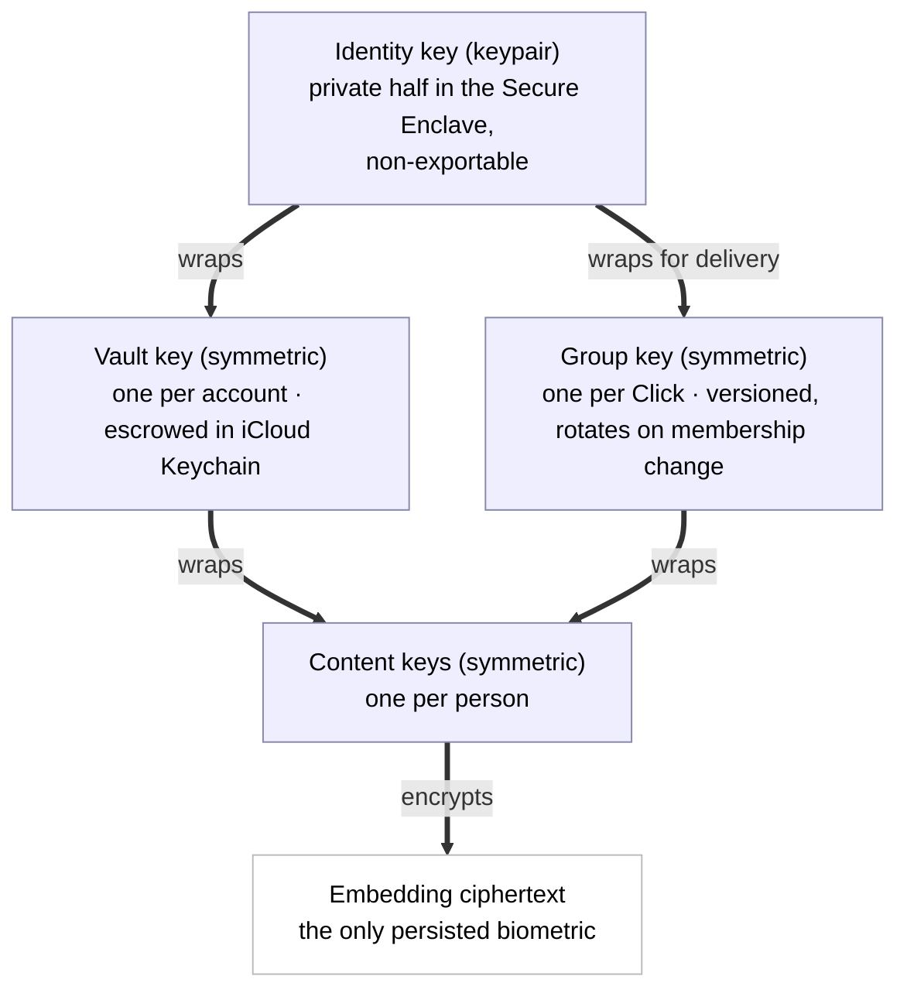
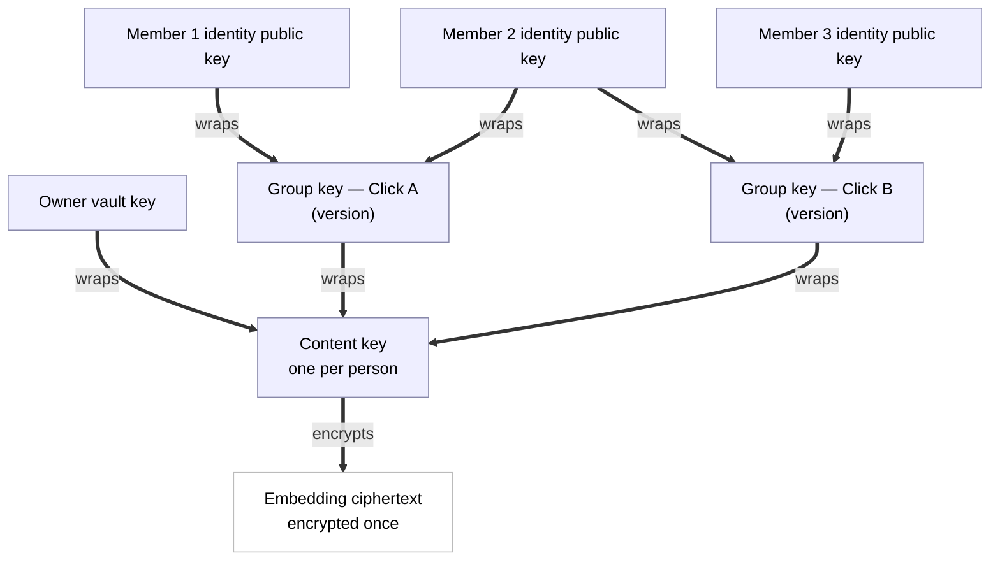
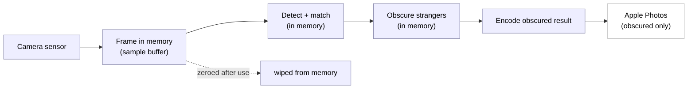
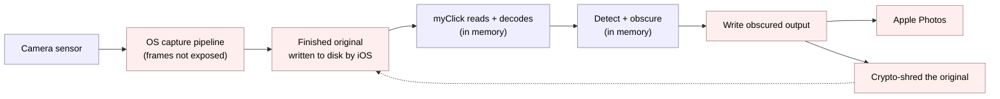
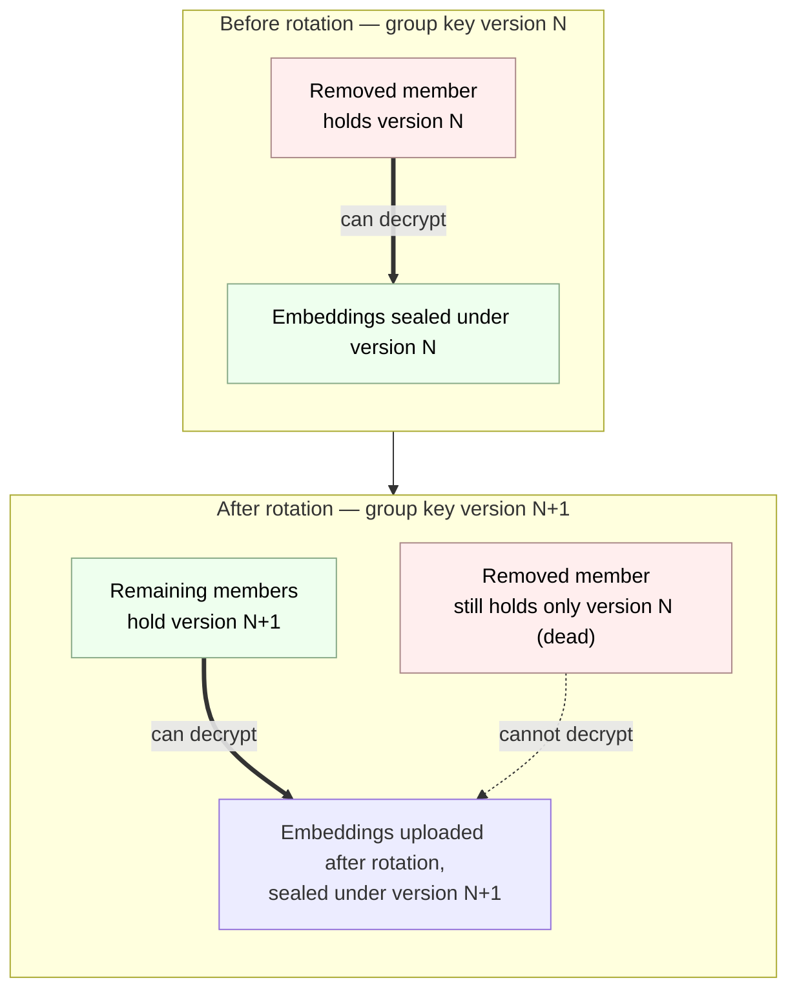

# myClick Cryptographic Protocol

**Status: DRAFT — in active design (2026-05-28). Nothing here is final.**

All eleven sections are drafted as of 2026-05-28. This is still a draft, not a final spec: the empirical calibration (template count, match threshold, false-accept ceiling, re-enrolment bands) is validated in the closed beta, and the v2 metadata-hiding items in section 11 remain open. Everything here is subject to change as the design firms up — this banner will be updated as sections lock.

This document specifies the cryptographic protocol behind myClick: how faces become encrypted embeddings, how members of a Click share the ability to recognise each other's children, how the server stays unable to decrypt anything sensitive, and how revocation works.

This protocol is being designed in the open. See the commit history for how it evolved.

## Table of Contents

- [The ideas in plain English (start here)](#the-ideas-in-plain-english)

1. [Threat model](#1-threat-model)
2. [Canonical model](#2-canonical-model)
3. [Key hierarchy](#3-key-hierarchy)
4. [Enrolment (face to encrypted embedding)](#4-enrolment-face-to-encrypted-embedding)
5. [Embedding storage and the server's view](#5-embedding-storage-and-the-servers-view)
6. [Per-Click group key (the ratchet)](#6-per-click-group-key-the-ratchet)
7. [Recognition (on-device matching)](#7-recognition-on-device-matching)
8. [Capture and import: source-original lifecycle](#8-capture-and-import-source-original-lifecycle)
9. [Revocation (key rotation; forward-immediate, forward-only)](#9-revocation-key-rotation-forward-immediate-forward-only)
10. [Key escrow and recovery](#10-key-escrow-and-recovery)
11. [Open questions](#11-open-questions)

---

## The ideas in plain English

If you already know public-key cryptography, you can skip straight to section 1 — nothing in this primer is normative.

This is an on-ramp, not a textbook. The rest of the document is precise and assumes these ideas; here we name each one in a sentence or two and point to where it does its work. Nothing here is a requirement — no key sizes, no thresholds. Those live in the body, on purpose, so there is only one place to read them.

- **Plaintext vs ciphertext.** Plaintext is the readable thing; ciphertext is the scrambled version you get after encrypting it, useless to anyone without the key. In myClick the only sensitive plaintext is a face image (briefly, during enrolment) and a decrypted embedding (briefly, during recognition); everything stored or sent is ciphertext. See sections 4 and 5.
- **Encrypted in transit vs encrypted at rest.** "In transit" (TLS) protects bytes while they travel over the network; "at rest" protects bytes while they sit on disk or in a database. myClick does both, and the threat model in section 1 lists each separately because they defend against different attackers.
- **Symmetric keys.** A symmetric key is a single secret that both locks and unlocks — encrypt and decrypt with the same key. The vault key and each Click's group key are symmetric keys; see the key hierarchy in section 3.
- **Public/private keypairs.** A keypair is two matched halves: a public half you can share freely and a private half you keep secret, such that what one half locks only the other half opens. The account's identity key is a keypair; see section 3.
- **Key wrapping (envelope encryption).** Using one key to encrypt another key, so the locked key can be stored or shipped safely and only the holder of the outer key can free it. This is the single most load-bearing idea in the document — it appears on nearly every page, and the layered hierarchy and the "one embedding, many locks" diagrams in sections 3 and 6.3 are entirely built from it.
- **The Secure Enclave.** A dedicated hardware vault inside the iPhone. Keys generated there cannot be copied out — software, including myClick itself, can ask the Enclave to use a key but can never read it. The identity private key lives here; see section 3.
- **Key escrow.** Safely backing up a key with a trusted party so it can be recovered if the device is lost. myClick escrows the vault key with iCloud Keychain rather than asking a parent to safeguard a recovery phrase; see sections 3.2 and 10.
- **End-to-end encryption and server-blindness.** When only the endpoints (the users' devices) hold the keys, the server in the middle holds only locked boxes it cannot open. For myClick this is structural, not a promise we ask you to take on faith: there is no key on the server that could decrypt a child's biometric, by construction. See section 5 for the precise enumeration of what the server can and cannot see.
- **Face embeddings are non-reversible.** A face embedding is a number-vector derived from a face; it is not a compressed photo, and you cannot rebuild the original image from it. That is the whole reason it is the only biometric artifact we ever persist. The rest of how matching works is in section 4.

---

## 1. Threat model

A threat model is two honest lists. The first is what the system must defend against — the attacks where, if we lose, the product has failed at its one job. The second is what the system concedes — the attacks we do not stop, stated plainly so nobody is misled about what "privacy-first" buys them.

The concessions matter as much as the defences. A privacy claim that quietly omits its limits is worse than no claim at all, because it invites the user to trust the system in exactly the situations where it cannot help. So we write both lists, and we write the second one carefully.

### 1.1 Who we defend against (must win)

These are the adversaries the architecture exists to beat. If any of these wins, that is a bug in the protocol, not an accepted risk.

- **myClick the company, or a malicious insider.** Even we cannot decrypt a child's biometric. This is the headline guarantee, and the entire architecture is built to make it true: the keys that decrypt embeddings live in users' Secure Enclaves and iCloud Keychains, never on our servers. An engineer with full production access, or a future owner of the company with bad intentions, still gets only ciphertext.
- **A server breach.** An attacker who steals the entire database — every row, every blob, every backup — gets only ciphertext. No plaintext embeddings, ever. There is no admin key, no "break glass" decrypt path, no master secret on the server that turns the stolen data into faces.
- **A subpoena or state actor.** We cannot hand over what we cannot decrypt. The honest answer to a warrant for a child's biometric is "here is the ciphertext we hold; we have no key for it." This is a deliberate design property, not a legal posture we adopt after the fact — the inability is structural.
- **A network eavesdropper.** Everything is TLS in transit and end-to-end encrypted at rest. An attacker watching the wire, or sitting on a compromised network path, sees encrypted bytes both in flight and as stored.
- **A malicious Click member.** A member of one Click cannot extract the embeddings of children in Clicks they are not in — group keys are scoped per Click and never shared across them. No member can obtain raw photos of anyone's children, because raw photos are never stored or transmitted; only non-reversible embedding vectors exist. And no member can recognise children outside the Click's premises or scope, because recognition is gated by the active scope at capture time.

### 1.2 What we concede (accepted risks, stated plainly)

These are the attacks we do not stop. We list them because pretending otherwise would be dishonest, and because knowing them lets a user decide what myClick is and is not good for.

- **A compromised device.** If the user's own iPhone is jailbroken, or running malware with sufficient privilege, the plaintext embeddings that are decrypted on-device for matching are exposed on that device. No end-to-end encrypted system can defend a compromised endpoint — the endpoint is where plaintext has to exist for the app to work at all. We protect data in transit and at rest, not against an attacker who already owns the phone.
- **The lock-screen camera, to whoever holds the phone.** Like Apple Camera, myClick's camera is reachable from the lock screen without a Face ID prompt (see [section 7.5](#75-lock-screen-camera-flow)). Someone who picks up the phone can therefore take obscured photos, and if the owner's family happens to be in front of the lens they will be recognised and kept visible. That is the limit of it: the holder cannot browse Clicks, read a roster, change settings, or open the audit log — those stay behind the app-lock — and the decrypted roster is zeroed the instant the app backgrounds. We accept this narrow surface deliberately, as the price of a grab-and-shoot camera; it exposes nothing the holder could not already capture by standing where they are.
- **Apple itself.** We rely on the Secure Enclave for key generation and on iCloud Keychain for escrow and recovery. If Apple is malicious, or is compromised at the hardware or operating-system level, the model breaks. We trust the platform — as does every iOS app, and as the user already does by carrying the device.
- **Authorised use.** A photographer with `can_capture` rights in a Click legitimately recognises the consented children of that Click. That is the product working as designed, not a breach. The crucial nuance, stated explicitly: **within a Click, members necessarily share the embeddings of opted-in children.** A photographer's device must hold the plaintext embeddings of the children they are allowed to recognise, or matching cannot happen at all. A determined malicious member could therefore extract those vectors from their own device. The protection here is not secrecy — it is **consent** (they were granted recognition rights to exactly these children, by those children's parents) plus **non-reversibility** (an embedding is a vector, not a photo; it cannot be turned back into an image of the child). If you grant someone the right to recognise your child, you are trusting them with that child's embedding. The protocol makes that trust explicit and scoped; it does not pretend to remove it.
- **Metadata.** The server cannot read embeddings, but it can see some metadata: who is a member of which Click, when embeddings are uploaded, and the shape of the Click membership graph. Content is encrypted; the social graph and timing are visible server-side. Full metadata-hiding — sealed-sender-style techniques that blind the server to who talks to whom — is a v2-and-later consideration, not a v1.0 promise.
- **Already-published photos.** Once an obscured photo is saved to the Photos library or posted somewhere, it is out of our control. Revocation is forward-only: it changes what future captures will obscure, but it cannot reach into a photo that already exists on someone else's phone or feed. We say this plainly in the product copy, and we say it here.

---

## 2. Canonical model

This section defines the abstract, storage-agnostic constructs that the cryptography and the Storage Port depend on. It is the shared vocabulary every other section uses precisely, and it is deliberately narrow: a construct belongs here only if the cryptography or the storage interface depends on it. App-domain concepts that the crypto does not touch are defined in the companion data model, not here (see the closing note).

Each construct below gets a precise definition and a one-line plain gloss.

- **Account identity key** — the account's keypair: an ECC P-256 keypair generated per account and per device in the Secure Enclave. The public half is published to the server; the private half is non-exportable and never leaves the Enclave. It does two jobs — it authenticates the account, and it is the root of the wrapping hierarchy (section 3): its public half wraps this member's vault key and each group key delivered to them, and its private half unwraps them.
  *In plain terms: the device-bound keypair that proves who you are and unlocks everything else.*
- **Person (subject)** — the scope a content key belongs to: the holder of a content key and of the embeddings that content key encrypts. A person is a holder's own face or a dependent's, and it is the unit of cryptographic ownership — one person, one content key, one template set.
  *In plain terms: the face whose templates a single content key locks.*
- **Embedding** — the ciphertext. A roughly 2048-byte face vector extracted on-device, persisted only in encrypted form. It is the sole biometric artifact ever stored, and it is not reversible into a photograph.
  *In plain terms: the encrypted number-vector that stands in for a face.*
- **Content key** — one per person; the symmetric key that encrypts that person's templates. It is the only key applied directly to embedding ciphertext, and it is the small thing that gets wrapped for each audience (see the wraps below).
  *In plain terms: the key to one person's faces.*
- **Vault key** — one per account; the symmetric key that gives the owner private access by wrapping the owner's own content keys (the holder plus their dependents). It is the portable secret recovered on a new device, escrowed in iCloud Keychain.
  *In plain terms: your private master key for your own family's faces.*
- **Click** — a keying scope: the unit that has a group key. Cryptographically, a Click is exactly "a set of members who share one group key generation," nothing more. (Its app meaning — a circle of people who consent to recognise each other's children at premises — lives in the data model.)
  *In plain terms: the group that shares one key.*
- **Membership** — canonically, the set of accounts that currently hold a Click's group key. Membership is defined here by key possession, not by any role flag: you are a member, in the cryptographic sense, exactly when the current group-key version has been wrapped for your identity key.
  *In plain terms: who currently holds the group's key.*
- **Group key and GroupKeyVersion** — the symmetric key shared by a Click's members, and one generation of it. There is one group key per Click; it rotates on every membership change, and each rotation mints a new GroupKeyVersion that supersedes and kills the prior one. Rotation is the engine of revocation (section 9); the version stamp also serialises concurrent rotations (section 6.5).
  *In plain terms: the shared key, and which generation of it you are looking at.*
- **ContentKeyWrap** — a person's content key encrypted under one outer key: either the owner's vault key (owner-private access) or a specific Click GroupKeyVersion (shared recognition within that Click). The embedding ciphertext is stored once; only this small wrap is multiplied per audience.
  *In plain terms: one person's content key, locked for one audience.*
- **GroupKeyWrap** — a GroupKeyVersion encrypted under one member's identity public key, so only that member's Secure Enclave can unwrap it. This is how a group key reaches each member without the server ever holding a usable copy.
  *In plain terms: the group key, locked so only one member can open it.*

App-domain constructs — guardianship, the opt-in approval flow, premises, licences, and subscriptions — are defined in the companion data model (myClick repo, `docs/data-model.md`), not here, because the cryptography does not depend on them. In the canonical model, "opt-in" appears only as its cryptographic shadow: a person's content key is wrapped under a Click's group key. The body prose elsewhere (sections 1 and 5 through 9) still mentions premises, opt-in, and capture for narrative context; only this canonical model is restricted to crypto-relevant constructs.

---

## 3. Key hierarchy

In plain English, there are three layers of keys, each doing one job.

The **first layer** is the account's identity. When you first launch myClick, the app asks the Secure Enclave — the dedicated security chip in your iPhone — to generate a keypair just for you. The private half of that keypair never leaves the chip. It cannot be exported, copied, or extracted, even by the app itself; the app can only ask the chip to use it. This identity key is how the server knows it is really you, and it is the key that wraps (encrypts) the next layer down.

The **second layer** is your vault key. This is the key that protects your own family's faces — your embeddings and your children's embeddings — when they sit at rest on disk and on our server. It is a symmetric key (the same key locks and unlocks), wrapped by your identity key so only your device can use it, and escrowed in iCloud Keychain so that if you lose your phone, you can get it back.

The **third layer** is the per-Click group key. Each Click has one. When a child is opted into a Click, that child's embedding is made decryptable by every current member of that Click — so the school photographer's phone can recognise the children whose parents opted them into the school Click, and nobody else's. The group key is how that sharing happens. It is handed to each member by wrapping it under that member's identity public key, so only that member's device can unwrap it. It rotates every time membership changes, which is what makes revocation work (see section 9).

A structural consequence worth stating directly: **a single child's embedding is stored once, but made decryptable by more than one audience.** The embedding ciphertext exists exactly once, encrypted under its own per-person content key (see [section 6.3](#63-content-key-indirection)). What is multiplied is not the embedding but that small content key: it is wrapped once under the parent's vault key — the parent's own private access — and once under each Click's group key the child has been opted into. The same vector, encrypted a single time, with its content key sealed under different locks for different audiences.

The three layers wrap downward: the identity key (its private half locked in the Secure Enclave) wraps the vault key, and the vault key and each group key in turn wrap the content keys that protect the embeddings.

### 3.1 The three layers, precisely

| Key | Type | Lives where | Wrapped / protected by | Job |
|-----|------|-------------|------------------------|-----|
| Account identity key | ECC P-256 keypair | Private key inside the Secure Enclave (non-exportable); public key published to the server | The Secure Enclave itself; never leaves the chip | Authenticates the account; wraps the vault key; unwraps group keys delivered to this member |
| Account vault key | AES-256 symmetric | On-device, and escrowed in iCloud Keychain | Wrapped by the account identity key; escrowed under iCloud Keychain | Wraps the content keys of the account's own enrolled embeddings (holder + children), giving the owner private access at rest |
| Per-Click group key | AES-256 symmetric | On-device for each current member; distributed by the server in wrapped form | Wrapped under each member's identity public key for delivery | Makes a Click's opted-in embeddings decryptable by all current members for recognition; rotates on membership change |

### 3.2 Two decisions locked here

**Recovery is by iCloud Keychain escrow, not a user-held recovery phrase.** We escrow the account vault key in iCloud Keychain rather than asking the user to write down and safeguard a recovery phrase. The reasoning: it is by far the best consumer UX (a parent recovering a lost phone signs in with their Apple ID, as they already expect to); Apple is already a conceded trust anchor in our threat model (section 1.2), so escrow does not introduce a new party we were otherwise keeping out; and a lost recovery phrase would mean permanently lost family face data, with no path back. For a product whose users are ordinary parents, not crypto practitioners, the recovery-phrase failure mode is unacceptable.

**A group key with rotation on membership change, not a full double-ratchet.** A messaging protocol like Signal uses a double-ratchet to get per-message forward secrecy, because a chat is a continuous stream of messages and each one should be independently protected. A Click's embedding roster is not a message stream — it is a relatively static set that changes only when someone joins or leaves. Per-message forward secrecy would be overkill and would add messaging-grade complexity for no benefit. A per-Click group key that rotates on every membership change achieves exactly the guarantees we need — forward-immediate and forward-only revocation (section 9) — without that complexity.

---

## 4. Enrolment (face to encrypted embedding)

Enrolment is how a face becomes an encrypted embedding. It is the one moment where myClick handles a raw image of a child, so it is designed with the most care: the raw frames exist in memory only, for as long as it takes to extract embeddings, and are then zeroed.

### 4.1 The flow

1. **Initiate.** A parent starts enrolment, for themselves or for a child. (Enrolling a dependent is the common case.)
2. **Guided sweep.** The app guides a short multi-angle capture — turn left, turn right, look up, look down, smile. The frames are held in a memory buffer only. They are never written to disk.
3. **Quality gates.** As frames arrive, the app checks them:
   - A face must be detected.
   - Exactly one face must be present. Multiple faces is a **hard block** — enrolment will not proceed, because we must not accidentally enrol the wrong child.
   - Lighting must be adequate. Poor lighting is a **soft warning** — the app nudges the user but does not stop them.
   - Pose must vary across the sweep, so the template set actually covers a range of angles.
4. **Extraction.** MobileFaceNet runs on-device and extracts the embeddings from the captured frames. No image leaves the phone for this step; there is no cloud call.
5. **Zeroing.** The raw frames are zeroed from the memory buffer immediately, the moment extraction is done. See section 4.6.
6. **Encryption.** The embeddings are encrypted under the person's content key; that content key is wrapped under the account's vault key (and, once the person is opted into a Click, under that Click's group key — see [section 6.3](#63-content-key-indirection)).
7. **Storage.** The ciphertext is stored locally and synced to the server. The server receives ciphertext only — it never sees a frame, never sees a plaintext embedding.
8. **Consent read-back.** A consent read-back is recorded in the audit log: who enrolled whom, when, and under what consent statement.

### 4.2 Liveness: light, not hard-gated

The guided multi-angle sweep is itself a soft liveness check. A flat printed photo or a still image on a screen cannot easily produce a coherent multi-pose sweep — the geometry does not hold up across angles. Where TrueDepth hardware is available, we use it opportunistically to strengthen this.

We deliberately do **not** hard-block on liveness. Hard liveness gating would make enrolling a young child miserable — small children do not perform on cue, and a stuck enrolment flow is a recipe for a parent giving up. The real protection against enrolling a face that isn't a consenting person's is physical: you need physical access to the child to complete the sweep, and the sweep enforces that in practice. Liveness is a check we lean on lightly, not a wall.

### 4.3 Template set of 6 per person

We store a **template set of 6 embeddings** per enrolled person, not a single embedding:

1. Front, neutral
2. Front, smiling (expression variation)
3. Three-quarter left
4. Three-quarter right
5. Looking up
6. Looking down

A detected face matches the person if it clears the match threshold against **any one** of these templates.

The reason for more than one template is that a face embedding is sensitive along three axes at once: **yaw** (turning left/right), **pitch** (looking up/down), and **expression** (neutral vs smiling and beyond). Children's candid faces vary enormously across all three — a kid mid-laugh at a three-quarter angle looks very different to a neutral front shot. A single embedding would miss most real captures.

Four factors set the count:

1. **The pose-and-expression envelope to cover** — the range of angles and expressions a real candid photo will throw at us.
2. **Per-template pose tolerance** — each template reliably matches faces within roughly ±30 degrees of its own pose before confidence drops off. More templates, spaced across the envelope, keep every likely face within tolerance of some template.
3. **The false-accept asymmetry** — the dominant factor. See section 4.4.
4. **Compute and storage cost** — every detected face is compared against every template of every roster member, so the count multiplies the work done per frame and the bytes stored per person.

### 4.4 The false-accept asymmetry

This is the privacy-critical part of the calibration, and it is worth being precise about.

There are two ways matching can go wrong, and they are not equally bad:

- A **false-reject** — your own child is wrongly obscured — is annoying but safe. It fails closed: the worst outcome is that a photo you wanted has a blur where your kid's face is. No stranger is exposed. No privacy is breached.
- A **false-accept** — a stranger's child is shown unobscured because the system wrongly thought they were on the roster — is a privacy breach. It is the exact harm myClick exists to prevent.

These two failures are not symmetric, and the calibration is built around that. Adding templates raises the false-accept rate: each template is another chance for a stranger's face to clear the threshold, so the aggregate false-accept rate is roughly the per-template rate multiplied by the template count. So template count and match threshold are **co-tuned against a hard false-accept ceiling.** We deliberately spend the cost of more templates in the safe currency — false-rejects, over-obscuring — rather than the dangerous one.

**Starting ceiling: aggregate false-accept rate ≤ 0.1%** — a stranger wrongly recognised in fewer than 1 in 1000 faces — to be tightened if the closed-beta data on real children's faces allows.

What this spec fixes is the **method and the ceiling**, not a magic constant. The final template count (it could land anywhere from 5 to 7) and the match threshold are calibrated empirically during the closed beta against real children's faces. The principle — co-tune count and threshold against a hard false-accept ceiling, paying the cost in over-obscuring — is the durable decision.

### 4.5 Re-enrolment: periodic and explicit, age-banded, no silent learning

Children's faces change, so templates go stale. We refresh them by **periodic, explicit re-enrolment**, age-banded:

- Roughly every 3 months under age 5.
- Roughly every 6–12 months for older children.

The app reminds the parent; the parent redoes the sweep. That is the whole mechanism.

We deliberately do **not** silently update templates as recognition succeeds in the field. Continuous "learning" — quietly folding each successful match back into the template set — would mean continuously re-processing a child's biometric in the background. That is precisely the always-on biometric harvesting myClick exists to avoid. Explicit re-enrolment keeps the promise true: **we only process a child's face when you ask us to.** This is a deliberate accuracy cost, paid on purpose to keep the no-background-harvesting guarantee honest.

### 4.6 The zeroing guarantee

The raw enrolment frames are zeroed from the memory buffer **explicitly in code**, immediately after embeddings are extracted (step 5 above). This is documented here and visible in the open-source code: a reviewer can read the source and confirm that the frames are zeroed and that there is no disk write of the raw image.

We state the limit of that plainly. Source-level review proves the source does the right thing. **Binary-level verification — that the app actually shipped to the App Store does exactly this — awaits reproducible builds**, which we do not yet have. We will not imply more assurance than we can currently deliver. The source is auditable today; bit-for-bit verification of the shipped binary is future work.

---

## 5. Embedding storage and the server's view

This section is the precise enumeration of what the server can and cannot see. It is the technical backing for the public "what we store" page, and it is the place where the headline claim from [section 1.1](#11-who-we-defend-against-must-win) — "even we cannot decrypt a child's biometric" — gets made concrete. A privacy claim is only as good as the list behind it, so here is the whole list.

The discipline is simple: everything the server holds is either ciphertext (useless without keys the server does not have) or metadata we have already conceded ([section 1.2](#12-what-we-concede-accepted-risks-stated-plainly)). Nothing else.

At a glance, the line the server cannot cross: it holds ciphertext and the conceded metadata, and it never holds a plaintext embedding or any usable key.

```mermaid
flowchart LR
    subgraph sees["What the server holds"]
        direction TB
        ct["Encrypted embeddings (ciphertext)"]
        wraps["Wrapped content-keys and group keys"]
        pub["Account public keys"]
        meta["Membership metadata, timestamps, premises polygons, audit log"]
    end
    subgraph never["What the server never holds"]
        direction TB
        plain["Plaintext embeddings"]
        vk["The vault key (escrowed with Apple)"]
        ugk["Any group key in unwrapped, usable form"]
        raw["Any raw photo or face image"]
    end
    sees -.->|cannot cross| never

    classDef has fill:#efe,stroke:#8a8,color:#000;
    classDef hasnt fill:#fee,stroke:#a88,color:#000;
    class ct,wraps,pub,meta has;
    class plain,vk,ugk,raw hasnt;
```

### 5.1 What the server holds

All of this is either ciphertext the server cannot decrypt, or metadata we have openly conceded.

- **Encrypted embeddings.** The 2048-byte face vectors, as ciphertext. Never in plaintext.
- **Wrapped content-keys and wrapped group keys.** Each person's template set is encrypted under that person's content-key; that content-key is wrapped under the owner's vault key and under each Click's group key the person is opted into; and each group key is wrapped under a member's identity public key. The server stores all of these wrapped forms and routes them to the right devices. It cannot unwrap any of them, because the unwrapping keys live in members' Secure Enclaves. (The content-key indirection is explained in [section 6](#6-per-click-group-key-the-ratchet).)
- **Account public keys.** Public by design — that is what "public key" means. The server uses them to verify accounts and to route wrapped group keys.
- **Membership metadata.** Which accounts are in which Click; each member's role flags (`is_biometrically_enrolled`, `can_capture`, `is_admin`); and the associated timestamps.
- **Premises definitions.** The geofence polygons attached to each Click.
- **The audit log.** Consent events and membership changes — who enrolled whom, who joined or left, when.

### 5.2 What the server never holds

This is the list that makes the "never on our servers" claim in [section 1.1](#11-who-we-defend-against-must-win) precise.

- **The account vault key.** It is escrowed in iCloud Keychain — that is, with Apple — and never on our servers. We are not in the escrow path at all (see [section 10](#10-key-escrow-and-recovery)).
- **Any group key in unwrapped form.** The server only ever sees group keys wrapped under members' identity public keys. It never holds one it could actually use.
- **Any plaintext embedding.** Decryption happens on-device, in memory, for the duration of a recognition session and no longer (see [section 7](#7-recognition-on-device-matching)).
- **Any raw photo or face image.** These are never uploaded — not at enrolment, not at capture, not at import. The server has never seen a child's face and never will.

### 5.3 What the server can therefore infer

We concede this metadata in [section 1.2](#12-what-we-concede-accepted-risks-stated-plainly); here is what it amounts to in practice.

- **The social and institutional graph.** From membership metadata, the server can see who is in which Clicks together — which accounts belong to a family, which parents are in a class, which staff are in a school group.
- **Timing.** When embeddings are uploaded, when members join or leave. The shape of activity over time is visible even though its content is not.
- **Premises locations.** The geofence polygons are server-stored in v1 (so they can sync to members' devices), so the server knows roughly where a Click operates — which school, which neighbourhood.

### 5.4 What the server cannot infer

- **Anyone's biometric.** Every embedding is ciphertext. The server cannot tell one child's face from another's, or reconstruct any face at all.
- **Whether a specific child was recognised in a specific photo.** Recognition happens entirely on-device, and the obscured output is never uploaded. The server has no idea who appeared in any photo, who was kept visible, or who was obscured.

### 5.5 Two decisions recorded here

**Premises are server-visible in v1.** The geofence polygons live on the server so they can sync to every member's device, which means the server can infer roughly where a Click operates. This sits inside the metadata concession already made in [section 1.2](#12-what-we-concede-accepted-risks-stated-plainly) — it is not a new concession, just the concrete form of one. Premises-encryption, which would hide locations from the server, is deferred to v2 along with the rest of metadata-hiding (see [section 11](#11-open-questions)).

**Storage substrate: Postgres `bytea` for embeddings.** Embedding data is small — roughly 12 KB per person for the six-template set in plaintext; the stored ciphertext, plus its small content-key wraps, is modestly larger — so it lives directly in Postgres as `bytea`. There is no efficiency reason to push it into object storage at this scale. Any larger encrypted artifacts that arise would use storage buckets configured with no server-side decrypt key, but at v1 there is nothing large enough to need them.

## 6. Per-Click group key (the ratchet)

This section consolidates the group-key decisions from [section 3](#3-key-hierarchy) and the sharing-mechanic design into one place. It is the mechanism that lets every current member of a Click recognise the children opted into it, and lets revocation work the moment membership changes.

### 6.1 One key per Click

Each Click has a single **AES-256 group key**. The embeddings opted into the Click are made decryptable under it (indirectly — see [section 6.3](#63-content-key-indirection)), so that every current member can recognise those children, and nobody outside the Click can.

### 6.2 Distribution rides on admin approval

When a new member is admitted, the admin's device wraps the current group key under the new member's identity public key and hands the wrapped key to the server to deliver. Only the new member's Secure Enclave can unwrap it.

This deliberately rides on the admin-approval step that already exists in the join flow. Admission to a Click already requires an admin to approve; wrapping the group key is folded into that same action. The rationale is accountability: a human admin is already in the loop deciding who gets in, so the cryptographic grant of recognition rights happens at exactly the moment a person took responsibility for admitting them — not automatically, not server-side.

### 6.3 Content-key indirection

Embeddings are not encrypted directly under the group key. Instead, **each person has a single content-key that encrypts their template set, and that content-key is wrapped under the group key.** One extra layer of indirection. The indirection is uniform across audiences: the same content-key is also wrapped under the owner's vault key for the owner's private access (see [section 3](#3-key-hierarchy)). So the embedding ciphertext is stored exactly once, and only the small content-key is wrapped per audience — never the embedding itself.

One embedding, many locks: the embedding is encrypted a single time under its content key, and that one content key is wrapped under the owner's vault key and under each Click group key the person is opted into; each group key is in turn wrapped under every current member's identity public key.

The payoff is rotation cost. When membership changes and the group key must rotate ([section 6.4](#64-rotation-on-every-membership-change)), the only things that need re-wrapping are the content-keys — which are a handful of bytes each — not the embeddings themselves, which are kilobytes each. Rotating an 800-child school Click means re-wrapping 800 tiny content-keys, not re-encrypting 800 full embeddings. Same security, roughly a hundredfold less work. The indirection costs one cheap content-key unwrap per person at read time and buys cheap rotation, which is the operation that actually happens often.

### 6.4 Rotation on every membership change

Every time membership changes — someone joins, someone leaves, someone is removed — the group key rotates:

1. A new group key is generated.
2. It is wrapped for each remaining member under that member's identity public key.
3. The content-keys are re-wrapped under the new group key.

After rotation, the old group key is dead: it decrypts nothing new, and anyone who only held the old key (a departed member) is locked out of everything uploaded thereafter. This is the engine of revocation ([section 9](#9-revocation-key-rotation-forward-immediate-forward-only)).

### 6.5 Multiple admins, and serialising concurrent rotations

Any admin can distribute or rotate the group key. This is native to the model rather than a special case: every admin is a member and therefore already holds the group key, and `is_admin` is just a per-member attribute. There is no separate "key-holder" role to manage.

That raises one concurrency hazard: two admins rotating at the same moment could produce two conflicting "new" group keys, leaving members in an inconsistent state. We prevent this by **serialising rotations with a version stamp** on the server (optimistic concurrency). A rotation references the key version it intends to replace. If two rotations race, the first to land wins; the second is rejected because the version it referenced is now stale, and it retries against the new version. The server never has to understand the key material to do this — it only compares version numbers — so serialising rotations does not require the server to hold anything it should not.

Multiple admins is also the institutional recovery-resilience mechanism (see [section 10](#10-key-escrow-and-recovery)).

### 6.6 Why group-key-plus-rotation, not a full double-ratchet

This decision is recorded in [section 3.2](#32-two-decisions-locked-here) and restated here for completeness, because it is the defining choice of this section. A messaging protocol uses a double-ratchet to give every message its own forward secrecy, because a chat is a continuous stream and each message should be independently protected. A Click's embedding roster is not a stream — it is a relatively static set that changes only on membership or opt-in changes. Per-message forward secrecy would be solving a problem we do not have, at messaging-grade complexity. Group-key-plus-rotation delivers exactly the guarantees we need — forward-immediate and forward-only revocation ([section 9](#9-revocation-key-rotation-forward-immediate-forward-only)) — and nothing we do not.

## 7. Recognition (on-device matching)

Recognition is the moment the product earns its name: faces are detected, matched against the people you are allowed to recognise, and everyone else is obscured. All of it happens on the device. No face, no embedding, and no recognition result ever leaves the phone.

### 7.1 The flow

1. **Detect.** Vision detects faces in the frame and returns their bounding boxes.
2. **Extract.** MobileFaceNet extracts an embedding for each detected face, in memory.
3. **Compare.** The device compares each face's embedding against the **active roster** — the union of the photographer's `can_capture` Clicks that are active at the current location in Mode A, or the explicitly-selected Click's roster in Mode B.
4. **Decide.** A match above threshold against **any one** of a person's six templates keeps that face visible. No match obscures it.
5. **Zero.** Every detected face's embedding is zeroed the moment its decision is made.

### 7.2 The unconsented-face invariant (R2)

This is a hard guarantee, and it is the legal hook (POPIA legitimate-interest, GDPR equivalent) that makes processing strangers' faces defensible at all: **we never build a database of children we do not have consent to remember.**

A stranger's embedding is computed in memory, used only for the single obscure-or-keep comparison, and zeroed within milliseconds. It never touches disk. It never touches the network. It is never stored, indexed, or retained in any form. The only thing that persists from a stranger's face is the obscuring that protected them.

### 7.3 Roster decryption lifecycle (R1)

The active roster is stored as ciphertext (that is the whole point of [sections 5](#5-embedding-storage-and-the-servers-view) and [6](#6-per-click-group-key-the-ratchet)). Recognition needs it in plaintext. So the roster is decrypted into memory at the start of a session, held for the session, and zeroed at the end.

No plaintext roster is ever written to disk. Only the **encrypted** roster is cached on disk for fast loading; decryption is always in-memory and per-session. This is what keeps the encrypted-at-rest guarantee true for consented children, not only for strangers — your own child's embedding is no more exposed at rest than anyone else's.

### 7.4 What an active recognition session is

A recognition session is precisely the period during which the device holds a decrypted roster in memory. Its boundaries are defined exactly, because the roster's lifetime is a security property.

- **Starts** when recognition is needed: the camera viewfinder becomes active (Mode A), or an import batch begins (Mode B).
- **Ends — hard boundaries, roster zeroed immediately, no exceptions:**
  - the app backgrounds, or the Face ID app-lock engages;
  - the app terminates;
  - the camera screen closes, or the Mode B batch finishes or is cancelled.
- **Soft boundary (foreground only):** if the user briefly navigates away from the camera while the app is still foregrounded and unlocked, the roster is held for roughly 60 seconds — so flipping quickly back to the camera does not pay the decryption cost again — and then zeroed. Any background or lock during that window zeroes it immediately. The soft boundary never survives leaving the app.
- **Recomposes within a session:** in Mode A, as the device crosses premises boundaries, Clicks drop out of the in-memory roster (their portion zeroed) or join it (their portion decrypted). The session persists; its roster contents track the active scope.

### 7.5 Lock-screen camera flow

The camera and recognition are reachable from the lock screen **without** a Face ID prompt, the way Apple Camera is. The Face ID app-lock gates only the management surfaces — the Clicks list, settings, the licence inventory, the audit log — never the camera.

The security reasoning follows directly from the threat model. We already concede the stolen or compromised device ([section 1.2](#12-what-we-concede-accepted-risks-stated-plainly)). The camera only ever obscures faces; it never exposes the roster, the embeddings, or the social graph to whoever is holding the phone. So a thief who grabs the phone gets a camera that will recognise the owner's family if those people happen to be physically standing in front of it — and nothing else. They cannot browse Clicks, see who is enrolled, read settings, or open the audit log. The decrypted roster is still zeroed the instant the app backgrounds or locks; it is simply re-decrypted on each quick launch. We trade nothing of value for the convenience of a grab-and-shoot camera.

### 7.6 Progressive roster loading

Rosters load smallest-and-likeliest first. The family Click — a handful of people — decrypts in single-digit milliseconds; most-recently-used Clicks come next; large rosters fill in over tens of milliseconds. Crucially, this decryption overlaps camera-hardware initialisation, which takes roughly 200–400 ms on every launch regardless, so the roster work is hidden behind a wait that was happening anyway and is invisible to the user.

Combined with two other rules, the quick grab from the lock screen feels instant:

- **Shutter-independence:** the shutter captures the frame instantly; obscuring is applied when the decision is ready, not before. You never wait to take the shot.
- **Fail-closed:** until the decision is ready, faces are obscured.

The only observable artifact is benign: a school-opted-in child who is not part of the owner's family might be briefly over-obscured — for the tens of milliseconds until the school roster finishes loading — and over-obscuring is always the safe direction to fail.

### 7.7 Matching performance (R3)

Matching is brute-force vectorised cosine similarity: one face's embedding is compared against the whole roster matrix in a single operation, using Accelerate/BNNS. This is more than fast enough for v1 scale, which runs to thousands of templates. Approximate-nearest-neighbour indexing is deferred until a single roster exceeds roughly 10,000 templates — a threshold a v1 Click does not reach.

### 7.8 Mode B

Mode B uses the same recognition engine described above, with one difference: the roster is the **explicitly-selected Click's** roster rather than the capture-by-union of active Clicks. The user chooses the Click context at import time (because imported photos were not taken under any photographer's identity in myClick), and from there detection, extraction, comparison, decision, and zeroing are identical.

## 8. Capture and import: source-original lifecycle

The previous sections guarantee that three sensitive artifacts never persist in the clear: the **enrolment sweep frames** ([section 4](#4-enrolment-face-to-encrypted-embedding)), a **stranger's embedding** ([section 7.2](#72-the-unconsented-face-invariant-r2)), and the **decrypted roster** ([section 7.3](#73-roster-decryption-lifecycle-r1)). All three are memory-only by construction and are unaffected by anything in this section.

This section addresses a fourth artifact those guarantees do not cover: the **source original** — the actual photo or video being captured or imported, before myClick has obscured the faces in it. It is the frame the camera produces, or the file a Mode B import hands us. Until it is obscured, it is the most sensitive plaintext the product ever handles in bulk: a clear image that may contain unconsented children.

The invariant, stated once and precisely:

> **No recoverable cleartext source original ever persists.**

Note the wording. The strongest form of this invariant — "originals never touch disk" — remains literally true for most captures (Flow A below), and is the promise we make wherever it holds. But it is stronger than the invariant actually requires, and for a class of capture modes it cannot be honoured literally at all. The honest, universal guarantee is the one above: not "no bytes ever reach disk," but "nothing readable as a child's face ever survives." This section shows how each pipeline meets it.

### 8.1 Two pipelines

Whether the source original must touch disk depends on how much of the capture myClick controls.

- In **Flow A**, myClick receives each frame in memory before anything is written. We obscure first and write only the obscured result. The original is never a file.
- In **Flow B**, the operating system's capture pipeline runs end to end in hardware and hands myClick a **finished file, already written to disk, with faces unobscured.** Cinematic video, ProRes, some high-frame-rate slow-motion, and the paired movie of a Live Photo work this way: there is no point at which myClick sees the frames before the OS writes them. To obscure, we must read that file back, process it, write the obscured copy, and destroy the original.

Flow B is the only place in the entire product where a cleartext source original exists on disk. Everything below is about making that existence safe.

### 8.2 Flow A — frame-accessible capture (memory-only)

The standard AVFoundation path delivers each frame as an in-memory sample buffer (`AVCaptureVideoDataOutput` / `AVCapturePhotoOutput`) before any file is written. The pipeline obscures in memory and writes only the obscured output:

This covers normal photo capture, normal video recording, and Mode B import:

- **Photo.** The frame is obscured in memory; only the obscured image is written to the Photos library.
- **Video.** Frames are obscured one by one as they arrive; `AVAssetWriter` streams the *obscured* movie to disk as it records. The obscured movie is the output we keep — but no unobscured frame is ever written.
- **Mode B import.** The imported file is decoded in-process; frames are obscured in memory and the obscured export is written. The imported original is never copied into myClick's storage. (Mode B's recognition behaviour is in [section 7.8](#78-mode-b).)

For Flow A the "originals never touch disk" guarantee holds in its strongest form: the source original lives and dies in memory. iOS does not page application memory to a disk swap file, so "in memory only" on iPhone genuinely means never written to storage.

### 8.3 Flow B — OS-owned capture (disk-backed)

Some capture modes are implemented end to end in Apple's hardware pipeline and produce a finished file myClick never had the chance to obscure:

The hazard is the single on-disk node: the finished original exists in the clear from the moment iOS writes it until myClick destroys it. A naive "we will delete it after obscuring" is insufficient, because three ordinary events break it:

- **An interrupted run.** A crash, an out-of-memory termination, or a dead battery *between* the OS writing the file and myClick deleting it leaves the original on disk. This requires no attacker — only an ordinary interruption.
- **An exported copy.** A file written to a backed-up or synced location is copied off the device by the operating system's normal behaviour (iCloud backup, device backup, system indexing), with no compromise involved.
- **A non-destructive delete.** On flash storage, a normal delete unlinks the file but leaves its bytes recoverable until they are overwritten.

[Section 8.4](#84-the-hardened-flow-b) closes all three.

### 8.4 The hardened Flow B

Three mechanisms together make the on-disk original meet the invariant. None is sufficient alone.

**1. Encrypted scratch.** The original is written only to a dedicated scratch location inside myClick's app container, with `NSFileProtectionComplete` and a per-file key. It is never written to a backed-up or shared location, and it is flagged excluded from backup. While the device is locked or powered off, the file's bytes are encrypted and the key is evicted from memory — so a seized, off, or locked phone yields ciphertext, not a child's face. This is the same Data Protection trust anchor the rest of the protocol already relies on; it introduces no new party.

**2. Durable review-set journal.** myClick keeps a persisted journal of every source original that exists on disk and has not yet been obscured-and-destroyed. On every launch, before any other work, the app reconciles this journal to empty: any original left by a previous interrupted run is either finished (obscured, then its original destroyed) or, if the user abandoned it, destroyed outright. Cleanup is idempotent, so an interruption *during* cleanup simply re-runs. This is what converts "a crash leaks the original forever" into "a crash defers cleanup to the next launch, which is guaranteed."

**3. Crypto-shred, not unlink.** Because the scratch file has its own per-file key, destroying it means discarding that key. The bytes become unrecoverable immediately, with no dependence on the flash being overwritten later. "Delete" in this section always means crypto-shred.

A fourth rule is procedural rather than cryptographic, but it is load-bearing: **the source original is never handed to a system service that may cache it.** It is never added (even transiently) to the Photos library, never passed to QuickLook or a share sheet, never given to any API that generates its own thumbnails or copies outside myClick's container. Only in-process frameworks (decode, Vision) ever read it, and they read it in place. A derivative we did not create is a derivative we cannot shred.

### 8.5 The residual, stated plainly

Even hardened, Flow B has a floor we do not pretend away: while myClick is **actively running on an unlocked device**, the scratch original is decryptable within myClick's own process for the seconds it takes to obscure it. This is identical to the exposure that enrolment ([section 4](#4-enrolment-face-to-encrypted-embedding)) and recognition ([section 7](#7-recognition-on-device-matching)) already require — plaintext must exist in memory for the app to do its work at all — and it falls entirely inside the compromised-device concession already made in [section 1.2](#12-what-we-concede-accepted-risks-stated-plainly). Flow B adds no exposure above that floor; it brings a disk-backed capture *down* to it. The difference between Flow B and Flow A is not the floor — it is that Flow A never has to touch disk to reach it.

### 8.6 Modes that cannot be obscured

A few capture modes cannot be obscured meaningfully even with the machinery above — most clearly **RAW / ProRAW**, where the value of the format *is* the unprocessed sensor data, and obscuring it would both defeat the format and require editing raw sensor values. For any such mode the rule is scope, not scratch: it is offered **only in Normal Mode** — the per-capture override for solo shots with nothing to obscure — or it is not offered at all. A mode that needs obscuring but cannot be obscured is never shipped under a Click.

### 8.7 Decisions recorded here

- **The invariant is "no recoverable cleartext source original ever persists,"** not "no bytes touch disk." The latter holds for Flow A and is the stronger promise we make wherever it is true; the former is the universal guarantee that also covers Flow B. The corresponding myClick architecture principle is reworded to match (recorded as ADR-0005 in the myClick working repo).
- **Flow B is gated on the encrypted-scratch + review-set-journal foundation.** No OS-owned capture mode that requires obscuring ships before that foundation exists; until then such modes are either held or restricted to Normal Mode.

## 9. Revocation (key rotation; forward-immediate, forward-only)

Revocation is what happens when someone leaves a Click or is removed from it. The honest version of revocation has a sharp limit, and we state it here as plainly as we do everywhere else.

### 9.1 The mechanism is key rotation

On any membership change — a member removed, or a member leaving — the group key is rotated exactly as described in [section 6.4](#64-rotation-on-every-membership-change): a new group key is generated, wrapped for each remaining member under their identity public key, and the content-keys are re-wrapped under the new key. The departed member never receives the new key, so everything uploaded after the rotation is sealed against them.

Before rotation, the removed member holds version N and can decrypt everything sealed under it. After rotation, the roster is sealed under version N+1, which is wrapped only for the remaining members; the removed member holds a dead key and can decrypt nothing uploaded thereafter.

### 9.2 Forward-immediate

Once a rotation propagates — a matter of seconds — every capturer's future photos respect the new key. A removed member can no longer decrypt any newly uploaded embedding. The window between the membership change and full effect is the propagation time, measured in seconds, not the indefinite lag of waiting for some manual cleanup.

### 9.3 Forward-only (stated plainly)

Revocation cannot reach backwards. Photos already taken and saved to other members' devices, or already published somewhere, **cannot be retroactively obscured.** We have no way to reach into anyone else's photo library or anyone else's feed. The product copy says this directly — *"Revocation applies to future photos"* — and so does this spec. A privacy promise that implied otherwise would be a lie, and the limit is structural: a photo that already exists on another person's phone is simply out of reach.

### 9.4 Best-effort device wipe (stated honestly)

On revocation, the server also sends a wipe signal. A cooperating client receiving it deletes its cached encrypted roster for that Click. We are honest about what this is and is not worth: a **malicious** client can simply ignore the signal, and we cannot force it. So the wipe is best-effort cleanup, not a guarantee.

The real guarantee is the key rotation in [section 9.1](#91-the-mechanism-is-key-rotation) — the departed member cannot decrypt anything uploaded after they left, whether or not their client honoured the wipe. We do not imply the wipe is airtight, because it is not. It is a courtesy that tidies up cooperating devices; the cryptography is what actually protects you.

### 9.5 Account close

On account close, data is **soft-deleted for 30 days** and then hard-deleted. The grace window allows recovery from an accidental or coerced closure; after it, the data is gone. A right-of-access JSON export of an account's own data is available on request, so a user can take their data with them.

## 10. Key escrow and recovery

Recovery is the unglamorous part of any encryption design, and the part that decides whether real people can trust it. A parent who loses their phone must be able to get their family's face data back — and must be able to keep participating in the Clicks they were in — without us holding a key that breaks the whole model. This section is how.

### 10.1 What recovery restores

Recovery is by **iCloud Keychain escrow** (the decision is recorded in [section 3.2](#32-two-decisions-locked-here)), and it escrows two things: the **account vault key** and the **material needed to rejoin the account's Clicks**. The second part matters as much as the first — account recovery restores full Click participation, not just the private vault. A recovered parent gets back their own embeddings and is able to take part in the school Click, the class Click, and the family again, rather than being left holding their own data but locked out of everyone else's.

### 10.2 The mechanics

The mechanics follow from the key hierarchy:

- The Secure Enclave identity key is device-specific and non-exportable — it never leaves the chip, so it is never the thing that gets recovered.
- On a new device, the app generates a **fresh identity key** in that device's Secure Enclave.
- The **portable secrets — the account vault key plus the group-key-unwrapping material — are recovered from iCloud Keychain**, re-established through the user's Apple ID plus device passcode, the standard iCloud Keychain recovery flow. With these back, the account's own embeddings become decryptable again and its Click memberships can be re-established on the new device.
- Our server never sees the vault key at any point in this flow. Escrow is between the user and Apple; we are not in the path.

### 10.3 Institutional recovery resilience: multiple admins

For Clicks — and especially institutional ones — the multiple-admin model ([section 6.5](#65-multiple-admins-and-serialising-concurrent-rotations)) is also the recovery story. A Click is not bricked if one admin's device **and** iCloud are both lost, because any other admin can still rotate the group key and admit members. The Click keeps functioning through the surviving admins.

For institutional Clicks such as schools, multiple admins is therefore **strongly recommended**, not optional in spirit — a school running its photography on one person's phone is one lost device away from a stuck Click.

### 10.4 The remaining open case

The one case not yet fully designed is the rare worst case: **all** admins of a Click simultaneously losing access. Multiple admins mitigates this — the more admins, the less likely — but it does not formally close it. The complete recovery design for the all-admins-lost case is noted as open work in [section 11](#11-open-questions).

## 11. Open questions

These are the things we have deliberately deferred or not yet pinned down. We list them here for the same reason we list the conceded threats in [section 1.2](#12-what-we-concede-accepted-risks-stated-plainly): an auditor should be able to see the edges of what is designed, not just the middle.

**Deferred to v2**

- **Metadata-hiding.** Sealed-sender-style protection that would blind the server to the social graph and to timing. In v1 the server can infer who is in which Clicks together and when activity happens ([section 5.3](#53-what-the-server-can-therefore-infer)). Closing that is a v2 goal.
- **Premises-encryption.** Hiding premises locations from the server. In v1 the geofence polygons are server-stored so they can sync to devices, so the server knows roughly where a Click operates ([section 5.5](#55-two-decisions-recorded-here)). This is deferred to v2 alongside the rest of metadata-hiding.

**Empirical calibration (closed beta)**

- **Final template count, match threshold, and false-accept ceiling.** The method and the starting ceiling (≤ 0.1% aggregate false-accept) are fixed in [section 4.4](#44-the-false-accept-asymmetry); the final template count (somewhere between 5 and 7) and the threshold are calibrated on real children's faces across varied lighting and devices during the closed beta, and the ceiling confirmed there.
- **Re-enrolment band tuning.** The age-banded re-enrolment schedule ([section 4.5](#45-re-enrolment-periodic-and-explicit-age-banded-no-silent-learning)) is a starting estimate. We will measure staleness-driven false-rejects — especially for under-5s on the 3-month band — so the bands are grounded in data rather than guessed.

**Verifiability roadmap**

- **Reproducible builds.** So that users can verify the binary shipped to the App Store matches the public source. This closes the design-versus-deployment gap noted throughout (for example in [section 4.6](#46-the-zeroing-guarantee)). Roadmap item.
- **Server attestation / transparency.** So that users can verify the deployed server actually runs the published E2EE module, not a modified one. Roadmap item.

**Still in design**

- **Full group-key recovery if all admins of a Click lose access.** Multiple admins ([section 10.3](#103-institutional-recovery-resilience-multiple-admins)) mitigates this; the complete recovery design for the all-admins-lost case is not yet specified.
- **The spec's canonical format.** Whether this stays GitHub-rendered markdown, becomes a Signal-style PDF, or takes an RFC shape. For now, the canonical form is this markdown document.
