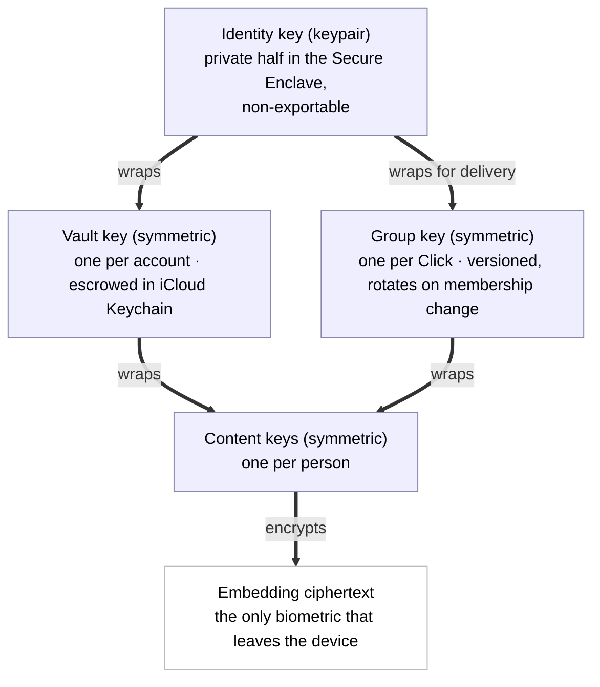
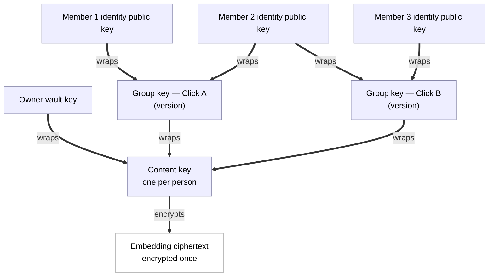
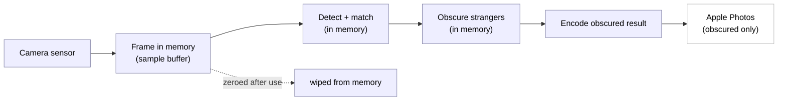
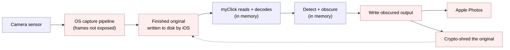
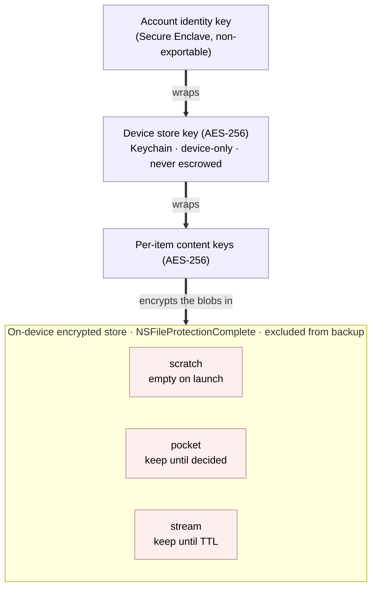
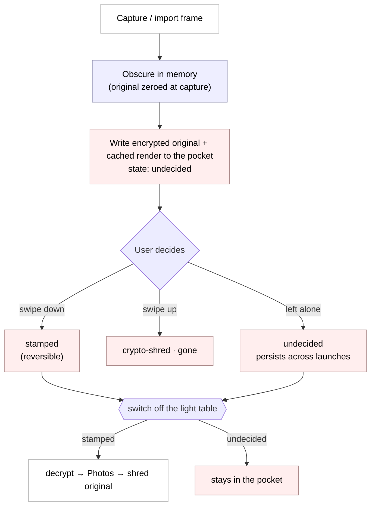
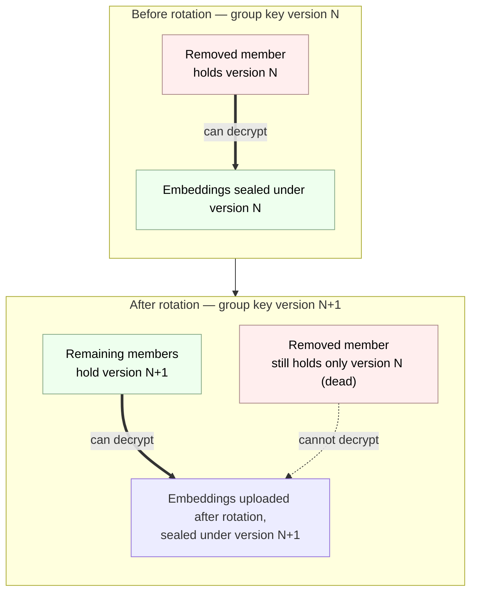

# myClick Cryptographic Protocol

**Status: DRAFT — in active design (2026-05-28). Nothing here is final.**

All thirteen sections are drafted; section 11 (streaming relay and distribution) and section 12 (notification and live delivery) specify the post-v1.0 guardian photo-return feature and its live-delivery layer, and land after the v1.0 surfaces they depend on. This is still a draft, not a final spec: the empirical calibration (template count, match threshold, false-accept ceiling, re-enrolment bands) is validated in the closed beta, and the v2 metadata-hiding items in section 13 remain open. Everything here is subject to change as the design firms up — this banner will be updated as sections lock.

This document specifies the cryptographic protocol behind myClick: how faces become encrypted embeddings, how members of a Click share the ability to recognise each other's children, how the server stays unable to decrypt anything sensitive, and how revocation works.

This protocol is being designed in the open. See the commit history for how it evolved.

## Table of Contents

- [The ideas in plain English (start here)](#the-ideas-in-plain-english)

1. [Threat model](#1-threat-model)
   - [1.3 Accepted trust assumptions (pre-production)](#13-accepted-trust-assumptions-pre-production)
2. [Canonical model](#2-canonical-model)
3. [Key hierarchy](#3-key-hierarchy)
4. [Enrolment (face to encrypted embedding)](#4-enrolment-face-to-encrypted-embedding)
5. [Embedding storage and the server's view](#5-embedding-storage-and-the-servers-view)
6. [Per-Click group key (the ratchet)](#6-per-click-group-key-the-ratchet)
7. [Recognition (on-device matching)](#7-recognition-on-device-matching)
8. [Capture and import: source-original lifecycle](#8-capture-and-import-source-original-lifecycle)
9. [Revocation (key rotation; forward-immediate, forward-only)](#9-revocation-key-rotation-forward-immediate-forward-only)
10. [Key escrow and recovery](#10-key-escrow-and-recovery)
11. [Streaming relay and distribution](#11-streaming-relay-and-distribution)
12. [Notification and live delivery](#12-notification-and-live-delivery)
13. [Open questions](#13-open-questions)

---

## The ideas in plain English

If you already know public-key cryptography, you can skip straight to section 1 — nothing in this primer is normative.

This is an on-ramp, not a textbook. The rest of the document is precise and assumes these ideas; here we name each one in a sentence or two and point to where it does its work. Nothing here is a requirement — no key sizes, no thresholds. Those live in the body, on purpose, so there is only one place to read them.

- **Plaintext vs ciphertext.** Plaintext is the readable thing; ciphertext is the scrambled version you get after encrypting it, useless to anyone without the key. In myClick the only sensitive plaintext is a face image (briefly, during enrolment, and when the owner of an enrolment views a stored capture crop — section 4.8) and a decrypted embedding (briefly, during recognition); everything stored or sent is ciphertext. See sections 4 and 5.
- **Encrypted in transit vs encrypted at rest.** "In transit" (TLS) protects bytes while they travel over the network; "at rest" protects bytes while they sit on disk or in a database. myClick does both, and the threat model in section 1 lists each separately because they defend against different attackers.
- **Symmetric keys.** A symmetric key is a single secret that both locks and unlocks — encrypt and decrypt with the same key. The vault key and each Click's group key are symmetric keys; see the key hierarchy in section 3.
- **Public/private keypairs.** A keypair is two matched halves: a public half you can share freely and a private half you keep secret, such that what one half locks only the other half opens. The account's identity key is a keypair; see section 3.
- **Key wrapping (envelope encryption).** Using one key to encrypt another key, so the locked key can be stored or shipped safely and only the holder of the outer key can free it. This is the single most load-bearing idea in the document — it appears on nearly every page, and the layered hierarchy and the "one embedding, many locks" diagrams in sections 3 and 6.3 are entirely built from it.
- **The Secure Enclave.** A dedicated hardware vault inside the iPhone. Keys generated there cannot be copied out — software, including myClick itself, can ask the Enclave to use a key but can never read it. The identity private key lives here; see section 3.
- **Key escrow.** Safely backing up a key with a trusted party so it can be recovered if the device is lost. myClick escrows the vault key with iCloud Keychain rather than asking a parent to safeguard a recovery phrase; see sections 3.2 and 10.
- **End-to-end encryption and server-blindness.** When only the endpoints (the users' devices) hold the keys, the server in the middle holds only locked boxes it cannot open. For myClick this is structural, not a promise we ask you to take on faith: there is no key on the server that could decrypt a child's biometric, by construction. See section 5 for the precise enumeration of what the server can and cannot see.
- **Face embeddings are non-reversible.** A face embedding is a number-vector derived from a face; it is not a compressed photo, and you cannot rebuild the original image from it. That is the whole reason it is the only biometric artifact that ever leaves the device. (Each of your own enrolment captures also keeps one small encrypted face crop on the device itself, so you can see what the app has actually learned — see section 4.8. That crop never leaves the phone.) The rest of how matching works is in section 4.

---

## 1. Threat model

A threat model is two honest lists. The first is what the system must defend against — the attacks where, if we lose, the product has failed at its one job. The second is what the system concedes — the attacks we do not stop, stated plainly so nobody is misled about what "privacy-first" buys them.

The concessions matter as much as the defences. A privacy claim that quietly omits its limits is worse than no claim at all, because it invites the user to trust the system in exactly the situations where it cannot help. So we write both lists, and we write the second one carefully.

### 1.1 Who we defend against (must win)

These are the adversaries the architecture exists to beat. If any of these wins, that is a bug in the protocol, not an accepted risk.

- **myClick the company, or a malicious insider.** Even we cannot decrypt a child's biometric. This is the headline guarantee, and the entire architecture is built to make it true: the keys that decrypt embeddings live in users' Secure Enclaves and iCloud Keychains, never on our servers. An engineer with full production access, or a future owner of the company with bad intentions, still gets only ciphertext.
- **A server breach.** An attacker who steals the entire database — every row, every blob, every backup — gets only ciphertext. No plaintext embeddings, ever. There is no admin key, no "break glass" decrypt path, no master secret on the server that turns the stolen data into faces.
- **A subpoena or state actor.** We cannot hand over what we cannot decrypt. The honest answer to a warrant for a child's biometric is "here is the ciphertext we hold; we have no key for it." This is a deliberate design property, not a legal posture we adopt after the fact — the inability is structural.
- **A network eavesdropper.** Everything is TLS in transit and end-to-end encrypted at rest. An attacker watching the wire, or sitting on a compromised network path, sees encrypted bytes both in flight and as stored.
- **A malicious Click member.** A member of one Click cannot extract the embeddings of children in Clicks they are not in — group keys are scoped per Click and never shared across them. No member can obtain face images of anyone else's children: no photo or face image is ever transmitted or stored server-side, and the only stored face image anywhere — the encrypted enrolment-capture sidecar of section 4.8 — exists solely on its owner's device, for that owner's own enrolled people, and never leaves it. And no member can recognise children outside the Click's premises or scope, because recognition is gated by the active scope at capture time.

### 1.2 What we concede (accepted risks, stated plainly)

These are the attacks we do not stop. We list them because pretending otherwise would be dishonest, and because knowing them lets a user decide what myClick is and is not good for.

- **A compromised device.** If the user's own iPhone is jailbroken, or running malware with sufficient privilege, the plaintext embeddings that are decrypted on-device for matching are exposed on that device. No end-to-end encrypted system can defend a compromised endpoint — the endpoint is where plaintext has to exist for the app to work at all. We protect data in transit and at rest, not against an attacker who already owns the phone.
- **The lock-screen camera, to whoever holds the phone.** Like Apple Camera, myClick's camera is reachable from the lock screen without a Face ID prompt (see [section 7.6](#76-lock-screen-camera-flow)). Someone who picks up the phone can therefore take obscured photos, and if the owner's family happens to be in front of the lens they will be recognised and kept visible. That is the limit of it: the holder cannot browse Clicks, read a roster, change settings, or open the audit log — those stay behind the app-lock — and the decrypted roster is zeroed the instant the app backgrounds. We accept this narrow surface deliberately, as the price of a grab-and-shoot camera; it exposes nothing the holder could not already capture by standing where they are.
- **Apple itself.** We rely on the Secure Enclave for key generation and on iCloud Keychain for escrow and recovery. If Apple is malicious, or is compromised at the hardware or operating-system level, the model breaks. We trust the platform — as does every iOS app, and as the user already does by carrying the device.
- **Authorised use.** A photographer with `can_capture` rights in a Click legitimately recognises the consented children of that Click. That is the product working as designed, not a breach. The crucial nuance, stated explicitly: **within a Click, members necessarily share the embeddings of opted-in children.** A photographer's device must hold the plaintext embeddings of the children they are allowed to recognise, or matching cannot happen at all. A determined malicious member could therefore extract those vectors from their own device. The protection here is not secrecy — it is **consent** (they were granted recognition rights to exactly these children, by those children's parents) plus **non-reversibility** (an embedding is a vector, not a photo; it cannot be turned back into an image of the child). If you grant someone the right to recognise your child, you are trusting them with that child's embedding. The protocol makes that trust explicit and scoped; it does not pretend to remove it.
- **Metadata.** The server cannot read embeddings, but it can see some metadata: who is a member of which Click, when embeddings are uploaded, and the shape of the Click membership graph. Content is encrypted; the social graph and timing are visible server-side. Full metadata-hiding — sealed-sender-style techniques that blind the server to who talks to whom — is a v2-and-later consideration, not a v1.0 promise.
- **Already-published photos.** Once an obscured photo is saved to the Photos library or posted somewhere, it is out of our control. Revocation is forward-only: it changes what future captures will obscure, but it cannot reach into a photo that already exists on someone else's phone or feed. We say this plainly in the product copy, and we say it here.

### 1.3 Accepted trust assumptions (pre-production)

Section 1.2 lists the standing architectural concessions. This section collects the narrower assumptions that a pre-production privacy review surfaced and that we are **consciously accepting for the beta** — each is bounded, each has a stated full fix, and each is recorded here so it is a deliberate decision rather than an implicit gap. None of them touches a biometric; all are bounded to low-sensitivity, app-domain data, and each fails closed rather than leaking when its assumption does not hold.

- **The pending-name seal target is an *unauthenticated*, server-returned identity key.** When a joiner seals their own display name for the admitting admin to read before admission, they seal it under the **inviter's identity public key** — and that key is returned by `peek_invite`, an *unauthenticated, pre-join* read ([section 5.6](#56-app-domain-names-are-server-blind-too--including-the-accounts-own-name), the trust-caveat paragraph). In the honest-but-curious model (the model the whole architecture is built for — section 1.1) the server returns the real key and this is sound. **Outside** that model, a malicious server could substitute its own identity public key, causing the joiner's app to seal the pending name to a key the server controls. The exposure is bounded to **exactly one datum — the joiner's own, self-chosen, low-sensitivity display name** — never a child's embedding, never another member's name, never a Click's contents (those are sealed under keys the server never returns or substitutes, and a wrong key fails closed). It is the kind of string the joiner is already choosing to reveal to the people they are asking to join. **Full fix:** identity-key **TOFU / pinning** (trust-on-first-use of a member's identity key, with change-detection), so a substituted key is rejected. **Status:** post-beta. We ship the beta with this limit stated, not silently assumed.

- **Within a Click, members share the roster ciphertext, and a member can extract the plaintext embeddings their own device decrypts.** The roster read (`fetch_roster_ciphertext`) is **membership-gated** — an access gate, not a secrecy gate (data-model.md §8.3(1)). This is the authorised-member boundary already conceded under "Authorised use" in [section 1.2](#12-what-we-concede-accepted-risks-stated-plainly): a photographer's device must hold the **plaintext** embeddings of the children they are entitled to recognise, or matching cannot happen at all, so a determined malicious member could extract those vectors from their own device. We do **not** hide a Click's roster from its own members. The protection is not access-secrecy but **consent** (recognition rights were granted for exactly these children, by those children's guardians) plus **non-reversibility** (an embedding is a vector, not a photo — it cannot be turned back into an image of the child). Stated as an accepted assumption so it is explicit: *to grant someone the right to recognise your child is to trust them with that child's embedding; the protocol makes that trust scoped and explicit, it does not pretend to remove it.* The same boundary applies to the name and age-band reads, which return **ciphertext** to entitled members and fail closed otherwise (data-model.md §8.3(3)). **Full fix:** none is intended — this is a structural property of on-device recognition, not a defect; it is recorded as a conscious acceptance, not a deferral.

---

## 2. Canonical model

This section defines the abstract, storage-agnostic constructs that the cryptography and the Storage Port depend on. It is the shared vocabulary every other section uses precisely, and it is deliberately narrow: a construct belongs here only if the cryptography or the storage interface depends on it. App-domain concepts that the crypto does not touch are defined in the companion data model, not here (see the closing note).

Each construct below gets a precise definition and a one-line plain gloss.

- **Account identity key** — the account's keypair: an ECC P-256 keypair generated per account and per device in the Secure Enclave. The public half is published to the server; the private half is non-exportable and never leaves the Enclave. It does two jobs — it authenticates the account, and it is the root of the wrapping hierarchy (section 3): its public half wraps this member's vault key and each group key delivered to them, and its private half unwraps them.
  *In plain terms: the device-bound keypair that proves who you are and unlocks everything else.*
- **Person (subject)** — the scope a content key belongs to: the holder of a content key and of the embeddings that content key encrypts. A person is a holder's own face or a dependent's, and it is the unit of cryptographic ownership — one person, one content key, one template set.
  *In plain terms: the face whose templates a single content key locks.*
- **Embedding** — the ciphertext. A roughly 2048-byte face vector extracted on-device, persisted only in encrypted form. It is the sole biometric artifact ever stored off-device — each owned capture may additionally carry a device-local encrypted crop sidecar (section 4.8), which never leaves the device — and it is not reversible into a photograph.
  *In plain terms: the encrypted number-vector that stands in for a face.*
- **Content key** — one per person; the symmetric key that encrypts that person's templates. It is the only key applied directly to embedding ciphertext, and it is the small thing that gets wrapped for each audience (see the wraps below).
  *In plain terms: the key to one person's faces.*
- **Vault key** — one per account; the symmetric key that gives the owner private access by wrapping the owner's own content keys (the holder plus their dependents). It is the portable secret recovered on a new device, escrowed in iCloud Keychain.
  *In plain terms: your private master key for your own family's faces.*
- **Click** — a keying scope: the unit that has a group key. Cryptographically, a Click is exactly "a set of members who share one group key generation," nothing more. (Its app meaning — a circle of people who consent to recognise each other's children at premises — lives in the data model.)
  *In plain terms: the group that shares one key.*
- **Membership** — canonically, the set of accounts that currently hold a Click's group key. Membership is defined here by key possession, not by any role flag: you are a member, in the cryptographic sense, exactly when the current group-key version has been wrapped for your identity key.
  *In plain terms: who currently holds the group's key.*
- **Group key and GroupKeyVersion** — the symmetric key shared by a Click's members, and one generation of it. There is one group key per Click; it rotates on every membership change, and each rotation mints a new GroupKeyVersion that supersedes and kills the prior one. Rotation is the engine of revocation (section 9); the version stamp also serialises concurrent rotations (section 6.5).
  *In plain terms: the shared key, and which generation of it you are looking at.*
- **ContentKeyWrap** — a person's content key encrypted under one outer key: either the owner's vault key (owner-private access) or a specific Click GroupKeyVersion (shared recognition within that Click). The embedding ciphertext is stored once; only this small wrap is multiplied per audience.
  *In plain terms: one person's content key, locked for one audience.*
- **GroupKeyWrap** — a GroupKeyVersion encrypted under one member's identity public key, so only that member's Secure Enclave can unwrap it. This is how a group key reaches each member without the server ever holding a usable copy.
  *In plain terms: the group key, locked so only one member can open it.*

App-domain constructs — guardianship, the opt-in approval flow, premises, licences, and subscriptions — are defined in the companion data model (myClick repo, `docs/data-model.md`), not here, because the cryptography does not depend on them. In the canonical model, "opt-in" appears only as its cryptographic shadow: a person's content key is wrapped under a Click's group key. The body prose elsewhere (sections 1 and 5 through 9) still mentions premises, opt-in, and capture for narrative context; only this canonical model is restricted to crypto-relevant constructs.

---

## 3. Key hierarchy

In plain English, there are three layers of keys, each doing one job.

The **first layer** is the account's identity. When you first launch myClick, the app asks the Secure Enclave — the dedicated security chip in your iPhone — to generate a keypair just for you. The private half of that keypair never leaves the chip. It cannot be exported, copied, or extracted, even by the app itself; the app can only ask the chip to use it. This identity key is how the server knows it is really you, and it is the key that wraps (encrypts) the next layer down.

The **second layer** is your vault key. This is the key that protects your own family's faces — your embeddings and your children's embeddings — when they sit at rest on disk and on our server. It is a symmetric key (the same key locks and unlocks), wrapped by your identity key so only your device can use it, and escrowed in iCloud Keychain so that if you lose your phone, you can get it back.

The **third layer** is the per-Click group key. Each Click has one. When a child is opted into a Click, that child's embedding is made decryptable by every current member of that Click — so the school photographer's phone can recognise the children whose parents opted them into the school Click, and nobody else's. The group key is how that sharing happens. It is handed to each member by wrapping it under that member's identity public key, so only that member's device can unwrap it. It rotates every time membership changes, which is what makes revocation work (see section 9).

A structural consequence worth stating directly: **a single child's embedding is stored once, but made decryptable by more than one audience.** The embedding ciphertext exists exactly once, encrypted under its own per-person content key (see [section 6.3](#63-content-key-indirection)). What is multiplied is not the embedding but that small content key: it is wrapped once under the parent's vault key — the parent's own private access — and once under each Click's group key the child has been opted into. The same vector, encrypted a single time, with its content key sealed under different locks for different audiences.

The three layers wrap downward: the identity key (its private half locked in the Secure Enclave) wraps the vault key, and the vault key and each group key in turn wrap the content keys that protect the embeddings.

### 3.1 The three layers, precisely

| Key | Type | Lives where | Wrapped / protected by | Job |
|-----|------|-------------|------------------------|-----|
| Account identity key | ECC P-256 keypair | Private key inside the Secure Enclave (non-exportable); public key published to the server | The Secure Enclave itself; never leaves the chip | Authenticates the account; wraps the vault key; unwraps group keys delivered to this member |
| Account vault key | AES-256 symmetric | On-device, and escrowed in iCloud Keychain | Wrapped by the account identity key; escrowed under iCloud Keychain | Wraps the content keys of the account's own enrolled embeddings (holder + children), giving the owner private access at rest |
| Per-Click group key | AES-256 symmetric | On-device for each current member; distributed by the server in wrapped form | Wrapped under each member's identity public key for delivery — and, for a member who **owns/administers** the Click, the group key is **additionally escrowed** by sealing it under that member's **vault key** (recoverable from iCloud Keychain) and storing the sealed blob server-side, so it survives **identity-key loss** (see [section 6.8](#68-group-key-durability-owneradmin-escrow) / [section 10.2](#102-the-mechanics)). The identity key itself remains Secure-Enclave-bound and is never escrowed | Makes a Click's opted-in embeddings decryptable by all current members for recognition; rotates on membership change |
| Device store key | AES-256 symmetric | On-device only (Keychain, device-only / non-synced); never escrowed | Held in the Secure-Enclave-protected Keychain (device-only, non-synced); optionally wrapped under the account identity key once that subsystem exists | Wraps the per-item content keys of the on-device encrypted store — capture scratch, the Light Table pocket, the local gallery (see [section 8.8](#88-the-on-device-encrypted-store-lanes-keys-and-the-journal)) |

The first three keys form the **biometric hierarchy**, and "three layers" refers to them. The **device store key** is a fourth key with a different job: it protects on-disk *photo blobs* (source originals and obscured renders), not embeddings. It is introduced where it is used ([section 8.8](#88-the-on-device-encrypted-store-lanes-keys-and-the-journal)) and sits deliberately outside the escrowed hierarchy above — generated per device, never synced to iCloud Keychain, never escrowed — so the ability to decrypt an unobscured on-disk original never leaves the device that produced it.

### 3.2 Two decisions locked here

**Recovery is by iCloud Keychain escrow, not a user-held recovery phrase.** We escrow the account vault key in iCloud Keychain rather than asking the user to write down and safeguard a recovery phrase. The reasoning: it is by far the best consumer UX (a parent recovering a lost phone signs in with their Apple ID, as they already expect to); Apple is already a conceded trust anchor in our threat model (section 1.2), so escrow does not introduce a new party we were otherwise keeping out; and a lost recovery phrase would mean permanently lost family face data, with no path back. For a product whose users are ordinary parents, not crypto practitioners, the recovery-phrase failure mode is unacceptable.

**A group key with rotation on membership change, not a full double-ratchet.** A messaging protocol like Signal uses a double-ratchet to get per-message forward secrecy, because a chat is a continuous stream of messages and each one should be independently protected. A Click's embedding roster is not a message stream — it is a relatively static set that changes only when someone joins or leaves. Per-message forward secrecy would be overkill and would add messaging-grade complexity for no benefit. A per-Click group key that rotates on every membership change achieves exactly the guarantees we need — forward-immediate and forward-only revocation (section 9) — without that complexity.

### 3.3 Concrete primitives (locked 2026-06-18)

Sections 3.1–3.2 fix the *shape* of the hierarchy — which key wraps which, and that recovery is by iCloud Keychain escrow. The concrete primitives below were left implicit in earlier drafts; they are pinned here so the implementation has no cryptographic decision to improvise (the "protocol-spec-first" rule). All three deliberately match constructions myClick already ships on-device (the encrypted store and `RosterCryptoKey`), introducing no new cryptography. They are sound, standard defaults locked for v1; the formal protocol audit remains the place where they receive adversarial scrutiny.

- **AEAD mode — AES-256-GCM.** Every symmetric encryption in the biometric hierarchy — the vault key and each group key protecting content keys, and each per-person content key protecting its embedding template set — uses **AES-256-GCM**. This is the same authenticated mode sections 4.8 / 8.8 fix for the on-device store; section 3 now states it explicitly for the escrowed hierarchy too.
- **Asymmetric wrap — ECIES over P-256.** Wrapping a symmetric key *under an identity public key* — the vault key on-device at rest, and each group key for delivery to a member (section 3.1) — uses **ECIES over P-256**: an ephemeral ECDH to the recipient's P-256 public key, HKDF-SHA256 to derive the wrapping key, then AES-256-GCM. The wrapped form is self-describing on-device and crosses the Storage Port only as an opaque blob; if cross-implementation interop of the wire format is ever required, that format is pinned at that time.
- **Vault-key recovery — the iCloud Keychain escrow is canonical.** The vault key is held two ways (section 3.1): wrapped under the identity key for on-device-at-rest protection, and escrowed in iCloud Keychain. The **escrow is the authoritative recovery artifact** — the identity key is device-bound and dies with the phone (section 10.2), so a replaced device recovers the vault key from iCloud Keychain, never from any on-device wrap.

---

## 4. Enrolment (face to encrypted embedding)

Enrolment is how a face becomes an encrypted embedding. It is the one moment where myClick handles a raw image of a child, so it is designed with the most care: the raw frames, and the working set of face crops kept from them, exist in memory only — for the brief enrolment-and-review session, never longer — and are then zeroed. The one image that outlives the session is each confirmed capture's sidecar image — its subject-masked context crop, or at minimum its tight matcher crop — sealed into an encrypted, device-bound sidecar ([section 4.8](#48-enrolment-capture-sidecars-stored-face-crops)); the full frames never persist anywhere. Enrolment reads frames directly from the live camera feed, so it uses the frame-accessible, memory-only posture of capture Flow A ([section 8.2](#82-flow-a--frame-accessible-capture-memory-only)); the disk-backed Flow B path ([section 8.3](#83-flow-b--os-owned-capture-disk-backed)) never applies, because iOS never hands enrolment a finished file.

### 4.1 The flow

1. **Initiate.** A parent starts enrolment, for themselves or for a child. (Enrolling a dependent is the common case.)
2. **Continuous sweep.** The app watches the live feed and harvests a short multi-angle set — front, three-quarter left, three-quarter right, up, down, and a smiling front — filling six angle slots as the subject moves, rather than marching through one fixed pose at a time. Frames stream through memory; only the best crop for each slot is kept, and only in memory. Nothing is written to disk during the sweep.
3. **Quality gates.** Each candidate frame is gated before it can fill a slot:
   - An unambiguous enrolment **subject** must be present, and it is the only face processed. A frame with no face is skipped. A frame with more than one face is allowed **only under subject isolation**: the harvester takes the single dominant face — one face clearly larger and more central than any other, by a required margin (currently 1.6×) — embeds **only** that face, and **blurs every other face in the preview and never detects-for-identity, embeds, or stores it**. If no face clears the dominance margin (two faces of similar size and position), the frame is skipped — fail-closed. The wrong-child harm is *harvesting the wrong face*; isolating and embedding only the unambiguous subject, while blurring and never processing everyone else, is what prevents it. This lets a parent enrol in a busy place without capturing bystanders, and is the enrolment counterpart of capture-time bystander obscuring.
   - The face must be large enough in the frame for a faithful crop.
   - The crop must be sharp — a variance-of-Laplacian focus check — so motion-blurred frames are dropped, not captured.
   - Lighting adequacy is a soft nudge, not a block.
   - Pose must vary across the six slots so the template set covers a real range of angles.
   A frame that fails any gate is silently skipped; the app never captures a poor frame just to make progress.
4. **Review.** When all six slots are filled, the user reviews the captured set and can redo any single slot, in which case the app re-harvests only that one look. The six crops remain in memory throughout; nothing is persisted until the user confirms.
5. **Extraction.** On confirm, MobileFaceNet runs on-device and extracts the six embeddings from the held crops. No image leaves the phone for this step; there is no cloud call. Each confirmed capture is stamped with a `capturedAt` timestamp (metadata, not biometric), and its sidecar image — the subject-masked context crop where a mask is available, otherwise the bare tight aligned matcher crop — is sealed into that capture's encrypted sidecar ([section 4.8](#48-enrolment-capture-sidecars-stored-face-crops)).
6. **Zeroing.** The held frames and crops are zeroed from memory the moment extraction and sidecar sealing are done. If the user abandons enrolment before confirming — cancel, back, or the app backgrounding — the crops are zeroed with no extraction and no sidecar at all. See section 4.6.
7. **Encryption.** The embeddings are encrypted under the person's content key; that content key is wrapped under the account's vault key (and, once the person is opted into a Click, under that Click's group key — see [section 6.3](#63-content-key-indirection)).
8. **Storage.** The ciphertext is stored locally and synced to the server. The server receives ciphertext only — it never sees a frame, never sees a plaintext embedding. This sync is not one atomic write but a short sequence of calls; the client owns the person id and the sequence is idempotent and resumable, so an interrupted enrolment can be retried to completion without ever creating a duplicate person ([section 4.9](#49-the-enrolment-write-is-idempotent-and-resumable-the-client-owns-the-person-id)).
9. **Consent read-back.** A consent read-back is recorded in the audit log: who enrolled whom, when, and under what consent statement.

**The capture-trigger contract.** The subject-isolation gate above decides *which* face in a frame may be processed; this contract decides *when* the harvester may commit a capture at all. A capture MUST commit only while all three of the following hold:

1. **Subject lock.** The face being captured MUST be the same physical face that was selected when the harvest armed. Lock is maintained by **geometric continuity only** — face-box overlap across consecutive frames; a face cannot teleport from one part of the frame to another between frames. Tracking MUST NOT use embeddings: bystanders are never embedded, not even to be rejected. Loss of lock MUST cancel any open capture window and silence the trigger until the locked subject is re-established as the clear dominant subject.
2. **Clear winner.** The subject MUST clear the relative dominance margin of the subject-isolation gate (currently 1.6×): clearly larger and more central than any other face in the frame.
3. **Dominance floor.** The subject MUST occupy at least a device-calibrated fraction of the frame — measured as face-box fraction until person segmentation lands, and as person-mask fraction once it does. The floor is absolute where the margin is relative: a face that is merely the largest of several small background faces is structurally ineligible, so background faces can never arm or feed a harvest.

A frame in which any of the three fails is skipped, and a lock loss closes the capture window entirely — fail-closed, as everywhere in enrolment.

One companion rule for what the user is shown: the subject mask that blurs every non-subject face in the live preview MUST equally be applied to any retained review snapshot. A frame kept for the user to look at is held to the same blur standard as the live preview — there is no review image in which a bystander's face is visible.

### 4.2 Liveness: light, not hard-gated

The guided multi-angle sweep is itself a soft liveness check. A flat printed photo or a still image on a screen cannot easily produce a coherent multi-pose sweep — the geometry does not hold up across angles. Where TrueDepth hardware is available, we use it opportunistically to strengthen this.

We deliberately do **not** hard-block on liveness. Hard liveness gating would make enrolling a young child miserable — small children do not perform on cue, and a stuck enrolment flow is a recipe for a parent giving up. The real protection against enrolling a face that isn't a consenting person's is physical: you need physical access to the child to complete the sweep, and the sweep enforces that in practice. Liveness is a check we lean on lightly, not a wall.

### 4.3 Template set of 6 per person

We store a **template set of 6 embeddings** per enrolled person, not a single embedding:

1. Front, neutral
2. Front, smiling (expression variation)
3. Three-quarter left
4. Three-quarter right
5. Looking up
6. Looking down

A detected face matches the person if it clears the match threshold against **any one** of these templates.

The reason for more than one template is that a face embedding is sensitive along three axes at once: **yaw** (turning left/right), **pitch** (looking up/down), and **expression** (neutral vs smiling and beyond). Children's candid faces vary enormously across all three — a kid mid-laugh at a three-quarter angle looks very different to a neutral front shot. A single embedding would miss most real captures.

Four factors set the count:

1. **The pose-and-expression envelope to cover** — the range of angles and expressions a real candid photo will throw at us.
2. **Per-template pose tolerance** — each template reliably matches faces within roughly ±30 degrees of its own pose before confidence drops off. More templates, spaced across the envelope, keep every likely face within tolerance of some template.
3. **The false-accept asymmetry** — the dominant factor. See section 4.4.
4. **Compute and storage cost** — every detected face is compared against every template of every roster member, so the count multiplies the work done per frame and the bytes stored per person.

### 4.4 The false-accept asymmetry

This is the privacy-critical part of the calibration, and it is worth being precise about.

There are two ways matching can go wrong, and they are not equally bad:

- A **false-reject** — your own child is wrongly obscured — is annoying but safe. It fails closed: the worst outcome is that a photo you wanted has a blur where your kid's face is. No stranger is exposed. No privacy is breached.
- A **false-accept** — a stranger's child is shown unobscured because the system wrongly thought they were on the roster — is a privacy breach. It is the exact harm myClick exists to prevent.

These two failures are not symmetric, and the calibration is built around that. Adding templates raises the false-accept rate: each template is another chance for a stranger's face to clear the threshold, so the aggregate false-accept rate is roughly the per-template rate multiplied by the template count. So template count and match threshold are **co-tuned against a hard false-accept ceiling.** We deliberately spend the cost of more templates in the safe currency — false-rejects, over-obscuring — rather than the dangerous one.

**Starting ceiling: aggregate false-accept rate ≤ 0.1%** — a stranger wrongly recognised in fewer than 1 in 1000 faces — to be tightened if the closed-beta data on real children's faces allows.

What this spec fixes is the **method and the ceiling**, not a magic constant. The final template count (it could land anywhere from 5 to 7) and the match threshold are calibrated empirically during the closed beta against real children's faces. The principle — co-tune count and threshold against a hard false-accept ceiling, paying the cost in over-obscuring — is the durable decision.

### 4.5 Re-enrolment: periodic and explicit, age-banded, no silent learning

Children's faces change, so templates go stale. We refresh them by **periodic, explicit re-enrolment**, age-banded:

- Roughly every 3 months under age 5.
- Roughly every 6–12 months for older children.

The app reminds the parent; the parent redoes the sweep. That is the whole mechanism.

We deliberately do **not** silently update templates as recognition succeeds in the field. Continuous "learning" — quietly folding each successful match back into the template set — would mean continuously re-processing a child's biometric in the background. That is precisely the always-on biometric harvesting myClick exists to avoid, and it stays forbidden.

What that rules out is *silent, automatic, success-driven* learning. It does **not** rule out **deliberate correction** — a person explicitly fixing a face the system got wrong and choosing to add it to enrolment (a parent in Mode A post-shutter review, or an operator at the Mode B lightroom). That is not silent and not automatic: it is a human acting on a specific face, which is exactly "you asking us to." Deliberate correction is specified in [section 4.7](#47-deliberate-correction-enrolment-progressive). The line is **silent success-folding (forbidden) vs explicit human correction (allowed)** — both periodic re-enrolment and deliberate correction keep the promise that **we only process a child's face when a person asks us to**; silent background learning is neither and remains barred.

**Re-enrolment re-seals; it does not re-mint.** The four rules below are normative. They exist because re-enrolment runs on a person who is *already* enrolled — most consequentially on a reinstall, sign-out, or new-device restore, where the local roster is rebuilt by re-pushing the restored people back through the enrolment write path. First enrolment mints a single per-person content key ([section 4.10](#410-atomic-self-family-enrolment) step 1: "one fresh per-person **content key**"). Re-enrolment must reuse *that same* key — "one embedding, many locks" ([section 6.3](#63-content-key-indirection)) only holds if the key never changes underneath the locks. Minting a second key re-distributes it only to the home/family Click and the vault wrap, never to the other Clicks the person is already opted into, so every peer or school Click keeps a wrap sealed to the now-dead key and the person reads as undecryptable there while the home Click still opens them and masks the breakage. That is the failure recorded as #496; these rules prevent it by construction.

- **R-RE1 — Re-enrolment is a re-seal, not a re-mint.** When the enrolment write path runs for an **already-enrolled owned person** — one whose vault-key `content_key_wrap` already exists ([section 6.3](#63-content-key-indirection)) — it MUST recover that existing content key (R-RE3) and re-seal the new template set, name, and age band under it ([section 6.3](#63-content-key-indirection), "one embedding, many locks"). It MUST NOT mint a new content key. The single existing vault wrap, and every Click group wrap already written, keep opening the re-sealed ciphertexts unchanged — so a person stays decryptable in **every** Click they were opted into, not only the home Click. **Only first enrolment mints** — the path with no vault wrap and no stored embeddings ([section 4.10](#410-atomic-self-family-enrolment)). The reinstall / sign-out / new-device restore is the trigger of record: `create_person` is idempotent on the client-owned id and *resumes* the same person ([section 4.9](#49-the-enrolment-write-is-idempotent-and-resumable-the-client-owns-the-person-id)), so a write that minted a fresh key on resume would silently orphan that person's peer-Click wraps (#496). A resuming write re-seals; it never re-mints.

- **R-RE2 — A minted key that is ever shared MUST reach every opted-in Click.** R-RE1 removes the need to mint on re-enrolment at all. The one remaining case that legitimately mints a *new* key for an *already-shared* person is a deliberate, system-initiated re-key — for example a future model upgrade that chooses to rotate the content key rather than re-seal under it. Any such re-key MUST re-wrap the new content key under the owner's vault key **and under the current group-key version of every Click the person is opted into**. Distributing a minted-and-shared key to a subset of those Clicks — the exact shape of the #496 defect — is itself a defect, not a partial success. (A first-enrolment mint is exempt: the person is in no Click yet, so "every opted-in Click" is the empty set; the vault wrap and the home-Click opt-in wrap are written by the atomic write of [section 4.10](#410-atomic-self-family-enrolment).)

- **R-RE3 — Recovery fails loud; it never silently mints over an existing person.** Before re-sealing, the write path resolves the content key into exactly one of three outcomes, and there is no fourth:
  1. **Vault wrap present and it opens** → reuse the recovered content key (R-RE1). This is the ordinary re-enrolment outcome.
  2. **Vault wrap genuinely absent** (no `vault_key` `content_key_wrap` exists for this person, and no stored embeddings) → this is a never-enrolled person; mint, as first enrolment ([section 4.10](#410-atomic-self-family-enrolment)).
  3. **Vault wrap present but unreadable, or the read is a transport error** → **ABORT the write**. Never mint, never re-seal under a guessed key, never fall back to a fresh key. A present-but-unreadable wrap means the right key is somewhere this device cannot currently reach, not that the person is new.

  Recovery is **vault-first**: the owner's `vault_key` wrap is per-account, escrowed in iCloud Keychain ([section 3.1](#31-the-three-layers-precisely) / [section 10](#10-key-escrow-and-recovery)), and home-Click-independent — it is the authoritative source and survives reinstall. The home-Click **group-key** path is a fallback for legacy rows that predate the vault wrap; it **MUST NOT** be used to rescue an already-enrolled person on the write path, because a stale or duplicate home Click can hold a `.group` wrap that returns a *different* content key (the #337 leftover-duplicate-family-Click vector, the same one that produced the #472 rename failure). A wrong key recovered from a stale Click would be re-sealed over the person's real templates and silently corrupt them; vault-first, abort-on-ambiguity is what forecloses that.

- **R-RE4 — Write-time self-check before any wrap is stored.** Before the write stores any `content_key_wrap` (vault or group) for an already-enrolled person, the content key in hand MUST be proven to open **at least one of that person's existing server embeddings** ([section 5](#5-embedding-storage-and-the-servers-view)); if it does not, the write MUST abort and store nothing. A brand-new person with **no** existing embeddings is exempt — there is nothing to check against, and the first-enrolment mint (R-RE3 case 2) is correct by construction. Stated honestly: R-RE4 guards **recovery-correctness** — it is the assertion that catches the #337 / #472 contamination vector (a wrong content key recovered from a stale Click) before it can be written. It is **not** the source of the #496 structural guarantee; that guarantee comes entirely from R-RE1 *never re-minting* an already-enrolled person's key. R-RE4 is the belt to R-RE1's braces: even if recovery returned the wrong existing key, the self-check refuses to seal it.

### 4.6 The zeroing guarantee

The enrolment face crops are zeroed from memory **explicitly in code**. They are held only in memory, and only for the duration of the enrolment-and-review session — at most the six crops needed for the template set — and are zeroed the moment embedding extraction and sidecar sealing complete at confirm, or immediately if the user abandons enrolment before confirming (cancel, back, or app backgrounding), in which case no embedding is extracted and no sidecar is written at all. At no point is a raw frame written to disk, and no crop is ever written in the clear: the only image that persists is each confirmed capture's sidecar image — subject-masked context crop or bare matcher crop — sealed encrypted into its sidecar ([section 4.8](#48-enrolment-capture-sidecars-stored-face-crops)). The live-feed path is otherwise the frame-accessible, memory-only posture of capture Flow A ([section 8.2](#82-flow-a--frame-accessible-capture-memory-only)); the disk-backed Flow B path never applies to enrolment. It is documented here and visible in the open-source code: a reviewer can read the source and confirm that the crops are zeroed, that no raw frame is written, and that the only persisted image is the encrypted sidecar.

We state the limit of that plainly. Source-level review proves the source does the right thing. **Binary-level verification — that the app actually shipped to the App Store does exactly this — awaits reproducible builds**, which we do not yet have. We will not imply more assurance than we can currently deliver. The source is auditable today; bit-for-bit verification of the shipped binary is future work.

### 4.7 Deliberate correction enrolment (progressive)

Recognition is only as good as enrolment, and the angles that fail in the field — a strong profile, a turned-and-down candid — are exactly the ones a one-time sweep under-covers. Rather than chase every angle at enrolment, myClick lets a person **deliberately correct** a wrongly-obscured face and fold that real, in-the-field capture back into enrolment. It is the explicit-human-action counterpart of the silent learning [section 4.5](#45-re-enrolment-periodic-and-explicit-age-banded-no-silent-learning) forbids: the corrections target the *failures*, which are the captures the template set most needs.

**Where it happens — deliberate surfaces only, never the background:**

- **Mode A:** a parent, on the post-shutter review screen, taps a face that was obscured and identifies it as one of their own roster members.
- **Mode B:** an operator, at the lightroom/review grid for an imported batch, corrects a misidentified face.

In both, a human looks at a specific face and chooses to act. There is no automatic folding of successful matches.

**The write path:**

1. The correction names an **existing roster member the corrector is entitled to enrol** — themselves, or a dependent they own ([section 3](#3-key-hierarchy)). It can **never mint a new person or learn an unknown face** — that would create a persistent biometric for a non-consenting subject, which stays forbidden. It only ever re-labels among already-consented people.
2. **Proximity guard.** A correction may only learn the face the user actually indicated. The source is re-detected, and the re-detected face box MUST substantially overlap the face the user tapped; if re-detection cannot confirm the indicated face, the correction MUST be refused with nothing learned — and the refusal says so plainly. A tap can never silently teach the system a different face than the one under the finger.
3. The corrected face crop is held **in memory only** (Flow A posture, [section 4.6](#46-the-zeroing-guarantee)) and must pass the same quality gate as enrolment ([section 4.1](#41-the-flow)); a poor crop is refused, so a bad capture cannot poison the set. **Occlusion state is inferred conservatively:** if eye landmarks cannot be found on the corrected crop, the capture MUST be stored as eyes-occluded — which only ever *tightens* its bar, because occluded templates are held to the stricter variant tier ([section 7.1](#7-recognition-on-device-matching)). A mis-inference can over-restrict a template; it can never loosen one.
4. MobileFaceNet extracts the embedding on-device; the capture is stamped `capturedAt`, its sidecar image — masked-context crop or bare matcher crop ([section 4.8](#48-enrolment-capture-sidecars-stored-face-crops)) — is sealed into the capture's encrypted sidecar, and the in-memory buffers are zeroed.
5. The embedding is encrypted under that person's content key, exactly as an enrolment template ([section 4](#4-enrolment-face-to-encrypted-embedding)), and appended to their set. The server sees ciphertext only. **A failure here is reported honestly:** a storage or persistence failure MUST surface as a storage failure, never as a quality refusal — a failed write is not dressed up as a poor crop.

**Staying inside the false-accept ceiling.** Deliberate correction grows the template set, and [section 4.4](#44-the-false-accept-asymmetry) is explicit that more templates raise the aggregate false-accept rate. So corrected captures are bounded **three ways at once** (belt-and-braces):

1. **Two seats per (pose, variant) cell** — each cell holds at most two captures, one per provenance class: the best **sweep** capture (enrolment-session provenance) and the best **deliberate correction** (correction provenance). Within each provenance class the best composite score wins its seat, so a new correction replaces the previous correction for that cell rather than piling onto it, and the set stays bounded at ≤ 2 captures per cell. A correction MUST NOT evict a sweep capture, and a sweep capture MUST NOT evict a correction — the seats are separate. The separation is the point: at teach time, every stored capture has just *failed* to clear the matching bar against the corrected face, so a deliberate correction is direct recognisability evidence that the photo-quality score — a proxy — must not silently discard. The second seat changes only the budget, not the matching composition: a seated correction still carries the stricter corrected bar of point 3, and [section 7.1](#7-recognition-on-device-matching) is unchanged. Legacy-migrated captures, which carry a sentinel pose rather than a measured one, are exempt from per-cell collapse until a real sweep replaces them — collapsing them by a pose they never measured would discard coverage blindly.
2. **A hard cap** on total templates per person — once reached, a new correction evicts the weakest rather than adding. The cap MUST NOT evict any seat-holder of an occupied (pose, variant) cell — neither its best sweep capture nor its best correction: seat representation is protected, and the cap binds only on surplus beyond the seated captures, so capacity pressure can never silently erase an angle or variant the set had covered.
3. **A stricter match contribution for corrected captures** — a corrected template is held to a higher bar to *count toward a match* than a sweep template (the same mechanism as the sunglasses tier, [section 7.1](#7-recognition-on-device-matching)). A correction is often a harder angle, exactly where false-accepts concentrate, so it must clear more before it can keep a face visible.

All three apply; the **exact** cap, the per-cell seat scoring, and the stricter-contribution margin are calibrated on the bench against real faces. The durable decision is that the corrected set is held to the same hard false-accept ceiling (≤0.1%) as a sweep-only set — **correction never buys recall by spending the false-accept budget past the ceiling.**

One scoping rule completes the budget: a scoped re-capture of one variant set (for example, redoing the sunglasses sweep) replaces only that set's **sweep** captures. Deliberate corrections survive a scoped re-capture and then compete for their correction seats as normal — redoing one sweep does not throw away the hard-won field corrections that fixed real failures.

**What it is not.** Not silent — every added template traces to a deliberate human correction of a specific face. Not unconsented — it only ever extends a biometric the corrector already owns. Not unbounded — it lives inside the [section 4.4](#44-the-false-accept-asymmetry) ceiling.

### 4.8 Enrolment capture sidecars (stored face crops)

An embedding is the right thing to match with and the wrong thing to show a human. A parent looking at a roster of number-vectors cannot tell whether the third capture is their child mid-laugh or a blurry mistake; cannot see that a set has gone stale as the child grew; and, when the embedding model is upgraded, the only path forward would be to re-sweep every person from scratch. So each enrolment capture MAY carry exactly **one stored image sidecar**, under rules strict enough to keep every other guarantee in this document intact.

**This revises a claim.** Earlier versions of this protocol stated that embeddings are the only persisted biometric artifact. That is no longer the whole truth, and we say so plainly: with sidecars, each owned enrolment capture may persist **one encrypted face crop on the owner's device**. The embedding remains the only biometric used for matching, and the only biometric ever stored off-device, synced, or transmitted. The sidecar is a deliberate, bounded exception — an image, not a vector — and every rule below exists to keep it bounded.

**What the sidecar is.** One stored image per capture, in one of two forms. The minimum — and fallback — form is the **bare tight aligned matcher crop**: the exact image the embedding was computed from, showing precisely the face the embedding already represents and nothing around it. The stored image MAY instead be the **subject-masked context crop**: the wider face-local context around the matcher crop, in which every region outside the subject's area is blurred or masked **before persistence** — the same subject mask that governs the live enrolment preview and any retained review snapshot ([section 4.1](#41-the-flow)) — together with **matcher-rect metadata** locating the aligned matcher crop within it. The unmasked context MUST NEVER be persisted: masking happens before the sidecar is sealed, so there is no moment, on any path, at which an unmasked context image exists on disk. When no subject mask is available, the sidecar MUST fall back to the bare matcher crop. In either form, never the full frame and never an unmasked wider crop: every pixel outside the subject's area is either absent (bare crop) or masked before sealing (context crop) — no readable background, no other person.

**Consent boundary — identical to embeddings.** Sidecars exist only for owned biometrics: the holder's own face, and dependents the holder enrolled ([section 3](#3-key-hierarchy)). A face that never gets a persisted capture never gets a sidecar — bystanders and strangers are untouched ([section 7.2](#72-the-unconsented-face-invariant-r2) stands unchanged), and a refused correction ([section 4.7](#47-deliberate-correction-enrolment-progressive)) leaves no sidecar behind.

**Encryption and at-rest posture.** Each sidecar is encrypted with AES-GCM under its own per-file content key, wrapped by a Secure-Enclave-protected key — the same key discipline as the on-device encrypted store ([section 8.8](#88-the-on-device-encrypted-store-lanes-keys-and-the-journal)). The file is written `NSFileProtectionComplete` and is excluded from all backups. It is never exported, never synced, never transmitted: the sidecar never leaves the device, on any path.

**The only two decrypt uses.** A sidecar is decrypted only:

1. for **on-screen display to the capture's owner**, in the roster and enrolment UI — the gallery is how an owner audits what the app has actually learned; and
2. for **local re-embedding when the embedding model is upgraded** — a named, permitted use: the new model re-extracts embeddings from each sidecar's aligned matcher crop — the matcher-rect region of a masked-context sidecar, or the whole image of a bare-crop sidecar — entirely on-device, so a model upgrade does not force every family to re-sweep.

No other use is permitted. In particular, a sidecar is never an input to live recognition.

**Lifecycle — 1:1 with its capture, no orphans.** A sidecar is crypto-shredded (key destroyed, file removed) the moment its capture is pruned, evicted, retaken, or its person deleted. One capture, at most one sidecar, with exactly the capture's lifetime. On every launch the app reconciles sidecars against captures and shreds any orphan — the same journal pattern as the capture scratch posture ([section 8.4](#84-the-hardened-flow-b)).

**Default-on.** Sidecars are on by default. The stored crop is the transparency story — a roster a parent can look at and verify — not an optional extra.

**A timestamp alongside.** Each capture also gains a `capturedAt` timestamp — metadata, not biometric — so staleness ([section 4.5](#45-re-enrolment-periodic-and-explicit-age-banded-no-silent-learning)) is visible per capture rather than guessed per person.

### 4.9 The enrolment write is idempotent and resumable; the client owns the person id

Storing an enrolment ([section 4.1](#41-the-flow), steps 7–9) is not a single atomic write. It is a short sequence of separate calls to the storage layer — create the person, store each encrypted template, store the content-key wraps (vault, then the Click group key), record the opt-in, approve it — and the network or the app can die between any two of them. This section states the property that makes that sequence safe, because a half-finished enrolment is a data-flow question with a privacy consequence, and an auditor should see how it is handled.

**The client owns the person id.** The device generates the person's identifier and supplies it when creating the person; the same identifier is used for every subsequent call in the write. The create step is **idempotent on that identifier**: if the person does not exist it is created (and the caller established as its guardian); if it already exists and the caller is its guardian, the call is a no-op that returns the same person — the *resume* path; if it already exists and the caller is **not** its guardian, the call is rejected, so one device can never claim or collide with another account's person id. Identity is gated by guardianship exactly as every other person-scoped operation is.

**The whole write is therefore resumable.** Every step after create is already idempotent on the person id — storing a template overwrites the same slot, storing a wrap overwrites the same wrap, recording and approving the opt-in converge to the same state. So a retry after any mid-sequence failure re-enters the same person and drives the *same* write to completion. It can never produce a second, duplicate person, and there is no client-versus-server identifier to reconcile, because the identifier the device generated **is** the stored identifier.

**A partial write is invisible to recognition.** Recognition reads only the **approved roster** — the set of persons whose opt-in has been approved ([section 7.3](#73-roster-decryption-lifecycle-r1)) — and the opt-in approval is the *last* step of the write. A person whose write failed before that step has no approved opt-in, so the recognition pipeline never sees them: a half-written enrolment cannot cause a wrong match and cannot leak. This is the same gate as ordinary consent — pending means not in the roster, whether because an admin has not yet approved or because the write did not finish. The worst consequence of an interrupted enrolment is an abandoned record on the storage layer, never an unsafe recognition; the storage layer's own housekeeping reclaims such records, and doing so is hygiene, not a safety dependency.

**One refinement is now closed for the self-family path; one remains open.** Folding the make-live steps — the group-key content wrap, the opt-in, and its approval — into a single atomic operation, so a person can never be momentarily in the roster without its key, is now done for **self-family enrolment**: [section 4.10](#410-atomic-self-family-enrolment) specifies a single transactional write that commits the person, the guardianship, every embedding, the vault wrap, an approved opt-in, and the group wrap all-or-nothing. The remaining open refinement (listed in [section 13](#13-open-questions)) is version-tagging a model-upgrade re-embed ([section 4.5](#45-re-enrolment-periodic-and-explicit-age-banded-no-silent-learning), [section 4.8](#48-enrolment-capture-sidecars-stored-face-crops)) so a person can never be left half on the old model and half on the new. The atomic write below does not change the resumability property above — the granular sequence remains the path for cross-Click opt-in, re-enrol re-sync, and import.

### 4.10 Atomic self-family enrolment

[Section 4.9](#49-the-enrolment-write-is-idempotent-and-resumable-the-client-owns-the-person-id) makes the granular multi-call write safe to retry; it does not make it atomic. For the common case — a guardian enrolling their own child into their own family Click, where the guardian and the admitting admin are the same actor — the write can be made strictly all-or-nothing, and is. The device computes every cryptographic artifact in memory first and then commits the whole enrolment through **one** storage-layer call. The ordering is exact, and stated here so a reviewer can read it against the open-source code:

1. **Seal.** Seal the template set, the display name, and the age band under one fresh per-person **content key**, and **wrap the content key under the account's vault key**. This is the in-memory crypto of [section 4](#4-enrolment-face-to-encrypted-embedding) / [section 6.3](#63-content-key-indirection) — nothing has left the device yet.
2. **Fetch the held group-key version.** Read the version of the **home-Click group key the device already holds**. If the device holds **no** group key for that Click, **fail loud and write nothing** — neither locally nor to the server. There is no path that ships an enrolment without the group wrap it needs to be recognised.
3. **Group-wrap in memory.** Compute the **group wrap** of the content key under that held group-key version, in memory.
4. **Zero.** Zero the plaintext templates from memory — on **every** exit path, including every failure path above ([section 4.6](#46-the-zeroing-guarantee)).
5. **Commit once.** Call the single enrolment write **once**. The server commits, in a **single transaction**, the person (under the client-owned id, idempotent — [section 4.9](#49-the-enrolment-write-is-idempotent-and-resumable-the-client-owns-the-person-id)), the caller's primary guardianship, every embedding ciphertext, the vault content-key wrap, an **approved** opt-in, and the group content-key wrap. Any failure rolls the whole write back, so the server is never left half-written. Only **ciphertext and opaque wraps** cross the wire — the server still never sees a plaintext embedding, name, age band, or key ([section 5](#5-embedding-storage-and-the-servers-view)).
6. **Local-write-last.** Write the **local roster only after** the call succeeds. A failure at any step above therefore leaves **no** server state **and** **no** local roster entry — the device never claims a person is enrolled that the server does not also hold, approved and wrapped.

The auth gate is **guardian of the person AND admin of the target Click** — the self-family case, where the same actor is both, so the opt-in auto-approves inline. A **cross-Click** opt-in (guardian ≠ admin) is **not** this path: it keeps the granular [section 4.9](#49-the-enrolment-write-is-idempotent-and-resumable-the-client-owns-the-person-id) sequence — the guardian opts in (pending) and writes the wrap, and a separate admin approves — because the make-live decision belongs to a different actor and cannot be folded into one local transaction. This atomic write is **additive**: the granular calls remain for cross-Click opt-in, re-enrolment re-sync, name/age backfill, and import.

---

## 5. Embedding storage and the server's view

This section is the precise enumeration of what the server can and cannot see. It is the technical backing for the public "what we store" page, and it is the place where the headline claim from [section 1.1](#11-who-we-defend-against-must-win) — "even we cannot decrypt a child's biometric" — gets made concrete. A privacy claim is only as good as the list behind it, so here is the whole list.

The discipline is simple: everything the server holds is either ciphertext (useless without keys the server does not have) or metadata we have already conceded ([section 1.2](#12-what-we-concede-accepted-risks-stated-plainly)). Nothing else.

At a glance, the line the server cannot cross: it holds ciphertext and the conceded metadata, and it never holds a plaintext embedding or any usable key.

```mermaid
flowchart LR
    subgraph sees["What the server holds"]
        direction TB
        ct["Encrypted embeddings (ciphertext)"]
        wraps["Wrapped content-keys and group keys"]
        pub["Account public keys"]
        meta["Membership metadata, timestamps, premises polygons, audit log"]
    end
    subgraph never["What the server never holds"]
        direction TB
        plain["Plaintext embeddings"]
        vk["The vault key (escrowed with Apple)"]
        ugk["Any group key in unwrapped, usable form"]
        raw["Any raw photo or face image"]
    end
    sees -.->|cannot cross| never

    classDef has fill:#efe,stroke:#8a8,color:#000;
    classDef hasnt fill:#fee,stroke:#a88,color:#000;
    class ct,wraps,pub,meta has;
    class plain,vk,ugk,raw hasnt;
```

### 5.1 What the server holds

All of this is either ciphertext the server cannot decrypt, or metadata we have openly conceded.

- **Encrypted embeddings.** The 2048-byte face vectors, as ciphertext. Never in plaintext.
- **Wrapped content-keys and wrapped group keys.** Each person's template set is encrypted under that person's content-key; that content-key is wrapped under the owner's vault key and under each Click's group key the person is opted into; and each group key is wrapped under a member's identity public key. The server stores all of these wrapped forms and routes them to the right devices. It cannot unwrap any of them, because the unwrapping keys live in members' Secure Enclaves. (The content-key indirection is explained in [section 6](#6-per-click-group-key-the-ratchet).)
- **Account public keys.** Public by design — that is what "public key" means. The server uses them to verify accounts and to route wrapped group keys.
- **Membership metadata.** Which accounts are in which Click; each member's role flags (`is_biometrically_enrolled`, `can_capture`, `is_admin`); and the associated timestamps.
- **Premises definitions.** The geofence polygons attached to each Click.
- **The audit log.** Consent events and membership changes — who enrolled whom, who joined or left, when.

### 5.2 What the server never holds

This is the list that makes the "never on our servers" claim in [section 1.1](#11-who-we-defend-against-must-win) precise.

- **The account vault key.** It is escrowed in iCloud Keychain — that is, with Apple — and never on our servers. We are not in the escrow path at all (see [section 10](#10-key-escrow-and-recovery)).
- **Any group key in unwrapped form.** The server only ever sees group keys wrapped under members' identity public keys. It never holds one it could actually use.
- **Any plaintext embedding.** Decryption happens on-device, in memory, for the duration of a recognition session and no longer (see [section 7](#7-recognition-on-device-matching)).
- **Any raw photo or face image.** These are never uploaded — not at enrolment, not at capture, not at import. The on-device enrolment-capture sidecars ([section 4.8](#48-enrolment-capture-sidecars-stored-face-crops)) never leave the device, so they change nothing here. The server has never seen a child's face and never will.

### 5.3 What the server can therefore infer

We concede this metadata in [section 1.2](#12-what-we-concede-accepted-risks-stated-plainly); here is what it amounts to in practice.

- **The social and institutional graph.** From membership metadata, the server can see who is in which Clicks together — which accounts belong to a family, which parents are in a class, which staff are in a school group.
- **Timing.** When embeddings are uploaded, when members join or leave. The shape of activity over time is visible even though its content is not.
- **Premises locations.** The geofence polygons are server-stored in v1 (so they can sync to members' devices), so the server knows roughly where a Click operates — which school, which neighbourhood.

### 5.4 What the server cannot infer

- **Anyone's biometric.** Every embedding is ciphertext. The server cannot tell one child's face from another's, or reconstruct any face at all.
- **Whether a specific child was recognised in a specific photo.** Recognition happens entirely on-device, and the obscured output is never uploaded. The server has no idea who appeared in any photo, who was kept visible, or who was obscured.

### 5.5 Two decisions recorded here

**Premises are server-visible in v1.** The geofence polygons live on the server so they can sync to every member's device, which means the server can infer roughly where a Click operates. This sits inside the metadata concession already made in [section 1.2](#12-what-we-concede-accepted-risks-stated-plainly) — it is not a new concession, just the concrete form of one. Premises-encryption, which would hide locations from the server, is deferred to v2 along with the rest of metadata-hiding (see [section 13](#13-open-questions)).

**Storage substrate: Postgres `bytea` for embeddings.** Embedding data is small — roughly 12 KB per person for the six-template set in plaintext; the stored ciphertext, plus its small content-key wraps, is modestly larger — so it lives directly in Postgres as `bytea`. There is no efficiency reason to push it into object storage at this scale. Any larger encrypted artifacts that arise would use storage buckets configured with no server-side decrypt key, but at v1 there is nothing large enough to need them.

### 5.6 App-domain names are server-blind too — including the account's own name

The same "the server holds only ciphertext" guarantee extends past embeddings to the app-domain **names** the product shows. A person's display name is sealed under that person's content key; a Click's name under the Click's group key; and the **account's own display name** — the human name a member shows to the people around them — is sealed *separately for each audience that should read it*, under the key that audience already holds. No new key material is introduced anywhere; each name is "just one more thing an existing key locks".

An account's display name has **four audiences**, and is sealed four ways:

| Audience | Reads it where | Sealed under | Why that key |
|----------|----------------|--------------|--------------|
| **Self**, across the account's own devices | the user's own profile | the account **vault key** | per-account, escrowed in iCloud Keychain (§3.1/§10) — recovers on a new device; no other account holds it |
| **Co-members** of a Click | the member list | that Click's **group key** | every current member already holds it (§6.2); the server holds only ciphertext |
| **The admitting admin**, *before* the group key is shared | the admit queue | the **inviter's identity public key** (ECIES over P-256) | admission is the moment the group key is distributed (§6.2), so a pending member cannot yet seal under it — they seal to the inviter/admin's identity key instead, which only that admin's Secure Enclave can open |
| **The invitee**, *before* joining | the invite preview | *(none — carried as cleartext in the invite link)* | a non-member holds no group key, and the link does **not** carry one, so a server-sealed name would be unreadable; instead the inviter's app writes the Click name and its own display name **as cleartext into the invite link itself** (`&c=` / `&i=`). The link's query never reaches our server, so this stays server-blind — the inviter is choosing to tell the invitee these two low-sensitivity strings out-of-band |

The construction in each row is one already fixed in §3.3: AES-256-GCM under the vault or group key for the symmetric paths, and ECIES over P-256 (ephemeral ECDH → HKDF-SHA256 → AES-256-GCM) for the seal-to-identity-public-key path — the identical primitive that delivers a group key to a member, applied to the name bytes instead of a key. Every form is ciphertext at rest; **the server reads none of them**, and the "what we store" list stays as short for the account name as it is for a child's face.

Two consequences recorded honestly. First, the pending-member path assumes — in the v1/beta scope — that **the inviter is the admin who admits**; a different admin holds a different identity key and would see only the id-stub placeholder for that pending member (fail-closed, no leak). Multi-admin reveal is a post-beta refinement. Second, the two group-key-sealed name forms (a member's name, an inviter's name) are bound to a group-key version, so **rotation (§6.4) must re-seal them under the new version**, exactly as it must re-seal the Click name; the self name (vault key) and the pending name (identity public key) are not group-key-bound and are unaffected. The data-model records the storage columns, RPCs, and the rotation obligation (`docs/data-model.md` §9.6).

**Trust caveat — the pending-name seal target is an *unauthenticated* server-returned key.** The pending-member path (row 3 above) seals the joiner's display name under the **inviter's identity public key**, and that key is returned by `peek_invite` — an *unauthenticated, pre-join* read. In the honest-but-curious model the server returns the real key and this is sound. Outside that model, **a malicious server could substitute its own identity public key**, causing the joiner's app to seal the pending name to a key the server controls — letting the server read that *one* datum: the joiner's **own, self-chosen, low-sensitivity display name** (never a child's embedding, never another member's name, never a Click's contents — those are sealed under keys the server never returns or substitutes, and a wrong key fails closed). The exposure is bounded to the joiner's own display name and is the kind of thing the joiner is already choosing to reveal to the people they're asking to join. The full fix is **identity-key TOFU / pinning** (trust-on-first-use of a member's identity key, with change-detection) so a substituted key is rejected; that is a **post-beta** refinement, tracked here so the beta ships with the limit stated rather than silently assumed. The invitee-preview row carries cleartext in the link and seals nothing, so it is unaffected by this caveat.

**AEAD mode pinned (was an inference in client code).** Every symmetric field-seal named in this section — the self name (vault key), each co-member / inviter name (group key), each person and Click name (content key / group key) — uses **AES-256-GCM**, and the seal-to-identity-public-key path (the pending name) uses **ECIES over P-256** (ephemeral ECDH → HKDF-SHA256 → AES-256-GCM), exactly as fixed in §3 (lines on AEAD mode and asymmetric wrap). This restates, at the name-seal site, the primitive the client implements, so the mode is a PROTOCOL literal here and not left to be re-derived from the code.

### 5.7 The per-account Clicks read returns two server-blind roster counts

The per-account Clicks read (the app-domain `list_my_clicks`) — the read that returns the calling account's Click memberships — additionally returns, **per Click**, two integer counts:

- **(a) The Click's approved opt-in total** — the number of approved opt-in persons recognised by that Click. It is returned to **members** of the Click, who already see that Click on their list.
- **(b) The caller's own approved opt-in count in that Click** — the number of the calling account's own approved opt-ins in that Click. It is returned to the caller as a **guardian** of those persons.

Both are counts over **opt-in association metadata only** — the `(person_id, click_id)` opt-in associations the server already holds to enforce sharing. They expose **no key material, no ciphertext, no biometric template, and no name**: a count is an integer, not a roster. Counting an association the server already stores introduces **no new server knowledge** — the server can already see that a `(person_id, click_id)` association exists ([section 5.1](#51-what-the-server-holds), membership metadata), so aggregating those existing rows into a count tells it nothing it could not already derive by counting them itself.

This preserves the server-blind posture exactly as the document already permits elsewhere: it is the same class of low-sensitivity, signal-free count as the per-`(person_id, click_id)` distribution-revoked marker and the per-blob ordering scalars the streaming layer already concedes ([section 11.18](#1118-metadata-leaks-and-conceded-trust-boundaries)). The privacy floor is unchanged — the server still holds only ciphertext and metadata it already conceded, and the "what we store" list gains nothing readable.

## 6. Per-Click group key (the ratchet)

This section consolidates the group-key decisions from [section 3](#3-key-hierarchy) and the sharing-mechanic design into one place. It is the mechanism that lets every current member of a Click recognise the children opted into it, and lets revocation work the moment membership changes.

### 6.1 One key per Click

Each Click has a single **AES-256 group key**. The embeddings opted into the Click are made decryptable under it (indirectly — see [section 6.3](#63-content-key-indirection)), so that every current member can recognise those children, and nobody outside the Click can.

### 6.2 Distribution rides on admin approval

When a new member is admitted, the admin's device wraps the current group key under the new member's identity public key and hands the wrapped key to the server to deliver. Only the new member's Secure Enclave can unwrap it.

This deliberately rides on the admin-approval step that already exists in the join flow. Admission to a Click already requires an admin to approve; wrapping the group key is folded into that same action. The rationale is accountability: a human admin is already in the loop deciding who gets in, so the cryptographic grant of recognition rights happens at exactly the moment a person took responsibility for admitting them — not automatically, not server-side.

#### 6.2.1 Admission confers membership, not the photographer capability

Admission confers **membership only**. A newly admitted account holds the group key — it can decrypt the Click's roster and be recognised within it — but admission does **not**, by itself, confer the **photographer capability**: the right to take recognising photographs under the Click (the `can_capture` member attribute, [section 5.1](#51-what-the-server-holds)). The two are now separated. (An earlier draft implicitly granted the photographer capability to every member of a *symmetric* — peer/family — Click at admission, on the reasoning that all adult members of a family or class cohort capture symmetrically; that **implicit grant is removed**, and this clause supersedes it.)

The photographer capability is acquired through a **two-party handshake**: the member **requests** it (the app-domain `request_capture`), and a Click **admin approves or declines** it (the app-domain `approve_capture` / `decline_capture`). The request is a **durable, declinable state** — it persists until an admin acts on it, exactly as the guardianship request of [section 6.7.1](#671-the-request-direction--when-the-second-guardian-initiates) does — not a fire-and-forget call. This mirrors the existing two-sided shape already used for guardianship and for admission itself: one party initiates, a second party with authority consents, and neither side can complete the grant alone.

The rationale is consent symmetry. A biometric-processing capability must **originate from the data-subject's own affirmative act** — a member is never dropped into a role that processes other people's children's faces without asking for it. The admin still **gates the actual grant**, so the asymmetric-institutional safety property is fully preserved: in a school-style Click, only admin-selected members can ever capture, because a request without an admin approval grants nothing. The change tightens the symmetric case (a request is now required where one was previously implicit) without loosening the asymmetric case.

Acquiring the capability is a **membership-attribute change only** — it flips `can_capture` for one member. It distributes **no key material and triggers no group-key rotation**: the group key was already delivered to this member at admission ([section 6.2](#62-distribution-rides-on-admin-approval)), and the capability grants no new decryption reach (the member could already decrypt the roster they were admitted to). Rotation remains reserved for a member **leaving or being removed** ([section 6.4](#64-rotation-on-every-membership-change)); granting a capability to an existing member is an addition, and additions never rotate.

**Transition.** Photographer capabilities granted under the prior implicit-grant rule are **grandfathered** — left in place, not retroactively revoked. Tightening an already-granted capability (asking a grandfathered photographer to re-request, or withdrawing a capability granted implicitly) is a **separate, deliberate, communicated change**, not a side effect of this rule; this clause changes only how the capability is acquired **from here forward**.

### 6.3 Content-key indirection

Embeddings are not encrypted directly under the group key. Instead, **each person has a single content-key that encrypts their template set, and that content-key is wrapped under the group key.** One extra layer of indirection. The indirection is uniform across audiences: the same content-key is also wrapped under the owner's vault key for the owner's private access (see [section 3](#3-key-hierarchy)). So the embedding ciphertext is stored exactly once, and only the small content-key is wrapped per audience — never the embedding itself.

One embedding, many locks: the embedding is encrypted a single time under its content key, and that one content key is wrapped under the owner's vault key and under each Click group key the person is opted into; each group key is in turn wrapped under every current member's identity public key.

The payoff is rotation cost. When membership changes and the group key must rotate ([section 6.4](#64-rotation-on-every-membership-change)), the only things that need re-wrapping are the content-keys — which are a handful of bytes each — not the embeddings themselves, which are kilobytes each. Rotating an 800-child school Click means re-wrapping 800 tiny content-keys, not re-encrypting 800 full embeddings. Same security, roughly a hundredfold less work. The indirection costs one cheap content-key unwrap per person at read time and buys cheap rotation, which is the operation that actually happens often.

**The content key is minted once and reused for the person's life — clarifying what changes and what does not.** The content key seals only *static* enrolment data (the embedding, the name, the age band), so it is minted exactly once, at first enrolment, and reused thereafter. A re-enrolment, a look change, glasses, and an embedding-model upgrade all re-seal the templates under the **same** content key — none of them mints a new one ([section 4.5](#45-re-enrolment-periodic-and-explicit-age-banded-no-silent-learning), R-RE1). **Revocation is group-key rotation, not a content-key change:** a member leaving rotates the *group* key and re-wraps the same content key under the new group-key version ([section 6.4](#64-rotation-on-every-membership-change)); the content key is untouched. An actual content-key change is therefore a rare, deliberate event (for example a future model upgrade that chooses to rotate rather than re-seal — [section 4.5](#45-re-enrolment-periodic-and-explicit-age-banded-no-silent-learning), R-RE2), and when it happens it **MUST** re-wrap the new key under the owner's vault wrap **and** under the current group-key version of **every** Click the person is opted into, in **one atomic transaction**. Distributing a changed content key to only a subset of those audiences is the failure recorded as #496, not a partial success. This keeps the divergence loud and bounded: the cheap per-audience wrap is the only thing that fans out, the single shared embedding never moves, and a stale wrap fails to open (a surfaced, fail-closed signal — [section 7.3](#73-roster-decryption-lifecycle-r1)) rather than silently opening a stale face.

### 6.4 Rotation on every membership change

Adding a member does **not** rotate the key — admission distributes the *current* key to the newcomer ([section 6.2](#62-distribution-rides-on-admin-approval)), since an addition only grants access and needs no forward secrecy. Rotation is the response to a member **leaving or being removed**. Every such departure rotates the group key:

1. A new group key is generated.
2. It is wrapped for each remaining member under that member's identity public key.
3. The content-keys are re-wrapped under the new group key.

After rotation, the old group key is dead: it decrypts nothing new, and anyone who only held the old key (a departed member) is locked out of everything uploaded thereafter. This is the engine of revocation ([section 9](#9-revocation-key-rotation-forward-immediate-forward-only)).

### 6.5 Multiple admins, and serialising concurrent rotations

Any admin can distribute or rotate the group key. This is native to the model rather than a special case: every admin is a member and therefore already holds the group key, and `is_admin` is just a per-member attribute. There is no separate "key-holder" role to manage.

That raises one concurrency hazard: two admins rotating at the same moment could produce two conflicting "new" group keys, leaving members in an inconsistent state. We prevent this by **serialising rotations with a version stamp** on the server (optimistic concurrency). A rotation references the key version it intends to replace. If two rotations race, the first to land wins; the second is rejected because the version it referenced is now stale, and it retries against the new version. The server never has to understand the key material to do this — it only compares version numbers — so serialising rotations does not require the server to hold anything it should not.

Multiple admins is also the institutional recovery-resilience mechanism (see [section 10](#10-key-escrow-and-recovery)).

### 6.6 Why group-key-plus-rotation, not a full double-ratchet

This decision is recorded in [section 3.2](#32-two-decisions-locked-here) and restated here for completeness, because it is the defining choice of this section. A messaging protocol uses a double-ratchet to give every message its own forward secrecy, because a chat is a continuous stream and each message should be independently protected. A Click's embedding roster is not a stream — it is a relatively static set that changes only on membership or opt-in changes. Per-message forward secrecy would be solving a problem we do not have, at messaging-grade complexity. Group-key-plus-rotation delivers exactly the guarantees we need — forward-immediate and forward-only revocation ([section 9](#9-revocation-key-rotation-forward-immediate-forward-only)) — and nothing we do not.

### 6.7 One canonical child enrolment per Click; co-guardianship, not duplication

A `Person` in myClick is one guardian's enrolment record, not a canonical human (a content-key sealing one person's template set, [section 6.3](#63-content-key-indirection)). The enrolment write is owned by exactly one guardian and is idempotent **on that account's** client-owned person id ([section 4.9](#49-the-enrolment-write-is-idempotent-and-resumable-the-client-owns-the-person-id)). That idempotency stops *one* guardian's retries from minting a duplicate; it cannot stop *two different* guardians from each enrolling the **same physical child** into the **same Click**, because their two records are distinct, each guardian-owned, and the protocol **deliberately holds no way to tell they are the same human**. Correlating a child across accounts would require comparing biometrics across owners — exactly the global biometric index the unconsented-face invariant ([section 7.2](#72-the-unconsented-face-invariant-r2)) and the accepted-trust boundary ([section 1.2](#12-what-we-concede-accepted-risks-stated-plainly), [section 1.3](#13-accepted-trust-assumptions-pre-production)) forbid us to build. The duplicate is the price of never correlating a child across accounts; we cannot also promise one canonical record per child by building the index we promise never to build.

Two records for one child do not break recognition — the roster union simply gains a second reference point — but they corrode three guarantees: **revocation** (one guardian removing the child rotates the key and drops *their* record, yet the child stays recognised through the other record — "I took my kid out" does not take the kid out, contradicting the forward-immediate revocation of [section 9](#9-revocation-key-rotation-forward-immediate-forward-only)); **consent accounting** (an institutional "we have consent for all N children here" count double-counts a child held under two records); and the **custody biometric-pause** flow (which acts on one record, so pausing the known one leaves the unknown one live).

The protocol's rule:

1. **One canonical enrolment per Click.** The target roster state is, for a given child in a given Click, **one biometric record, opted in once, with one or more guardians attached** — never two competing biometric enrolments. This is the single object that revocation, consent counts, and the pause flow act on.

2. **A second guardian co-guardians the canonical record; they do not re-enrol.** When a guardian opts a child into a Click ([section 6.3](#63-content-key-indirection) wraps the child's content key under the Click group key), their device — already an admitted, keyed member ([section 6.2](#62-distribution-rides-on-admin-approval)) — checks the child against the **Click roster it is already entitled to decrypt** ([section 7.3](#73-roster-decryption-lifecycle-r1)). On a likely match against a record the device does not already own, the protocol resolves toward **co-guardianship of the existing canonical record** rather than completing a second enrolment.

3. **The check is Click-scoped and leaks nothing across the boundary.** It runs only against a roster the checking device may already read inside that one Click — the authorised-member boundary already conceded in [section 1.2](#12-what-we-concede-accepted-risks-stated-plainly) / [section 1.3](#13-accepted-trust-assumptions-pre-production). It **never** reaches across Click boundaries and never reveals a child's presence to a party not already entitled to that roster; a cross-boundary "already enrolled?" check would itself be a breach (it would disclose a child's presence to a non-entitled party and reconstruct the forbidden cross-account correlation).

4. **The consent rule — who may act.** Becoming a co-guardian of the canonical record happens **only** through the existing two-sided guardian grant: an existing guardian *proposes* the specific account, and **only that named account** can *accept* (the app-domain `propose_guardian` → `accept_guardian` handshake; data model, "Guardianship and the co-parent solution"). The duplicate resolution **initiates** that handshake; it never bypasses it, never self-mints guardianship over a child an account was not invited to guard, and never silently merges or moves a biometric across accounts. A guardian may always revoke, pause, or opt out **a record they guard** — and those acts now operate on the one canonical record, so removal actually removes the child.

This is a **nudge, not a hard guarantee.** Two genuinely different look-alike children must remain enrollable, so the check is overridable, and two uncoordinated guardians who both dismiss it can still produce two records; an admin reconciliation step (an app-domain tool for institutional Clicks, where the admin holds the one canonical roster) closes the residual. No key material, wrap chain, or rotation rule changes here — this is a consent-and-flow rule layered on the existing content-key indirection ([section 6.3](#63-content-key-indirection)) and the existing two-sided guardian grant. The exact match threshold, the merge mechanics, and whether a confirmed-same second biometric is discarded or folded in as additional templates of the one record are deferred to the build (adjacent to [section 4.5](#45-re-enrolment-periodic-and-explicit-age-banded-no-silent-learning) / [section 4.9](#49-the-enrolment-write-is-idempotent-and-resumable-the-client-owns-the-person-id)) and listed in [section 13](#13-open-questions).

#### 6.7.1 The request direction — when the second guardian initiates

[Section 6.7](#67-one-canonical-child-enrolment-per-click-co-guardianship-not-duplication) says co-guardianship is reached through the two-sided guardian grant: an *existing* guardian **proposes** a specific account, and only that named account may **accept** (the app-domain `propose_guardian` → `accept_guardian` handshake). That direction works when the canonical guardian initiates. The duplicate-child case surfaces the nudge on the **other** device — the *second* guardian's, at opt-in time ([section 6.7](#67-one-canonical-child-enrolment-per-click-co-guardianship-not-duplication) part 2) — and there the proposing direction cannot start, for three structural reasons:

1. The second guardian is **not yet a guardian** of the canonical record, so they cannot *propose* (the propose right belongs to existing guardians only — the gate that stops a stranger self-minting guardianship).
2. The Click roster their device legitimately decrypts ([section 7.3](#73-roster-decryption-lifecycle-r1)) names the matched child by its record id, but **never names the owning guardian's account** — so the second guardian's device has no `proposed_account_id` to target, and structurally *cannot* learn who the canonical guardian is.
3. There is no channel for the second guardian to **ask** the canonical guardian to propose them, and no way for the canonical guardian to **see** that a duplicate was detected on someone else's device.

So the protocol defines the **inverse** of the propose→accept handshake, used when the second guardian is the one who notices:

- **Request.** The second guardian — an admitted, keyed **member** of a Click the child is opted into ([section 6.2](#62-distribution-rides-on-admin-approval), [section 7.3](#73-roster-decryption-lifecycle-r1)) — issues a **request** to co-guardian the matched canonical record (the app-domain `request_guardianship`). The request is **Click-scoped**: it is legitimate only for a child opted into a Click the requester is an active member of — exactly the roster their device may already read ([section 1.2](#12-what-we-concede-accepted-risks-stated-plainly) / [section 1.3](#13-accepted-trust-assumptions-pre-production)). It reaches across no Click boundary and **discloses nothing about the canonical guardian** to the requester (it returns only that the request was recorded; there is no read that maps a record to its guardian for a non-guardian).
- **The canonical guardian sees it.** Only an existing guardian of that record can read the pending request (the missing inbox/notification — app-domain `list_guardianship_requests_for_me`), learning who is asking. A requester or a non-guardian learns nothing.
- **Approve, or decline.** An existing guardian **approves** (app-domain `accept_guardianship_request`), which mints the requester's co-guardianship with the **same effect** as `accept_guardian` (the new co-guardian is added to the one canonical record and thereby gains exactly the access an admitted, keyed member-plus-guardian has — no new key material, no separate scheme; the distribution rides the existing wrap chain and rotation rules, [section 6.3](#63-content-key-indirection)/[section 6.4](#64-rotation-on-every-membership-change)). Or an existing guardian **declines** (and the requester may withdraw their own request).

The consent invariant is unchanged: **the canonical guardian still says yes.** Only the *initiating side* flips — request-by-future-co-guardian, approve-by-existing-guardian — instead of propose-by-existing-guardian, accept-by-future-co-guardian. A request **never self-mints** anything: it is an ask, and only a consenting existing guardian's approval produces the co-guardianship. Both directions converge on the same end state ([section 6.7](#67-one-canonical-child-enrolment-per-click-co-guardianship-not-duplication) part 4) — one canonical record, one or more guardians, admitted only through two-sided consent — and neither ever moves or correlates a biometric across accounts.

### 6.8 Group-key durability (owner/admin escrow)

The identity key that unwraps a member's delivered group key ([section 3.1](#31-the-three-layers-precisely)) is Secure-Enclave-bound and **never escrowed** — by design ([section 3.2](#32-two-decisions-locked-here), [section 10.2](#102-the-mechanics)). That keeps an iCloud-account compromise from decrypting a Click, but it also means that when a device loses its identity key — a full app-delete, a sign-out, or a move to a new device — every `group_key_wrap` sealed to that key is orphaned, and a Click for which the owner is the **only** member (or the only one whose key is gone) has no peer left to re-wrap it. This section closes that durability gap for the members who can close it themselves, without weakening the Enclave-bound identity posture. The decision is recorded in [ADR-0019](https://github.com/carlheinmostert/myClick/blob/main/docs/adr/0019-identity-key-durability-reinstall-signout.md) (Option B).

The mechanism reuses the already-escrowed vault key ([section 3.1](#31-the-three-layers-precisely)):

1. **Seal at create / admit-as-admin / rotation.** At Click creation, when a member is admitted as an admin, and on every group-key rotation ([section 6.4](#64-rotation-on-every-membership-change)), a member who **owns/administers** the Click seals the *current* group key under their **vault key** — AES-256-GCM, the same symmetric wrap the per-person vault wrap uses ([section 3.3](#33-concrete-primitives-locked-2026-06-18)) — and stores the resulting ciphertext server-side in `group_key_vault_wrap`. The server holds **only ciphertext**; the vault key never reaches the server (it is escrowed solely between the user and Apple, [section 10.2](#102-the-mechanics)).
2. **Recover and re-wrap on identity-key loss.** On a new device (or after a reinstall / sign-out), the owner recovers their vault key from iCloud Keychain ([section 10.2](#102-the-mechanics)), unseals `group_key_vault_wrap` to recover the group key, and **re-wraps** it under the **fresh** Secure-Enclave identity key via the existing distribution path (the app-domain `distribute_group_key`). No new wrapping scheme is introduced; the recovered key rejoins the standard wrap chain ([section 6.3](#63-content-key-indirection)).

**Scope, stated honestly.** This covers Clicks you **own/administer** — the case where you hold the group key at seal time and can self-recover. A Click you joined as a **non-admin** and then lost your key for has no vault-sealed copy of that key on your account, so it still needs a peer/admin **re-admit** to re-wrap the group key to your new identity key — the open case carried in [section 10](#10-key-escrow-and-recovery) / [section 13](#13-open-questions). The trade this makes is precise: a shared secret (the group key) now also sits in one owner/admin's personal iCloud vault, so an iCloud compromise of an **owner** exposes that one Click's photos — a scoped widening, narrower than escrowing the identity key itself, which would expose every Click.

## 7. Recognition (on-device matching)

Recognition is the moment the product earns its name: faces are detected, matched against the people you are allowed to recognise, and everyone else is obscured. All of it happens on the device. No face, no embedding, and no recognition result ever leaves the phone.

### 7.1 The flow

1. **Detect.** Vision detects faces in the frame and returns their bounding boxes.
2. **Extract.** MobileFaceNet extracts an embedding for each detected face, in memory.
3. **Compare.** The device compares each face's embedding against the **active roster** — the union of the photographer's `can_capture` Clicks that are active at the current location in Mode A, or the explicitly-selected Click's roster in Mode B.
4. **Decide.** A face stays visible if it clears the threshold against **any one** of a person's templates; no match obscures it. The bar is **variant-aware**: an eyes-occluded template (sunglasses) is held to a **stricter** threshold than a bare or reading-glasses one. An occluded face carries far less of the discriminative signal — the eye region — so a sunglasses template is the one most likely to false-accept a stranger ([section 4.4](#44-the-false-accept-asymmetry)); the stricter bar is how we let someone be recognised in sunglasses without spending the false-accept budget. The tier only ever **raises** the bar for occluded templates and never lowers any bar, so bare and reading-glasses matching is unchanged. The occluded threshold is calibrated on the bench against real faces.
5. **Zero.** Every detected face's embedding is zeroed the moment its decision is made.

### 7.2 The unconsented-face invariant (R2)

This is a hard guarantee, and it is the legal hook (POPIA legitimate-interest, GDPR equivalent) that makes processing strangers' faces defensible at all: **we never build a database of children we do not have consent to remember.**

A stranger's embedding is computed in memory, used only for the single obscure-or-keep comparison, and zeroed within milliseconds. It never touches disk. It never touches the network. It is never stored, indexed, or retained in any form. The only thing that persists from a stranger's face is the obscuring that protected them.

### 7.3 Roster decryption lifecycle (R1)

The active roster is stored as ciphertext (that is the whole point of [sections 5](#5-embedding-storage-and-the-servers-view) and [6](#6-per-click-group-key-the-ratchet)). Recognition needs it in plaintext. So the roster is decrypted into memory at the start of a session, held for the session, and zeroed at the end.

No plaintext roster is ever written to disk. Only the **encrypted** roster is cached on disk for fast loading; decryption is always in-memory and per-session. This is what keeps the encrypted-at-rest guarantee true for consented children, not only for strangers — your own child's embedding is no more exposed at rest than anyone else's.

**A per-Click "can't be read on this device" signal — surfaced, never silent.** When a Click's roster portion fails to decrypt on this device — the device holds the group-key version but the person's content key or embedding will not open under it (the #457 / #496 signal: the wrap is sealed to a content key this device no longer has) — that Click is dropped from the recognition union **fail-closed**, exactly as it must be. But a fail-closed drop MUST NOT be invisible. The device surfaces an explicit per-Click signal to the affected guardian — "this Click's enrolment can't be read on this device" — *even when the same person is still recognised through another Click* (their family Click), so that a masked, partial corruption is visible rather than silently hiding behind a Click that still works. Without this, a non-family member (a school photographer) silently blurs a consented child with no symptom at all, and the guardian's own device hides the breakage because their family wrap still opens. The signal is **gated behind the bounded cold-start retry** (the same self-healing auto-retry that warms a not-yet-warmed peer-Click key on first launch) so that an as-yet-unwarmed key never raises a false alarm: it fires only once a key is confirmed genuinely unreadable, not merely late. The fail-loud surfacing is the complement to the durability fix ([ADR-0019](https://github.com/carlheinmostert/myClick/blob/main/docs/adr/0019-identity-key-durability-reinstall-signout.md) Option D); the re-seal-not-re-mint rules of [section 4.5](#45-re-enrolment-periodic-and-explicit-age-banded-no-silent-learning) (R-RE1–R-RE4) are what stop the corruption arising in the first place.

### 7.4 Roster key-wrapping — Secure-Enclave self-ECDH

[Section 7.3](#73-roster-decryption-lifecycle-r1) fixes that only the *encrypted* roster is cached on disk. This subsection fixes the key that encrypts it, and the device-bound key that wraps *that* key. The biometric embeddings in the roster are the most sensitive bytes the device caches at rest, so the at-rest key is hardware-bound to the one phone that owns the roster.

- **The roster cache is sealed under a random roster key.** The on-disk encrypted roster is AES-256-GCM under a random 256-bit **roster key** generated on the device. Decryption is in-memory and per-session, exactly as section 7.3 requires; the roster key is the symmetric key that AES-GCM uses.
- **On Secure-Enclave hardware the roster key is itself wrapped.** The roster key is not stored bare. It is wrapped (AES-256-GCM) under a **wrapping key** that is derived from a non-extractable Secure-Enclave P-256 key — the same key-wrapping (envelope) idea that the whole document is built on (section 3), applied one layer further down, to the local at-rest cache rather than to the escrowed hierarchy.
- **The wrapping key is derived by self-ECDH.** The Secure-Enclave private key performs an ECDH key-agreement **with its own public key**, and the shared secret is run through HKDF-SHA256 — salt `camera.myclick.roster-key-wrap`, 32-byte output — to produce the AES-GCM wrapping key. The derivation is deterministic: the same Enclave key always yields the same wrapping key, so the roster key can be unwrapped on every launch without storing the wrapping key anywhere.
- **Why self-ECDH, not direct encryption.** CryptoKit's Secure-Enclave API exposes only key-agreement and signing — there is no direct symmetric-encryption primitive that takes an Enclave key. Self-ECDH followed by HKDF is the accepted way to derive a deterministic symmetric wrapping key from a non-extractable Enclave key: it uses only the two operations the Enclave offers, and it never asks the Enclave to do anything outside its hardware contract.
- **Why this is sound, not a weakness.** The Enclave private scalar never leaves the chip — that is the whole point of the Secure Enclave (section 3). Because the scalar is the only secret input to the agreement, the wrapping key can be reproduced *only* by this exact device's Enclave; no other device, and no software on this device, can derive it. HKDF with the domain-separated salt turns the raw ECDH shared secret into a proper pseudorandom 256-bit key bound to this purpose. The "self" in self-ECDH is not a degenerate handshake — it is a deterministic way to make the hardware mint a per-device symmetric key.
- **Persistence.** The wrap material is a single Keychain item with accessibility `kSecAttrAccessibleWhenUnlockedThisDeviceOnly`: it is available only while the device is unlocked, and it is **excluded from iCloud and iTunes/Finder backup**, so it never leaves the phone by any backup or sync path. The stored blob is `[Secure-Enclave key dataRepresentation][AES-GCM-wrapped roster key]` — the device-bound key's own serialised form concatenated with the roster key sealed under the wrapping key derived from it. On launch the Enclave reconstitutes its key from the `dataRepresentation`, re-derives the wrapping key by self-ECDH, and unwraps the roster key into memory.
- **Fallback where no Secure Enclave exists.** On a platform without a Secure Enclave — the simulator, or older hardware below the supported floor — there is no non-extractable key to wrap with, so the roster key is stored **bare** behind the *same* `kSecAttrAccessibleWhenUnlockedThisDeviceOnly` Keychain accessibility. This is an explicit branch, not a silent degrade: the device-only, no-backup at-rest posture is identical; only the extra hardware-bound wrap is absent, because the hardware to provide it is absent.

This decision — to keep the self-ECDH scheme rather than reach for any other construction to key the at-rest roster cache — is recorded as ADR-0013 in the myClick working repo.

### 7.5 What an active recognition session is

A recognition session is precisely the period during which the device holds a decrypted roster in memory. Its boundaries are defined exactly, because the roster's lifetime is a security property.

- **Starts** when recognition is needed: the camera viewfinder becomes active (Mode A), or an import batch begins (Mode B).
- **Ends — hard boundaries, roster zeroed immediately, no exceptions:**
  - the app backgrounds, or the Face ID app-lock engages;
  - the app terminates;
  - the camera screen closes, or the Mode B batch finishes or is cancelled.
- **Soft boundary (foreground only):** if the user briefly navigates away from the camera while the app is still foregrounded and unlocked, the roster is held for roughly 60 seconds — so flipping quickly back to the camera does not pay the decryption cost again — and then zeroed. Any background or lock during that window zeroes it immediately. The soft boundary never survives leaving the app.
- **Recomposes within a session:** in Mode A, as the device crosses premises boundaries, Clicks drop out of the in-memory roster (their portion zeroed) or join it (their portion decrypted). The session persists; its roster contents track the active scope.

### 7.6 Lock-screen camera flow

The camera and recognition are reachable from the lock screen **without** a Face ID prompt, the way Apple Camera is. The Face ID app-lock gates only the management surfaces — the Clicks list, settings, the licence inventory, the audit log — never the camera.

The security reasoning follows directly from the threat model. We already concede the stolen or compromised device ([section 1.2](#12-what-we-concede-accepted-risks-stated-plainly)). The camera only ever obscures faces; it never exposes the roster, the embeddings, or the social graph to whoever is holding the phone. So a thief who grabs the phone gets a camera that will recognise the owner's family if those people happen to be physically standing in front of it — and nothing else. They cannot browse Clicks, see who is enrolled, read settings, or open the audit log. The decrypted roster is still zeroed the instant the app backgrounds or locks; it is simply re-decrypted on each quick launch. We trade nothing of value for the convenience of a grab-and-shoot camera.

### 7.7 Progressive roster loading

Rosters load smallest-and-likeliest first. The family Click — a handful of people — decrypts in single-digit milliseconds; most-recently-used Clicks come next; large rosters fill in over tens of milliseconds. Crucially, this decryption overlaps camera-hardware initialisation, which takes roughly 200–400 ms on every launch regardless, so the roster work is hidden behind a wait that was happening anyway and is invisible to the user.

Combined with two other rules, the quick grab from the lock screen feels instant:

- **Shutter-independence:** the shutter captures the frame instantly; obscuring is applied when the decision is ready, not before. You never wait to take the shot.
- **Fail-closed:** until the decision is ready, faces are obscured.

The only observable artifact is benign: a school-opted-in child who is not part of the owner's family might be briefly over-obscured — for the tens of milliseconds until the school roster finishes loading — and over-obscuring is always the safe direction to fail.

### 7.8 Matching performance (R3)

Matching is brute-force vectorised cosine similarity: one face's embedding is compared against the whole roster matrix in a single operation, using Accelerate/BNNS. This is more than fast enough for v1 scale, which runs to thousands of templates. Approximate-nearest-neighbour indexing is deferred until a single roster exceeds roughly 10,000 templates — a threshold a v1 Click does not reach.

### 7.9 Mode B

Mode B uses the same recognition engine described above, with one difference: the roster is the **explicitly-selected Click's** roster rather than the capture-by-union of active Clicks. The user chooses the Click context at import time (because imported photos were not taken under any photographer's identity in myClick), and from there detection, extraction, comparison, decision, and zeroing are identical.

### 7.10 The obscuring fill: style vocabulary and per-style anonymity floors

Everything above specifies the *decision* — which faces stay visible and which are obscured. This subsection specifies the *fill*: the pixels rendered where an obscured face was. The fill is a **rendering vocabulary**, not a privacy mechanism in its own right, and the boundary between the two is the whole point of specifying it here.

**The style vocabulary.** An obscured face is rendered in exactly one **obscuring-fill style**, drawn from a fixed vocabulary:

- `gaussian` — the legacy fill. Retired from user selection; the vocabulary retains it so the provenance stamps of photos developed before the style vocabulary existed still resolve to a name.
- `mosaic-square`, `mosaic-hex`, `mosaic-crystal` — pixel-mosaic variants.
- `painterly-watercolor`, `painterly-dots` — painterly variants, rendered over a diffuse base.
- `sticker-<glyph>` — a decorative glyph composited over an anonymity-grade fill, parameterised by the glyph.

**What a style can never change.** A style is texture, never scope. The obscure-or-keep decision ([section 7.1](#71-the-flow)), the mask-shape machinery that bounds the fill, the fail-closed rule ([section 7.7](#77-progressive-roster-loading)) — until the decision is ready, faces are obscured — and the unconsented-face invariant ([section 7.2](#72-the-unconsented-face-invariant-r2)) are all **unchanged by style**. Style rendering consumes the same in-memory-only, zeroed-after-decision embeddings as before; no style creates, requires, or retains any biometric. Switching styles changes what an obscured stranger looks like; it can never change who is obscured.

**Per-style anonymity floors (normative).** Every style must destroy identity; a style that merely decorates is not a style, it is a leak. Each style therefore carries a **floor** that the renderer cannot be configured below, in any setting, at any cascade level:

- **Mosaic (all three variants):** a **fixed block count per face**, not a fixed block size — a face spans approximately 9 blocks across its width regardless of the face's size in pixels. A large face at a fixed block *size* would yield fine-grained pixelation, which is ML-reversible; fixing the *count* makes fine-grained pixelation impossible by construction. Every face reduces to the same coarse grid, whether the blocks are square, hexagonal, or crystal.
- **Painterly (both variants):** a **minimum smoothing radius / dot radius relative to face size**. The renderer rejects a too-gentle brush; a lightly-stylised recognisable face never leaves it.
- **Sticker:** the **anonymity-grade fill underneath is the guarantee**; the glyph is decoration above it. The floor applies to the underlying fill, so a sticker asset that fails to composite still leaves an anonymised face — the guarantee never rests on artwork.
- **Depth-of-field scene treatments:** any treatment that melts a scene into a lens look (however gentle) additionally renders **anonymity-grade obscuring on every stranger head, regardless of the scene blur radius**. A subtle background bokeh never dilutes the anonymisation of a stranger's face.

**Provenance carries the style.** The identity-free in-file provenance stamp ([ADR-0014](https://github.com/carlheinmostert/myClick/blob/main/docs/adr/0014-unified-photo-provenance.md) — EXIF `UserComment` + the XMP namespace `https://myclickapp.com/ns/provenance/1.0/`) records its obscuring-mode field as a value from this vocabulary. Because rendering is resolved per destination, **each rendered copy carries the style it was actually rendered in**: the photographer's local developed copy, each streamed per-Click copy ([sections 11.1](#111-two-obscured-versions-on-the-photographers-device) and [11.17](#1117-read-state-lineage-and-provenance-across-a-re-publish)), and each Mode B export stamp their own value independently. This introduces **no new data class and no server involvement**: styles are rendered entirely on-device, the stamp remains identity-free and in-file only, and nothing about a style ever crosses the relay.

The product design behind this vocabulary — the style family, the cascade of defaults, and the per-destination lens review — is specified in the myClick working repo at `docs/superpowers/specs/2026-07-07-obscure-styles-and-destination-lenses-design.md` (2026-07-07). This subsection is the normative protocol residue of that design: the vocabulary, the floors, and the invariants styles cannot touch.

### 7.11 Consent re-blur renders in the photo's effective style (destination lenses)

When a photo is rendered for a specific destination Click, the outgoing copy carries a **per-destination consent re-blur** (Layer 2): every account not consented into *that* Click is obscured in *that* copy, even one who is a recognised, consented member of another Click the same photo is bound for ([section 11.1](#111-two-obscured-versions-on-the-photographers-device)). This subsection fixes one rendering rule for that Layer-2 obscuring, normatively:

**The consent re-blur is rendered in the photo's effective obscure-style — the same style and fill as the rest of that copy ([section 7.10](#710-the-obscuring-fill-style-vocabulary-and-per-style-anonymity-floors)) — never a distinct or foreign fill.** A mosaic photo's consent-obscured faces are mosaic; a watercolor photo's are watercolor. One copy, one coherent texture: a destination render never shows a foreign smudge (for example a legacy `gaussian` patch) appearing only where the consent layer acted. This is what lets the Light Table's per-destination lens show the guardian exactly what leaves — the consent layer becomes visible, and it looks like the photo it lives in.

What this rule does **not** touch: the obscure-or-keep **decision** ([section 7.1](#71-the-flow)), the **fail-closed** rule ([section 7.7](#77-progressive-roster-loading)), and the **unconsented-face invariant** — no persistent biometric for a face we do not have consent to remember ([section 7.2](#72-the-unconsented-face-invariant-r2)) — are all unchanged. This is a rendering rule only: it fixes the *fill* Layer 2 uses, never *who* Layer 2 obscures.

This is **on-device only** and introduces **no wire-format change**: the re-blur is rendered into the shared copy's pixels before it is sealed ([section 11.1](#111-two-obscured-versions-on-the-photographers-device)), exactly as before; nothing about a style ever crosses the relay, and no server field is added, changed, or read. **Per-Click house styles** — a Click prescribing its own destination style — are a named future extension; **today the destination render uses the photo's effective style**, so every account obscured in a given copy (whether by the recognition decision or by the Layer-2 consent re-blur) shares that one copy's fill. The product design is the same `docs/superpowers/specs/2026-07-07-obscure-styles-and-destination-lenses-design.md` (2026-07-07) and its Phase 2 destination-lenses plan.

## 8. Capture and import: source-original lifecycle

The previous sections guarantee that three sensitive artifacts never persist in the clear: the **enrolment sweep frames** ([section 4](#4-enrolment-face-to-encrypted-embedding)) — whose confirmed captures persist only as the encrypted, device-bound sidecar images of [section 4.8](#48-enrolment-capture-sidecars-stored-face-crops), never in the clear — a **stranger's embedding** ([section 7.2](#72-the-unconsented-face-invariant-r2)), and the **decrypted roster** ([section 7.3](#73-roster-decryption-lifecycle-r1)). All three are memory-only or sealed-encrypted by construction and are unaffected by anything in this section.

This section addresses a fourth artifact those guarantees do not cover: the **source original** — the actual photo or video being captured or imported, before myClick has obscured the faces in it. It is the frame the camera produces, or the file a Mode B import hands us. Until it is obscured, it is the most sensitive plaintext the product ever handles in bulk: a clear image that may contain unconsented children.

The invariant, stated once and precisely:

> **No recoverable cleartext source original ever persists.**

Note the wording. The strongest form of this invariant — "originals never touch disk" — remains literally true for most captures (Flow A below), and is the promise we make wherever it holds. But it is stronger than the invariant actually requires, and for a class of capture modes it cannot be honoured literally at all. The honest, universal guarantee is the one above: not "no bytes ever reach disk," but "nothing readable as a child's face ever survives." This section shows how each pipeline meets it.

### 8.1 Two pipelines

Whether the source original must touch disk depends on how much of the capture myClick controls.

- In **Flow A**, myClick receives each frame in memory before anything is written. We obscure first and write only the obscured result. The original is never a file.
- In **Flow B**, the operating system's capture pipeline runs end to end in hardware and hands myClick a **finished file, already written to disk, with faces unobscured.** Cinematic video, ProRes, some high-frame-rate slow-motion, and the paired movie of a Live Photo work this way: there is no point at which myClick sees the frames before the OS writes them. To obscure, we must read that file back, process it, write the obscured copy, and destroy the original.

Flow B is the only place in the entire product where a cleartext source original exists on disk. Everything below is about making that existence safe.

### 8.2 Flow A — frame-accessible capture (memory-only)

The standard AVFoundation path delivers each frame as an in-memory sample buffer (`AVCaptureVideoDataOutput` / `AVCapturePhotoOutput`) before any file is written. The pipeline obscures in memory and writes only the obscured output:

This covers normal photo capture, normal video recording, and Mode B import:

- **Photo.** The frame is obscured in memory; only the obscured image is written to the Photos library.
- **Video.** Frames are obscured one by one as they arrive; `AVAssetWriter` streams the *obscured* movie to disk as it records. The obscured movie is the output we keep — but no unobscured frame is ever written.
- **Mode B import.** The imported file is decoded in-process; frames are obscured in memory and the obscured export is written. The imported original is never copied into myClick's storage. (Mode B's recognition behaviour is in [section 7.9](#79-mode-b).)

For Flow A the "originals never touch disk" guarantee holds in its strongest form: the source original lives and dies in memory. iOS does not page application memory to a disk swap file, so "in memory only" on iPhone genuinely means never written to storage.

### 8.3 Flow B — OS-owned capture (disk-backed)

Some capture modes are implemented end to end in Apple's hardware pipeline and produce a finished file myClick never had the chance to obscure:

The hazard is the single on-disk node: the finished original exists in the clear from the moment iOS writes it until myClick destroys it. A naive "we will delete it after obscuring" is insufficient, because three ordinary events break it:

- **An interrupted run.** A crash, an out-of-memory termination, or a dead battery *between* the OS writing the file and myClick deleting it leaves the original on disk. This requires no attacker — only an ordinary interruption.
- **An exported copy.** A file written to a backed-up or synced location is copied off the device by the operating system's normal behaviour (iCloud backup, device backup, system indexing), with no compromise involved.
- **A non-destructive delete.** On flash storage, a normal delete unlinks the file but leaves its bytes recoverable until they are overwritten.

[Section 8.4](#84-the-hardened-flow-b) closes all three.

### 8.4 The hardened Flow B

Three mechanisms together make the on-disk original meet the invariant. None is sufficient alone.

**1. Encrypted scratch.** The original is written only to a dedicated scratch location inside myClick's app container, with `NSFileProtectionComplete` and a per-file key. It is never written to a backed-up or shared location, and it is flagged excluded from backup. While the device is locked or powered off, the file's bytes are encrypted and the key is evicted from memory — so a seized, off, or locked phone yields ciphertext, not a child's face. This is the same Data Protection trust anchor the rest of the protocol already relies on; it introduces no new party.

**2. Durable review-set journal.** myClick keeps a persisted journal of every source original that exists on disk and has not yet been obscured-and-destroyed. On every launch, before any other work, the app reconciles this journal to empty: any original left by a previous interrupted run is either finished (obscured, then its original destroyed) or, if the user abandoned it, destroyed outright. Cleanup is idempotent, so an interruption *during* cleanup simply re-runs. This is what converts "a crash leaks the original forever" into "a crash defers cleanup to the next launch, which is guaranteed." (This journal and its crypto-shred are the **scratch lane** of the general on-device encrypted store defined in [section 8.8](#88-the-on-device-encrypted-store-lanes-keys-and-the-journal); "reconcile to empty on launch" is the scratch lane's retention policy. The persistent Light Table pocket and the time-limited gallery share the same journal and shredding machinery but keep their items rather than emptying them.)

**3. Crypto-shred, not unlink.** Because the scratch file has its own per-file key, destroying it means discarding that key. The bytes become unrecoverable immediately, with no dependence on the flash being overwritten later. "Delete" in this section always means crypto-shred.

A fourth rule is procedural rather than cryptographic, but it is load-bearing: **the source original is never handed to a system service that may cache it.** It is never added (even transiently) to the Photos library, never passed to QuickLook or a share sheet, never given to any API that generates its own thumbnails or copies outside myClick's container. Only in-process frameworks (decode, Vision) ever read it, and they read it in place. A derivative we did not create is a derivative we cannot shred.

### 8.5 The residual, stated plainly

Even hardened, Flow B has a floor we do not pretend away: while myClick is **actively running on an unlocked device**, the scratch original is decryptable within myClick's own process for the seconds it takes to obscure it. This is identical to the exposure that enrolment ([section 4](#4-enrolment-face-to-encrypted-embedding)) and recognition ([section 7](#7-recognition-on-device-matching)) already require — plaintext must exist in memory for the app to do its work at all — and it falls entirely inside the compromised-device concession already made in [section 1.2](#12-what-we-concede-accepted-risks-stated-plainly). Flow B adds no exposure above that floor; it brings a disk-backed capture *down* to it. The difference between Flow B and Flow A is not the floor — it is that Flow A never has to touch disk to reach it.

### 8.6 Modes that cannot be obscured

A few capture modes cannot be obscured meaningfully even with the machinery above — most clearly **RAW / ProRAW**, where the value of the format *is* the unprocessed sensor data, and obscuring it would both defeat the format and require editing raw sensor values. For any such mode the rule is scope, not scratch: it is offered **only in Normal Mode** — the per-capture override for solo shots with nothing to obscure — or it is not offered at all. A mode that needs obscuring but cannot be obscured is never shipped under a Click.

### 8.7 Decisions recorded here

- **The invariant is "no recoverable cleartext source original ever persists,"** not "no bytes touch disk." The latter holds for Flow A and is the stronger promise we make wherever it is true; the former is the universal guarantee that also covers Flow B. The corresponding myClick architecture principle is reworded to match (recorded as ADR-0005 in the myClick working repo).
- **Flow B is gated on the encrypted-scratch + review-set-journal foundation.** No OS-owned capture mode that requires obscuring ships before that foundation exists; until then such modes are either held or restricted to Normal Mode.
- **The encrypted-scratch foundation is generalised into a single on-device encrypted store** with three retention lanes — scratch, pocket, and stream ([section 8.8](#88-the-on-device-encrypted-store-lanes-keys-and-the-journal), [section 8.9](#89-the-light-table-persistent-review-and-the-switch-off-commit)). Flow B scratch is its ephemeral lane; the Light Table's persistent review tray and Guardian's local gallery are the other two. Recorded as ADR-0006 in the myClick working repo.

### 8.8 The on-device encrypted store: lanes, keys, and the journal

Three features need to hold an encrypted blob on disk: the Flow B capture scratch above; the **Light Table** review surface, which keeps undecided frames between sessions; and (post-v1.0) the **Guardian** local gallery, which holds received obscured photos until they are saved or expire. These are one mechanism — an encrypted blob on disk, a per-item key, crypto-shred to destroy — differing only in how long an item is allowed to live. myClick therefore implements a single **on-device encrypted store**, and every item carries one **retention lane**.

| Lane | Holds | Retention rule | Used by |
|------|-------|----------------|---------|
| **scratch** | an unobscured source original | destroyed the moment it is obscured; the lane is reconciled to empty on every launch | Flow B capture ([section 8.4](#84-the-hardened-flow-b)) |
| **pocket** | an unobscured original, plus a cached obscured render | kept until the user decides — keep, discard, or switch-off | the Light Table ([section 8.9](#89-the-light-table-persistent-review-and-the-switch-off-commit)) |
| **stream** | an obscured photo received from a Click | kept until a per-item time-to-live expires, then crypto-shredded | Guardian's local gallery (its server relay is specified separately) |

**Keys.** Each item is sealed with its own per-item content key (AES-256), exactly as embeddings are ([section 6.3](#63-content-key-indirection)). Those content keys are wrapped by a single **device store key** — an AES-256 key generated on the device and held in the Keychain as **device-only and non-synced; it is never escrowed to iCloud Keychain and is not part of account recovery.** Keychain items in this protection class are themselves protected by a Secure-Enclave-resident device key, so the store key is Secure-Enclave-rooted without depending on the account identity key ([section 3](#3-key-hierarchy)); wrapping it under that identity key is an equivalent option once the subsystem exists. It is the device-local counterpart of the vault key: where the vault key is escrowed so a parent can recover their family's faces on a new phone, the store key is deliberately *not*, so the ability to decrypt an unobscured on-disk original never leaves the device that produced it. A replaced phone generates a fresh store key and therefore starts with an **empty store** — escrowed biometric data returns through normal recovery; on-disk originals do not.

**At rest.** Every blob is written `NSFileProtectionComplete`, inside myClick's app container, and excluded from backup; and it is never handed to a system service that may cache it ([section 8.4](#84-the-hardened-flow-b)'s procedural rule applies to all lanes). While the device is locked or powered off, the file's bytes and the store key are both unavailable, so a seized, off, or locked phone yields ciphertext.

**Destruction is crypto-shred.** Because every item has its own content key, destroying an item means discarding that key; the bytes become unrecoverable immediately, with no dependence on the flash being overwritten. This holds for all three lanes — an obscured-and-finished scratch original, a discarded Light Table frame, and an expired gallery photo are shredded the same way.

**Per-item metadata sidecars.** Each item's metadata — its lane, state, the wrapped per-item content key, the blob references, and (for pocket items) the review face-set and strip order — is held in its own sealed sidecar, `<id>.meta.enc`, AES-256-GCM under the device store key, alongside that item's blobs. There is **no shared journal file**: an item is fully self-describing, so writes for different items never contend and the store's write path is concurrency-safe by construction. (The earlier single-journal form forced a read-modify-write of one shared file and therefore a serial write path; the per-item sidecar removes that bottleneck — see ADR-0008. It is the same sealed-sidecar pattern used for face crops in section 4.8, applied to the store index.) The **sidecar is the commit marker**: blobs are written first and the sidecar last, by atomic rename, so an item is present iff its sidecar exists and its blobs are present. On every launch, before other work, the app reconciles the store by enumerating the sidecars and applying each item's lane policy — **per lane**: the scratch lane is emptied (any leftover original finished or destroyed, idempotently); overdue stream items are expired; pocket items are verified present and consistent and otherwise **kept**; a sidecar whose blobs are missing (a torn write) is dropped, and a blob with no sidecar is deleted. "Reconcile to empty on launch" is thus the scratch lane's policy, not a universal rule — one shredder, three retention policies, now indexed per item rather than by a single journal. Crypto-shred is unchanged in effect: discarding an item deletes its sidecar (and with it the wrapped content key) and its blobs, so the bytes become unrecoverable immediately.

**Minimisation.** The pocket and stream lanes mean unobscured originals (pocket) and obscured photos (stream) now persist between sessions — a larger at-rest footprint than scratch alone. Two things bound it: the blobs are ciphertext whenever the device is locked or off, and each persistent lane has a retention bound — a TTL for the stream lane, and a bounded-with-a-nudge prompt for the pocket ([section 8.9](#89-the-light-table-persistent-review-and-the-switch-off-commit)). The store never silently destroys a pocket item the user has not decided on.

### 8.9 The Light Table: persistent review and the switch-off commit

The Light Table is the post-shutter and Mode B **review surface**: captured or imported frames lie on a persistent "table" awaiting a keep-or-discard decision. It is the pocket lane's one customer in v1.0, and it is where the "no recoverable cleartext source original" invariant meets a tray that must survive between sessions.

**What it stores.** When a frame arrives, myClick obscures it in memory (Flow A; the in-memory original is **still zeroed at capture**, unchanged from [section 8.2](#82-flow-a--frame-accessible-capture-memory-only)) and writes the **encrypted original** into the pocket, together with a cached **obscured render** — the same safe-to-share image that would otherwise go to the Photos library. The original is kept (not an obscured-only copy) so a persisted frame can be re-reviewed in full later, **including manual face-fix**: decrypt the original in memory, re-detect, re-obscure, update the cached render, and zero the original again — identical to the live path. The cached render exists so the filmstrip paints without re-running the obscure pass on every open.

**States and gestures.** Each pocket item is `undecided`, `stamped`, or gone:

- **Keep (swipe down)** marks the frame `stamped`. This is a reversible state, not a commit — un-stamping returns it to `undecided`. The original stays in the pocket.
- **Discard (swipe up)** crypto-shreds the item immediately: its content key is discarded and the frame is unrecoverable.
- A frame left alone stays `undecided`, on the table, across launches.

**Switch-off is the commit point**, and it is journaled and idempotent. When the user switches off the Light Table, the app walks the pocket: a `stamped` frame is decrypted in memory, its obscured render is written to the Photos library, and its original is then crypto-shredded; an `undecided` frame is left in the pocket to persist; discarded frames are already shredded. The item's **sidecar** marks the Photos write done before the shred, so an interrupted commit that re-runs on the next launch neither writes a photo twice nor loses one. After switch-off the table holds exactly the still-undecided frames.

**Per-device, by design.** Because the store key is never escrowed ([section 8.8](#88-the-on-device-encrypted-store-lanes-keys-and-the-journal)), the Light Table is per-device: "untouched frames stay on the table" holds across launches on the same phone, but a restored or replaced phone starts with an empty table. Undecided review frames are local working state, and keeping the unobscured-original decryption capability off every escrow and backup path is the stronger posture.

**Bounded with a nudge.** Undecided frames past a threshold (an age, and/or a count) raise a gentle prompt to decide on them. The store never silently deletes an undecided frame; the bound exists so the count of unobscured originals at rest does not grow without limit — the same data-minimisation logic the stream lane's TTL serves.

### 8.10 The encrypted on-disk display cache (Stream receive)

The Stream's receive feed decrypts each incoming photo to a display image. Holding those display copies only in memory means a cold relaunch re-fetches every photo from the relay (a signed-URL ciphertext download) and re-recovers the group key to re-decrypt it. The **display cache** is a fourth use of the on-device encrypted store machinery ([section 8.8](#88-the-on-device-encrypted-store-lanes-keys-and-the-journal)) that persists a **downsampled** display copy of each received photo on disk, encrypted, so a relaunch renders the feed from local ciphertext with no network and no key recovery.

**Same posture as §8.8.** One **display blob** (`<blobid>.display.enc`, a ~1024px JPEG sealed under a fresh per-file content key) and one **sidecar** (`<blobid>.meta.enc`, AES-256-GCM under a device cache store key, holding the wrapped content key, the blob ref, `cachedAt` / `expiresAt` / `lastReadAt`, and a version fingerprint) per entry. Blobs are written `NSFileProtectionComplete`, inside the app container, excluded from backup; the sidecar is the commit marker (blob first, sidecar last, atomic rename). Destruction is the same key-first crypto-shred: delete the sidecar (the only wrapped-key copy) first, then the blob, and verify both are gone — a survivor fails loud, never silently.

**A distinct, droppable device key.** The cache uses its own device store key, held in the Keychain device-only / non-synced / never-escrowed, under a service distinct from the pocket's. The cache is thus independently droppable — wiping it never touches the pocket — and, like every store key, a replaced phone generates a fresh one and starts with an empty cache.

**Differences from §8.8, stated plainly.** (1) **A single load-bearing blob** per entry (the display copy), versus the pocket's original+render. (2) **It persists across launch as a cache: a miss is a normal, non-fatal outcome** — the feed simply re-fetches — whereas a post-commit pocket miss is a defect. (3) **An active TTL/version sweep that deletes.** Where the pocket never deletes an undecided item on its own, the cache deletes: an entry past its expiry, or version-stale, is crypto-shredded on read and on reconcile. (4) **A size cap with LRU eviction.** Application Support is not OS-evicted, so the cache caps itself (a byte/count cap) and evicts the least-recently-used entries — through the same crypto-shred path, never a bare delete. (5) The **primary invalidation is receiver-side**, below.

**Invalidation is receiver-side, against the live listing.** A retract, an expiry, or a withdrawal-supersede is enacted by the *owner* (retract is outbound-only) or the *relay*; a *receiver* learns of it only when the blob stops appearing in `list_stream`. So the cache's **primary retract/expiry path is a reconcile against the freshly-listed live set**: on every feed refresh the device enumerates the cache and crypto-shreds every cached blob that is no longer in the live listing, or is past its stored expiry. This is enumerated cache-vs-live, not a diff of the in-memory feed (which is replaced wholesale and would miss a never-listed-this-session blob).

**The absent-shred runs only against a *trustworthy* listing.** Because that sweep is destructive, it fires only when the device trusts the live set to be **complete**: the inbound and outbound listings must both have **succeeded** *and* their union must be **non-empty**. A failed listing, or a successful-but-**empty** one, is a not-yet-loaded view — the reconcile then falls back to the TTL / version / orphan sweeps only, never the absent-shred. This is load-bearing: at a cold relaunch the per-Click listing returns empty for a beat, before the subscribed Clicks and their group keys resolve; treating that transient empty set as "every cached blob was retracted" would crypto-shred the entire freshly-warmed cache, and the feed would re-download on every launch (the cold-relaunch wipe). Deferring is safe — a genuinely empty feed's entries reach their TTL, and the next non-empty listing absent-shreds whatever is truly gone. The expiry and version sweeps still run on every reconcile, so a retract is never *missed*, only (in the rare fully-emptied-feed case) deferred to the TTL window.

**Re-blur / version invalidation.** A withdrawal re-blur ([section 11.7](#117-withdrawal-the-server-stops-immediately-the-device-re-blurs-eventually)) mints a **new** `blob_id` and shreds the predecessor ([section 11.9](#119-per-blob-atomicity-and-ordering-compare-and-set)), so a receiver already catches it via the live-list reconcile above — the old id vanishes, the new id is a cache miss. As defence-in-depth against any same-id mutation, the sidecar also stores the blob's per-blob CAS `version`; a read or reconcile whose listed version differs from the cached version crypto-shreds the copy and treats it as a miss, so a stale display of a now-withdrawn child can never be served.

**Orphan-key sweep — fail-soft on a new key.** Because the cache key is never escrowed, a fresh or restored device cannot open last device's sidecars. The launch reconcile treats a sidecar that will not open under the current store key as unrecoverable and deletes both files (it is already unreadable; this only reclaims disk) rather than raising a corruption error — a fresh key means the whole directory is stale and is safely swept, never bricking the feed.

**TTL.** An entry's effective expiry is `min(the relay entry's expires_at, cachedAt + a local cache TTL)`, so a cached copy never outlives either the relay blob's retention window or the local ceiling.

**On-device only.** The cache crosses no device boundary: no server data-flow, no ledger. It is a per-device performance copy of photos the device was already authorized to decrypt and display.

### 8.11 The smart pocket: persistent local replica with server-authoritative revocation (proposed evolution, not yet implemented)

> **Status: forward direction, open questions resolved (founder decisions 2026-06-28); implementation by slices.** This subsection records the agreed *direction* for evolving the §8.10 receive cache; it is not yet implemented, but the open questions are now **resolved** rather than open. It stays a forward-looking model, marked as such for the same reason the post-v1.0 and draft items elsewhere are: an auditor should see where the design is heading, not only what is built. The pull-reconcile backstop ([clause below](#811-the-smart-pocket-persistent-local-replica-with-server-authoritative-revocation-proposed-evolution-not-yet-implemented)) already ships in part (the §8.10 receive-side reconcile); the persistence-by-default and authenticated push-delete halves are the new work, sequenced by slices — **Slice 1** the persistence flip (keep the warmed feed by default), **Slice 2** the authenticated `fetch_revocations` pull feed plus the server-side withdrawal resolution that expands a per-`(person_id, click_id)` marker to blob ids at read time, **Slice 3** the content-free APNs background wake. The decision and its now-resolved questions are recorded as ADR-0021 in the myClick working repo.

The §8.10 cache is framed as a **cache**: a performance copy of the feed, droppable at will, re-fetched on a miss, kept briefly so a withdrawal has little to chase. The smart pocket is its evolution into a **persistent local replica**: it keeps shared photos on-device **indefinitely** (bounded only by storage), and enforces the revocation promise by **obeying** the relay's delete and version signals — not by re-fetching to check.

**Persistence and revocation are not in tension.** The "keep little, re-fetch to check" instinct conflated the *requirement* (obey a withdrawal) with one *implementation* (an ephemeral re-fetch). Re-fetching is not what makes a withdrawal land; **obeying a delete signal is**. A persistent store that honours delete/version signals enforces withdrawal exactly as well as a re-fetching cache, because both ultimately depend on the device syncing with the relay, and **neither can reach a powered-off device**. The persistent replica that obeys its authority is the standard offline-first pattern, not a novelty — Signal/WhatsApp keep messages locally yet honour delete-for-everyone and disappearing-message timers; a CDN keeps edge copies yet obeys a purge.

**Relay as consent authority, pocket as agent.** The split that makes this clean:

- The **relay is the consent authority** — the single source of truth for *liveness and consent*: who is still allowed to hold a blob, what has been withdrawn, the current per-blob `version`, and the per-Click `consent_epoch` ([section 11.3](#113-the-blind-relay), [section 11.4](#114-the-delivery-gate-server-blind)). It holds no key, decrypts nothing, sees no face; it reasons over metadata only.
- The **smart pocket is the relay's agent** — it mirrors the *content* (the encrypted blobs the device was already authorized to decrypt and display, [section 8.10](#810-the-encrypted-on-disk-display-cache-stream-receive)) and enforces the relay's consent state on-device, crypto-shredding a copy the relay reports gone, version-stale, or expired. Truth lives at the relay; bytes and local enforcement live in the pocket.

**The revocation path has two halves.** The first is mandatory and already partly built; the second is the new immediacy upgrade.

1. **Pull-reconcile — the self-healing backstop (mandatory).** On every sync the device reconciles the local pocket against the relay's authoritative live set, exactly as the §8.10 receive-side reconcile already does: any entry **absent-from-live**, **version-stale** (a CAS `version` mismatch, [section 11.9](#119-per-blob-atomicity-and-ordering-compare-and-set)), or **expired** is crypto-shredded. This half **must remain**, non-negotiably: it is the **only** mechanism that catches a *missed* signal, and a missed delete — a withdrawn child lingering — is the one failure the feature must never produce. The backstop is what makes the push half safe to rely on.
2. **Push-deletes — the immediacy upgrade (the new part, on by default).** The relay prompts the device to drop a revoked blob within seconds, even backgrounded, instead of only on the next open — turning "revoked on next sync" into "revoked promptly." This upgrade is **on by default**. It is a **hybrid of a content-free doorbell and an authenticated pull**, with deliberately uneven authority (detailed in the [revocation-channel clause](#811-the-smart-pocket-persistent-local-replica-with-server-authoritative-revocation-proposed-evolution-not-yet-implemented) below): a content-free silent APNs background wake — `{"aps":{"content-available":1}}`, no id, no key, no face, no name, no epoch — carrying only an opaque rotating collapse-id, followed by an authenticated `fetch_revocations` pull under the device's own credential that is the **sole authority** for what gets shredded. A dropped, delayed, or spoofed push falls back to the pull-reconcile, so the push is the upgrade and the backstop is the floor — never the reverse.

This mirrors the streaming withdrawal split already specified ([section 11.7](#117-withdrawal-the-server-stops-immediately-the-device-re-blurs-eventually)): the server-side stop is immediate and unconditional; the device-side enforcement is eventual and best-effort, but always fails **safe** — a missed signal keeps a blob cached until the next reconcile drops it; it never re-opens access.

**The revocation channel — hybrid, forged-shred DoS closed by construction.** Only the relay (or an authorized owner/admin acting through it) may cause a shred: a forged shred would be a **denial-of-service** against a victim's pocket. The channel resolves that by giving the two parts **uneven authority**. (1) The **content-free silent APNs push is a doorbell with zero authority** — `{"aps":{"content-available":1}}` and nothing else (no id, no name, no key, no epoch), carrying an opaque, rotating **collapse-id** so a burst of revocations coalesces to a single background wake. (2) The **sole authority is the authenticated `fetch_revocations(since_cursor)` pull**, fetched under the device's **own** account credential; the device shreds only the blob ids that feed names as revoked. Because the spoofable channel (the push) carries no authority and the authoritative channel (the pull) is authenticated under the device's own credential, **a forged or replayed push is a harmless no-op** — at most it triggers one extra authenticated pull that finds nothing to shred. The forged-shred DoS is thus **closed by construction**, not merely mitigated. **Idempotency** falls out of crypto-shred's idempotence on an absent entry (a second shred of an already-gone blob is a no-op). The **ACK is a device-held per-Click cursor**, advanced **only after a confirmed shred** — there is deliberately **no server-side per-device receipt**, which would be a read-receipt / surveillance surface the design forbids ([section 11.17](#1117-read-state-lineage-and-provenance-across-a-re-publish)). **Retry** is automatic re-listing: a failed shred does not advance the cursor, so the next `fetch_revocations` re-reports the same entry until it lands. A long-offline device whose cursor predates the relay's compaction floor receives a `resync_required` sentinel and performs a full §8.10-style reconcile instead. **Payload (resolved 2026-06-28).** Over Apple's APNs wire the payload carries **nothing** beyond the content-available flag and the opaque collapse-id. The authenticated `fetch_revocations` feed (relay↔device only) carries `blob_id` + `click_id` + `revoked_epoch` — a **read-projection of metadata the delivery gate already holds** ([section 11.4](#114-the-delivery-gate-server-blind)), introducing **no new server-visible data class**. The only genuinely new third-party items are the **per-device APNs token** and the **content-free wake event**, both declared for the DPIA alongside the existing streaming metadata ([section 11.18](#1118-metadata-leaks-and-conceded-trust-boundaries)). **Fan-out** is a compact per-`(person_id, click_id)` **marker** that `fetch_revocations` expands to blob ids at read time — **no per-blob tombstone is materialised server-side**.

**The local metadata DB.** The pocket is indexed by a local metadata database — **one row per cached blob** — with the encrypted blobs stored as content references. It generalises the §8.10 / [section 8.8](#88-the-on-device-encrypted-store-lanes-keys-and-the-journal) per-item sealed sidecar into a queryable index that can drive reconcile, eviction, and push-delete lookups efficiently at feed scale. Each row carries at least: `blobID` (the opaque relay id, the reconcile and push-delete key); `version` / CAS (the per-blob version fingerprint compared against the listing, [section 11.9](#119-per-blob-atomicity-and-ordering-compare-and-set)); `consent_epoch` (the monotone per-Click epoch the blob was sealed at, [section 11.3](#113-the-blind-relay)); `click_id`; the **subject set** (or a reference to it) for local filtering and for resolving a per-`(person_id, click_id)` withdrawal to the affected entries; `cachedAt`; `lastSeenLive`; and `expiry` = `min(relay expires_at, cachedAt + 90d)` (the [section 8.10](#810-the-encrypted-on-disk-display-cache-stream-receive) TTL rule, with the **local ceiling resolved to the relay MAX TTL of 90 days** so the relay's own `expires_at` is always the binding constraint — a cached copy never outlives the window the relay would itself have served). The wrapped per-blob content key stays in the entry's sealed sidecar — the only wrapped-key copy — so **crypto-shred is unchanged**: discard the key first, the bytes become unrecoverable immediately, the DB row and the blob are removed alongside. The metadata DB holds **no plaintext** beyond opaque ids and integers — no key, no face, no name. **No new key material and no new wrapping scheme**; this is a flow-and-indexing layer over the existing per-blob content-key indirection ([section 11.2](#112-per-blob-content-key-wrapped-under-the-group-key)) and the §8.10 store machinery.

**Bounds — a store and a cache, never past the relay window.** "Keep forever" is the default *intent*, bounded by the retention rule above: a cached copy **never outlives the retention period it was published under** — the effective expiry is `min(relay expires_at, cachedAt + 90d)`, so the relay's own `expires_at` is always the binding constraint and the local ceiling is the relay MAX TTL of 90 days ([section 11.5](#115-crypto-shred-at-the-ttl-window)). Within that window the pocket keeps a received photo as long as feasible, obeys deletes regardless of storage pressure (the two halves above), and **evicts the least-recently-used entries** through the same crypto-shred path (never a bare delete) when it approaches a byte/count cap — exactly as the §8.10 cache already does. An evicted entry is a normal, non-fatal **cache miss**: the feed re-fetches it if it is still live. So it is genuinely a store (kept by default, survives relaunch) **and** a cache (a miss is fine, evictable under pressure) — never longer than the relay window, and honest about it.

**The precise guarantee — same words for cache or store.**

> A device honours a withdrawal **on its next sync** or **on receipt of a push** — whichever comes first. It cannot reach a powered-off or offline device. Persistence does not weaken revocation, given a solid delete path.

The push shrinks the lingering window from "next open" toward "seconds" for a backgrounded device; the backstop guarantees the window closes on the next sync even if every push was missed. The residual — a powered-off or long-offline device beyond reach of either half — is the **same** residual the §8.10 pull-only model has today ([section 9.3](#93-forward-only-stated-plainly)'s forward-only limit applies); the smart pocket does not enlarge it.

**At-rest posture change, stated plainly.** Compared with an ephemeral cache, the pocket means **more decrypted shared photos sit at rest, longer** — they persist between sessions, kept by default for the life of the Click's retention window (bounded to ≤ the relay window, capped at the 90-day MAX TTL above — never indefinitely). They remain **device-only, encrypted, `NSFileProtectionComplete`, excluded from backup, and crypto-shreddable** ([section 8.8](#88-the-on-device-encrypted-store-lanes-keys-and-the-journal)) — ciphertext whenever the device is locked or off — but this is a real claim change, and the product's "what we store" page and this spec say it directly: *your device keeps an encrypted, server-revocable local copy of shared photos, never longer than the relay would have served it.* That copy change lands **with** the feature, not in a later sprint.

**The Download leak boundary is unchanged.** The pocket sits **inside** the privacy boundary: encrypted, server-revocable, crypto-shreddable. **Download** to Apple Photos remains the explicit, permanent, **out-of-boundary** keep — the forward-only, irretrievable exit from revocation ([section 9.3](#93-forward-only-stated-plainly), [section 11.5](#115-crypto-shred-at-the-ttl-window)). A longer-lived in-boundary pocket must not blur that line: the pocket is revocable; Download is the user's deliberate, permanent choice to step outside revocation. The two stay visibly distinct.

**On-device only.** As with §8.10, the pocket crosses no device boundary for its *content*: no server data-flow of photos, no ledger. The revocation channel adds two genuinely new third-party items — the **per-device APNs token** and the **content-free wake event** — while its sole authoritative flow, the authenticated `fetch_revocations` pull, carries only `blob_id` + `click_id` + `revoked_epoch`, a read-projection of metadata the delivery gate ([section 11.4](#114-the-delivery-gate-server-blind)) already holds (no new server-visible data class), and never a key, face, or name. All of it is declared for the DPIA in [section 11.18](#1118-metadata-leaks-and-conceded-trust-boundaries) alongside the existing streaming metadata.

## 9. Revocation (key rotation; forward-immediate, forward-only)

Revocation is what happens when someone leaves a Click or is removed from it. The honest version of revocation has a sharp limit, and we state it here as plainly as we do everywhere else.

### 9.1 The mechanism is key rotation

On any membership change — a member removed, or a member leaving — the group key is rotated exactly as described in [section 6.4](#64-rotation-on-every-membership-change): a new group key is generated, wrapped for each remaining member under their identity public key, and the content-keys are re-wrapped under the new key. The departed member never receives the new key, so everything uploaded after the rotation is sealed against them.

Before rotation, the removed member holds version N and can decrypt everything sealed under it. After rotation, the roster is sealed under version N+1, which is wrapped only for the remaining members; the removed member holds a dead key and can decrypt nothing uploaded thereafter.

### 9.2 Forward-immediate

Once a rotation propagates — a matter of seconds — every capturer's future photos respect the new key. A removed member can no longer decrypt any newly uploaded embedding. The window between the membership change and full effect is the propagation time, measured in seconds, not the indefinite lag of waiting for some manual cleanup.

### 9.3 Forward-only (stated plainly)

Revocation cannot reach backwards. Photos already taken and saved to other members' devices, or already published somewhere, **cannot be retroactively obscured.** We have no way to reach into anyone else's photo library or anyone else's feed. The product copy says this directly — *"Revocation applies to future photos"* — and so does this spec. A privacy promise that implied otherwise would be a lie, and the limit is structural: a photo that already exists on another person's phone is simply out of reach.

### 9.4 Best-effort device wipe (stated honestly)

On revocation, the server also sends a wipe signal. A cooperating client receiving it deletes its cached encrypted roster for that Click. We are honest about what this is and is not worth: a **malicious** client can simply ignore the signal, and we cannot force it. So the wipe is best-effort cleanup, not a guarantee.

The real guarantee is the key rotation in [section 9.1](#91-the-mechanism-is-key-rotation) — the departed member cannot decrypt anything uploaded after they left, whether or not their client honoured the wipe. We do not imply the wipe is airtight, because it is not. It is a courtesy that tidies up cooperating devices; the cryptography is what actually protects you.

### 9.5 Account close

On account close, data is **soft-deleted for 30 days** and then hard-deleted. The grace window allows recovery from an accidental or coerced closure; after it, the data is gone. A right-of-access JSON export of an account's own data is available on request, so a user can take their data with them.

## 10. Key escrow and recovery

Recovery is the unglamorous part of any encryption design, and the part that decides whether real people can trust it. A parent who loses their phone must be able to get their family's face data back — and must be able to keep participating in the Clicks they were in — without us holding a key that breaks the whole model. This section is how.

### 10.1 What recovery restores

Recovery is by **iCloud Keychain escrow** (the decision is recorded in [section 3.2](#32-two-decisions-locked-here)), and it escrows two things: the **account vault key** and the **material needed to rejoin the account's Clicks**. The second part matters as much as the first — account recovery restores full Click participation, not just the private vault. A recovered parent gets back their own embeddings and is able to take part in the school Click, the class Click, and the family again, rather than being left holding their own data but locked out of everyone else's.

### 10.2 The mechanics

The mechanics follow from the key hierarchy:

- The Secure Enclave identity key is device-specific and non-exportable — it never leaves the chip, so it is never the thing that gets recovered.
- On a new device, the app generates a **fresh identity key** in that device's Secure Enclave.
- The **account vault key is recovered from iCloud Keychain**, re-established through the user's Apple ID plus device passcode, the standard iCloud Keychain recovery flow. With it back, the account's own embeddings become decryptable again.
- **Group keys come back by the concrete escrow-and-re-wrap mechanism of [section 6.8](#68-group-key-durability-owneradmin-escrow), not by a hand-wave that "unwrapping material" simply reappears.** For each Click the account **owns/administers**, the recovered vault key **unseals** the server-stored `group_key_vault_wrap` to recover that group key, which is then **re-wrapped under the fresh Secure-Enclave identity key** of the new device (the `distribute_group_key` path). Those Clicks resume recognising. **The honest limit:** Clicks the account joined as a **non-admin only** — and any group keys orphaned **before** this fix shipped — are **not** recovered this way; they still require a peer/admin re-admit ([section 10.4](#104-the-remaining-open-case), [section 13](#13-open-questions)).
- Our server never sees the vault key at any point in this flow. Escrow is between the user and Apple; we are not in the path.

### 10.3 Institutional recovery resilience: multiple admins

For Clicks — and especially institutional ones — the multiple-admin model ([section 6.5](#65-multiple-admins-and-serialising-concurrent-rotations)) is also the recovery story. A Click is not bricked if one admin's device **and** iCloud are both lost, because any other admin can still rotate the group key and admit members. The Click keeps functioning through the surviving admins.

For institutional Clicks such as schools, multiple admins is therefore **strongly recommended**, not optional in spirit — a school running its photography on one person's phone is one lost device away from a stuck Click.

### 10.4 The remaining open case

The one case not yet fully designed is the rare worst case: **all** admins of a Click simultaneously losing access. Multiple admins mitigates this — the more admins, the less likely — but it does not formally close it. The complete recovery design for the all-admins-lost case is noted as open work in [section 13](#13-open-questions).

## 11. Streaming relay and distribution

The sections so far cover capture, recognition, and the obscured photo that lands in the photographer's own Light Table ([section 8.9](#89-the-light-table-persistent-review-and-the-switch-off-commit)). This section covers what happens when the photographer chooses to send a copy out to the other guardians of a Click — the post-v1.0 feature whose product working name is "the Stream." It specifies the **stream lane's server relay** that [section 8.8](#88-the-on-device-encrypted-store-lanes-keys-and-the-journal) deferred ("its server relay is specified separately").

The whole of it is a single discipline, identical to the one the rest of the document already keeps: **the relay is blind.** The shared photo crosses the server as ciphertext, sealed under the Click's group key exactly as embeddings are; the server stores ciphertext and routing metadata and never holds a key, never decrypts, never sees a face. Sections 11.1–11.8 are the precise form of that one guarantee for a streamed photo and the two membership-change cases — group-key rotation and a guardian withdrawing distribution — that act on photos already in flight. Sections 11.9–11.18 then resolve the **normative completeness items** a security/DPIA review surfaced before any streaming code may be written (the protocol-spec-first pre-code gate, streaming spec §18): per-blob atomicity and ordering ([section 11.9](#119-per-blob-atomicity-and-ordering-compare-and-set)); who performs the rotation re-seal and the orphaned-publisher case ([section 11.10](#1110-rotation-re-seal-the-principal-and-the-orphaned-publisher-case)); the honest bound of forward-immediate revocation under cached keys ([section 11.11](#1111-the-honest-bound-of-forward-immediate-revocation-under-cached-keys)); the withdrawal / rotation / expiry race concurrency ([section 11.12](#1112-concurrency-withdrawal-rotation-and-expiry-races)); school-scale re-seal bounds ([section 11.13](#1113-school-scale-re-seal-bounds)); one-Publish-to-many-Clicks atomicity ([section 11.14](#1114-one-publish-to-many-clicks-per-flick-transaction-boundary)); the two consent-correctness blockers — cross-photographer withdrawal authorization ([section 11.15](#1115-cross-photographer-withdrawal-authorization)) and distribution-consent freshness at Publish ([section 11.16](#1116-distribution-consent-freshness-at-publish)); the read-state, lineage, and provenance consequences of a re-publish ([section 11.17](#1117-read-state-lineage-and-provenance-across-a-re-publish)); and the residual metadata leaks ([section 11.18](#1118-metadata-leaks-and-conceded-trust-boundaries)).

The headline fail-closed correction this revision lands: **withdrawal is now server-enforced, not a client sweep.** A guardian flipping distribution-off flips a **server-visible per-`(person_id, click_id)` distribution-revoked marker**, and the delivery gate ([section 11.4](#114-the-delivery-gate-server-blind)) **denies** any blob carrying a withdrawn subject the instant that marker flips — immediate, server-side, decoupled from the guardian's device. The device re-blur ([section 11.7](#117-withdrawal-the-server-stops-immediately-the-device-re-blurs-eventually)) is demoted from the *stopping* mechanism to a best-effort **restoration** (re-admitting the photo to the stream with the child blurred). **STOP is server-side, immediate, unconditional; CORRECT (re-blur) is device-side, eventual, best-effort.** This marker is the only new server-visible field this section adds **that carries a withdrawal signal**; it is metadata-only and server-blind (a `(person_id, click_id)` pair and an epoch — never a key, never a face, never a name). It is not, however, the only new server-visible scalar: the per-blob `consent_epoch` ([section 11.3](#113-the-blind-relay)) and the per-blob `version`/`state` compare-and-set tuple ([section 11.9](#119-per-blob-atomicity-and-ordering-compare-and-set)) are additional new server-visible, low-sensitivity **ordering** scalars that carry no withdrawal signal — all three are declared in [section 11.18](#1118-metadata-leaks-and-conceded-trust-boundaries).

**Awaiting security/DPIA review.** This is a **draft for review** (Carl plus a security/DPIA reviewer), and the following are deliberately **recommended defaults left open for that review — they are not changed here**:

- The **distribution-revoked marker** is the one new server-visible metadata field that carries a withdrawal *signal* (the per-blob `consent_epoch` and the `version`/`state` CAS tuple are also new but are signal-free ordering scalars — item (6) of [section 11.18](#1118-metadata-leaks-and-conceded-trust-boundaries)). It is declared for the DPIA ([section 11.18](#1118-metadata-leaks-and-conceded-trust-boundaries)) and accepted as minimal and unavoidable (server-enforced withdrawal has no blind alternative), but the reviewer should confirm it.
- **§11.11 Rule A** (the relay stops serving, stated honestly) over Rule B (forced re-encryption) — kept, pending review.
- The **`is_admin`-gated administrative shred** authority ([section 11.10](#1110-rotation-re-seal-the-principal-and-the-orphaned-publisher-case)) — it requires a new `is_admin` retract RPC in the data model; kept as a default, pending review.
- The **`predecessor_pointer`** server column **may be droppable** if supersede instead carries `old_blob_id` as a transient call argument ([section 11.3](#113-the-blind-relay), [section 11.17](#1117-read-state-lineage-and-provenance-across-a-re-publish)) — flagged for the reviewer.
- The **multi-Click flick timing correlation** ([section 11.18](#1118-metadata-leaks-and-conceded-trust-boundaries)): whether per-Click publishes are jittered/decoupled or the correlation is accepted — flagged as a human call.
- A **CAS-liveness termination proof** for the withdrawal-supersede retry loop ([section 11.9](#119-per-blob-atomicity-and-ordering-compare-and-set), [section 11.12](#1112-concurrency-withdrawal-rotation-and-expiry-races)) is owed to a cryptographer.

This is a **draft for review** (Carl plus a security/DPIA reviewer). Where a rule embodies a real security trade-off — most sharply the honest revocation bound ([section 11.11](#1111-the-honest-bound-of-forward-immediate-revocation-under-cached-keys)), where we choose "the relay stops serving it, stated honestly" over forced re-encryption — the alternatives and the reason for the choice are stated inline so a reviewer can challenge them.

This feature depends on v1.0 surfaces — the group key ([section 6](#6-per-click-group-key-the-ratchet)), the encrypted face-region knowledge produced at capture, the on-device store and Light Table ([section 8.8](#88-the-on-device-encrypted-store-lanes-keys-and-the-journal), [section 8.9](#89-the-light-table-persistent-review-and-the-switch-off-commit)) — so it is specified here, after them. The app-domain model (the `stream_blob`, `stream_entitlement`, `optin.distribute`, and `membership.receive_scope` storage, the RPC surface, the trial and subscription rules) lives in the companion data model; this section fixes only the cryptography and the server-blind data flow. The on-device-only attention record ("seen-map") that the stream-browsing UI keeps is local review state, server-invisible by construction, and is recorded in the data model alongside the pocket journal and `displayOrder` — it is not part of this protocol.

### 11.1 Two obscured versions on the photographer's device

Sharing introduces a **second** obscured version of a captured photo, distinct from the photographer's own copy. Mode A capture already produces the photographer's own copy, dying-in-memory ([section 8.2](#82-flow-a--frame-accessible-capture-memory-only)): strangers obscured, the recognised children of the Click clear. Sharing derives a **shared copy** from that reviewed photo in which **strangers and every sharing-off recognised child are obscured, and only sharing-on children remain clear.**

The shared copy is built **lazily, at Share time, from the reviewed copy** — not eagerly at capture. The build is the same pixel operation as the withdrawal re-blur of [section 11.7](#117-withdrawal-the-server-stops-immediately-the-device-re-blurs-eventually): the device blurs the known face regions of the sharing-off subjects. No re-detection is needed — the subject face regions are already known from the capture-time recognition pass and are carried in the encrypted face-region sidecar ([section 11.3](#113-the-blind-relay)). "Sharing-on" is the per-child distribution consent (the data model's `optin.distribute`, guardian-set, no silent default); the off-switch fully protects a child even when a recipient is viewing the Click's whole stream ([section 11.4](#114-the-delivery-gate-server-blind)). The shared copy is the only version that ever reaches the relay; the photographer's own clear-of-recognised-children copy never leaves the device except by the ordinary Download-to-Photos action ([section 8.9](#89-the-light-table-persistent-review-and-the-switch-off-commit)).

### 11.2 Per-blob content key, wrapped under the group key

The shared copy is sealed under a **fresh per-blob content key** — AES-256-GCM, the same authenticated mode fixed in [section 3.3](#33-concrete-primitives-locked-2026-06-18) — generated on the device for this one blob. That per-blob key is then **wrapped under the Click's current GroupKeyVersion**, the identical ContentKeyWrap-under-group-key construction that seals an embedding's content key for a Click ([section 6.3](#63-content-key-indirection)). One blob, one content key, one wrap under the group key the Click's members already hold.

This indirection is what makes shredding cheap and revocation exact, exactly as it is for embeddings:

- **Crypto-shred = discard the wrap and delete the storage object.** Destroying a streamed blob means discarding its `wrapped_blob_key` and deleting the ciphertext object from Storage. The bytes become unrecoverable immediately — no dependence on a remote overwrite — while the group key lives on for the Click and all its other blobs. This is the same crypto-shred discipline the on-device store uses ([section 8.8](#88-the-on-device-encrypted-store-lanes-keys-and-the-journal)), applied to a server object: the per-blob key is the small thing that dies.
- **Rotation re-wraps the small thing, not the blob.** Because only the per-blob key is wrapped under the group key, a group-key rotation re-wraps each unshredded blob's key — a handful of bytes — and never re-encrypts the photo itself ([section 11.6](#116-group-key-rotation-re-seals-unshredded-blobs)).

### 11.3 The blind relay

The device uploads the shared copy as ciphertext to Supabase Storage (CDN-fronted), accompanied by one metadata row. The server stores **only ciphertext plus metadata**; it holds no key and never decrypts — the same server-blindness fixed for embeddings in [section 5.2](#52-what-the-server-never-holds), now extended to obscured shared photos.

The metadata row for a streamed blob carries:

- `click_id` — the Click this blob belongs to.
- `group_key_version_id` — the GroupKeyVersion the `wrapped_blob_key` is wrapped under, so a member knows which group-key generation unwraps it.
- `uploaded_by`, `uploaded_at` — the photographer account and the upload time.
- `expires_at` — `uploaded_at` + the Click's stream TTL ([section 11.5](#115-crypto-shred-at-the-ttl-window)).
- `consent_epoch` — the value of the Click's distribution-revoked epoch (below) **at the instant this blob was sealed**. The delivery gate compares it against each subject's current distribution-revoked marker to decide whether a withdrawal post-dates this blob ([section 11.4](#114-the-delivery-gate-server-blind)). **One monotone counter, one number space.** Both this blob `consent_epoch` and every subject's per-`(person_id, click_id)` revoked marker ([section 11.4](#114-the-delivery-gate-server-blind) clause 5, [section 11.7](#117-withdrawal-the-server-stops-immediately-the-device-re-blurs-eventually)) are drawn from **one monotone per-Click epoch counter**: a withdrawal **advances the Click counter** and records that value into the withdrawing person's marker; a blob **stamps the same Click counter** at seal. The gate denies exactly when `person.revoked_epoch > blob.consent_epoch` within that single sequence. A person who has never withdrawn has an **implicit revoked epoch of 0**, which is below every blob's `consent_epoch` and so never denies. It is a monotone integer, not a timestamp the server can read meaning into beyond ordering.
- `version` and `state` — the per-blob optimistic-concurrency tuple that serialises every mutation of this blob ([section 11.9](#119-per-blob-atomicity-and-ordering-compare-and-set)). `state` is one of `live`, `superseded`, or `shredded` — *not* the retired `developing`/`fixed` capture-state; `version` is a monotonically increasing integer the relay bumps on each accepted mutation. The blob is serveable **only** in `state = live`; the supersede that mints a successor nulls the predecessor's `wrapped_blob_key` and flips it out of `live` in the **same** compare-and-set ([section 11.9](#119-per-blob-atomicity-and-ordering-compare-and-set)), so there is never a window in which a superseded predecessor is still deliverable.
- `predecessor_pointer` — present only on a blob that supersedes an earlier version (a withdrawal re-publish, [section 11.7](#117-withdrawal-the-server-stops-immediately-the-device-re-blurs-eventually)). It is **not** a server-visible lineage id: the predecessor's identity is carried **inside the group-key-sealed payload** and resolved on-device ([section 11.17](#1117-read-state-lineage-and-provenance-across-a-re-publish)); this column is at most a relay-opaque shred-bookkeeping marker, never a readable link between two blobs. **It may be droppable entirely** — if the supersede RPC carries `old_blob_id` as a transient call argument (used only to drive the predecessor's shred under the same CAS, then discarded), no persisted column is needed at all. Retaining-versus-dropping it is flagged for the security/DPIA review ([section 11](#11-streaming-relay-and-distribution) intro).
- `storage_path` — where the ciphertext object lives.
- `wrapped_blob_key` — the per-blob content key wrapped under `group_key_version_id` ([section 11.2](#112-per-blob-content-key-wrapped-under-the-group-key)); set to null when the blob is crypto-shredded.
- **Subject `person_id` tags** — the **complete** set of recognised children present in the shared copy — both sharing-on (clear) **and** sharing-off (already blurred) — for routing ([section 11.4](#114-the-delivery-gate-server-blind)) and for the standing withdrawal gate ([section 11.4](#114-the-delivery-gate-server-blind) clause 5). These are opaque person ids, never a face and never a name. The set is the full subject set, not only the clear subjects, so that a *later* withdrawal of an already-blurred co-subject can still be gated and re-blurred (see the monotone region-set rule below).
- **The encrypted face-region sidecar** — the **complete** subject face bounding-box set, sealed under the **group key** (AES-256-GCM under `group_key_version_id`), so any current member's device can decrypt the regions to perform a withdrawal re-blur ([section 11.7](#117-withdrawal-the-server-stops-immediately-the-device-re-blurs-eventually)) without re-detecting faces. **The region set is monotone and complete: it carries the bounding box of *every* recognised subject — including subjects already blurred in this copy — and a withdrawal re-publish never prunes a now-blurred subject's region from the successor ([section 11.7](#117-withdrawal-the-server-stops-immediately-the-device-re-blurs-eventually) step 3).** This is load-bearing: it is what lets a later co-subject withdrawal re-blur a different child against a known region with no re-detection, on any current member's device, even after an earlier subject was already blurred. The server stores this sidecar as ciphertext like everything else; it never reads a bounding box.

The subject tags are the only **routing** field that is plaintext-meaningful to the server, and they are deliberately so — routing needs them. The **distribution-revoked marker** ([section 11.4](#114-the-delivery-gate-server-blind), [section 11.7](#117-withdrawal-the-server-stops-immediately-the-device-re-blurs-eventually)) is the one new server-visible field this section adds **that carries a withdrawal signal** — a per-`(person_id, click_id)` revoked epoch the relay reads to enforce withdrawal server-side. It is not the only new server-visible scalar: the per-blob `consent_epoch` above and the per-blob `version`/`state` CAS tuple above ([section 11.9](#119-per-blob-atomicity-and-ordering-compare-and-set)) are additional new server-visible **ordering** scalars — low-sensitivity, signal-free, declared alongside the marker in [section 11.18](#1118-metadata-leaks-and-conceded-trust-boundaries). All are metadata-only and server-blind (ids and integers, never a face and never a name); their privacy cost is stated in [section 11.18](#1118-metadata-leaks-and-conceded-trust-boundaries).

### 11.4 The delivery gate (server-blind)

A caller may download a streamed blob's ciphertext **iff all five** of the following hold. The gate is enforceable without the server ever decrypting anything — it reasons over membership, entitlement, scope, liveness, and live distribution consent, all of which are metadata.

> **Design note — the develop/fix state was retired.** Earlier drafts gated delivery on a `fixed` blob state, with a short `developing` cool-off during which recipients could view but not download. The product design that this section serves has since **collapsed that two-state model entirely** (streaming spec §13.3 / §17, ADR-0016 §2.3, data-model §4.4): a published blob is **deliverable the instant it is published**, and the photographer's safety margin is **retraction for the whole retention window** ([section 11.8](#118-instant-landing-retraction-and-recall-while-viewing)) rather than a held-back delivery. The old §11.8 "developing state" honesty note is replaced by the instant-landing and recall-while-viewing rules in the new [section 11.8](#118-instant-landing-retraction-and-recall-while-viewing).

1. **Membership.** The caller is a current member of the blob's Click — they hold the current group key, so they can unwrap the blob key once they receive it. A non-member is refused outright.
2. **Active entitlement.** The caller holds an active streaming entitlement. The check is **source-agnostic**: an own subscription, an in-window trial, or a school-sponsored entitlement all satisfy it identically. The relay reads the entitlement's status, not its source — baking source-agnosticism in now costs nothing and keeps the school-sponsored door open without a speculative commitment.
3. **Receive-scope match.** The caller's per-Click receive scope determines which of the Click's blobs they may pull:
   - **Just-mine** delivers only blobs whose subject-tag set **intersects the caller's guarded persons** — the dependents they own who are opted into this Click.
   - **Everything** delivers all the Click's blobs, subject to a **Click-shape gate**: in a symmetric Click (family, peer, class) any member may choose "everything"; in an asymmetric Click (school) "everything" is staff/admins only, and an ordinary member is held to just-mine. This reuses the symmetric/asymmetric distinction the capturer-ACL already draws in the model. "Everything" still respects per-child distribution consent at the pixel level — every sharing-off child was already blurred in the shared copy ([section 11.1](#111-two-obscured-versions-on-the-photographers-device)), so the off-switch fully protects a child even inside the whole-stream view.
4. **Liveness.** The blob is in **`state = live`** — neither superseded nor shredded. Gating on the live state (not merely on `shredded_at IS NULL`) is what closes the supersede window: the supersede that mints a successor atomically nulls the predecessor's `wrapped_blob_key` and flips it out of `live` in the **same** compare-and-set ([section 11.9](#119-per-blob-atomicity-and-ordering-compare-and-set)), so a superseded predecessor is **never** serveable for an instant — there is no state in which a stale, less-blurred predecessor and its successor are both deliverable. A crypto-shredded blob (retracted, withdrawn-superseded, or TTL-expired) has no `wrapped_blob_key` and its storage object is gone, so it fails closed by construction; a superseded-but-not-yet-shredded blob is excluded by the `state = live` test even in the sliver before its shred completes. There is **no** `developing`/`fixed` distinction — that two-state model was retired (see the design note above).
5. **Live distribution consent (the standing withdrawal gate).** **No subject of the blob carries a distribution-revoked marker for this Click whose revocation post-dates the blob's seal.** The relay holds a per-`(person_id, click_id)` **distribution-revoked epoch** that a guardian's withdrawal flips ([section 11.7](#117-withdrawal-the-server-stops-immediately-the-device-re-blurs-eventually)); each blob carries the `consent_epoch` it was sealed at ([section 11.3](#113-the-blind-relay)). **Both numbers are drawn from the same single monotone per-Click epoch counter** ([section 11.3](#113-the-blind-relay)): a withdrawal advances the Click counter and writes it into the withdrawing person's marker, and a blob stamps the same counter at seal. The gate **denies** delivery of any blob whose subject set contains a person whose current revoked epoch for this Click is **greater than the blob's `consent_epoch`** (`person.revoked_epoch > blob.consent_epoch`) — i.e. a withdrawal landed after this blob was sealed. A subject who has never withdrawn has an **implicit revoked epoch of 0**, below every blob's `consent_epoch`, so an un-withdrawn person never trips the gate. The relay can evaluate this **blindly**: it already routes by the subject `person_id` tags and joins guardianship ([section 11.15](#1115-cross-photographer-withdrawal-authorization)), so reading a `(person_id, click_id)` epoch is the same class of metadata it already holds. This clause is **standing and immediate**: it denies the blob the instant the marker flips, with **no dependence on any guardian device** running a sweep — so a withdrawn child is server-side-protected even before (or whether or not) the device re-blur of [section 11.7](#117-withdrawal-the-server-stops-immediately-the-device-re-blurs-eventually) ever runs, and it also denies any blob published *after* the withdrawal but still sealed at or below the marker (a stale-cache publish, [section 11.16](#1116-distribution-consent-freshness-at-publish)) — re-enabling distribution does **not** clear the marker (it is monotone, [section 11.7](#117-withdrawal-the-server-stops-immediately-the-device-re-blurs-eventually)); only a later blob sealed at a higher `consent_epoch` under the re-enabled consent passes. **STOP is server-side, immediate, unconditional; the device re-blur is only the best-effort CORRECT that lets the photo flow again with the child blurred.** This marker is the only new server-visible field this section adds **that carries a withdrawal signal** — metadata-only, server-blind, declared for the DPIA alongside the signal-free ordering scalars (`consent_epoch`, the `version`/`state` CAS tuple) in [section 11.18](#1118-metadata-leaks-and-conceded-trust-boundaries).

A caller who is a member but holds **no active entitlement** is given only a **count** of waiting photos — never a teaser image, never a degraded-resolution preview. The transparent count is the only thing the un-entitled member sees; the blast-radius of a child's distribution consent is "this Click's subscribing members," not only the guardians of co-photographed children. (The entitlement check is clause 2 of the delivery gate; a guardian's own-child **re-blur fetch** is a distinct path that bypasses it — see below and [section 11.15](#1115-cross-photographer-withdrawal-authorization).)

When the gate passes, the server returns the ciphertext and the metadata row; the caller's device unwraps the per-blob key with the group key and decrypts locally. Receiving is decoupled from enrolment: any entitled member may receive — a grandparent or coach with no child in the roster receives under "everything" (subject to the Click-shape gate); what is paid for is the right to receive, not the right to receive a specific child.

**The re-blur fetch is a distinct, entitlement-exempt path.** The five-clause gate above governs the ordinary delivery RPC (`fetch_stream_blob_ciphertext`). The withdrawal re-blur ([section 11.7](#117-withdrawal-the-server-stops-immediately-the-device-re-blurs-eventually)) needs the withdrawing guardian's device to fetch a blob's ciphertext **even though** clause 5 now denies that blob to ordinary delivery and clause 2 might deny it for lack of an entitlement. That fetch is therefore a **separate RPC (`fetch_for_reblur`)** that **bypasses the entitlement check (clause 2) and the standing-withdrawal denial (clause 5)** — it must, since its whole job is to retrieve the very blob the gate is now refusing, in order to tighten it — and is instead gated on the [section 11.15](#1115-cross-photographer-withdrawal-authorization) clauses (current member ∧ guardian-of-a-subject ∧ the withdrawal's Click). It does **not** stamp `trial_started_at` and does **not** count as the trial-trigger first-delivery ([section 11.17](#1117-read-state-lineage-and-provenance-across-a-re-publish)): a privacy operation must never start anyone's paid clock.

### 11.5 Crypto-shred at the TTL window

Each blob carries `expires_at` = `uploaded_at` + the Click's stream TTL (default 30 days, Click-configurable within a 7-to-90-day range; the value is an app-domain setting in the data model). At `expires_at` the relay **automatically crypto-shreds the blob**: it discards `wrapped_blob_key` and deletes the storage object ([section 11.2](#112-per-blob-content-key-wrapped-under-the-group-key)). The photo is then gone from the relay and from any recipient's in-app gallery that had not downloaded it before expiry.

A copy a recipient already **Downloaded** into their Apple Photos survives the shred — that is the ordinary forward-only limit ([section 9.3](#93-forward-only-stated-plainly)): once a photo is saved to someone else's library it is out of reach. The TTL governs the relay and the parents' in-app gallery; it does not govern the photographer's own Light Table copy, which has its own much longer bounded-with-a-nudge local leash ([section 8.9](#89-the-light-table-persistent-review-and-the-switch-off-commit)).

### 11.6 Group-key rotation re-seals unshredded blobs

A group-key rotation is the response to a member leaving or being removed ([section 6.4](#64-rotation-on-every-membership-change)); it is the engine of revocation ([section 9](#9-revocation-key-rotation-forward-immediate-forward-only)). Streaming **extends the rotation's re-seal set**: in addition to re-wrapping the roster content keys and the group-key-sealed member, inviter, and Click names ([section 5.6](#56-app-domain-names-are-server-blind-too--including-the-accounts-own-name)), a rotation now also re-seals, **for the remaining members**, every **unshredded** stream blob — both its `wrapped_blob_key` and its encrypted face-region sidecar, which are both sealed under the group key.

- The **removed member is excluded** from the re-seal, so they lose access to all in-flight blobs immediately — forward-immediate revocation, the same property rotation already gives for embeddings.
- **New members are forward-only:** admission distributes the current group key ([section 6.2](#62-distribution-rides-on-admin-approval)) but does **not** back-fill a newcomer with the pre-join blobs. A new member receives blobs uploaded after they joined, not a backlog.
- Shredded blobs are skipped — there is no key left to re-wrap.

The rationale is that a routine membership change must not silently empty the remaining parents' pending galleries. Re-sealing only the small per-blob keys and the small face-region sidecars — never the photo bytes — keeps this cheap at school scale, exactly as the content-key indirection does for embeddings ([section 6.3](#63-content-key-indirection)).

### 11.7 Withdrawal: the server stops immediately, the device re-blurs eventually

When a guardian withdraws distribution consent for a child (flips that child's `optin.distribute` to false), two things happen with **different guarantees**, and keeping them separate is the whole fail-closed correctness of withdrawal:

- **STOP — server-side, immediate, unconditional.** The withdrawal RPC flips the child's **distribution-revoked marker** — the per-`(person_id, click_id)` revoked epoch the relay holds — to the current epoch. From that instant the delivery gate's standing clause ([section 11.4](#114-the-delivery-gate-server-blind) clause 5) **denies every in-flight blob in that Click for which the child is a subject** whose `consent_epoch` predates the flip, and **denies any future publish** carrying that child until distribution is re-enabled. This is server-enforced, takes effect the moment consent flips, and is **completely decoupled from the guardian's device** — no sweep, no download, no per-blob device action is required for the child to stop being served. A withdrawn child is dark on the relay immediately, even if the guardian's phone is off.
- **CORRECT (re-blur) — device-side, eventual, best-effort RESTORATION.** Stopping a blob protects the child but also withholds the *whole* photo from the other families in it — a blunt outcome the product does not want to leave standing. So a **re-blur restores** the photo to the stream with the withdrawn child blurred and everyone else intact. This is a **restoration**, not the stop: it re-admits a photo the gate is already denying. It is best-effort (it depends on a capable device running it), and the photo simply stays denied until it runs — failing **safe**, never failing open. Crucially, **any current member's device may perform the restoration**, not only the withdrawing guardian's, because the face-region sidecar is sealed under the **group key** every member holds ([section 11.3](#113-the-blind-relay)); the withdrawing guardian's own device is merely the most likely to do it promptly. The relay never edits a pixel; a device does, and the server stays blind throughout.

The restoration re-publish, when it runs:

1. **A current member's device fetches** the denied blob's ciphertext via the entitlement-exempt re-blur path ([section 11.4](#114-the-delivery-gate-server-blind), `fetch_for_reblur`), decrypts it with the group key, and **re-blurs the withdrawn child** using the encrypted face-region sidecar ([section 11.3](#113-the-blind-relay)) — the exact known region, no re-detection — the same pixel operation as the lazy shared-copy build ([section 11.1](#111-two-obscured-versions-on-the-photographers-device)).
2. The device **re-seals the re-blurred image** under a fresh per-blob key wrapped under the current group key ([section 11.2](#112-per-blob-content-key-wrapped-under-the-group-key)) and **uploads it as a new blob version**, stamped with the **current** `consent_epoch` (so the standing gate now passes it — the withdrawn child is blurred, not clear, in this successor).
3. **The successor preserves the complete region set.** Its `face_regions_ciphertext` is re-sealed under the current group key and **carries the bounding box of every recognised subject — including the now-blurred withdrawn child and every other subject — pruning none** ([section 11.3](#113-the-blind-relay), the monotone region-set rule). This is mandatory: if a co-subject's guardian withdraws *later*, that second re-blur must find the second child's region still present so it can blur against a known box with no re-detection. A successor that pruned the first-withdrawn child's region would be fine; a successor that pruned a *still-clear* co-subject's region would strand a future withdrawal — so the rule is simply "never prune any region; the set only ever grows blurred, never shrinks."
4. The **old version is crypto-shredded** (its wrap discarded, its object deleted) under the supersede CAS ([section 11.9](#119-per-blob-atomicity-and-ordering-compare-and-set)), and honest clients purge any cached copy they had not yet Downloaded.
5. **Already-saved copies are forward-only** — a recipient who already Downloaded a clear-of-this-child version into their Apple Photos keeps it, and we cannot reach into their library. This is stated plainly, the same limit as everywhere ([section 9.3](#93-forward-only-stated-plainly), [section 11.11](#1111-the-honest-bound-of-forward-immediate-revocation-under-cached-keys)).

The re-blur fetch may proceed **regardless of subscription**, because it is a privacy operation, not a convenience receive — withholding the re-blur capability behind a paywall would make the off-switch unusable ([section 11.4](#114-the-delivery-gate-server-blind), the entitlement-exempt `fetch_for_reblur` path). The rejected alternatives are recorded in ADR-0015 in the myClick working repo: pulling the whole photo from everyone (too blunt — it punishes the families of co-photographed children) and minting a per-recipient version (cryptographically infeasible cheaply).

**Re-enabling distribution is strictly forward-only — it never lowers or clears the revoked marker.** The per-`(person_id, click_id)` revoked epoch is **monotone**: a withdrawal advances it to the current Click epoch, and turning distribution back on does **not** reduce it, reset it, or clear it — the marker stays permanently at its withdrawal value. Re-enabling is a **pure forward consent-state write**: it records that the child may again be sealed clear *going forward*, so only **future** blobs — built clear under the re-enabled consent and stamped with a **current (higher) `consent_epoch`** at seal — clear the standing gate (their `consent_epoch ≥` the marker). **Every blob sealed *before* the withdrawal stays permanently denied**, because its `consent_epoch` is below the marker and the marker never comes back down; an off→on toggle therefore cannot un-blur any pre-withdrawal clear copy. This is the **locked forward-only rule** for distribution (myclick-streaming.md §16 / §17, [ADR-0016 §2.6](adr/0016-streaming-relay-distribution-and-light-table-publish.md)): off→on has **no reach-back**. Withdrawal is therefore not a one-way shred of the in-flight set — it is a **standing, monotone denial of everything sealed at or before the withdrawal**, while re-enabling only re-opens the gate for what is sealed after it; already-shredded predecessors stay gone, and pre-withdrawal copies stay denied forever.

### 11.8 Instant landing, retraction, and recall-while-viewing

A published blob is **live and downloadable the instant it is published** — there is no `developing` cool-off and no view-only stage (the two-state model is retired; see the design note in [section 11.4](#114-the-delivery-gate-server-blind)). The photographer's margin for second thoughts is **retraction**, available for the **entire retention window**, not a brief grace period:

- **Retract** (`retract_stream_blob`) stops serving the blob and crypto-shreds it — discard `wrapped_blob_key`, delete the storage object ([section 11.2](#112-per-blob-content-key-wrapped-under-the-group-key)) — at any point before its TTL. It pulls the photo back from every recipient who had **not** yet Downloaded it. Retract is `uploaded_by`-gated and is the **only** operation that recalls a published copy. It is a CAS mutation like any other ([section 11.9](#119-per-blob-atomicity-and-ordering-compare-and-set)).
- **Shred is not Retract.** Shred deletes only the photographer's **local pocket copy** ([section 8.9](#89-the-light-table-persistent-review-and-the-switch-off-commit)); it touches no relay blob and recalls nothing. The two are distinct so a local cleanup never silently recalls others' copies; shredding the last local copy does not orphan publishes, which remain retractable from the Outbound stream.

**Recall-while-viewing fails loud, and discovery is pull-only.** Because there is no held-back delivery, a recipient may have a blob **open** at the moment it is retracted **or superseded by a withdrawal re-blur** ([section 11.7](#117-withdrawal-the-server-stops-immediately-the-device-re-blurs-eventually)). The honest rule, and its reconciliation with the silent-same-slot rule of [section 11.17](#1117-read-state-lineage-and-provenance-across-a-re-publish):

- The recall is **pull-only**: there is **never a targeted push** that tells the relay, or another member's device, "this recipient is looking at this photo right now" — that would require exactly the read-state surveillance the design forbids ([section 11.17](#1117-read-state-lineage-and-provenance-across-a-re-publish)). The recipient's client learns of the recall on its **next fetch / refresh**, when the delivery gate ([section 11.4](#114-the-delivery-gate-server-blind)) denies the now-`superseded`-or-`shredded` blob (clause 4) or denies it under the standing withdrawal gate (clause 5).
- **On a retract** (the blob is shredded with no successor) the client **fails closed and fails loud**: the open photo **blanks** to a neutral "this photo was pulled back" placeholder, never a silently-retained stale clear frame. An honest client also purges any cached not-yet-Downloaded copy.
- **On a withdrawal re-publish** (the predecessor is superseded by a re-blurred successor) an open viewer of the predecessor must **blank or refresh to the LIVE re-blurred successor — it must never keep showing the decrypted clear predecessor.** The silent-same-slot rule of [section 11.17](#1117-read-state-lineage-and-provenance-across-a-re-publish) means **only** "do not re-flag the item as unseen and do not nudge the recipient back at it" — it preserves read-state across the correction; it does **emphatically not** mean "keep displaying the stale clear bytes." The viewer transparently re-resolves to the live successor (same feed slot, read-state intact) showing the child now blurred; what changes silently is the *unseen flag*, not the *pixels on screen*. The fail-closed default while the successor is being fetched is to blank the predecessor, not to hold it: a privacy-tightening correction must never leave a withdrawn child clear on a screen that happened to be open at the wrong moment.

**The honest limit, stated plainly.** Retraction reaches every copy still on the stream within seconds, but it **cannot** reach:

1. a copy a recipient has already **Downloaded** into Apple Photos — that is the universal forward-only limit ([section 9.3](#93-forward-only-stated-plainly)); and
2. **bytes a hostile recipient client already decrypted to display.** Delivery is instant, so any recipient who fetched the blob necessarily received and decrypted its ciphertext on their device to view it; a hostile or compromised client could retain that decrypted frame. This is the same screenshot-of-anything-on-a-screen limit the threat model already concedes for a compromised or hostile endpoint ([section 1.2](#12-what-we-concede-accepted-risks-stated-plainly)), now stated for the stream. We do **not** oversell "guaranteed total recall": retraction is a real, fast recall against ordinary honest use, not an unbreakable hold against a determined recipient who already saw the photo. A withdrawal after a Download raises **no** notification to the prior downloader — notifying would require server-visible who-downloaded-what tracking and is a guilt-trip with no remedy; the forward-only limit is instead stated up front at the Download arm-confirm and on the "what we store" page.

### 11.9 Per-blob atomicity and ordering (compare-and-set)

Sections 11.1–11.8 describe each blob operation in isolation. This subsection fixes how they **serialise**, because a streamed blob is mutated by several independent flows — publish, retract, a withdrawal re-publish ([section 11.7](#117-withdrawal-the-server-stops-immediately-the-device-re-blurs-eventually)), a rotation re-seal ([section 11.6](#116-group-key-rotation-re-seals-unshredded-blobs)), and the TTL crypto-shred ([section 11.5](#115-crypto-shred-at-the-ttl-window)) — that can arrive out of order or be retried. Without an ordering contract, a late or duplicated mutation could resurrect a shredded blob, or re-seal a key under a dead group-key version, or lose a privacy-tightening edit. The rule is a **compare-and-set on a per-blob state tuple**, enforced server-side over metadata only — the relay never reads content to apply it.

**The per-blob state tuple.** Every `StreamBlob` row carries `(version, state, group_key_version_id)`:

- `version` — a monotonically increasing integer, bumped by the relay on every accepted mutation.
- `state` — `live`, `superseded` (a withdrawal re-publish has replaced this blob with a newer one), or `shredded` (crypto-shred done: `wrapped_blob_key` nulled, object deleted). State transitions are **monotone**: `live → superseded`, `live → shredded`, `superseded → shredded`. There is **no transition back to `live`** — a shredded or superseded blob is terminal in the lessening-access direction. This is the fail-closed invariant: a mutation can only ever **remove** or **tighten** access to an existing blob, never re-open it.
- `group_key_version_id` — the GroupKeyVersion the `wrapped_blob_key` and `face_regions_ciphertext` are currently sealed under ([section 11.2](#112-per-blob-content-key-wrapped-under-the-group-key), [section 11.3](#113-the-blind-relay)).

**The CAS contract.** Every mutating RPC carries the `expected_version` (and, for re-seal operations, the `expected_group_key_version_id`) it believes it is acting on. The relay applies the mutation **iff** the row's current tuple still matches; otherwise it **rejects with the current tuple** and the caller re-reads and retries against fresh state. This is the identical optimistic-concurrency discipline group-key rotation already uses ([section 6.5](#65-multiple-admins-and-serialising-concurrent-rotations)) — version-compare only, no key material, no content. Concretely:

| Mutation | CAS precondition | Effect on success |
|----------|------------------|-------------------|
| **Publish** ([section 11.2](#112-per-blob-content-key-wrapped-under-the-group-key), [section 11.14](#1114-one-publish-to-many-clicks-per-flick-transaction-boundary)) | `(publish_batch_id, click_id)` unused ∧ `expected_group_key_version_id = ` the Click's **current** GroupKeyVersion | mint blob (`state = live`, `version = 0`) sealed under the current version |
| **Retract** ([section 11.8](#118-instant-landing-retraction-and-recall-while-viewing), `uploaded_by`-gated) | `state = live` ∧ `version = expected` | `state → shredded`, `version++`, `wrapped_blob_key` nulled, object deleted |
| **Admin moderation retract** ([section 11.10](#1110-rotation-re-seal-the-principal-and-the-orphaned-publisher-case), `is_admin`-gated, **shred-only**) | `state = live` ∧ `version = expected` | `state → shredded`, `version++`, `wrapped_blob_key` nulled, object deleted — **never a supersede/re-publish**: an admin removes the blob, never rewrites its pixels |
| **TTL shred** ([section 11.5](#115-crypto-shred-at-the-ttl-window)) | `state ∈ {live, superseded}` ∧ `now ≥ expires_at` | `state → shredded`, `version++`, `wrapped_blob_key` nulled, object deleted |
| **Rotation re-seal** ([section 11.6](#116-group-key-rotation-re-seals-unshredded-blobs)) | `state = live` ∧ `group_key_version_id = expected` | install new `wrapped_blob_key` + `face_regions_ciphertext`, `group_key_version_id → new`, `version++` |
| **Withdrawal supersede** ([section 11.7](#117-withdrawal-the-server-stops-immediately-the-device-re-blurs-eventually), `is_guardian`-of-subject gated) | predecessor `state = live` ∧ `version = expected` | **in one CAS**: mint successor (`state = live`, current `consent_epoch`) **and** null the predecessor's `wrapped_blob_key` + flip predecessor `state → superseded`, `version++` on both; predecessor object then shredded |

**On CAS failure, re-read and retry.** Every mutation above re-reads the row and retries against fresh state when its CAS precondition no longer matches; the admin moderation retract follows the same re-read-and-retry on a stale `version`, exactly as retract and the re-seal do.

**The supersede leaves no serveable predecessor for an instant.** The withdrawal-supersede row is **one** compare-and-set, not two: minting the successor and nulling-plus-superseding the predecessor happen atomically. There is therefore never a window in which the less-blurred predecessor is still `live` (and thus serveable, [section 11.4](#114-the-delivery-gate-server-blind) clause 4) alongside its successor. Even before this atomicity matters, the standing withdrawal gate ([section 11.4](#114-the-delivery-gate-server-blind) clause 5) has **already** denied the predecessor from the instant the marker flipped — so the predecessor is doubly closed: denied by the marker immediately, and removed from `live` atomically when the successor lands.

**Publish is rejected under a superseded group-key version.** The **Publish** row carries `expected_group_key_version_id`. The relay rejects a publish wrapped under a **stale** GroupKeyVersion — one that a rotation drain ([section 11.6](#116-group-key-rotation-re-seals-unshredded-blobs), [section 11.13](#1113-school-scale-re-seal-bounds)) has already superseded — forcing the publishing device to re-sync the new group key and re-wrap before it can publish. This closes the window where a device, holding a stale client-cached group-key version mid-rotation, would otherwise upload a blob sealed under a version some remaining members no longer treat as current. No blob is ever admitted under a superseded version.

**Idempotent rejection of stale and duplicate mutations.** Because every transition bumps `version` and is monotone, a **duplicate** of an already-applied mutation fails its CAS (the version moved on) and is a safe no-op — the relay returns the current tuple, not an error that demands compensating action ("no exception-driven control flow"). An **out-of-order** mutation likewise fails CAS and is rejected: a rotation re-seal that arrives after a retract finds `state = shredded` (not `live`) and is dropped — correctly, there is nothing live to re-seal; a TTL shred that races a retract finds the blob already `shredded` and is a no-op. The terminal-state monotonicity guarantees the **fail-closed resolution of every race is the more-obscuring / less-available outcome**: when two mutations contend, whichever reduces access wins, because `shredded` and `superseded` are absorbing states a later "still live" assumption can never override. (The termination of the withdrawal-supersede retry loop under contention — [section 11.12](#1112-concurrency-withdrawal-rotation-and-expiry-races) case (b) — is owed a formal proof obligation to a cryptographer; flagged in the [section 11](#11-streaming-relay-and-distribution) intro.)

### 11.10 Rotation re-seal: the principal, and the orphaned-publisher case

[Section 11.6](#116-group-key-rotation-re-seals-unshredded-blobs) states *that* a rotation re-seals every unshredded blob's per-blob key and face-region sidecar under the new GroupKeyVersion. This subsection fixes *who* performs that re-seal and resolves the case where the blob's original publisher has left.

**Who re-seals: the admin who triggers the rotation, on-device.** Rotation is already an admin-driven, on-device operation ([section 6.4](#64-rotation-on-every-membership-change), [section 6.5](#65-multiple-admins-and-serialising-concurrent-rotations)): the rotating admin's device mints the new group key, wraps it for each remaining member, and re-wraps the roster content keys and the group-key-sealed names. The stream re-seal **rides the same operation, performed by the same admin device**, and is delivered through the existing `rotate_group_key` re-seal set (data-model §7.7). The admin's device:

1. holds the **old** group key (it is a current member, by definition of being able to rotate), so it can **unwrap** each unshredded blob's `wrapped_blob_key` and its `face_regions_ciphertext`;
2. holds the **new** group key it just minted, so it can **re-wrap** the per-blob key and **re-seal** the face-region sidecar under the new version;
3. uploads the re-wrapped key and re-sealed sidecar for installation under the CAS contract of [section 11.9](#119-per-blob-atomicity-and-ordering-compare-and-set) (precondition `group_key_version_id = old`).

**This re-seal never decrypts the photo — but state honestly what that is and is not.** The re-seal *operation* unwraps a **content key** and re-seals a **bounding-box sidecar** — both small key/metadata objects. The re-seal step itself never fetches, decrypts, or touches the blob's image bytes; the photo ciphertext is re-keyed only in the sense that its *content key's wrap* changes, exactly as content-key indirection keeps embedding rotation cheap ([section 6.3](#63-content-key-indirection)). So in the normal flow an admin re-seals an in-flight blob without ever fetching the photo.

**The honest bound, stated plainly (parallel to [section 11.11](#1111-the-honest-bound-of-forward-immediate-revocation-under-cached-keys)).** "The admin never touches image bytes" is a **client-behaviour promise, not a cryptographic guarantee.** A Click's admins are members and therefore **hold the Click's group key**; with it, an admin's device **can** unwrap any in-flight blob's per-blob key and decrypt that blob — exactly as any member can, and exactly the conceded authorised-member boundary of [section 1.2](#12-what-we-concede-accepted-risks-stated-plainly) ("Authorised use") and [section 1.3](#13-accepted-trust-assumptions-pre-production). The cryptography does **not** prevent an admin from decrypting a Click's own in-flight blobs; what holds is that the honest re-seal *code path* does not, and that the admin already legitimately holds recognition access to that Click's content. We do not imply the re-seal cryptographically blinds the admin to the photo — it does not. This is the same honesty as §11.11's cached-key bound: we state the true reach (an admin holding the group key can read that Click's blobs) rather than implying the protocol withholds from a party it has already keyed.

**The orphaned-publisher case (no silent gallery-emptying).** A blob's original publisher may have **left the Click** before the blob's TTL expires. Decision A ([ADR-0016 §2.5](adr/0016-streaming-relay-distribution-and-light-table-publish.md)) exists precisely so a routine membership change does not silently empty the remaining parents' galleries — so a blob must **not** be dropped merely because its publisher is gone. The rule:

- **Re-seal is publisher-independent.** The re-seal authority is "any current admin of the Click holding the old and new group keys," **not** "the blob's `uploaded_by`." Because the blob's per-blob key is wrapped under the *group* key (not the publisher's personal key), **any** remaining admin can unwrap-and-re-wrap it. The departing publisher's absence removes no capability that the re-seal needs. An orphaned blob is re-sealed for the remaining members exactly like any other and **stays in their galleries** until its own TTL.
- **The leaver is excluded as a member, including as a publisher.** If the departing member *was* the publisher, they are excluded from the re-seal like every other leaver ([section 11.6](#116-group-key-rotation-re-seals-unshredded-blobs)): they lose access to their own in-flight blobs along with everyone else's — forward-immediate revocation applies symmetrically.
- **Retraction of an orphaned blob, and the administrative shred.** `retract_stream_blob` is `uploaded_by`-gated, so a blob whose publisher has left can no longer be retracted *by its publisher*. This is acceptable and correct: the blob still crypto-shreds at its TTL ([section 11.5](#115-crypto-shred-at-the-ttl-window)), and a Click **admin** retains an **administrative shred for moderation** — an explicit `is_admin`-gated retract over any blob in the Click, a first-class row in the [section 11.9](#119-per-blob-atomicity-and-ordering-compare-and-set) CAS table (precondition `state = live` ∧ `version = expected`, with the same re-read-and-retry on CAS failure). It is **shred-only and never a supersede/re-publish**: an admin who is **not** a guardian of any subject may **remove** an orphaned or abusive blob, but may **never rewrite its pixels**. This preserves the [section 11.15](#1115-cross-photographer-withdrawal-authorization) invariant that **only subject-guardians author pixel edits, and only monotone (more-blur) ones** — moderation is a blunt remove, not a content edit, so it cannot be a path by which a non-guardian alters what a photo shows. (The shred authority needs a new `is_admin` retract RPC in the data model; it is kept as a recommended default, awaiting the security/DPIA review — [section 11](#11-streaming-relay-and-distribution) intro.) The withdrawal re-blur path ([section 11.7](#117-withdrawal-the-server-stops-immediately-the-device-re-blurs-eventually)) is unaffected — it is gated on **guardianship of the subject child**, not on publisher identity, so a child's guardian can still tighten an orphaned blob even though its publisher is gone ([section 11.15](#1115-cross-photographer-withdrawal-authorization)).

### 11.11 The honest bound of forward-immediate revocation under cached keys

[Section 9.2](#92-forward-immediate) calls rotation "forward-immediate." For streamed blobs that phrase needs a precise, honest bound, because rotation re-wraps a blob's **per-blob key** but does **not** re-encrypt the blob's **ciphertext**. We state the true guarantee and the rule that backs it.

**What rotation does and does not do to an existing blob.** A rotation ([section 11.6](#116-group-key-rotation-re-seals-unshredded-blobs)) changes the *wrap* on each live blob's per-blob content key — re-sealing that small key under the new GroupKeyVersion for the remaining members and excluding the leaver. It does **not** generate a new per-blob content key and does **not** re-encrypt the blob's image bytes (that would mean re-uploading every photo on every membership change — infeasible at school scale, [section 11.13](#1113-school-scale-re-seal-bounds)). The blob ciphertext after rotation is **byte-identical** to before; only its key's wrap changed.

**The honest consequence.** A removed member who, **before** rotation, had already fetched and unwrapped a blob's per-blob content key — or had already decrypted the blob's bytes — **retains that unwrapped key / those plaintext bytes on their own device, and rotation cannot reach into their device to remove them.** Rotation denies them the *next* re-wrap, so they cannot decrypt **future** blobs or **future** re-seals; it does **not** retroactively un-decrypt what they already pulled. This is the exact streamed-blob form of the forward-only limit already stated for saved photos ([section 9.3](#93-forward-only-stated-plainly)): once a member has pulled the plaintext (or the key that yields it) onto their device, it is out of reach.

**The rule we pick, and why.** There are two candidate meanings of "revocation" for an in-flight blob, and we choose deliberately:

- **(A) The relay stops serving it, stated honestly.** Rotation excludes the leaver from the re-seal, so the relay will not hand them the new wrap; combined with the best-effort wipe signal ([section 9.4](#94-best-effort-device-wipe-stated-honestly)), an honest leaver's client loses access. We state plainly that a leaver who **already** fetched-and-decrypted a blob keeps that copy — same as any downloaded photo.
- **(B) Force re-encryption to deny a cached-key holder.** Generate a fresh per-blob key, re-encrypt the blob bytes, re-upload. This would deny a leaver who cached the *old* per-blob key but had **not** yet decrypted the bytes — a narrow window — at the cost of re-encrypting and re-uploading every in-flight blob on every membership change.

**We adopt (A).** Rule (B) buys almost nothing real: a leaver motivated enough to cache a per-blob key is equally able to decrypt the bytes in the same breath (decryption is a local operation on a key they hold), so (B) closes only the vanishing sliver where a hostile client fetched-and-kept the key but chose not to decrypt — while paying full re-encryption-and-re-upload cost at school scale on every leave. It is cost with no matching security. So the guarantee for streamed blobs is stated exactly: **rotation is forward-immediate for everything a leaver had not already pulled — they can decrypt no future blob and no future re-seal — and forward-only for anything they had already fetched and decrypted, which is beyond our reach, exactly as a downloaded photo is.** We do not imply rotation reaches into a leaver's device; the cryptography denies the future, not the past. (The same honest bound applies to a withdrawal re-publish, [section 11.7](#117-withdrawal-the-server-stops-immediately-the-device-re-blurs-eventually): a recipient who already pulled the pre-withdrawal version keeps it; the re-blur protects only copies not yet pulled.)

### 11.12 Concurrency: withdrawal, rotation, and expiry races

The CAS contract of [section 11.9](#119-per-blob-atomicity-and-ordering-compare-and-set) is what makes the dangerous races safe; this subsection works each one through explicitly, because a lost update here can leave a withdrawn child **clear**, which is the worst-case failure the whole feature must never produce.

**(a) Withdrawal re-publish races a group-key rotation.** A guardian's withdrawal supersede ([section 11.7](#117-withdrawal-the-server-stops-immediately-the-device-re-blurs-eventually)) seals the corrected blob under what it believes is the current group key; concurrently an admin rotates the key. Two orderings, both safe:

- *Rotation lands first.* The withdrawal's supersede carries `expected_group_key_version_id = old`; it now fails CAS (the live predecessor was re-sealed to the new version) and the guardian's device re-reads, re-seals the corrected blob under the **new** version, and retries. No clear copy is ever served — the predecessor was already **denied by the standing withdrawal marker** the instant consent flipped ([section 11.7](#117-withdrawal-the-server-stops-immediately-the-device-re-blurs-eventually), [section 11.4](#114-the-delivery-gate-server-blind) clause 5), independent of where the re-publish is in its retry.
- *Withdrawal lands first.* The predecessor is superseded-then-shredded and the corrected successor is `live` under the old version, stamped with the current `consent_epoch` so it passes the standing gate. The subsequent rotation re-seals the **successor** (it is the live blob now) under the new version, excluding the leaver. The shredded predecessor is skipped (no key to re-wrap). Correct in both directions.

The **standing withdrawal marker is the safety pin**: flipping the marker denies the predecessor at the delivery gate ([section 11.4](#114-the-delivery-gate-server-blind) clause 5) **the instant consent flips — server-side, before any re-publish or rotation resolves** — so during the entire race window the relay serves **neither** the old (marker-denied) **nor** an un-re-blurred new version. It fails closed, delivering nothing for that subject's blob until a correctly re-blurred, correctly-sealed, current-`consent_epoch` successor exists. The device re-publish is the *restoration* that lets the photo flow again with the child blurred; the *stop* never depended on it.

**(b) Two guardians of two different children in one photo withdraw near-simultaneously.** A single blob has two sharing-on subjects, A and B; A's guardian and B's guardian both withdraw at once. Each withdrawal must blur *its own* child, and the result must end with **both** blurred — a lost update that drops one re-blur would leave that child clear. The CAS serialises them onto **one chain of successors**:

1. Both withdrawals flip their own child's distribution-revoked marker, so `P` is **denied at the delivery gate** for either subject immediately ([section 11.4](#114-the-delivery-gate-server-blind) clause 5; idempotent — each marker flip is independent and both denials compose). `P` is dark to recipients before either re-blur runs.
2. Both guardian devices fetch `P` via the entitlement-exempt re-blur path ([section 11.4](#114-the-delivery-gate-server-blind)), each re-blurs its own child, each attempts a supersede with `expected_version = P.version`.
3. **Exactly one wins the CAS** — say A's, minting successor `P′` (A blurred), and shredding `P`. B's supersede fails CAS (P is now `superseded`/`shredded`).
4. B's device, on CAS rejection, **re-reads the current live blob** — now `P′`, which already has A blurred — re-blurs **B** on top of it, and supersedes `P′` with `P″` (A **and** B blurred). 

The losing writer **must re-derive from the new live version, never re-submit its original edit** — re-submitting a re-blur computed against `P` would drop A's blur. This "re-read the winner, re-apply my tightening on top, retry" loop is mandatory and is the direct analogue of any CAS retry; it terminates because each round shreds a predecessor and the subject set is finite. The end state is `P″` with both children blurred — **no lost update, no child left clear.** (Because every re-blur only ever *adds* obscuring, the order in which the two land does not matter to the final pixels — the operations commute toward more-obscured — but they must still serialise so neither write is silently discarded.)

**(c) A re-publish races the TTL expiry-shred of its predecessor.** A withdrawal supersede targets predecessor `P` while the relay's TTL job ([section 11.5](#115-crypto-shred-at-the-ttl-window)) crypto-shreds `P` at `expires_at`:

- *Expiry lands first.* `P` is `shredded`; the supersede's CAS (`expected P.state = live`) fails. The guardian's device is told `P` is gone, and **does nothing further** — there is nothing left to tighten; the photo already left the relay. It must **not** mint a successor (that would pointer to an already-shredded predecessor and resurrect a photo the TTL just removed — forbidden by the monotone, no-return-to-live rule of [section 11.9](#119-per-blob-atomicity-and-ordering-compare-and-set)). The successor inherits the **predecessor's `expires_at`, never a fresh TTL**, so a re-publish can never extend a photo's life past the window the original consent set; once that instant passes there is simply nothing to re-publish.
- *Re-publish lands first.* The successor `P′` is `live`, inheriting `P`'s `expires_at`; `P` is shredded by the supersede itself. The later TTL job, finding `P` already shredded, is a no-op, and `P′` expires at the inherited `expires_at` on its own schedule. No sealing under a dead key version, no pointer to a shredded predecessor.

The inherited-`expires_at` rule is load-bearing: it guarantees a re-publish chain shares **one** expiry instant, so neither a withdrawal nor a rotation re-seal can launder a photo into a longer life than its Click's TTL granted.

### 11.13 School-scale re-seal bounds

An 800-family Click on a busy day can have thousands of unshredded blobs in flight. Every membership change re-seals **all** of them ([section 11.6](#116-group-key-rotation-re-seals-unshredded-blobs)) on **one** admin device ([section 11.10](#1110-rotation-re-seal-the-principal-and-the-orphaned-publisher-case)). This subsection bounds that work and fixes the stream's consistency during a long re-seal, because the one thing it must never do is silently empty the gallery.

**The work is small per blob, but unbounded in count.** Each blob's re-seal is one content-key unwrap + re-wrap and one sidecar re-seal — a handful of bytes, never the photo ([section 11.10](#1110-rotation-re-seal-the-principal-and-the-orphaned-publisher-case)). The cost scales with blob **count**, not blob size, exactly as roster re-wrapping scales with person count not embedding size ([section 6.3](#63-content-key-indirection)). At thousands of blobs this is still a large batch of small operations.

**Batching and pagination.** The admin device re-seals in **bounded pages** (a fixed page size, tuned in build): it reads a page of live blobs' wraps via the rotation-input read ([section 11.10](#1110-rotation-re-seal-the-principal-and-the-orphaned-publisher-case)), re-seals them, and commits the page under the per-blob CAS ([section 11.9](#119-per-blob-atomicity-and-ordering-compare-and-set)) before fetching the next. Each page commit is **independently idempotent** (CAS on each blob's `group_key_version_id = old`), so an interruption mid-batch — the admin's app backgrounds, dies, or loses network — is **resumable**: on resume the device re-reads, the already-re-sealed blobs now carry the new version and are skipped (their CAS precondition `= old` no longer holds, a safe no-op), and only the not-yet-done blobs are re-sealed. The re-seal is thus a **resumable, restartable batch**, never an all-or-nothing transaction that a dropped connection would force to restart from zero.

**The new group key is usable immediately; the blob backlog drains progressively.** The rotation's *primary* product — the new group key wrapped for remaining members, the re-wrapped roster, the re-sealed names — commits in the core `rotate_group_key` step and is **not** held hostage to the blob backlog. Recognition and new publishes work under the new key the instant that core step lands. The stream blob re-seal is a **follow-on batch** that drains afterward.

**The gallery must not empty during the drain — the consistency rule.** During the drain, some live blobs are still sealed under the **old** version (not yet re-sealed) and some under the **new**. A remaining member's device may hold either version, depending on rotation timing. The delivery gate ([section 11.4](#114-the-delivery-gate-server-blind)) returns each blob's **current** `group_key_version_id`, and the member's device unwraps with whichever group-key generation that names — and a **remaining** member holds both the old and the new group key across a rotation (the new by the fresh wrap, the old still in memory/cache until it ages out), so it can decrypt a blob under **either** version throughout the drain. Therefore:

- A remaining member's gallery **never blanks** during a re-seal: every live blob remains decryptable by them under whichever version currently seals it, because they legitimately hold both generations across the transition.
- Delivery **does not pause**. There is no stop-the-world: the gate keeps serving live blobs throughout, each under its current version. The only blob a remaining member cannot read is one mid-flight between page-commit states, which the CAS makes atomic per blob (a blob is sealed under exactly one version at any instant — never half-re-sealed).
- The **leaver** is excluded from the new wraps from the moment the core rotation lands; any blob not yet re-sealed is still under the old key the leaver holds, but those blobs are draining toward the new key and the leaver receives no new wrap — so the leaver's window is bounded by the drain, and (per [section 11.11](#1111-the-honest-bound-of-forward-immediate-revocation-under-cached-keys)) anything they had already pulled was already beyond reach regardless. The honest statement: the leaver loses the *future* immediately; the in-flight backlog they could still pull under the old key during the drain is exactly the "already had the key" forward-only surface §11.11 already concedes, and it shrinks to zero as the batch completes.

**Offline-device handling.** The re-seal is performed by the **rotating admin's** device; it does **not** require any *other* member's device to be online. A remaining member who is offline during the rotation simply receives the new group-key wrap and the re-sealed blobs when they next sync — the server holds the wraps for them ([section 6.2](#62-distribution-rides-on-admin-approval)). If the rotating admin's **own** device goes offline mid-drain, the batch is resumable on its return (above), and meanwhile any *other* admin can also run/continue the re-seal (the re-seal authority is any current admin, [section 11.10](#1110-rotation-re-seal-the-principal-and-the-orphaned-publisher-case)) — so a single admin dropping offline does not strand the backlog. Multiple admins is the same resilience story rotation already relies on ([section 10.3](#103-institutional-recovery-resilience-multiple-admins)).

### 11.14 One Publish to many Clicks: per-flick transaction boundary

One Light Table flick can publish a photo into several Clicks at once ([myclick-streaming.md §13](myclick-streaming.md)). The protocol models this as **N independent per-Click blobs, one per target Click**, each with its own per-Click shared copy (its own sharing-off mask), its own per-blob key, and its own wrap under that Click's group key ([section 11.1](#111-two-obscured-versions-on-the-photographers-device), [section 11.2](#112-per-blob-content-key-wrapped-under-the-group-key)). This subsection fixes the transaction boundary across those N publishes, because a partial failure must never publish the **clear-for-X** copy while dropping the **blurred-for-Y** copy in a way that exposes a child.

**Each per-Click blob is built and sealed independently and correctly, or not at all.** The critical safety property is **per-blob**, not cross-blob: each Click's blob is built from that Click's own coverage — every child sharing-off **in that Click** is blurred **in that Click's copy** before it is sealed and uploaded ([section 11.1](#111-two-obscured-versions-on-the-photographers-device)). A blob is never published with a child clear who should be blurred *for that blob's audience*. So a partial failure across Clicks cannot produce a "clear-for-the-wrong-audience" blob: the only thing that can fail is **whether a given correct blob lands**, never whether a landed blob is correctly masked. The dangerous direction — a clear copy reaching an audience that should not see it — is structurally impossible because masking is decided per-Click before sealing.

**The per-flick idempotency key.** The flick is stamped with a single client-generated **`publish_batch_id`**, and each per-Click `publish_stream_blob` call carries it together with its `click_id`. The pair `(publish_batch_id, click_id)` is the **idempotency key**: the relay accepts at most one blob per pair, so a retry of the whole flick after a partial failure re-drives the **same** batch — Clicks that already got their blob are no-ops (the pair exists), Clicks that did not get theirs are completed. The batch is therefore **resumable to completion** with no duplicate blobs, the same client-owns-the-id idempotency the enrolment write uses ([section 4.9](#49-the-enrolment-write-is-idempotent-and-resumable-the-client-owns-the-person-id)).

**The partial-failure rule.** The N publishes are **not** wrapped in one server-side all-or-nothing transaction (they target N independent Click scopes and N independent group keys; a cross-scope atomic write would couple Clicks that share nothing). Instead:

- Each per-Click publish is **independently atomic** (it lands a complete, correctly-masked blob or nothing).
- The flick as a whole is **resumable**: any subset that failed is retried under the same `publish_batch_id` until every armed Click has its blob, and the Light Table shows a per-band landed/failed state from the Outbound read so the photographer sees which Clicks succeeded.
- A failure is **fail-loud, never silent** ("no silent fallbacks"): a band that did not land is shown as not-landed, and the photographer can retry or abandon it. There is **no** state in which one Click's blob is silently dropped while another's is presented as fully published.
- Crucially, the failure that matters for privacy — a too-clear copy — **cannot occur**, because each blob's mask is computed and applied before that blob is sealed; a failed publish leaves *no* blob for that Click, not a wrongly-clear one.

So the per-flick boundary is: **independent per-Click atomic publishes, joined by one idempotency key into a resumable batch, fail-loud on any partial failure, and structurally incapable of publishing a clear-for-the-wrong-Click copy.**

### 11.15 Cross-photographer withdrawal authorization

This is a consent-correctness blocker. The **stop** half of withdrawal needs no per-blob authorization at all — flipping the `(person_id, click_id)` distribution-revoked marker ([section 11.7](#117-withdrawal-the-server-stops-immediately-the-device-re-blurs-eventually)) denies every affected blob server-side, and a guardian is trivially authorized to withdraw their own child's distribution. The hard part is the **restoration** half: the re-blur ([section 11.7](#117-withdrawal-the-server-stops-immediately-the-device-re-blurs-eventually)) must reach **every** in-flight blob the child appears in — including blobs **other photographers** published — or the photos stay dark for everyone (a child commonly appears in photos taken by many parents). Authorizing a guardian's device to fetch and supersede a blob whose `uploaded_by` is a **different account**, without granting a general cross-account rewrite capability and without the relay ever reading content, is the problem this subsection solves.

**The authorization rule: guardianship of a subject, scoped to one Click, proven blindly.** A caller may fetch (via `fetch_for_reblur`, [section 11.4](#114-the-delivery-gate-server-blind)) and supersede a blob **iff all** of the following hold — every clause checkable by the relay over metadata alone:

1. **The caller is a current member** of the blob's Click (holds the current group key — so their device can unwrap the blob's per-blob key and the face-region sidecar to perform the re-blur, with no extra key grant; this is the same key the re-seal and the recipient both use).
2. **The caller is a guardian of a `person_id` in the blob's `StreamBlobSubject` set** — i.e. the withdrawing child is actually a subject of this blob. Guardianship is the existing app-domain relation ([section 6.7](#67-one-canonical-child-enrolment-per-click-co-guardianship-not-duplication)); the subject set is metadata the relay already holds for routing ([section 11.3](#113-the-blind-relay)). The relay checks "is the caller a guardian of one of this blob's subjects?" — a pure metadata join, no content read.
3. **The Click is the one the withdrawal targets** — withdrawal is `(person_id, click_id)`-scoped, so the authorization is confined to blobs in that one Click. It reaches across **no** Click boundary.

**Why this is not a general cross-account rewrite.** The capability granted is exact and narrow: a guardian may supersede **only** blobs in which **their own guarded child** is a subject, **only** in a Click that child is opted into. They cannot touch a blob their child is not in, cannot touch another Click, and cannot edit the photo arbitrarily — the supersede is constrained to a **re-blur of their own child against the known face region** ([section 11.7](#117-withdrawal-the-server-stops-immediately-the-device-re-blurs-eventually)). The other photographer's other subjects are untouched (the re-blur only adds obscuring over the withdrawing child's region; co-subjects stay exactly as they were). So this is a **child-scoped privacy-tightening capability**, not a cross-account write primitive: the only edit it can express is "blur my child harder," which is monotone toward more privacy and can never expose anyone.

**How the relay authorizes it blindly.** Withdrawal is two RPCs with two different authorizations. The **stop** is `withdraw_distribution` — it flips the `(person_id, click_id)` distribution-revoked marker, authorized simply by the caller being a guardian of that child; it touches no individual blob and needs no per-blob predicate. The **restoration** is the per-blob re-blur: the `fetch_for_reblur` fetch ([section 11.4](#114-the-delivery-gate-server-blind)) and `republish_stream_blob` supersede, both `SECURITY DEFINER` RPCs that enforce clauses 1–3 as metadata predicates — both **`is_guardian`-of-a-subject gated**, not `uploaded_by`-gated. The relay never reads the blob; it checks membership, the subject-tag join, and the Click scope, then lets the **caller's device** do the unwrap-re-blur-re-seal. The supersede then rides the same CAS contract ([section 11.9](#119-per-blob-atomicity-and-ordering-compare-and-set)) as any other mutation. Because the re-blur is performed on-device against the **group-key-sealed** face-region sidecar that **any** member can already decrypt, the cross-photographer guardian needs **no** key they did not already hold as a member — there is no new key distribution, no per-blob grant, nothing the orphaned-publisher case ([section 11.10](#1110-rotation-re-seal-the-principal-and-the-orphaned-publisher-case)) could strand.

**The honest reach.** Withdrawal therefore reaches **all** in-flight blobs of the child within that Click, no matter who photographed them — the answer to "does it reach other photographers' copies?" is **yes, and that is the point**. Its limits are the ones stated everywhere: it cannot reach a copy already **Downloaded** by a recipient, nor a different Click the child is opted into (each Click is withdrawn separately, since each is a distinct audience and consent), nor bytes a recipient already decrypted ([section 11.11](#1111-the-honest-bound-of-forward-immediate-revocation-under-cached-keys)).

### 11.16 Distribution-consent freshness at Publish

The second consent-correctness blocker. The shared copy is built **lazily, on-device, at Publish**, from the current distribution flags ([section 11.1](#111-two-obscured-versions-on-the-photographers-device)). If the photographer's device builds that copy from a **stale local cache** of distribution consent, it could publish a **clear** copy of a child whose guardian **just withdrew** distribution on another device. That is the precise failure this subsection forbids.

**The rule: re-read authoritative distribution state at Publish, fail-closed on stale or unknown.** Before sealing each per-Click shared copy, the publishing device **re-reads the current distribution consent** for every recognised subject in that Click from the authoritative store (the roster/opt-in read that returns each subject's `OptIn.distribute` for the target Click, data-model §4.4). The lazy mask is built from **that fresh read**, never from a cache that may predate a withdrawal. Specifically:

- A subject is kept **clear** in the published copy **only if** the fresh read returns `distribute = true` (an approved opt-in with distribution affirmatively on) **for that Click**. 
- **Any other state blurs the subject — fail-closed:** `distribute = false`, an **unanswered** (and therefore mandatory) distribution consent, a pending/un-approved opt-in, or a read that **could not be completed** (offline, error, unknown) all resolve to **blur**. Ambiguity and staleness resolve toward **more** obscuring, never less — the same fail-closed posture as recognition ([section 7.7](#77-progressive-roster-loading)) and coverage arming ([myclick-streaming.md §13](myclick-streaming.md)).
- The freshness read is the **same source** the coverage computation reads to arm the bands (data-model §4.4: "coverage … computed per-photo on-device … an unanswered consent counts as not sharing-on"). Publish does not trust the arming-time snapshot; it **re-reads at the moment of sealing**, so a withdrawal that lands between arming and flick is honoured.

**The read must hit the primary — read-your-writes, no stale replica.** The freshness read defeats **local-cache** staleness on the *publishing* device. It does **not**, on its own, defeat **cross-device write-propagation lag** — a withdrawal that another guardian's device committed moments ago but that a read replica has not yet caught up to. To close that, the distribution-flag read at Publish **must be a primary read (read-your-writes consistency), never a possibly-stale replica read**: the publishing device asks the authoritative primary for the live `OptIn.distribute` of each subject, so a just-landed withdrawal on any device is observed. This is required **specifically for the distribution flag**; other roster reads may tolerate replica lag, but the consent gate cannot. Cross-device lag beyond even the primary read — the genuine simultaneity sliver — is **not** this read's job: it is covered by the **standing server-side withdrawal marker** ([section 11.4](#114-the-delivery-gate-server-blind) clause 5, [section 11.7](#117-withdrawal-the-server-stops-immediately-the-device-re-blurs-eventually)), which denies a just-published blob the instant the marker is visible to the relay, independent of what the publishing device read.

**Why a re-read, not a relay-side enforcement of the mask.** The relay is blind — it cannot inspect a blob to verify which children are clear, so it **cannot** be the enforcement point for distribution *masking* ([section 11.3](#113-the-blind-relay): the server never reads a face region). Mask enforcement therefore lives where the pixels are decided: **on the publishing device, at build time, from a fresh primary read.** The relay *can*, however, enforce the *standing denial* of a withdrawn subject's blob over metadata (clause 5) — and does. So enforcement is **layered**: the device's fresh primary read closes the common case at the source (no clear pixels are sealed from stale consent); the standing server marker denies any blob carrying a withdrawn subject regardless of what the device read; and the withdrawal re-blur ([section 11.7](#117-withdrawal-the-server-stops-immediately-the-device-re-blurs-eventually)) restores the photo with the child blurred. Three layers, each fail-closed.

**Honest bound.** The fresh primary read makes it impossible to publish a clear copy from a **stale cache or a stale replica**: the device consults current consent on the primary at the instant of sealing. It cannot make publish-and-withdraw **simultaneous** — a withdrawal in the final sliver before upload is caught by the **standing marker and the re-publish net**, not the read — but at no point is a withdrawn child **served** clear off the relay: even a blob published in that sliver is immediately denied by the standing gate (clause 5) until it is re-blurred. A copy a recipient pulled **before** the withdrawal became visible is the same forward-only limit as everywhere ([section 11.11](#1111-the-honest-bound-of-forward-immediate-revocation-under-cached-keys)).

### 11.17 Read-state, lineage, and provenance across a re-publish

Three product decisions settled this session touch the relay protocol and are recorded here so the cryptographic and data-flow consequences are explicit; the full UX lives in the streaming spec and data model.

**Read-state carries across a re-publish via a sealed-payload predecessor pointer, not a server column.** When a withdrawal re-publish ([section 11.7](#117-withdrawal-the-server-stops-immediately-the-device-re-blurs-eventually)) replaces a blob with a tighter version, that corrected version is **the same photo** to the recipient, and the recipient's local read-state ("seen") **must carry across** — a privacy-tightening correction must never re-open a cleared gap or nudge a recipient back at the child. The predecessor's identity is carried **inside the group-key-sealed payload** of the successor blob — decryptable only by a current member — and resolved **on-device**; it is deliberately **not** a server-visible `StreamBlob` lineage column ([ADR-0016 §2.7](adr/0016-streaming-relay-distribution-and-light-table-publish.md), data-model §9.2). The relay sees only an unrelated new blob and a shredded old one; it **cannot** link the two. The `predecessor_pointer` metadata field of [section 11.3](#113-the-blind-relay), if present at all, is at most relay-opaque shred bookkeeping and carries no readable link — the readable link lives only in the sealed payload. Consequently the corrected version **delivers silently into the same feed slot**, not as a fresh unseen item. The read flag itself is **on-device only, never relayed, never a read-receipt** — "X viewed your photo" is forbidden by design — so it is not otherwise part of this cryptographic protocol (it is local review-UX state, data-model §9.2).

**Provenance on a published copy names only the single target Click UUID.** When a recipient Downloads a streamed copy to Apple Photos, the in-file provenance stamp (the unified provenance stamp of ADR-0014 in the myClick working repo — EXIF `UserComment` + the XMP namespace `https://myclickapp.com/ns/provenance/1.0/`) records **exactly the one target Click UUID this copy was published into** — never the photographer's full contributing-Click set — and the kept/obscured face counts are recomputed against the *published* copy's face set (so every sharing-off child now counts as obscured). To a fellow Click member that UUID is their own group-key handle (no new identifier); to an outside downstream pipeline it is a name-free per-Click correlator that resolves to no identity without the group key. This keeps the published copy's provenance scoped to the single audience it was actually shared with, consistent with the one-blob-per-Click model ([section 11.14](#1114-one-publish-to-many-clicks-per-flick-transaction-boundary)).

*Honest note on the stamp's correlator strength.* The published-copy stamp pairs the **target-Click UUID with the kept/obscured face counts**, which is a **slightly stronger correlator than the bare UUID alone** — two downloaded files sharing a Click UUID *and* an unusual face-count pair are marginally more linkable to a common origin than two files sharing only the UUID. This is incremental and name-free (no identity resolves without the group key), but it is noted here and declared for the DPIA ([section 11.18](#1118-metadata-leaks-and-conceded-trust-boundaries)) rather than left implicit.

**The trial clock is stamped at the first server-authorized ciphertext fetch — but never by a re-blur fetch.** The streaming entitlement's trial window starts at the **first successful server-authorized ciphertext handover** — the first `fetch_stream_blob_ciphertext` that passes the delivery gate ([section 11.4](#114-the-delivery-gate-server-blind)) and returns an object URL, i.e. the first photo the app actually fetches to show. It is explicitly **not** a list/count glance, **not** a client-side decrypt/render (the blind relay cannot observe those), **not** sign-up or purchase, and **not** the entitlement-exempt re-blur fetch (`fetch_for_reblur`, [section 11.4](#114-the-delivery-gate-server-blind), [section 11.7](#117-withdrawal-the-server-stops-immediately-the-device-re-blurs-eventually)) — a guardian fetching their own child's blob to tighten it is a privacy operation and must never start anyone's paid clock; `fetch_for_reblur` therefore neither stamps `trial_started_at` nor counts as the trial-trigger first-delivery. "Trial never started" (`status = none`, `trial_started_at IS NULL`) is itself a deliverable state: the gate admits that latent-trial arm, and the first fetch through it stamps `trial_started_at = now()` / `trial_expires_at = now() + 30 days` and flips `none → trial` **in the same `SECURITY DEFINER` transaction under a row lock** (idempotent / state-stamped: a non-null `trial_started_at` never re-bootstraps). This is an app-managed entitlement gate, deliberately distinct from any StoreKit intro trial; the full rule and the per-account/family-shared resolution live in data-model §4.4 / §7.10 and ADR-0016 §2.4. It is recorded here only because the **trigger is a server-authorized ciphertext delivery** — a relay data-flow event — and so belongs in the relay's flow description.

### 11.18 Metadata leaks and conceded trust boundaries

This subsection enumerates **every** new server-visible datum and every trust boundary the streaming feature adds, so the DPIA and the security review see the full edge in one place rather than scattered. None exposes a biometric: every photo is ciphertext, and the server can no more reconstruct a face from a streamed blob than from an embedding. What follows is metadata and honest trust-boundary statements.

**(1) Co-appearance by id.** The subject `person_id` tags ([section 11.3](#113-the-blind-relay)) are visible to the server because routing the delivery gate needs them. They therefore reveal **which persons co-appear in a photo within a Click** — by opaque id, never by face and never by name. This is **incremental co-appearance metadata on top of the social and institutional graph the server already concedes** ([section 5.3](#53-what-the-server-can-therefore-infer)): the server already sees who is in which Click together; the subject tags add which of those persons were in the same shared photo. It folds into the **v2 metadata-hiding** scope already deferred in [section 13](#13-open-questions) — the same work that blinds the server to the membership graph blinds it to co-appearance.

**(2) The distribution-revoked marker.** The standing withdrawal gate ([section 11.4](#114-the-delivery-gate-server-blind) clause 5, [section 11.7](#117-withdrawal-the-server-stops-immediately-the-device-re-blurs-eventually)) requires the relay to hold a **per-`(person_id, click_id)` distribution-revoked epoch** — the **only new server-visible field that carries a withdrawal signal** (the per-blob ordering scalars in (6) below are also new but signal-free). It is metadata-only and server-blind: a `(person_id, click_id)` pair and a monotone integer, never a key, never a face, never a name. It reveals to the server that *some* subject's distribution consent in *some* Click was withdrawn at *some* ordering point — strictly less than the subject tags already reveal, since the relay already holds the `(person_id, click_id)` membership and routing graph. It is **unavoidable** if withdrawal is to be server-enforced rather than a client sweep (the headline fail-closed fix), and it is **minimal** (an epoch per affected pair, not a log). Explicitly **declared for the DPIA** here.

**(3) The published-copy provenance stamp is a slightly stronger correlator than the bare UUID.** A Downloaded copy's in-file stamp ([section 11.17](#1117-read-state-lineage-and-provenance-across-a-re-publish)) pairs the **target-Click UUID with the kept/obscured face counts**. Two downloaded files sharing a Click UUID *and* an unusual face-count pair are marginally more linkable to a common origin than two sharing only the UUID. This is an *in-file* leak to a downstream pipeline that reads metadata, not a relay-side leak (the relay never sees the stamp), and it is name-free — no identity resolves without the group key. Noted and declared for the DPIA.

**(4) Multi-Click flick timing correlation.** A single Light Table flick that publishes into N Clicks ([section 11.14](#1114-one-publish-to-many-clicks-per-flick-transaction-boundary)) produces **N blobs the server can correlate by `uploaded_by` plus near-identical `uploaded_at`** — cross-Click co-appearance-by-timing: the relay can infer that the same photographer published *something* into these N Clicks within the same instant, even though each blob is a distinct per-Click ciphertext with no shared content. This is weaker than (1) (it links Clicks by a publish event, not persons by a photo) but it is a real cross-Click correlator the per-Click-blob model introduces. **Whether the N publishes are jittered / decoupled in time to blunt this, or the correlation is simply accepted as a v1 concession, is a human call flagged for the security/DPIA review** ([section 11](#11-streaming-relay-and-distribution) intro) — the cryptography is identical either way; only the upload scheduling differs.

**(5) The guardianship↔foreign-blob authorization join.** Cross-photographer withdrawal authorization ([section 11.15](#1115-cross-photographer-withdrawal-authorization)) requires the relay to evaluate "is the caller a guardian of one of this blob's subjects?" over a **different photographer's** blob. That metadata join therefore lets the relay **relate a guardian account to a foreign photographer's blob via a shared subject `person_id`** — i.e. the relay learns "this guardian guards a child who is a subject of that other account's photo." This is the unavoidable cost of letting a guardian reach across photographers to withdraw their own child ([section 11.15](#1115-cross-photographer-withdrawal-authorization), "the answer is yes, and that is the point"). It is **declared here** as a conceded trust boundary. The narrower alternative — replacing the relay-side guardianship join with a **device-held capability proof** (the guardian's device proves guardianship of a subject without the relay performing the join) — is noted as a v2 hardening option alongside the rest of metadata-hiding, not a v1 commitment.

**(6) The per-blob ordering scalars (`consent_epoch` and the `version`/`state` CAS tuple).** Two further new server-visible scalars ride on every blob's metadata row ([section 11.3](#113-the-blind-relay)): the per-blob `consent_epoch` — the monotone per-Click epoch the blob was sealed at, read by the standing withdrawal gate ([section 11.4](#114-the-delivery-gate-server-blind) clause 5) — and the per-blob `version`/`state` optimistic-concurrency tuple that serialises every mutation of the blob ([section 11.9](#119-per-blob-atomicity-and-ordering-compare-and-set)). Both are **ordering** metadata, not signal: `consent_epoch` is a per-Click sequence position (it tells the server *when in a Click's withdrawal sequence* a blob was sealed, which it must compare against the revoked marker, but on its own carries no withdrawal event); `version` is a per-blob mutation count and `state` is one of `live`/`superseded`/`shredded`. They are **low-sensitivity** — small monotone integers and a three-value enum per blob, never a key, never a face, never a name, never a person id — and the server already observes a blob's liveness operationally (it serves `live` blobs and shreds expired ones). They are new with this section and **declared here for the DPIA** for completeness, so the "only new field" accounting is honest: the **revoked marker** (2) is the only new field carrying a *withdrawal signal*; these are additional new, declared, low-sensitivity, server-blind *ordering* scalars.

All six are deliberate v1 concessions of exactly the kind [section 1.2](#12-what-we-concede-accepted-risks-stated-plainly) catalogues, recorded for the DPIA, and folded (where applicable) into the v2 metadata-hiding scope deferred in [section 13](#13-open-questions).

## 12. Notification and live delivery

Section 11 covers how an obscured photo crosses the blind relay as ciphertext and reaches a recipient's Stream. This section covers how the recipient is **told a photo arrived** — push notifications, live in-app delivery, and the per-Click "live event" tile — and how all of that happens **without the relay or Apple ever seeing the photo or the names.** It is the post-v1.0 live-delivery layer over the Stream, and its product working name is "live photo notifications" ([myclick-live-notifications.md](https://github.com/carlheinmostert/myClick/blob/main/docs/myclick-live-notifications.md), [ADR-0029](https://github.com/carlheinmostert/myClick/blob/main/docs/adr/0029-live-photo-notifications-stream.md)).

The whole of it keeps the same discipline as section 11: **the relay is blind.** The notification a recipient sees — the photo thumbnail, the Click name, the count — is **assembled on the recipient's own device**, the only place the keys live. The server's part is to deliver a **content-free, identity-free poke** that says only "go look"; the device does everything from there. This section introduces **no new key material on the server and no new sensitive server metadata** — the per-Click group key of [section 6](#6-per-click-group-key-the-ratchet) decrypts the blob exactly as the in-app Stream does, the push tokens the server stores are non-sensitive routing addresses, and the "this Click is live" state is **derived** from blob-arrival metadata the relay already holds ([section 11.3](#113-the-blind-relay)), not stored.

It does, however, add **one new at-rest artifact on the recipient's own device** — and that posture change is stated here plainly rather than buried. A Notification Service Extension runs in a **separate process** from the app, and its keychain access group is **fixed at the extension's creation**; the Secure-Enclave identity key of [section 3](#3-key-hierarchy) was created in the app's own access group and **cannot be moved into a shared one for existing users**, so the extension cannot recover a group key the normal way (it cannot reach the identity key that unwraps the server's group-key escrow). To let the extension assemble a thumbnail on a **cold push**, the app therefore **caches each of the recipient's Click group keys at rest**, **wrapped under a device-local notification keypair**, in a **file-protected App Group container** ([section 12.2](#122-on-device-assembly-in-the-notification-service-extension)). This is a deliberate change from the strict "nothing new persisted" posture the earlier draft of this section asserted, and is governed by [ADR-0030](https://github.com/carlheinmostert/myClick/blob/main/docs/adr/0030-notification-crypto-bridge-cached-group-key.md). It changes nothing on the server: the cache is on-device, file-protected, backup-excluded, and the wrapping keypair never leaves the device — the server still holds only locked boxes it cannot open.

The app-domain storage (the push-token and notification-preference tables, the registration RPCs) lives in the companion data model ([data-model.md §4.6](https://github.com/carlheinmostert/myClick/blob/main/docs/data-model.md)); this section fixes the server-blind data flow and the privacy invariant.

### 12.1 The content-free, identity-free poke

When a blob is published ([section 11.3](#113-the-blind-relay)), the relay's publish path sends a **poke** over APNs to the Click's **other** members — the trigger for all three delivery flavors (lock-screen banner, live in-app insertion, and the Live Activity tile). The poke is the **only** new server-to-device signal this section introduces, and it is held to the same identity-free standard as the provenance stamp ([ADR-0014](https://github.com/carlheinmostert/myClick/blob/main/docs/adr/0014-unified-photo-provenance.md)):

- **The poke MAY contain:** an **opaque blob id** (the `StreamBlob` identifier the recipient will fetch), an **opaque Click id** (the relay's `click_id`, the group-key handle the recipient already holds), and the APNs **mutable-content** flag (so the recipient's Notification Service Extension is allowed to wake and rewrite the notification). Optionally a coarse, signal-free hint that this poke belongs to an in-progress live window (so the device routes it to the tile rather than a one-shot banner) — itself carrying no content.
- **The poke MUST NOT contain:** image bytes or a thumbnail; any person's name or a Click's name; a face or a face region; or **any count or field that reveals identity** (e.g. who is in the photo). The opaque ids are routing handles, not identities — they resolve to a name only on a device holding the group key.

The poke is therefore **content-blind**: it is the same class of metadata the relay already concedes — that a blob landed in a Click and when ([section 5.3](#53-what-the-server-can-therefore-infer)) — addressed to a device. It reveals nothing the relay did not already see.

### 12.2 On-device assembly in the Notification Service Extension

The rich notification is built on the recipient's device, in a **Notification Service Extension** (`UNNotificationServiceExtension`) that the mutable-content poke is allowed to wake. The extension is a **separate process** with a **fixed keychain access group**: it cannot reach the app's Secure-Enclave identity key (§3), so it cannot recover a Click group key the way the in-app Stream does (unwrapping the server's escrow under the identity key). A device-local crypto bridge closes that gap.

**The device-local notification keypair.** The app mints, **fresh**, a notification keypair — a P-256 ECIES keypair (the wrap primitive of [section 6.3](#63-content-key-indirection) / [section 3.3](#33-concrete-primitives-locked-2026-06-18)) — and stores it in a **shared keychain access group** that **both** the app and the extension can read. It is created fresh precisely because it **must** live in a shared access group, and an existing Secure-Enclave **identity** key cannot be relocated into one (its access group is fixed at creation); the notification keypair is **not** the identity key and never substitutes for it — it does nothing but wrap and unwrap the local group-key cache below. It may itself be Enclave-bound. Its private half **never leaves the device**.

**The wrapped group-key cache (the new at-rest artifact).** For each of the recipient's Clicks, the app maintains, in a **file-protected App Group container**, a cache entry holding: the opaque `click_id`, the current **group-key version id**, the **group key wrapped under the notification keypair's public key**, and the **Click name ciphertext** (already group-key-sealed, so safe to store). The container is protected with **`NSFileProtectionComplete`** (readable only while the device is unlocked) and is **excluded from backup**. The app — which alone holds the identity key — is the only writer: a refresher runs on launch, on group-key rotation ([section 6.4](#64-rotation-on-every-membership-change)), and on Click-membership change; for each Click it recovers the held group key by the ordinary identity-key path, re-wraps it under the notification public key, and writes the entry. **The identity key and the in-app key stores never enter the extension** — only the wrapped cache and the notification keypair do.

The extension, on the recipient's device, then:

1. **Reads the cache entry** for the poke's `click_id` and group-key version. If it is **absent** (the cache has not been populated for this Click, or the device is locked so the file-protected container is unreadable), the extension delivers a **generic notification** ("N new photos") and stops — the fail-safe ([section 12.6](#126-the-fail-safe-when-the-cache-is-absent)). It never shows wrong content.
2. **Unwraps the group key** from the cache entry with the **notification private key** (the ECIES unwrap of §6.3). This recovers the per-Click group key **without ever touching the identity key**.
3. **Fetches the ciphertext blob** through the existing gated delivery path ([section 11.4](#114-the-delivery-gate-server-blind)) and **decrypts it** under that group key: the per-blob content key is unwrapped under the group key, then the blob is opened, exactly as in [section 11.2](#112-per-blob-content-key-wrapped-under-the-group-key). No new blob-crypto, no new wrap on the wire.
4. **Downscales the decrypted (already-obscured) photo to a thumbnail** and **resolves the Click name locally** by best-effort decrypt of the cached name ciphertext under the same group key (falling back to generic text on any failure).
5. **Assembles the rich notification** (thumbnail + local Click name) for the OS to present.

**Cleartext is transient and zeroed.** The unwrapped group key, the decrypted photo, and the thumbnail exist only for the moment of assembly and are **zeroed** from memory afterward, the same zeroing discipline as recognition ([section 4.6](#46-the-zeroing-guarantee)). The photo itself still lands through the ordinary Stream / smart-pocket path ([section 8.8](#88-the-on-device-encrypted-store-lanes-keys-and-the-journal), [section 8.10](#810-the-encrypted-on-disk-display-cache-stream-receive)), not by the extension. What **is** newly persisted, and the honest delta from the earlier draft, is the **wrapped group-key cache** described above: a file-protected, backup-excluded, on-device store of each Click's group key wrapped under the device-local notification key. It exists so a cold push can assemble a thumbnail; it lives only on the recipient's device; it is useless without the notification private key, which never leaves that device; and the server gains nothing from it. The relay and Apple still never see the decrypted image or the name; **faces are assembled only on recipient devices.**

**The poke carries no usable secret.** The push payload carries a **signed ciphertext-blob URL** and the **per-blob wrapped content key** (§12.1) — both **useless without the cached group key**, which exists only on devices that legitimately hold it. Entitlement is therefore enforced **at send time, by the recipient set**: the relay only addresses the poke (and only mints the signed URL) to members the delivery gate ([section 11.4](#114-the-delivery-gate-server-blind)) already authorises, rather than gating only at fetch time as the in-app blob-URL path does. A device that is not entitled is never sent the URL or the wrapped key, and even if it obtained them it could not decrypt without the group key it does not hold.

### 12.3 The Live Activity: push-to-start, content-free updates, cadence-derived windows

A "live event" surfaces as a **Live Activity** (ActivityKit) tile on the recipient's Lock Screen — **one per Click** ([ADR-0029](https://github.com/carlheinmostert/myClick/blob/main/docs/adr/0029-live-photo-notifications-stream.md)), merging all photographers and premises of that Click. Its lifecycle is driven entirely by content-free pushes:

- **Push-to-start.** When a live window opens, the relay sends an iOS 17.2+ **push-to-start** push to the Click's recipients to start the tile. It is content-free in the same way as §12.1: opaque Click id, no name, no face.
- **Content-free update pushes.** Each subsequent publish to the Click during the window sends a **content-free update push** that **ticks the count** and prompts the device to assemble the next thumbnail on-device (§12.2). The relay never sends a count that names anyone; the tile's running number is "photos arrived in this Click," not "photos of person X."
- **Cadence-derived windows, from metadata the relay already holds.** The window is **derived**, not declared. The relay reads only **blob-arrival metadata it already holds** — which Click a blob landed in and its arrival time ([section 11.3](#113-the-blind-relay)) — and **no content**. When the publish cadence to one Click crosses a **burst threshold** and keeps arriving, the relay opens the window (push-to-start); the window **ends after a quiet gap** (no new publishes) or at iOS's **~8h hard cap**. A late lone photo after the gap is an ordinary one-shot poke (§12.1), not a re-opened window. Deriving liveness this way adds **no new server knowledge of content**: "a burst is in progress" is a pure function of arrival timestamps the relay already concedes ([section 5.3](#53-what-the-server-can-therefore-infer)). An **explicit photographer "go live"** ([ADR-0029](https://github.com/carlheinmostert/myClick/blob/main/docs/adr/0029-live-photo-notifications-stream.md)) changes only the *trigger* (a tap instead of a threshold crossing) and adds an event **name** (a string sealed and resolved on-device under the Click's group key, like every other Click-scoped name) — it stores no new sensitive server state. A **Mode B batch import** lands a publish burst and rides the same window mechanism with no separate path.

The **burst-size and quiet-gap thresholds are OPEN** — recommended defaults set by feel during testing, tunable and not load-bearing on the protocol.

### 12.4 No new key material on the server; push tokens are non-sensitive routing data

This section introduces **no new key material on the server, and no new server-decryptable artifact.** Every decryption it performs uses the per-Click group key of [section 6](#6-per-click-group-key-the-ratchet); the server holds no notification-specific key and nothing it could use to decrypt a blob. The one **new key material on the device** is the device-local **notification keypair** of [section 12.2](#122-on-device-assembly-in-the-notification-service-extension) — a fresh ECIES keypair, in a shared keychain access group, whose private half never leaves the device and whose sole job is to wrap and unwrap the on-device group-key cache; the server never sees it. The only new **server-stored** data is **routing**: per-device APNs device tokens and ActivityKit push-to-start / update tokens, plus a per-Click mute preference ([data-model.md §4.6](https://github.com/carlheinmostert/myClick/blob/main/docs/data-model.md)). These are **non-sensitive** — a delivery address Apple issues, refreshed by the device, carrying no image, no name, and no biometric. They are the same class of conceded routing metadata as `membership.receive_scope` ([section 5.3](#53-what-the-server-can-therefore-infer)): server-visible because the relay must hold an address to deliver to, signal-free as to content. The "this Click is live" state is **derived** (§12.3), not a stored field.

### 12.5 The privacy invariant

The invariant this section preserves, stated plainly: **Apple and the server never see the image or the names; faces are assembled only on recipient devices.** The relay delivers a content-free poke (§12.1); the recipient's Notification Service Extension unwraps the group key from the on-device cache under the device-local notification key, fetches the same gated ciphertext, decrypts it, builds the thumbnail and resolves the name locally, and zeroes the cleartext (§12.2); the Live Activity tile is started and ticked by content-free pushes over a window derived from arrival metadata the relay already concedes (§12.3); and the only new server-stored data is non-sensitive routing (§12.4). The notification layer adds a delivery *trigger*, an **on-device** assembly *step*, and **one new on-device at-rest artifact** — the wrapped group-key cache (§12.2) — but it adds no readable photo, no readable name, and **no new key or decryptable artifact on the server**. The residual server-visible metadata it introduces — the push-token addresses and the derived live-window inference — is declared for the DPIA alongside the section 11.18 streaming concessions; it carries no withdrawal signal and no biometric. The on-device wrapped group-key cache is likewise declared: it is local to the recipient's device, file-protected and backup-excluded, and the wrapping keypair never leaves the device.

### 12.6 The fail-safe when the cache is absent

The cache may be **unreadable or absent** — the device is locked (so the `NSFileProtectionComplete` container cannot be opened), the refresher has not yet populated this Click, or the entry is stale against the poke's group-key version. In every such case the extension **fails closed to a generic notification** ("N new photos") and stops: it never blocks, never crashes, never shows a thumbnail it could not legitimately assemble, and never shows another Click's content. The generic banner still tells the recipient something arrived; the rich, face-bearing version only ever appears when the device genuinely held the wrapped group key and unwrapped it locally. This is the same fail-closed discipline as the rest of the pipeline ([section 1.1](#11-who-we-defend-against-must-win), the obscure-on-doubt rule): when in doubt, reveal less.

## 13. Open questions

These are the things we have deliberately deferred or not yet pinned down. We list them here for the same reason we list the conceded threats in [section 1.2](#12-what-we-concede-accepted-risks-stated-plainly): an auditor should be able to see the edges of what is designed, not just the middle.

**Deferred to v2**

- **Metadata-hiding.** Sealed-sender-style protection that would blind the server to the social graph and to timing. In v1 the server can infer who is in which Clicks together and when activity happens ([section 5.3](#53-what-the-server-can-therefore-infer)), and — once streaming is live — which persons co-appear in a shared photo, by opaque id ([section 11.18](#1118-metadata-leaks-and-conceded-trust-boundaries)). Closing all of that is a v2 goal; the same work that blinds the server to the membership graph also blinds it to streaming co-appearance.
- **Premises-encryption.** Hiding premises locations from the server. In v1 the geofence polygons are server-stored so they can sync to devices, so the server knows roughly where a Click operates ([section 5.5](#55-two-decisions-recorded-here)). This is deferred to v2 alongside the rest of metadata-hiding.

**Empirical calibration (closed beta)**

- **Final template count, match threshold, and false-accept ceiling.** The method and the starting ceiling (≤ 0.1% aggregate false-accept) are fixed in [section 4.4](#44-the-false-accept-asymmetry); the final template count (somewhere between 5 and 7) and the threshold are calibrated on real children's faces across varied lighting and devices during the closed beta, and the ceiling confirmed there.
- **Re-enrolment band tuning.** The age-banded re-enrolment schedule ([section 4.5](#45-re-enrolment-periodic-and-explicit-age-banded-no-silent-learning)) is a starting estimate. We will measure staleness-driven false-rejects — especially for under-5s on the 3-month band — so the bands are grounded in data rather than guessed.

**Verifiability roadmap**

- **Reproducible builds.** So that users can verify the binary shipped to the App Store matches the public source. This closes the design-versus-deployment gap noted throughout (for example in [section 4.6](#46-the-zeroing-guarantee)). Roadmap item.
- **Server attestation / transparency.** So that users can verify the deployed server actually runs the published E2EE module, not a modified one. Roadmap item.

**Still in design**

- **Full group-key recovery if all admins of a Click lose access.** [ADR-0019](https://github.com/carlheinmostert/myClick/blob/main/docs/adr/0019-identity-key-durability-reinstall-signout.md) Option B (the owner/admin vault escrow of [section 6.8](#68-group-key-durability-owneradmin-escrow)) **narrows** this: a single owner/admin who loses their identity key now **self-recovers**, so the common reinstall / sign-out / new-device case is closed. Two cases stay open — **all** admins of a Click simultaneously losing access (multiple admins, [section 10.3](#103-institutional-recovery-resilience-multiple-admins), only mitigates it), and a member who joined a Click as **non-admin only** and then lost their key (no vault-sealed copy exists on their account; needs a peer/admin re-admit).
- **Atomic make-live for enrolment — closed for self-family, open for cross-Click.** Folding the three make-live steps of an enrolment write — the group-key content wrap, the opt-in, and its approval — into a single atomic operation, so a person can never be momentarily in the roster without its key. This is now **done for self-family enrolment**, where guardian and admin are the same actor: a single transactional write commits the whole enrolment all-or-nothing ([section 4.10](#410-atomic-self-family-enrolment)). It remains **open for the cross-Click case** (guardian ≠ admin), where the opt-in and its approval are taken by different actors and so cannot be folded into one local transaction; that path keeps the resumable-but-not-atomic granular sequence of [section 4.9](#49-the-enrolment-write-is-idempotent-and-resumable-the-client-owns-the-person-id).
- **Version-atomic model-upgrade re-embed.** Tagging a model-upgrade re-embed ([section 4.5](#45-re-enrolment-periodic-and-explicit-age-banded-no-silent-learning), [section 4.8](#48-enrolment-capture-sidecars-stored-face-crops)) with the model version so a person can never be left half on the old model and half on the new across an interrupted re-embed.
- **Duplicate-child resolution mechanics.** The model rule is fixed in [section 6.7](#67-one-canonical-child-enrolment-per-click-co-guardianship-not-duplication) — one canonical enrolment per Click, a second guardian co-guardians it via the two-sided grant, the in-Click duplicate check leaks nothing across the boundary. The build-time details are open: the operating threshold for the on-device duplicate check, the admin reconciliation/merge tool for institutional Clicks, and whether a confirmed-same second biometric is discarded or folded in as additional templates of the one record.
- **Streaming retraction window — no remaining crypto open question.** Earlier drafts left the develop-to-fix cool-off duration open. That two-state model has since been **retired** ([section 11.4](#114-the-delivery-gate-server-blind) design note, [section 11.8](#118-instant-landing-retraction-and-recall-while-viewing)): a published blob lands instantly and the photographer's margin is retraction for the whole retention window, so there is no cool-off duration left to pin. The only related tunable is the **stream TTL** itself (default 30 days, Click-configurable), which is an app-domain setting in the data model, not a cryptographic open question.
- **The spec's canonical format.** Whether this stays GitHub-rendered markdown, becomes a Signal-style PDF, or takes an RFC shape. For now, the canonical form is this markdown document.
